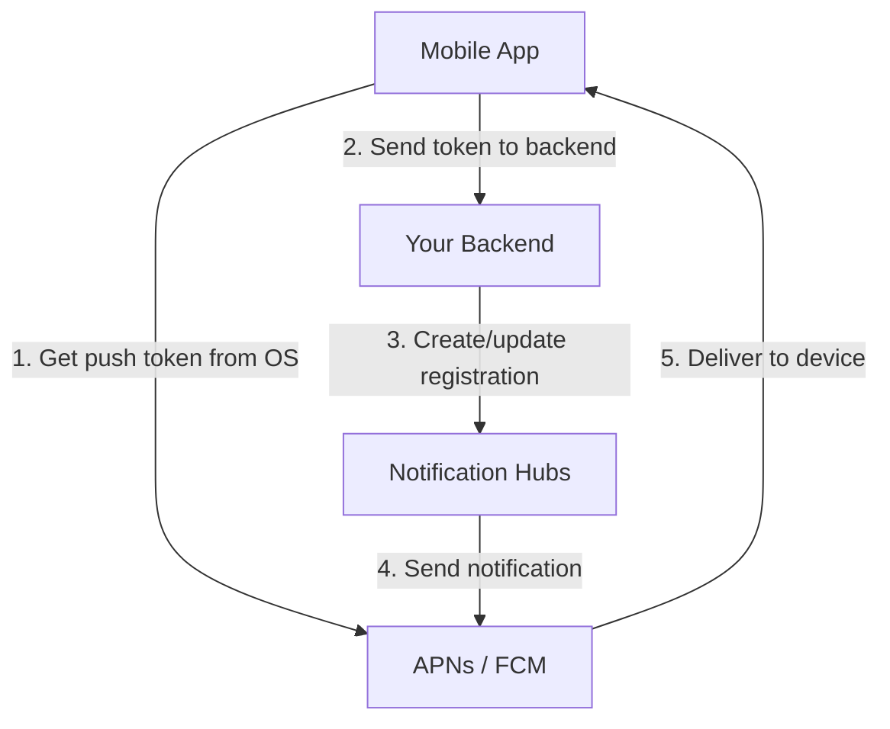

# How to Handle Device Registration in Azure Notification Hubs

Author: [nawazdhandala](https://www.github.com/nawazdhandala)

Tags: Azure, Notification Hubs, Device Registration, Installation, Mobile, Backend, Push

Description: Master device registration in Azure Notification Hubs using both the registration and installation models for reliable push notification delivery.

---

Device registration is the foundation of push notifications. If a device is not registered correctly, it will not receive notifications. If registrations go stale, you waste resources sending to tokens that no longer exist. Azure Notification Hubs offers two models for managing device registrations: the classic Registration model and the newer Installation model. In this post, I will cover both, explain when to use each, and show you how to handle the common challenges of keeping registrations clean and current.

## Registrations vs. Installations

Azure Notification Hubs has two APIs for managing devices:

**Registrations** are the original model. Each registration maps a platform-specific push handle (like an APNs device token or FCM registration ID) to a set of tags. Registrations can be either native (platform-specific payload) or template-based.

**Installations** are the newer, recommended model. An installation represents a device with a unique ID, its push handle, platform, tags, and optional templates. Installations are idempotent - you can create or update them with the same ID without worrying about duplicates.

The key difference: with registrations, you need to track registration IDs to update or delete them. With installations, you use your own installation ID (typically a device ID), making updates simpler and duplicate-free.

## Backend-Managed vs. Client-Managed Registration

There are two patterns for who creates the registration:

**Client-managed**: The mobile app registers directly with Notification Hubs. This is simpler to set up but gives you less control. The app needs the hub connection string (or a SAS token), and you cannot easily customize tags from the server.

**Backend-managed**: The mobile app sends its push token to your backend, and your backend creates the registration. This is the recommended approach because your backend controls the tags, can validate the request, and does not expose hub credentials to the client.



## Using the Installation Model

Here is how to implement backend-managed device registration using the Installation model.

```javascript
// installation-manager.js - Manage device installations
const { NotificationHubsClient } = require('@azure/notification-hubs');

const client = new NotificationHubsClient(
  process.env.NOTIFICATION_HUB_CONNECTION_STRING,
  'my-hub'
);

// Create or update an installation for a device
async function upsertInstallation(deviceInfo) {
  const { installationId, platform, pushHandle, userId, preferences } = deviceInfo;

  // Build tags based on user profile and preferences
  const tags = [
    `user:${userId}`,
    `platform:${platform}`
  ];

  if (preferences.alerts) tags.push('pref:alerts');
  if (preferences.marketing) tags.push('pref:marketing');

  const installation = {
    installationId: installationId, // Use a stable device identifier
    platform: platform === 'ios' ? 'apns' : 'gcm',
    pushChannel: pushHandle,        // The APNs token or FCM registration ID
    tags: tags
  };

  await client.createOrUpdateInstallation(installation);
  console.log(`Installation ${installationId} upserted with tags:`, tags);
}

// Delete an installation when the user logs out or uninstalls
async function removeInstallation(installationId) {
  try {
    await client.deleteInstallation(installationId);
    console.log(`Installation ${installationId} deleted`);
  } catch (err) {
    if (err.statusCode === 404) {
      console.log('Installation already removed');
    } else {
      throw err;
    }
  }
}
```

The mobile app needs to send the installation data to your backend whenever the push token changes or the user profile updates.

```javascript
// backend-api.js - Express endpoint for device registration
const express = require('express');
const app = express();
app.use(express.json());

app.post('/api/register-device', requireAuth, async (req, res) => {
  const { installationId, platform, pushHandle } = req.body;
  const userId = req.user.id;

  // Validate the request
  if (!installationId || !platform || !pushHandle) {
    return res.status(400).json({ error: 'Missing required fields' });
  }

  if (!['ios', 'android'].includes(platform)) {
    return res.status(400).json({ error: 'Invalid platform' });
  }

  try {
    // Fetch user preferences from your database
    const preferences = await getUserPreferences(userId);

    await upsertInstallation({
      installationId,
      platform,
      pushHandle,
      userId,
      preferences
    });

    res.json({ status: 'registered' });
  } catch (err) {
    console.error('Registration failed:', err);
    res.status(500).json({ error: 'Registration failed' });
  }
});
```

## Adding Templates to Installations

Installations can include templates, giving you the benefits of both the installation model and template-based notifications.

```javascript
// installation-with-templates.js - Installation with embedded templates
async function upsertInstallationWithTemplates(deviceInfo) {
  const { installationId, platform, pushHandle, userId } = deviceInfo;

  let templates = {};

  if (platform === 'ios') {
    templates = {
      // Alert notification template
      alertTemplate: {
        body: JSON.stringify({
          aps: {
            alert: { title: '$(title)', body: '$(body)' },
            sound: 'default',
            badge: '$(badge)'
          }
        }),
        headers: {
          'apns-push-type': 'alert',
          'apns-priority': '10'
        },
        tags: [`user:${userId}`, 'type:alert']
      },
      // Silent notification template
      silentTemplate: {
        body: JSON.stringify({
          aps: { 'content-available': 1 },
          action: '$(action)',
          resource: '$(resource)'
        }),
        headers: {
          'apns-push-type': 'background',
          'apns-priority': '5'
        },
        tags: [`user:${userId}`, 'type:silent']
      }
    };
  } else {
    templates = {
      alertTemplate: {
        body: JSON.stringify({
          notification: { title: '$(title)', body: '$(body)' }
        }),
        tags: [`user:${userId}`, 'type:alert']
      },
      silentTemplate: {
        body: JSON.stringify({
          data: { action: '$(action)', resource: '$(resource)' }
        }),
        tags: [`user:${userId}`, 'type:silent']
      }
    };
  }

  const installation = {
    installationId: installationId,
    platform: platform === 'ios' ? 'apns' : 'gcm',
    pushChannel: pushHandle,
    tags: [`user:${userId}`, `platform:${platform}`],
    templates: templates
  };

  await client.createOrUpdateInstallation(installation);
}
```

## Partial Updates with Patches

One advantage of the Installation model is support for partial updates. Instead of replacing the entire installation, you can patch specific fields.

```javascript
// patch-installation.js - Partially update an installation
async function addTagToInstallation(installationId, tag) {
  await client.updateInstallation(installationId, [
    { op: 'add', path: '/tags', value: tag }
  ]);
}

async function removeTagFromInstallation(installationId, tag) {
  await client.updateInstallation(installationId, [
    { op: 'remove', path: `/tags/${tag}` }
  ]);
}

async function updatePushHandle(installationId, newHandle) {
  await client.updateInstallation(installationId, [
    { op: 'replace', path: '/pushChannel', value: newHandle }
  ]);
}

// Batch multiple updates in a single call
async function updateUserProfile(installationId, updates) {
  const patches = [];

  if (updates.newTeam) {
    patches.push({ op: 'add', path: '/tags', value: `team:${updates.newTeam}` });
    if (updates.oldTeam) {
      patches.push({ op: 'remove', path: `/tags/team:${updates.oldTeam}` });
    }
  }

  if (updates.pushHandle) {
    patches.push({ op: 'replace', path: '/pushChannel', value: updates.pushHandle });
  }

  await client.updateInstallation(installationId, patches);
}
```

## Handling Token Refresh

Push tokens change. On iOS, the system can issue a new device token at any time. On Android, FCM registration IDs can be refreshed. Your app needs to detect these changes and update the registration.

```javascript
// token-refresh-handler.js - Backend endpoint for token updates
app.post('/api/update-push-token', requireAuth, async (req, res) => {
  const { installationId, newPushHandle } = req.body;
  const userId = req.user.id;

  try {
    // Verify the installation belongs to this user
    const installation = await client.getInstallation(installationId);

    if (!installation.tags?.includes(`user:${userId}`)) {
      return res.status(403).json({ error: 'Not your installation' });
    }

    // Update just the push handle
    await client.updateInstallation(installationId, [
      { op: 'replace', path: '/pushChannel', value: newPushHandle }
    ]);

    res.json({ status: 'updated' });
  } catch (err) {
    if (err.statusCode === 404) {
      // Installation does not exist, create a new one
      return res.status(404).json({ error: 'Installation not found, re-register' });
    }
    throw err;
  }
});
```

## Cleaning Up Stale Registrations

Over time, registrations accumulate for devices that have uninstalled your app, factory-reset, or simply stopped using the service. Stale registrations waste resources and can affect delivery metrics.

```javascript
// cleanup-registrations.js - Periodic cleanup of stale registrations
async function cleanupStaleRegistrations() {
  const registrations = client.listRegistrations();
  let staleCount = 0;

  for await (const reg of registrations) {
    // Check if the registration has a user tag
    const userTag = reg.tags?.find(t => t.startsWith('user:'));
    if (!userTag) continue;

    const userId = userTag.replace('user:', '');

    // Check if the user still exists and is active
    const userActive = await isUserActive(userId);
    if (!userActive) {
      await client.deleteRegistration(reg.registrationId);
      staleCount++;
    }
  }

  console.log(`Cleaned up ${staleCount} stale registrations`);
  return staleCount;
}

// Run this as a scheduled job, e.g., weekly
// Using Azure Functions timer trigger
module.exports = async function cleanupTimer(context) {
  const cleaned = await cleanupStaleRegistrations();
  context.log(`Cleanup completed: ${cleaned} stale registrations removed`);
};
```

You should also handle the feedback from platform notification services. When APNs or FCM tells you a token is invalid, remove the corresponding registration immediately.

## Best Practices

Here are the key things to get right with device registration:

- **Use the Installation model** for new projects. It is simpler, idempotent, and supports partial updates.
- **Manage registrations from your backend**, not from the client. This gives you control over tags and avoids exposing hub credentials.
- **Use a stable installation ID** that persists across app updates but changes on reinstall. On iOS, use `UIDevice.current.identifierForVendor`. On Android, use the Firebase installation ID.
- **Update registrations when tokens change.** Do not wait for the next app launch - update as soon as the OS notifies your app of a new token.
- **Clean up regularly.** Run a scheduled job to remove registrations for inactive users.
- **Keep tags under control.** With a maximum of 60 tags per registration, plan your tagging strategy carefully.

## Wrapping Up

Device registration is the plumbing that makes push notifications work. The Installation model in Azure Notification Hubs simplifies this plumbing with idempotent operations, partial updates, and embedded templates. Use backend-managed registrations for control and security, handle token refreshes promptly, and clean up stale entries regularly. Get the registration right, and the rest of your notification system will be much more reliable.
