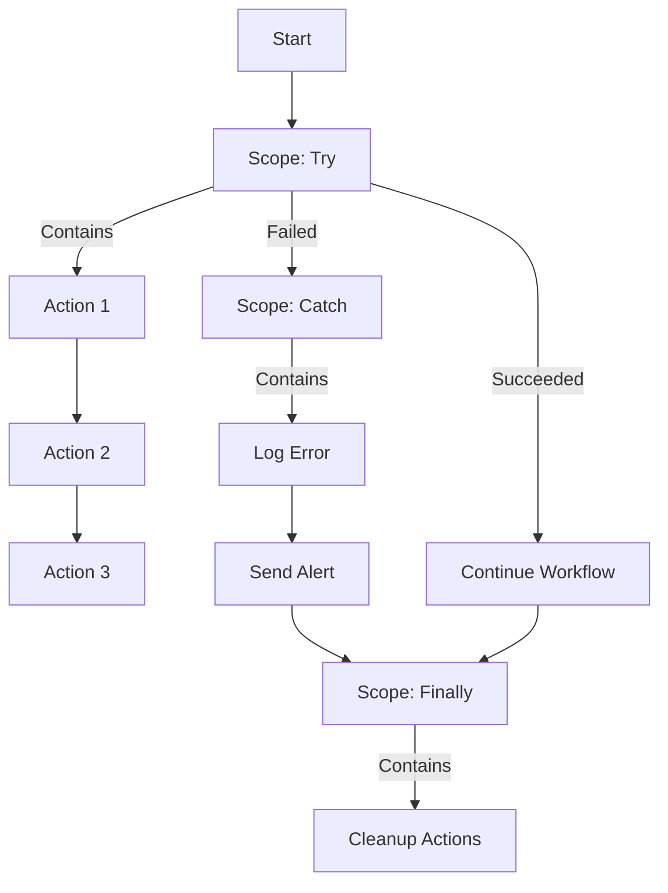

# How to Handle Errors and Implement Retry Policies in Azure Logic Apps Workflows

Author: [nawazdhandala](https://www.github.com/nawazdhandala)

Tags: Azure, Logic Apps, Error Handling, Retry Policy, Resilience, Workflow, Integration

Description: Learn how to build resilient Azure Logic Apps workflows with proper error handling, retry policies, and fallback strategies for production integrations.

---

In the real world, API calls fail, services go down temporarily, and network connections drop. If your Logic App workflows do not handle these failures gracefully, a single transient error can break an entire business process. Azure Logic Apps provides several mechanisms for dealing with errors - retry policies, run-after configurations, scopes for try/catch patterns, and termination actions. The trick is knowing which mechanism to use where and how to combine them for truly resilient workflows.

In this post, I will walk through each error handling mechanism with practical examples you can apply to your own workflows.

## Understanding How Logic Apps Handles Errors by Default

By default, when an action in a Logic App fails, all downstream actions are skipped and the workflow run is marked as "Failed." This is the simplest behavior but also the least useful for production workflows. You usually want to catch the error, log it, maybe retry the operation, and continue with the rest of the workflow.

Each action in a Logic App can finish with one of four statuses:
- **Succeeded** - the action completed successfully
- **Failed** - the action encountered an error
- **Skipped** - the action was skipped because a prerequisite action failed
- **TimedOut** - the action did not complete within the configured timeout

## Retry Policies

Retry policies are the first line of defense against transient failures. They tell Logic Apps to automatically retry a failed action before reporting it as failed.

### Configuring Retry Policies

Every HTTP-based action (HTTP, HTTP + Swagger, API Connection actions) supports retry policies. Configure them in the action's settings:

In the Logic App designer, click on the action, click the three dots, select "Settings," and scroll to the Retry Policy section.

The available retry policy types are:

**Default** - retries up to 4 times at exponentially increasing intervals. This is what you get if you do not configure anything.

**None** - no retries. The action fails immediately on the first error.

**Fixed interval** - retries a specified number of times with a fixed delay between each attempt.

**Exponential interval** - retries with exponentially increasing delays, which is the best approach for most scenarios because it gives the downstream service time to recover.

### Setting Retry Policy in the Workflow Definition

Here is how retry policies look in the workflow JSON definition:

```json
{
  "actions": {
    "Call_External_API": {
      "type": "Http",
      "inputs": {
        "method": "POST",
        "uri": "https://api.external-service.com/process",
        "body": "@triggerBody()",
        "retryPolicy": {
          "type": "exponential",
          "count": 5,
          "interval": "PT10S",
          "minimumInterval": "PT5S",
          "maximumInterval": "PT1H"
        }
      }
    }
  }
}
```

This configuration retries up to 5 times, starting with a 10-second delay and growing exponentially up to a maximum of 1 hour between retries.

### Choosing the Right Retry Parameters

For different types of services:

- **Azure services**: Use exponential with 4 retries, starting at 10 seconds. Azure services typically recover from transient issues within a few minutes.
- **Third-party APIs**: Use exponential with 3 retries, starting at 30 seconds. Third-party services may have rate limits, and aggressive retries can make things worse.
- **On-premises systems (via gateway)**: Use fixed interval with 3 retries at 60-second intervals. On-premises issues often take longer to resolve.

## The Run-After Configuration

Run-after is the most powerful error handling feature in Logic Apps. It controls when an action runs based on the status of a previous action. By default, an action runs only after the previous action succeeds. But you can configure it to run after any combination of: Succeeded, Failed, Skipped, or TimedOut.

This is how you build try/catch/finally patterns in Logic Apps.

### Configuring Run-After

In the designer, click on the action that should handle errors, click the three dots, and select "Configure run after." Check the boxes for the statuses you want to trigger on.

In the JSON definition:

```json
{
  "actions": {
    "Try_Action": {
      "type": "Http",
      "inputs": {
        "method": "GET",
        "uri": "https://api.example.com/data"
      }
    },
    "Handle_Error": {
      "type": "Compose",
      "inputs": {
        "error": "@actions('Try_Action')['error']",
        "statusCode": "@actions('Try_Action')['outputs']['statusCode']"
      },
      "runAfter": {
        "Try_Action": ["Failed", "TimedOut"]
      }
    },
    "Continue_On_Success": {
      "type": "Compose",
      "inputs": "@actions('Try_Action')['outputs']['body']",
      "runAfter": {
        "Try_Action": ["Succeeded"]
      }
    }
  }
}
```

## Try/Catch/Finally with Scopes

Scopes are the Logic Apps equivalent of try/catch/finally blocks. A scope groups multiple actions together and gives you a single point to handle errors for the entire group.

### Building a Try/Catch Pattern



Here is how to implement this:

**Step 1: Create the Try scope**

Add a Scope action and name it "Try." Inside this scope, add all the actions that might fail.

**Step 2: Create the Catch scope**

Add another Scope action after the Try scope. Name it "Catch." Configure its run-after to run when the Try scope has "Failed" or "TimedOut."

Inside the Catch scope, add error handling actions like logging, sending notifications, or pushing to a dead letter queue.

**Step 3: Create the Finally scope (optional)**

Add a third Scope action. Configure its run-after to run after the Catch scope on any status (Succeeded, Failed, Skipped, TimedOut). This ensures the Finally block always runs regardless of what happened before.

### Accessing Error Details in the Catch Block

Inside the Catch scope, you can access the error details from the Try scope:

```json
{
  "actions": {
    "Get_Error_Details": {
      "type": "Compose",
      "inputs": {
        "scopeResult": "@result('Try')",
        "failedActions": "@filter(result('Try'), item => item['status'] eq 'Failed')",
        "errorMessage": "@first(filter(result('Try'), item => item['status'] eq 'Failed'))['error']['message']"
      }
    }
  }
}
```

The `result('Try')` function returns an array of all action results within the Try scope, including their statuses and any error information.

## Practical Error Handling Patterns

### Pattern 1: Retry Then Fallback

Try the primary service. If it fails after retries, fall back to a secondary service.

```json
{
  "actions": {
    "Call_Primary_API": {
      "type": "Http",
      "inputs": {
        "method": "GET",
        "uri": "https://primary-api.example.com/data",
        "retryPolicy": {
          "type": "exponential",
          "count": 3,
          "interval": "PT10S"
        }
      }
    },
    "Call_Fallback_API": {
      "type": "Http",
      "inputs": {
        "method": "GET",
        "uri": "https://fallback-api.example.com/data"
      },
      "runAfter": {
        "Call_Primary_API": ["Failed", "TimedOut"]
      }
    },
    "Process_Result": {
      "type": "Compose",
      "inputs": "@coalesce(outputs('Call_Primary_API')['body'], outputs('Call_Fallback_API')['body'])",
      "runAfter": {
        "Call_Primary_API": ["Succeeded"],
        "Call_Fallback_API": ["Succeeded"]
      }
    }
  }
}
```

### Pattern 2: Circuit Breaker

For workflows that call an unreliable external service repeatedly, implement a circuit breaker pattern using a flag stored in Azure Table Storage:

1. Before calling the external service, check the circuit breaker flag
2. If the flag says "open" (service is known to be down), skip the call and use cached data
3. If the flag says "closed" (service should be working), make the call
4. If the call fails, update the flag to "open" with a timestamp
5. Periodically check if enough time has passed (e.g., 5 minutes) and reset the flag to "closed"

### Pattern 3: Compensating Transaction

For multi-step operations where a later step fails, undo the earlier steps:

```json
{
  "actions": {
    "Scope_Transaction": {
      "type": "Scope",
      "actions": {
        "Step_1_Create_Order": {
          "type": "ApiConnection",
          "inputs": { "..." : "Create order in system A" }
        },
        "Step_2_Reserve_Inventory": {
          "type": "ApiConnection",
          "inputs": { "..." : "Reserve inventory in system B" },
          "runAfter": { "Step_1_Create_Order": ["Succeeded"] }
        },
        "Step_3_Charge_Payment": {
          "type": "ApiConnection",
          "inputs": { "..." : "Charge payment in system C" },
          "runAfter": { "Step_2_Reserve_Inventory": ["Succeeded"] }
        }
      }
    },
    "Scope_Compensate": {
      "type": "Scope",
      "actions": {
        "Rollback_Inventory": {
          "type": "ApiConnection",
          "inputs": { "..." : "Release reserved inventory" }
        },
        "Cancel_Order": {
          "type": "ApiConnection",
          "inputs": { "..." : "Cancel the order" },
          "runAfter": { "Rollback_Inventory": ["Succeeded", "Failed"] }
        }
      },
      "runAfter": {
        "Scope_Transaction": ["Failed"]
      }
    }
  }
}
```

## Handling Specific HTTP Status Codes

Sometimes you want to handle different HTTP errors differently. A 429 (Too Many Requests) should trigger a retry with backoff, while a 404 (Not Found) should be handled as a business logic case, not an error.

Use a condition action after the HTTP call to check the status code:

```json
{
  "actions": {
    "Call_API": {
      "type": "Http",
      "inputs": {
        "method": "GET",
        "uri": "https://api.example.com/resource/@{triggerBody()?['id']}",
        "retryPolicy": { "type": "none" }
      }
    },
    "Check_Status_Code": {
      "type": "Switch",
      "expression": "@outputs('Call_API')['statusCode']",
      "cases": {
        "200": {
          "actions": { "Process_Success": { "type": "Compose", "inputs": "Success" } }
        },
        "404": {
          "actions": { "Handle_Not_Found": { "type": "Compose", "inputs": "Resource not found - creating new" } }
        },
        "429": {
          "actions": {
            "Wait_And_Retry": {
              "type": "Wait",
              "inputs": { "interval": { "count": 60, "unit": "Second" } }
            }
          }
        }
      },
      "default": {
        "actions": { "Handle_Unknown_Error": { "type": "Terminate", "inputs": { "runStatus": "Failed" } } }
      },
      "runAfter": {
        "Call_API": ["Succeeded", "Failed"]
      }
    }
  }
}
```

## Logging and Monitoring Errors

For production workflows, log all errors to a centralized location:

```json
{
  "actions": {
    "Log_Error_To_Table_Storage": {
      "type": "ApiConnection",
      "inputs": {
        "host": {
          "connection": { "name": "@parameters('$connections')['azuretables']['connectionId']" }
        },
        "method": "post",
        "path": "/v2/storageAccounts/{storageAccount}/tables/WorkflowErrors/entities",
        "body": {
          "PartitionKey": "@{workflow()['name']}",
          "RowKey": "@{workflow()['run']['name']}",
          "ErrorMessage": "@{actions('Try_Scope')?['error']?['message']}",
          "Timestamp": "@{utcNow()}",
          "WorkflowRunId": "@{workflow()['run']['name']}"
        }
      }
    }
  }
}
```

## Wrapping Up

Error handling in Azure Logic Apps requires a deliberate approach. Start by setting appropriate retry policies on every HTTP action, then use scopes to create try/catch patterns for groups of related actions, and use run-after configurations to build fallback paths. For critical business processes, add compensating transactions and dead letter queues so no data is lost when things go wrong. The patterns in this post cover the vast majority of real-world failure scenarios you will encounter in production integration workflows.
