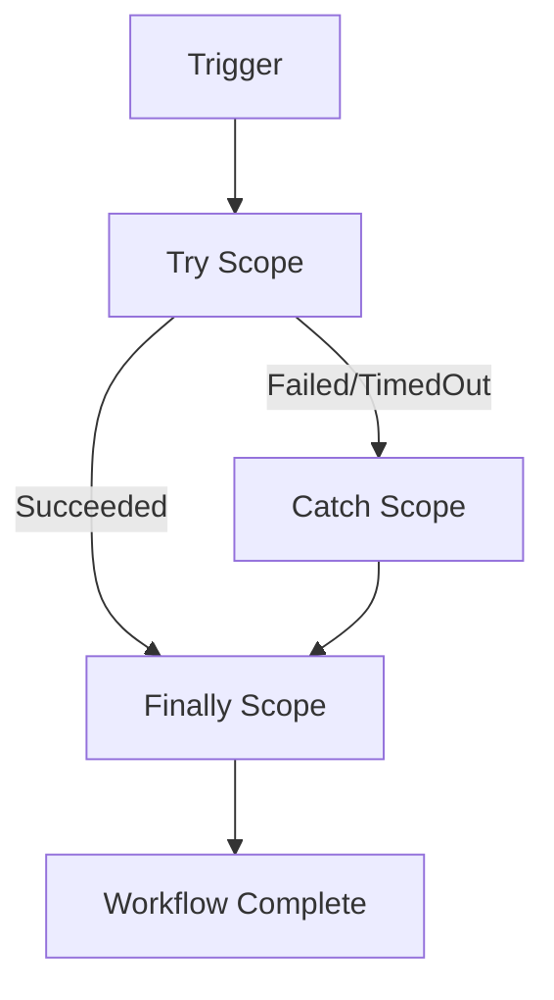

# How to Handle Errors and Retries in Azure Logic Apps Workflows

Author: [nawazdhandala](https://www.github.com/nawazdhandala)

Tags: Azure, Logic Apps, Error Handling, Retry Policy, Workflow Resilience, Exception Handling, Fault Tolerance

Description: Build resilient Azure Logic Apps workflows with proper error handling, retry policies, and compensation logic for production scenarios.

---

A workflow that only handles the happy path is a workflow that will fail in production. External APIs go down, databases time out, rate limits kick in, and data arrives in unexpected formats. Azure Logic Apps gives you several mechanisms to handle these failures gracefully - retry policies, scope-based error handling, run-after conditions, and terminate actions. Using them properly is the difference between a workflow that recovers automatically and one that fails silently.

## Retry Policies

Every HTTP action and managed connector action in Logic Apps has a configurable retry policy. The default policy retries 4 times with exponential intervals.

You can configure four types of retry policies:

- **Default**: 4 retries with exponential backoff (the system default)
- **Exponential Interval**: Custom retry count and interval with exponential backoff
- **Fixed Interval**: Custom retry count with a fixed delay between retries
- **None**: No retries at all

Here is how to set a custom retry policy on an HTTP action.

```json
{
  "Call_Payment_API": {
    "type": "Http",
    "inputs": {
      "method": "POST",
      "uri": "https://api.payments.com/v1/charge",
      "headers": {
        "Content-Type": "application/json"
      },
      "body": {
        "amount": "@body('Parse_Order')?['totalAmount']",
        "currency": "USD"
      },
      "retryPolicy": {
        "type": "exponential",
        "count": 5,
        "interval": "PT10S",
        "minimumInterval": "PT5S",
        "maximumInterval": "PT1H"
      }
    },
    "runAfter": {
      "Parse_Order": ["Succeeded"]
    }
  }
}
```

The exponential policy starts with a 10-second interval and doubles each time, up to the maximum of 1 hour, for a total of 5 retry attempts.

For actions where retrying would cause side effects (like charging a credit card twice), disable retries entirely.

```json
{
  "Charge_Credit_Card": {
    "type": "Http",
    "inputs": {
      "method": "POST",
      "uri": "https://api.payments.com/v1/charge",
      "body": { ... },
      "retryPolicy": {
        "type": "none"
      }
    }
  }
}
```

## Run-After Conditions

By default, an action runs only when its predecessor succeeds. But you can configure actions to run when a predecessor fails, times out, or is skipped. This is the foundation of error handling in Logic Apps.

```json
{
  "actions": {
    "Try_Process_Order": {
      "type": "Http",
      "inputs": {
        "method": "POST",
        "uri": "@appsetting('OrderApiUrl')/process",
        "body": "@triggerBody()"
      },
      "runAfter": {}
    },
    "Handle_Success": {
      "type": "Response",
      "inputs": {
        "statusCode": 200,
        "body": { "status": "processed" }
      },
      "runAfter": {
        "Try_Process_Order": ["Succeeded"]
      }
    },
    "Handle_Failure": {
      "type": "Response",
      "inputs": {
        "statusCode": 500,
        "body": {
          "status": "failed",
          "error": "@actions('Try_Process_Order')?['error']?['message']"
        }
      },
      "runAfter": {
        "Try_Process_Order": ["Failed", "TimedOut"]
      }
    }
  }
}
```

The `Handle_Failure` action runs only when `Try_Process_Order` fails or times out. This is how you branch on error conditions.

## Scope-Based Try-Catch-Finally

Logic Apps does not have explicit try-catch blocks, but you can build the same pattern using scopes and run-after conditions.

```json
{
  "actions": {
    "Try_Scope": {
      "type": "Scope",
      "actions": {
        "Validate_Input": {
          "type": "ParseJson",
          "inputs": {
            "content": "@triggerBody()",
            "schema": { ... }
          },
          "runAfter": {}
        },
        "Call_External_API": {
          "type": "Http",
          "inputs": {
            "method": "POST",
            "uri": "https://api.example.com/process",
            "body": "@body('Validate_Input')"
          },
          "runAfter": {
            "Validate_Input": ["Succeeded"]
          }
        },
        "Save_Result": {
          "type": "Http",
          "inputs": {
            "method": "POST",
            "uri": "https://api.example.com/results",
            "body": "@body('Call_External_API')"
          },
          "runAfter": {
            "Call_External_API": ["Succeeded"]
          }
        }
      },
      "runAfter": {}
    },
    "Catch_Scope": {
      "type": "Scope",
      "actions": {
        "Log_Error": {
          "type": "Http",
          "inputs": {
            "method": "POST",
            "uri": "@appsetting('LoggingApiUrl')/errors",
            "body": {
              "workflowRunId": "@workflow().run.name",
              "error": "@result('Try_Scope')",
              "timestamp": "@utcNow()"
            }
          },
          "runAfter": {}
        },
        "Send_Alert": {
          "type": "Http",
          "inputs": {
            "method": "POST",
            "uri": "@appsetting('SlackWebhookUrl')",
            "body": {
              "text": "Workflow failed: @{workflow().run.name}"
            }
          },
          "runAfter": {
            "Log_Error": ["Succeeded"]
          }
        }
      },
      "runAfter": {
        "Try_Scope": ["Failed", "TimedOut"]
      }
    },
    "Finally_Scope": {
      "type": "Scope",
      "actions": {
        "Cleanup": {
          "type": "Http",
          "inputs": {
            "method": "POST",
            "uri": "@appsetting('CleanupApiUrl')",
            "body": {
              "runId": "@workflow().run.name"
            }
          },
          "runAfter": {}
        }
      },
      "runAfter": {
        "Try_Scope": ["Succeeded", "Failed", "TimedOut", "Skipped"],
        "Catch_Scope": ["Succeeded", "Failed", "TimedOut", "Skipped"]
      }
    }
  }
}
```

The `Finally_Scope` runs regardless of whether `Try_Scope` succeeded or failed, and regardless of whether `Catch_Scope` ran. This gives you the classic try-catch-finally pattern.



## Accessing Error Details

When an action fails, you can access detailed error information using the `result()` and `actions()` functions.

```json
{
  "Log_Detailed_Error": {
    "type": "Compose",
    "inputs": {
      "failedAction": "Try_Scope",
      "actionStatus": "@actions('Try_Scope')?['status']",
      "errorCode": "@actions('Try_Scope')?['code']",
      "errorMessage": "@actions('Try_Scope')?['error']?['message']",
      "allResults": "@result('Try_Scope')",
      "workflowRunId": "@workflow().run.name",
      "timestamp": "@utcNow()"
    },
    "runAfter": {
      "Try_Scope": ["Failed"]
    }
  }
}
```

The `result('Try_Scope')` function returns an array with the result of every action inside the scope, including which ones failed and why.

## Timeout Configuration

Actions can hang if an external service does not respond. Set explicit timeouts to prevent workflows from running indefinitely.

```json
{
  "Call_Slow_API": {
    "type": "Http",
    "inputs": {
      "method": "GET",
      "uri": "https://slow-api.example.com/data"
    },
    "limit": {
      "timeout": "PT2M"
    },
    "runAfter": {}
  }
}
```

The timeout format uses ISO 8601 duration: `PT2M` means 2 minutes, `PT30S` means 30 seconds, `PT1H` means 1 hour.

## Compensation Logic

Sometimes you need to undo work when a later step fails. This is called compensation. For example, if you created an order but the payment step failed, you need to cancel the order.

```json
{
  "actions": {
    "Create_Order": {
      "type": "Http",
      "inputs": {
        "method": "POST",
        "uri": "@appsetting('OrderApiUrl')/orders",
        "body": "@triggerBody()"
      },
      "runAfter": {}
    },
    "Process_Payment": {
      "type": "Http",
      "inputs": {
        "method": "POST",
        "uri": "@appsetting('PaymentApiUrl')/charge",
        "body": {
          "orderId": "@body('Create_Order')?['orderId']",
          "amount": "@triggerBody()?['totalAmount']"
        },
        "retryPolicy": { "type": "none" }
      },
      "runAfter": {
        "Create_Order": ["Succeeded"]
      }
    },
    "Cancel_Order_On_Payment_Failure": {
      "type": "Http",
      "inputs": {
        "method": "DELETE",
        "uri": "@{appsetting('OrderApiUrl')}/orders/@{body('Create_Order')?['orderId']}"
      },
      "runAfter": {
        "Process_Payment": ["Failed"]
      }
    }
  }
}
```

## Monitoring Failed Runs

Set up alerts for workflow failures so you catch issues early.

```bash
# Create an alert for failed Logic App runs
az monitor metrics alert create \
  --name "alert-logic-app-failures" \
  --resource-group rg-workflows \
  --scopes "/subscriptions/{sub-id}/resourceGroups/rg-workflows/providers/Microsoft.Web/sites/logic-order-workflows" \
  --condition "total WorkflowRunsFailureRate > 5" \
  --window-size 15m \
  --evaluation-frequency 5m \
  --severity 2 \
  --action "/subscriptions/{sub-id}/resourceGroups/rg-workflows/providers/Microsoft.Insights/actionGroups/ag-oncall"
```

## Best Practices

Always use scopes for grouping related actions. They make error handling cleaner and give you a single point to check success or failure for a set of operations.

Set explicit retry policies on every external call. Do not rely on the default - be intentional about how many retries you want and how long to wait.

Log errors with enough context to debug. Include the workflow run ID, the action name, the input data, and the error message.

Use the Terminate action to mark a workflow run as Failed or Cancelled when your error handling determines the workflow cannot proceed. This makes failed runs visible in monitoring.

Test your error handling by deliberately causing failures during development. Call a nonexistent URL, pass invalid data, or use a mock API that returns errors. If you only test the happy path, your error handling code is untested code.

## Summary

Error handling in Logic Apps is built around retry policies, run-after conditions, scopes, and the result() function. Use scopes for try-catch-finally patterns, configure retry policies based on the nature of each external call, implement compensation logic for multi-step operations, and monitor failure rates with alerts. A well-built workflow handles failures as gracefully as it handles success.
