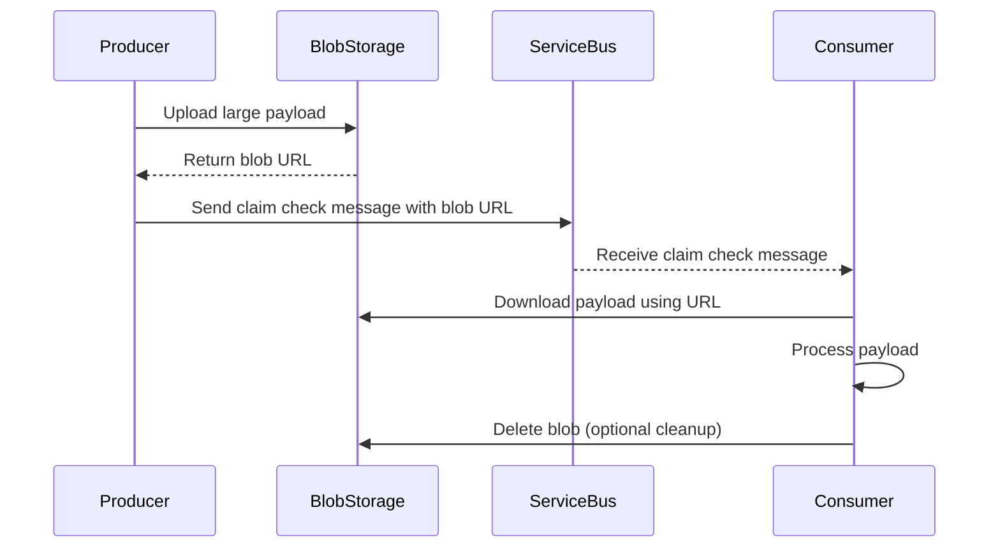

# How to Handle Large Messages in Azure Service Bus with Claim Check Pattern

Author: [nawazdhandala](https://www.github.com/nawazdhandala)

Tags: Azure, Service Bus, Claim Check Pattern, Messaging, Blob Storage, Cloud Architecture, Design Patterns

Description: Learn how to handle messages that exceed Azure Service Bus size limits using the claim check pattern with Azure Blob Storage.

---

Azure Service Bus has a message size limit. On the Standard tier, it is 256 KB. On the Premium tier, it can go up to 100 MB. But even 100 MB is not enough for some workloads - think PDF processing pipelines, image analysis services, or batch data transfers. The claim check pattern solves this problem elegantly without bending the messaging infrastructure in ways it was not designed for.

## What Is the Claim Check Pattern?

The idea is simple. Instead of stuffing the entire payload into a message, you store the large payload in external storage (like Azure Blob Storage) and send a small reference message through Service Bus. The consumer receives the reference, retrieves the actual payload from storage, and processes it. It is like checking a bag at the airport - you get a claim ticket, and you pick up the bag at the other end.



This pattern has been around for decades in enterprise integration. Microsoft documents it as part of their cloud design patterns, and it works beautifully with Azure's native services.

## When to Use It

You should reach for the claim check pattern when:

- Your message payload exceeds Service Bus size limits
- Message payloads are large but not every consumer needs the full payload
- You want to reduce messaging costs (Service Bus charges per message, and larger messages cost more)
- You need to process files (images, documents, videos) through a messaging pipeline

You do not need it when your messages are small JSON payloads under 256 KB. Adding the extra hop to Blob Storage introduces latency and complexity that is not worth it for small messages.

## Setting Up the Infrastructure

You need a Service Bus namespace, a queue (or topic), and a Blob Storage account with a container for the payloads.

```bicep
// Bicep template for the claim check infrastructure
param location string = resourceGroup().location

// Storage account for large payloads
resource storageAccount 'Microsoft.Storage/storageAccounts@2023-01-01' = {
  name: 'stclaimcheck${uniqueString(resourceGroup().id)}'
  location: location
  sku: { name: 'Standard_LRS' }
  kind: 'StorageV2'
}

// Container to hold the large message payloads
resource blobContainer 'Microsoft.Storage/storageAccounts/blobServices/containers@2023-01-01' = {
  name: '${storageAccount.name}/default/message-payloads'
  properties: {
    publicAccess: 'None'
  }
}

// Service Bus namespace
resource sbNamespace 'Microsoft.ServiceBus/namespaces@2022-10-01-preview' = {
  name: 'sb-claimcheck-demo'
  location: location
  sku: { name: 'Standard', tier: 'Standard' }
}

// Queue for claim check messages
resource queue 'Microsoft.ServiceBus/namespaces/queues@2022-10-01-preview' = {
  parent: sbNamespace
  name: 'documents'
  properties: {
    maxDeliveryCount: 5
    deadLetteringOnMessageExpiration: true
  }
}
```

## Implementing the Producer

The producer uploads the payload to Blob Storage first, then sends a lightweight message to Service Bus containing just enough information to retrieve the payload.

```csharp
using Azure.Messaging.ServiceBus;
using Azure.Storage.Blobs;
using System.Text.Json;

public class ClaimCheckProducer
{
    private readonly BlobContainerClient _blobContainer;
    private readonly ServiceBusSender _sender;

    public ClaimCheckProducer(string storageConnString, string sbConnString)
    {
        _blobContainer = new BlobContainerClient(storageConnString, "message-payloads");
        var sbClient = new ServiceBusClient(sbConnString);
        _sender = sbClient.CreateSender("documents");
    }

    public async Task SendLargeMessageAsync(byte[] payload, string fileName, string contentType)
    {
        // Generate a unique blob name to avoid collisions
        var blobName = $"{Guid.NewGuid()}/{fileName}";
        var blobClient = _blobContainer.GetBlobClient(blobName);

        // Upload the large payload to Blob Storage
        await blobClient.UploadAsync(
            new BinaryData(payload),
            overwrite: false
        );

        // Build the claim check - a small reference message
        var claimCheck = new ClaimCheckMessage
        {
            BlobUri = blobClient.Uri.ToString(),
            BlobName = blobName,
            OriginalFileName = fileName,
            ContentType = contentType,
            PayloadSizeBytes = payload.Length,
            UploadedAt = DateTimeOffset.UtcNow
        };

        // Send the claim check through Service Bus
        var message = new ServiceBusMessage(JsonSerializer.Serialize(claimCheck))
        {
            ContentType = "application/json",
            Subject = "claim-check",
            // Store blob name in application properties for easy filtering
            ApplicationProperties = { ["blobName"] = blobName }
        };

        await _sender.SendMessageAsync(message);
    }
}

// The claim check message - small and lightweight
public class ClaimCheckMessage
{
    public string BlobUri { get; set; }
    public string BlobName { get; set; }
    public string OriginalFileName { get; set; }
    public string ContentType { get; set; }
    public long PayloadSizeBytes { get; set; }
    public DateTimeOffset UploadedAt { get; set; }
}
```

## Implementing the Consumer

The consumer receives the claim check message, downloads the payload from Blob Storage, processes it, and optionally cleans up the blob.

```csharp
using Azure.Messaging.ServiceBus;
using Azure.Storage.Blobs;
using System.Text.Json;

public class ClaimCheckConsumer
{
    private readonly BlobContainerClient _blobContainer;
    private readonly ServiceBusProcessor _processor;

    public ClaimCheckConsumer(string storageConnString, string sbConnString)
    {
        _blobContainer = new BlobContainerClient(storageConnString, "message-payloads");
        var sbClient = new ServiceBusClient(sbConnString);
        _processor = sbClient.CreateProcessor("documents", new ServiceBusProcessorOptions
        {
            MaxConcurrentCalls = 3,
            AutoCompleteMessages = false
        });

        _processor.ProcessMessageAsync += HandleMessageAsync;
        _processor.ProcessErrorAsync += HandleErrorAsync;
    }

    private async Task HandleMessageAsync(ProcessMessageEventArgs args)
    {
        // Deserialize the claim check
        var claimCheck = JsonSerializer.Deserialize<ClaimCheckMessage>(
            args.Message.Body.ToString()
        );

        // Download the actual payload from Blob Storage
        var blobClient = _blobContainer.GetBlobClient(claimCheck.BlobName);
        var downloadResult = await blobClient.DownloadContentAsync();
        var payload = downloadResult.Value.Content.ToArray();

        // Process the payload - this is where your business logic goes
        Console.WriteLine($"Processing {claimCheck.OriginalFileName} ({payload.Length} bytes)");
        await ProcessPayload(payload, claimCheck);

        // Complete the message to remove it from the queue
        await args.CompleteMessageAsync(args.Message);

        // Clean up the blob now that processing is done
        await blobClient.DeleteIfExistsAsync();
    }

    private Task HandleErrorAsync(ProcessErrorEventArgs args)
    {
        Console.WriteLine($"Error processing message: {args.Exception.Message}");
        return Task.CompletedTask;
    }

    private async Task ProcessPayload(byte[] payload, ClaimCheckMessage metadata)
    {
        // Your actual processing logic here
        await Task.CompletedTask;
    }

    public async Task StartAsync() => await _processor.StartProcessingAsync();
    public async Task StopAsync() => await _processor.StopProcessingAsync();
}
```

## Handling Cleanup Carefully

Blob cleanup is the trickiest part of this pattern. If the consumer deletes the blob after processing, but then the message processing fails and the message gets retried, the blob is gone and the retry will fail. There are a few strategies to handle this.

**Strategy 1: Delete after completion.** Only delete the blob after you have successfully completed the Service Bus message. This is what the code above does, and it works for most cases.

**Strategy 2: Lifecycle policies.** Set a Blob Storage lifecycle management policy to automatically delete blobs older than a certain age (say 7 days). This acts as a safety net and handles cases where consumers crash before cleanup.

```json
{
  "rules": [
    {
      "name": "cleanup-claim-check-blobs",
      "enabled": true,
      "type": "Lifecycle",
      "definition": {
        "filters": {
          "blobTypes": ["blockBlob"],
          "prefixMatch": ["message-payloads/"]
        },
        "actions": {
          "baseBlob": {
            "delete": {
              "daysAfterCreationGreaterThan": 7
            }
          }
        }
      }
    }
  ]
}
```

**Strategy 3: Soft delete.** Enable blob soft delete so that even if a blob is deleted prematurely, it can be recovered during retries.

## Adding SAS Token Security

Instead of giving consumers full access to your storage account, generate a SAS token scoped to just the specific blob. Include it in the claim check message so the consumer can download without needing storage account credentials.

```csharp
// Generate a SAS token that only allows reading this specific blob
var sasBuilder = new BlobSasBuilder
{
    BlobContainerName = "message-payloads",
    BlobName = blobName,
    Resource = "b", // b = blob
    ExpiresOn = DateTimeOffset.UtcNow.AddHours(24)
};

// Only grant read permission
sasBuilder.SetPermissions(BlobSasPermissions.Read);

// Generate the SAS URI
var sasUri = blobClient.GenerateSasUri(sasBuilder);
```

## Performance Considerations

The claim check pattern adds latency because of the extra round trip to Blob Storage. For most workloads, this is negligible compared to the actual processing time. But if you are processing thousands of messages per second with sub-millisecond latency requirements, you should benchmark carefully.

Use the Premium tier of Service Bus if you need predictable latency, and place your Blob Storage account in the same region as your Service Bus namespace to minimize network hops.

Consider using Azure Managed Identity instead of connection strings for authentication between your services. It eliminates the risk of credential leaks and simplifies rotation.

## When Not to Use Claim Check

If your messages are consistently under the Service Bus size limit, skip the pattern. The added complexity of managing blobs, handling cleanup, and dealing with two services instead of one is not justified for small payloads. A good rule of thumb: if your message is under 200 KB, just send it directly through Service Bus.

## Summary

The claim check pattern is a battle-tested approach to handling large messages in any messaging system, and it works particularly well with Azure Service Bus and Blob Storage. Store the payload externally, pass a reference through the message broker, and retrieve on the other side. Add lifecycle policies for cleanup, use SAS tokens for security, and monitor both your Service Bus queue depth and your blob container size to keep things healthy.
