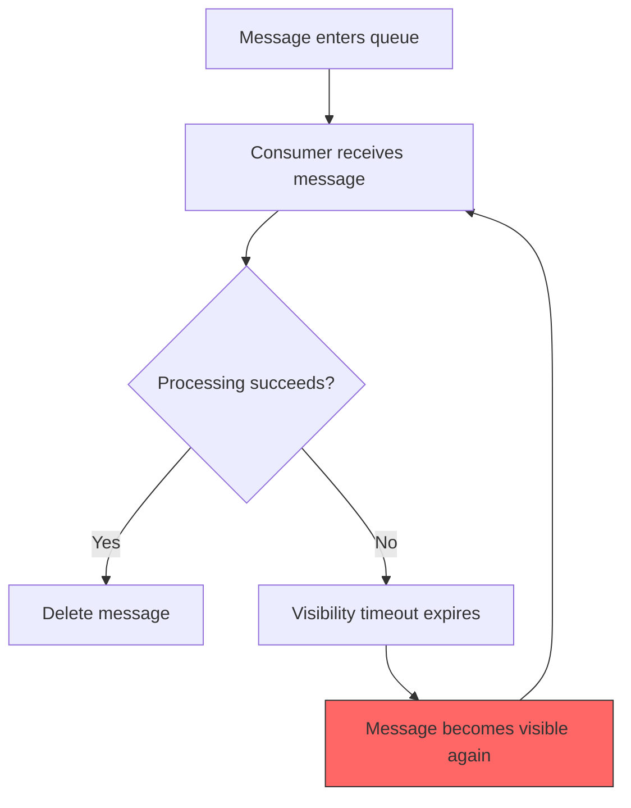

# How to Handle Poison Messages in Azure Queue Storage

Author: [nawazdhandala](https://www.github.com/nawazdhandala)

Tags: Azure, Queue Storage, Poison Messages, Error Handling, Azure Storage, Distributed Systems, Reliability

Description: Learn how to detect, handle, and manage poison messages in Azure Queue Storage to prevent failed messages from blocking your processing pipeline.

---

A poison message is a queue message that cannot be processed successfully no matter how many times you try. Maybe the message body is malformed, the referenced resource no longer exists, or a bug in your processing code consistently fails on a specific input. Without proper handling, these messages cycle endlessly through your queue - received, failed, made visible again, received, failed, and so on - wasting compute resources and potentially blocking other messages.

Azure Queue Storage does not have a built-in dead-letter queue like Azure Service Bus does. You need to implement poison message handling yourself. The good news is that it is straightforward, and the `dequeue_count` property gives you everything you need.

## The Poison Message Problem

Here is what happens without poison message handling:



The message loops forever between being received and failing. If your visibility timeout is 30 seconds, this message gets retried 2,880 times per day. Multiply that by however many poison messages accumulate, and your workers spend more time failing than processing real work.

## How Dequeue Count Works

Every time a message is received from the queue (dequeued), Azure increments its `dequeue_count`. This counter persists across visibility timeouts and is your primary tool for identifying poison messages.

The typical pattern:

1. Receive a message
2. Check its dequeue count
3. If the count exceeds your threshold, treat it as a poison message
4. Otherwise, process it normally

```python
from azure.storage.queue import QueueClient
import json

queue_client = QueueClient.from_connection_string(
    conn_str="your-connection-string",
    queue_name="task-queue"
)

# Receive messages from the queue
messages = queue_client.receive_messages(visibility_timeout=30)

for message in messages:
    # Check if this message has been retried too many times
    if message.dequeue_count > 5:
        print(f"Poison message detected: {message.id} (dequeue count: {message.dequeue_count})")
        handle_poison_message(message)
    else:
        try:
            process_message(message)
            queue_client.delete_message(message)
        except Exception as e:
            print(f"Processing failed (attempt {message.dequeue_count}): {e}")
            # Message becomes visible again after timeout for retry
```

## Implementing a Dead-Letter Queue

The most common approach to handling poison messages is moving them to a separate "dead-letter" queue for later inspection:

```python
from azure.storage.queue import QueueClient, QueueServiceClient
import json
import logging

logging.basicConfig(level=logging.INFO)
logger = logging.getLogger(__name__)

# Maximum number of processing attempts before considering a message poisoned
MAX_DEQUEUE_COUNT = 5

def setup_queues(connection_string):
    """Create the main queue and dead-letter queue if they do not exist."""
    service_client = QueueServiceClient.from_connection_string(connection_string)

    # Ensure both queues exist
    main_queue = service_client.get_queue_client("task-queue")
    dlq = service_client.get_queue_client("task-queue-deadletter")

    try:
        main_queue.create_queue()
    except Exception:
        pass  # Queue already exists

    try:
        dlq.create_queue()
    except Exception:
        pass  # Queue already exists

    return main_queue, dlq

def move_to_dead_letter(message, main_queue, dlq):
    """Move a poison message to the dead-letter queue with metadata."""
    # Wrap the original message with error metadata
    dead_letter_message = {
        "original_message": message.content,
        "original_message_id": message.id,
        "dequeue_count": message.dequeue_count,
        "enqueued_time": str(message.inserted_on),
        "moved_to_dlq_reason": "exceeded_max_dequeue_count",
        "max_dequeue_count": MAX_DEQUEUE_COUNT
    }

    # Send to the dead-letter queue
    dlq.send_message(json.dumps(dead_letter_message))

    # Delete from the main queue
    main_queue.delete_message(message)

    logger.warning(
        f"Moved poison message {message.id} to dead-letter queue "
        f"(dequeue count: {message.dequeue_count})"
    )

def process_message(content):
    """Your actual message processing logic."""
    task = json.loads(content)
    # Process the task...
    logger.info(f"Processed task: {task}")

def run_worker(connection_string):
    """Main worker loop with poison message handling."""
    main_queue, dlq = setup_queues(connection_string)

    logger.info("Worker started with dead-letter queue support")

    while True:
        messages = main_queue.receive_messages(
            messages_per_page=10,
            visibility_timeout=60
        )

        message_found = False
        for message in messages:
            message_found = True

            # Check for poison messages
            if message.dequeue_count > MAX_DEQUEUE_COUNT:
                move_to_dead_letter(message, main_queue, dlq)
                continue

            try:
                process_message(message.content)
                main_queue.delete_message(message)
                logger.info(f"Message {message.id} processed successfully")
            except Exception as e:
                logger.error(
                    f"Failed to process message {message.id} "
                    f"(attempt {message.dequeue_count}/{MAX_DEQUEUE_COUNT}): {e}"
                )

        if not message_found:
            import time
            time.sleep(5)
```

## C# Implementation

Here is the same pattern in C#:

```csharp
using Azure.Storage.Queues;
using Azure.Storage.Queues.Models;
using System.Text.Json;

public class QueueWorker
{
    private readonly QueueClient _mainQueue;
    private readonly QueueClient _deadLetterQueue;
    private const int MaxDequeueCount = 5;

    public QueueWorker(string connectionString)
    {
        // Initialize both queues
        _mainQueue = new QueueClient(connectionString, "task-queue");
        _deadLetterQueue = new QueueClient(connectionString, "task-queue-deadletter");

        _mainQueue.CreateIfNotExists();
        _deadLetterQueue.CreateIfNotExists();
    }

    public async Task RunAsync(CancellationToken cancellationToken)
    {
        Console.WriteLine("Worker started with dead-letter queue support");

        while (!cancellationToken.IsCancellationRequested)
        {
            // Receive a batch of messages
            QueueMessage[] messages = await _mainQueue.ReceiveMessagesAsync(
                maxMessages: 10,
                visibilityTimeout: TimeSpan.FromSeconds(60)
            );

            if (messages.Length == 0)
            {
                // No messages - back off
                await Task.Delay(5000, cancellationToken);
                continue;
            }

            foreach (var message in messages)
            {
                // Check for poison messages
                if (message.DequeueCount > MaxDequeueCount)
                {
                    await MoveToDeadLetterAsync(message);
                    continue;
                }

                try
                {
                    await ProcessMessageAsync(message.MessageText);
                    await _mainQueue.DeleteMessageAsync(
                        message.MessageId, message.PopReceipt);
                }
                catch (Exception ex)
                {
                    Console.WriteLine(
                        $"Failed attempt {message.DequeueCount}/{MaxDequeueCount}: {ex.Message}");
                    // Message will become visible again after timeout
                }
            }
        }
    }

    private async Task MoveToDeadLetterAsync(QueueMessage message)
    {
        // Create a dead-letter envelope with metadata
        var dlqMessage = new
        {
            OriginalMessage = message.MessageText,
            OriginalMessageId = message.MessageId,
            DequeueCount = message.DequeueCount,
            Reason = "exceeded_max_dequeue_count"
        };

        await _deadLetterQueue.SendMessageAsync(JsonSerializer.Serialize(dlqMessage));
        await _mainQueue.DeleteMessageAsync(message.MessageId, message.PopReceipt);

        Console.WriteLine($"Moved poison message {message.MessageId} to dead-letter queue");
    }

    private async Task ProcessMessageAsync(string content)
    {
        // Your processing logic here
        var task = JsonSerializer.Deserialize<JsonElement>(content);
        Console.WriteLine($"Processing: {task}");
        await Task.CompletedTask;
    }
}
```

## Choosing the Right Max Dequeue Count

The max dequeue count determines how many times a message gets retried before being treated as poison. There is no universal right answer - it depends on your workload:

- **Transient failures (network issues, temporary service outages):** Set the count higher (5-10) to give the system time to recover.
- **Deterministic failures (bad data, missing resources):** A lower count (3-5) is fine since retrying will not fix the problem.
- **Expensive processing:** Lower counts save compute costs on messages that will never succeed.
- **Critical data:** Higher counts ensure you do not prematurely give up on recoverable failures.

A count of 5 is a reasonable default for most workloads.

## Monitoring Poison Messages

Set up monitoring so you know when poison messages appear:

```python
from azure.storage.queue import QueueClient
import logging

def check_dead_letter_queue(connection_string):
    """Check the dead-letter queue and alert if messages are accumulating."""
    dlq = QueueClient.from_connection_string(connection_string, "task-queue-deadletter")

    properties = dlq.get_queue_properties()
    count = properties.approximate_message_count

    if count > 0:
        logging.warning(f"Dead-letter queue has {count} messages - investigation needed")

        # Peek at the messages to understand the failures
        peeked = dlq.peek_messages(max_messages=5)
        for msg in peeked:
            logging.warning(f"  DLQ message: {msg.content[:200]}")

    return count
```

In production, integrate this with your monitoring system:

```bash
# Check the dead-letter queue message count
DLQ_COUNT=$(az storage queue metadata show \
  --account-name mystorageaccount \
  --name task-queue-deadletter \
  --query "approximateMessageCount" \
  --output tsv)

if [ "$DLQ_COUNT" -gt "0" ]; then
    echo "WARNING: $DLQ_COUNT poison messages in dead-letter queue"
fi
```

## Reprocessing Dead-Letter Messages

After fixing the bug that caused the failures, you might want to reprocess dead-letter messages:

```python
from azure.storage.queue import QueueClient
import json

def reprocess_dead_letters(connection_string):
    """Move messages from dead-letter queue back to main queue for reprocessing."""
    main_queue = QueueClient.from_connection_string(connection_string, "task-queue")
    dlq = QueueClient.from_connection_string(connection_string, "task-queue-deadletter")

    reprocessed = 0
    while True:
        messages = dlq.receive_messages(max_messages=32, visibility_timeout=30)
        batch = list(messages)

        if not batch:
            break

        for message in batch:
            # Extract the original message from the dead-letter envelope
            envelope = json.loads(message.content)
            original_content = envelope.get("original_message", message.content)

            # Send the original message back to the main queue
            main_queue.send_message(original_content)

            # Delete from the dead-letter queue
            dlq.delete_message(message)
            reprocessed += 1

    print(f"Reprocessed {reprocessed} messages from dead-letter queue")
```

## Advanced Patterns

### Exponential Backoff

Instead of retrying immediately, increase the visibility timeout with each attempt:

```python
from azure.storage.queue import QueueClient

queue_client = QueueClient.from_connection_string(
    conn_str="your-connection-string",
    queue_name="task-queue"
)

messages = queue_client.receive_messages(visibility_timeout=30)

for message in messages:
    try:
        process_message(message.content)
        queue_client.delete_message(message)
    except Exception as e:
        # Calculate exponential backoff based on dequeue count
        # 1st retry: 30s, 2nd: 60s, 3rd: 120s, 4th: 240s, 5th: 480s
        backoff_seconds = min(30 * (2 ** message.dequeue_count), 3600)

        # Update the message visibility timeout for the backoff period
        queue_client.update_message(
            message,
            visibility_timeout=backoff_seconds
        )
        print(f"Retry scheduled in {backoff_seconds}s (attempt {message.dequeue_count})")
```

### Category-Based Handling

Different types of failures might need different handling:

```python
def handle_failure(message, error, queue_client, dlq_client):
    """Handle failures based on the error type."""
    if isinstance(error, json.JSONDecodeError):
        # Malformed message - will never succeed, move to DLQ immediately
        move_to_dead_letter(message, queue_client, dlq_client, reason="malformed_json")

    elif isinstance(error, FileNotFoundError):
        # Missing resource - might appear later, allow more retries
        if message.dequeue_count > 10:
            move_to_dead_letter(message, queue_client, dlq_client, reason="resource_not_found")

    elif isinstance(error, ConnectionError):
        # Transient error - allow many retries with backoff
        if message.dequeue_count > 20:
            move_to_dead_letter(message, queue_client, dlq_client, reason="persistent_connection_error")

    else:
        # Unknown error - use default threshold
        if message.dequeue_count > 5:
            move_to_dead_letter(message, queue_client, dlq_client, reason=str(type(error).__name__))
```

## Best Practices

**Always implement poison message handling.** Without it, your first malformed message will haunt your queue forever.

**Include metadata in dead-letter messages.** The original message content alone is not enough for debugging. Include the dequeue count, timestamps, and the reason for failure.

**Monitor your dead-letter queue.** A growing DLQ indicates a systematic problem that needs investigation.

**Make reprocessing easy.** Build a tool or script for moving messages from the DLQ back to the main queue. You will need it after fixing bugs.

**Log each processing failure.** The logs help you understand why messages fail without having to inspect the DLQ.

**Set alerts on DLQ depth.** If the dead-letter queue grows beyond a threshold, something is wrong and needs attention.

## Wrapping Up

Poison message handling is essential for any production system using Azure Queue Storage. The dequeue count property gives you everything you need to detect stuck messages, and a dead-letter queue provides a safe place to park them for investigation. Implement this pattern from the start - it is much easier than debugging a system that has been cycling through poison messages for days.
