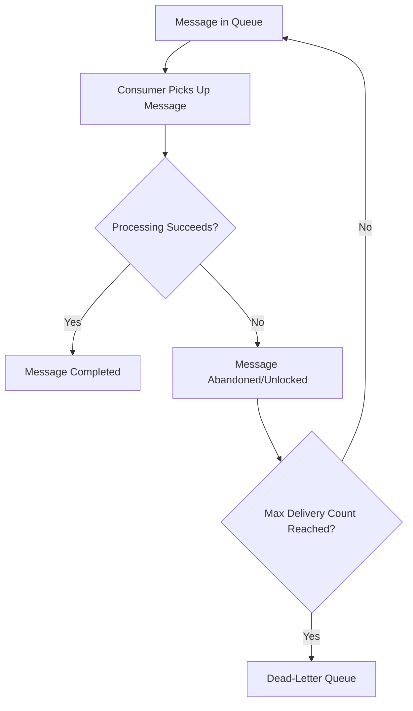

# How to Handle Poison Messages in Azure Service Bus Queues

Author: [nawazdhandala](https://www.github.com/nawazdhandala)

Tags: Azure Service Bus, Poison Messages, Error Handling, Message Queue, Azure, Reliability, Dead Letter

Description: Learn strategies for detecting, handling, and recovering from poison messages in Azure Service Bus queues to prevent processing loops and data loss.

---

A poison message is a message that your consumer cannot process successfully no matter how many times it tries. Maybe the message body is malformed, the data references a record that was deleted, or the processing logic hits an unrecoverable error for that specific payload. Without proper handling, a poison message can block your entire queue processing pipeline, consuming resources as it retries endlessly.

Azure Service Bus has built-in mechanisms to deal with poison messages, centered around the dead-letter queue. In this post, I will explain how poison messages occur, how Service Bus handles them by default, and how to build robust processing logic that deals with them gracefully.

## How Poison Messages Happen

Poison messages enter your system in several ways. An upstream producer might send a message with an invalid schema. A database migration might change a column type, making older messages incompatible. A third-party API that your consumer depends on might permanently reject certain inputs. Or your own code might have a bug that only manifests with specific data patterns.

The problem becomes acute in a message-driven system because the message keeps coming back. When your consumer throws an exception, the message becomes visible again and gets redelivered. If the same exception occurs, the cycle repeats.



## Default Behavior: Max Delivery Count

Azure Service Bus tracks how many times each message has been delivered. When a message's delivery count exceeds the queue's `MaxDeliveryCount` setting (default is 10), the message is automatically moved to the dead-letter queue.

```bash
# Set the max delivery count when creating or updating a queue
az servicebus queue create \
  --name orders \
  --namespace-name my-servicebus \
  --resource-group my-rg \
  --max-delivery-count 5 \
  --dead-lettering-on-message-expiration true
```

Setting the max delivery count to 5 means a message gets 5 chances to be processed successfully. After the 5th failure, Service Bus moves it to the dead-letter sub-queue automatically.

## Processing Messages with Explicit Error Handling

The key to handling poison messages well is to distinguish between transient errors (worth retrying) and permanent errors (should go to dead-letter immediately).

```csharp
using Azure.Messaging.ServiceBus;
using Microsoft.Extensions.Logging;

public class OrderProcessor
{
    private readonly ILogger<OrderProcessor> _logger;
    private readonly ServiceBusClient _client;

    public OrderProcessor(ILogger<OrderProcessor> logger, ServiceBusClient client)
    {
        _logger = logger;
        _client = client;
    }

    public async Task StartProcessingAsync()
    {
        var processor = _client.CreateProcessor("orders", new ServiceBusProcessorOptions
        {
            // Do not auto-complete - we want to control when the message is completed
            AutoCompleteMessages = false,
            MaxConcurrentCalls = 10,
            // Receive and delete is faster but loses the message on failure
            // PeekLock is safer - we control the outcome
            ReceiveMode = ServiceBusReceiveMode.PeekLock
        });

        processor.ProcessMessageAsync += HandleMessageAsync;
        processor.ProcessErrorAsync += HandleErrorAsync;

        await processor.StartProcessingAsync();
    }

    private async Task HandleMessageAsync(ProcessMessageEventArgs args)
    {
        var message = args.Message;

        _logger.LogInformation(
            "Processing message {MessageId}, delivery attempt {Count}",
            message.MessageId, message.DeliveryCount);

        try
        {
            // Try to deserialize the message
            var order = message.Body.ToObjectFromJson<Order>();

            // Validate the message content
            var validationErrors = ValidateOrder(order);
            if (validationErrors.Any())
            {
                // Permanent failure - invalid data will never pass validation
                // Send directly to dead-letter with a reason
                _logger.LogWarning(
                    "Message {MessageId} failed validation: {Errors}",
                    message.MessageId, string.Join(", ", validationErrors));

                await args.DeadLetterMessageAsync(message,
                    deadLetterReason: "ValidationFailed",
                    deadLetterErrorDescription: string.Join("; ", validationErrors));
                return;
            }

            // Process the valid order
            await ProcessOrder(order);

            // Mark the message as successfully processed
            await args.CompleteMessageAsync(message);

            _logger.LogInformation("Message {MessageId} processed successfully",
                message.MessageId);
        }
        catch (JsonException ex)
        {
            // Deserialization failure - message body is malformed
            // This will never succeed, so dead-letter it immediately
            _logger.LogError(ex, "Message {MessageId} has invalid JSON body",
                message.MessageId);

            await args.DeadLetterMessageAsync(message,
                deadLetterReason: "MalformedMessage",
                deadLetterErrorDescription: ex.Message);
        }
        catch (TransientException ex)
        {
            // Transient failure - database timeout, network blip, etc.
            // Abandon the message so it can be retried
            _logger.LogWarning(ex,
                "Transient error processing message {MessageId}, will retry",
                message.MessageId);

            await args.AbandonMessageAsync(message);
        }
        catch (Exception ex)
        {
            // Unknown error - check delivery count to decide what to do
            if (message.DeliveryCount >= 3)
            {
                // Already failed multiple times - dead-letter it
                _logger.LogError(ex,
                    "Message {MessageId} failed {Count} times, dead-lettering",
                    message.MessageId, message.DeliveryCount);

                await args.DeadLetterMessageAsync(message,
                    deadLetterReason: "ProcessingFailed",
                    deadLetterErrorDescription: ex.Message);
            }
            else
            {
                // Still has retries left - abandon for redelivery
                _logger.LogWarning(ex,
                    "Message {MessageId} failed, attempt {Count}",
                    message.MessageId, message.DeliveryCount);

                await args.AbandonMessageAsync(message);
            }
        }
    }

    private Task HandleErrorAsync(ProcessErrorEventArgs args)
    {
        _logger.LogError(args.Exception,
            "Error in message processing: {Source}", args.ErrorSource);
        return Task.CompletedTask;
    }
}
```

## Using Azure Functions with Service Bus Trigger

If you are using Azure Functions instead of a standalone processor, the pattern is slightly different because the Functions runtime handles the PeekLock completion automatically.

```csharp
using Azure.Messaging.ServiceBus;
using Microsoft.Azure.Functions.Worker;
using Microsoft.Extensions.Logging;

public class OrderFunction
{
    private readonly ILogger<OrderFunction> _logger;
    private readonly IOrderService _orderService;

    public OrderFunction(ILogger<OrderFunction> logger, IOrderService orderService)
    {
        _logger = logger;
        _orderService = orderService;
    }

    // The Functions runtime automatically completes the message on success
    // and abandons it on failure (which increments the delivery count)
    [Function("ProcessOrder")]
    public async Task Run(
        [ServiceBusTrigger("orders", Connection = "ServiceBusConnection")]
        ServiceBusReceivedMessage message,
        ServiceBusMessageActions messageActions)
    {
        _logger.LogInformation(
            "Processing order message {Id}, attempt {Count}",
            message.MessageId, message.DeliveryCount);

        try
        {
            var order = message.Body.ToObjectFromJson<Order>();
            await _orderService.ProcessAsync(order);

            // Explicitly complete on success
            await messageActions.CompleteMessageAsync(message);
        }
        catch (InvalidOrderException ex)
        {
            // Business rule violation - dead-letter immediately
            _logger.LogWarning("Invalid order: {Reason}", ex.Message);
            await messageActions.DeadLetterMessageAsync(message,
                deadLetterReason: "InvalidOrder",
                deadLetterErrorDescription: ex.Message);
        }
        catch (Exception ex) when (message.DeliveryCount >= 4)
        {
            // Too many failures - dead-letter instead of retrying forever
            _logger.LogError(ex, "Message exhausted retries, dead-lettering");
            await messageActions.DeadLetterMessageAsync(message,
                deadLetterReason: "MaxRetriesExceeded",
                deadLetterErrorDescription: ex.Message);
        }
        // For other exceptions, let the runtime handle the abandonment
        // which will result in redelivery
    }
}
```

## Monitoring the Dead-Letter Queue

Messages in the dead-letter queue do not get processed automatically. You need to actively monitor and handle them.

```csharp
// Check dead-letter queue depth and process messages
public class DeadLetterProcessor
{
    private readonly ServiceBusClient _client;
    private readonly ILogger<DeadLetterProcessor> _logger;

    public async Task ProcessDeadLettersAsync(string queueName)
    {
        // Create a receiver for the dead-letter sub-queue
        var receiver = _client.CreateReceiver(queueName,
            new ServiceBusReceiverOptions
            {
                SubQueue = SubQueue.DeadLetter
            });

        // Peek at messages without removing them
        var messages = await receiver.PeekMessagesAsync(maxMessages: 50);

        foreach (var message in messages)
        {
            _logger.LogInformation(
                "Dead-letter message: {Id}, Reason: {Reason}, Description: {Desc}",
                message.MessageId,
                message.DeadLetterReason,
                message.DeadLetterErrorDescription);

            // You can inspect and decide what to do:
            // - Fix and resubmit to the original queue
            // - Log for investigation
            // - Discard if no longer relevant
        }
    }

    // Resubmit fixable messages back to the main queue
    public async Task ResubmitDeadLettersAsync(string queueName)
    {
        var receiver = _client.CreateReceiver(queueName,
            new ServiceBusReceiverOptions
            {
                SubQueue = SubQueue.DeadLetter
            });

        var sender = _client.CreateSender(queueName);

        while (true)
        {
            var message = await receiver.ReceiveMessageAsync(TimeSpan.FromSeconds(5));
            if (message == null) break;

            // Create a new message with the same body
            var newMessage = new ServiceBusMessage(message.Body)
            {
                ContentType = message.ContentType,
                Subject = message.Subject,
                MessageId = Guid.NewGuid().ToString()
            };

            // Copy application properties
            foreach (var prop in message.ApplicationProperties)
            {
                newMessage.ApplicationProperties[prop.Key] = prop.Value;
            }

            // Add metadata about the resubmission
            newMessage.ApplicationProperties["ResubmittedFrom"] = "DeadLetter";
            newMessage.ApplicationProperties["OriginalMessageId"] = message.MessageId;
            newMessage.ApplicationProperties["OriginalDeadLetterReason"] =
                message.DeadLetterReason;

            // Send to the main queue and complete the dead-letter message
            await sender.SendMessageAsync(newMessage);
            await receiver.CompleteMessageAsync(message);

            _logger.LogInformation(
                "Resubmitted message {OrigId} as {NewId}",
                message.MessageId, newMessage.MessageId);
        }
    }
}
```

## Setting Up Alerts

Configure alerts to notify your team when dead-letter messages accumulate.

```bash
# Create an alert when dead-letter queue has more than 10 messages
az monitor metrics alert create \
  --name "DeadLetter-Alert" \
  --resource-group my-rg \
  --scopes "/subscriptions/<SUB>/resourceGroups/my-rg/providers/Microsoft.ServiceBus/namespaces/my-servicebus" \
  --condition "avg DeadletteredMessages > 10 where EntityName includes orders" \
  --window-size 5m \
  --evaluation-frequency 5m \
  --severity 2 \
  --action-group ops-team
```

## Summary

Poison messages are inevitable in message-driven systems. The best approach is to categorize errors into transient (retry) and permanent (dead-letter), use explicit dead-lettering with descriptive reasons for permanent failures, monitor the dead-letter queue actively, and build tooling to inspect and resubmit messages when appropriate. Azure Service Bus gives you the building blocks with max delivery count and dead-letter sub-queues - your job is to use them effectively in your processing logic.
