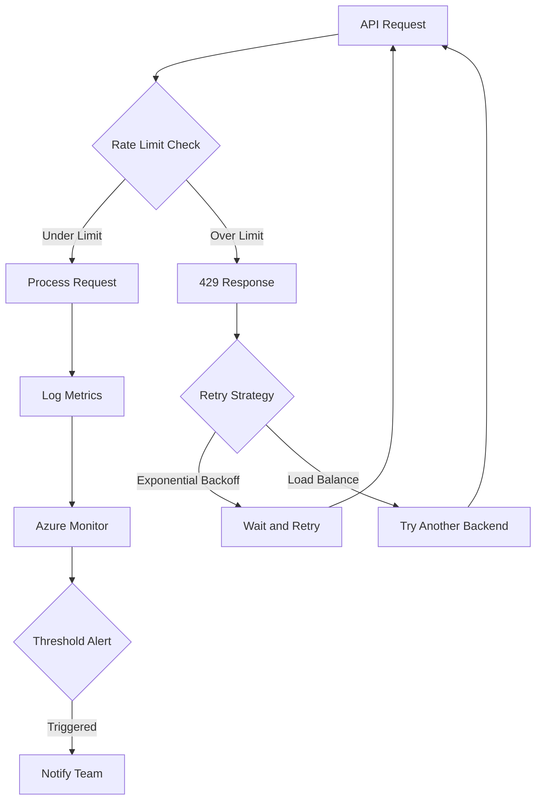

# How to Handle Rate Limiting and Throttling in Azure OpenAI API Calls

Author: [nawazdhandala](https://www.github.com/nawazdhandala)

Tags: Azure, OpenAI, Rate Limiting, Throttling, API, Resilience, Error Handling

Description: Practical patterns for handling rate limits and throttling in Azure OpenAI API calls with retry logic, backoff strategies, and load balancing.

---

If you are building production applications with Azure OpenAI, you will eventually hit rate limits. Azure OpenAI enforces limits on both tokens per minute (TPM) and requests per minute (RPM) for each model deployment. When you exceed these limits, the API returns a 429 (Too Many Requests) response, and your application needs to handle this gracefully. A poorly designed retry strategy can make things worse by flooding the API with retries during peak load.

In this post, I will cover the rate limiting model in Azure OpenAI, show you how to implement robust retry logic, and share patterns for distributing load across multiple deployments.

## Understanding Azure OpenAI Rate Limits

Azure OpenAI uses two types of rate limits:

- **Tokens Per Minute (TPM)**: The total number of input and output tokens your deployment can process per minute. This is the primary limit.
- **Requests Per Minute (RPM)**: The total number of API calls per minute, regardless of token count. This is calculated as TPM / 1000 * 6 for most models.

When you create a deployment in Azure OpenAI Studio, you assign a TPM quota. The default varies by model and region, and you can request increases through the Azure Portal.

When you hit either limit, the API returns a 429 response with a `Retry-After` header indicating how many seconds to wait before trying again.

## The 429 Response

Here is what a rate-limited response looks like:

```
HTTP/1.1 429 Too Many Requests
Retry-After: 10
x-ratelimit-remaining-tokens: 0
x-ratelimit-remaining-requests: 0

{
    "error": {
        "code": "429",
        "message": "Requests to the ChatCompletions_Create Operation under Azure OpenAI API version 2024-02-01 have exceeded token rate limit of your current OpenAI S0 pricing tier."
    }
}
```

The `Retry-After` header tells you exactly how long to wait. The `x-ratelimit-remaining-tokens` and `x-ratelimit-remaining-requests` headers tell you how much quota you have left before the next reset window.

## Implementing Exponential Backoff with Jitter

The standard approach for handling 429 responses is exponential backoff with jitter. This means each retry waits longer than the previous one, with some randomness added to prevent multiple clients from retrying at the exact same time (the thundering herd problem).

```python
import openai
import time
import random

def call_with_retry(client, messages, model="gpt4-production", max_retries=5):
    """
    Make an Azure OpenAI API call with exponential backoff retry logic.
    Handles both 429 (rate limit) and 500-level (server error) responses.
    """
    base_delay = 1  # Starting delay in seconds

    for attempt in range(max_retries):
        try:
            response = client.chat.completions.create(
                model=model,
                messages=messages,
                max_tokens=500
            )
            return response

        except openai.RateLimitError as e:
            if attempt == max_retries - 1:
                raise  # Give up after max retries

            # Use Retry-After header if available, otherwise use exponential backoff
            retry_after = getattr(e, 'retry_after', None)
            if retry_after:
                wait_time = float(retry_after)
            else:
                # Exponential backoff: 1s, 2s, 4s, 8s, 16s
                wait_time = base_delay * (2 ** attempt)

            # Add jitter (random 0-50% of wait time) to prevent thundering herd
            jitter = wait_time * random.uniform(0, 0.5)
            total_wait = wait_time + jitter

            print(f"Rate limited. Attempt {attempt + 1}/{max_retries}. "
                  f"Waiting {total_wait:.1f}s before retry.")
            time.sleep(total_wait)

        except openai.APIStatusError as e:
            if e.status_code >= 500:
                # Server errors are usually transient - retry
                wait_time = base_delay * (2 ** attempt)
                jitter = wait_time * random.uniform(0, 0.5)
                print(f"Server error {e.status_code}. Retrying in {wait_time + jitter:.1f}s")
                time.sleep(wait_time + jitter)
            else:
                raise  # Client errors (400, 403, etc.) should not be retried
```

## Using the Tenacity Library

For production code, I recommend using the `tenacity` library instead of writing your own retry loop. It is well tested and handles edge cases.

```python
from tenacity import (
    retry,
    stop_after_attempt,
    wait_exponential_jitter,
    retry_if_exception_type,
)
import openai

# Define a retry decorator for Azure OpenAI calls
@retry(
    retry=retry_if_exception_type(openai.RateLimitError),
    wait=wait_exponential_jitter(
        initial=1,     # Start with 1 second delay
        max=60,        # Never wait more than 60 seconds
        jitter=5       # Add up to 5 seconds of random jitter
    ),
    stop=stop_after_attempt(6),  # Give up after 6 attempts
    before_sleep=lambda retry_state: print(
        f"Rate limited, retrying in {retry_state.next_action.sleep:.1f}s "
        f"(attempt {retry_state.attempt_number})"
    )
)
def resilient_completion(client, messages, model="gpt4-production"):
    """
    Make an API call with automatic retry on rate limit errors.
    Uses tenacity for robust exponential backoff with jitter.
    """
    return client.chat.completions.create(
        model=model,
        messages=messages,
        max_tokens=500
    )
```

## Proactive Rate Limit Management

Instead of reacting to 429 errors, you can proactively manage your request rate to stay under the limit.

### Token Bucket Rate Limiter

A token bucket algorithm lets you smooth out request traffic and prevent bursts that trigger rate limits.

```python
import threading
import time

class TokenBucketRateLimiter:
    """
    Rate limiter using the token bucket algorithm.
    Ensures requests stay within the configured tokens-per-minute limit.
    """

    def __init__(self, tokens_per_minute):
        self.rate = tokens_per_minute / 60.0  # Tokens per second
        self.max_tokens = tokens_per_minute
        self.available_tokens = tokens_per_minute
        self.last_refill = time.time()
        self.lock = threading.Lock()

    def _refill(self):
        """Add tokens based on elapsed time since last refill."""
        now = time.time()
        elapsed = now - self.last_refill
        self.available_tokens = min(
            self.max_tokens,
            self.available_tokens + elapsed * self.rate
        )
        self.last_refill = now

    def acquire(self, tokens_needed):
        """
        Wait until enough tokens are available, then consume them.
        Blocks the calling thread if the bucket is empty.
        """
        while True:
            with self.lock:
                self._refill()
                if self.available_tokens >= tokens_needed:
                    self.available_tokens -= tokens_needed
                    return True

            # Not enough tokens yet - wait a bit
            time.sleep(0.1)


# Create a rate limiter matching your deployment's TPM limit
rate_limiter = TokenBucketRateLimiter(tokens_per_minute=80000)

def rate_limited_completion(client, messages, estimated_tokens=1000):
    """
    Make an API call with proactive rate limiting.
    Waits for token budget before making the call.
    """
    # Wait until we have budget for this request
    rate_limiter.acquire(estimated_tokens)

    return client.chat.completions.create(
        model="gpt4-production",
        messages=messages,
        max_tokens=500
    )
```

## Load Balancing Across Multiple Deployments

For high-throughput applications, a single deployment's rate limit may not be enough. You can create multiple deployments of the same model across different regions and load-balance requests across them.

```python
import random

class AzureOpenAILoadBalancer:
    """
    Distribute API calls across multiple Azure OpenAI deployments.
    Automatically routes around rate-limited deployments.
    """

    def __init__(self):
        self.backends = []
        self.cooldowns = {}  # Track which backends are in cooldown

    def add_backend(self, name, client, deployment_name):
        """Register a new backend deployment."""
        self.backends.append({
            "name": name,
            "client": client,
            "deployment": deployment_name
        })

    def get_available_backend(self):
        """Pick a random available backend (not in cooldown)."""
        now = time.time()
        available = [
            b for b in self.backends
            if self.cooldowns.get(b["name"], 0) < now
        ]

        if not available:
            # All backends are in cooldown - wait for the earliest one
            earliest = min(self.cooldowns.values())
            wait_time = earliest - now + 0.1
            print(f"All backends rate-limited. Waiting {wait_time:.1f}s")
            time.sleep(wait_time)
            return self.get_available_backend()

        return random.choice(available)

    def complete(self, messages, max_tokens=500):
        """
        Send a completion request, automatically routing to an available backend.
        Retries on a different backend if rate limited.
        """
        for _ in range(len(self.backends) * 2):  # Allow retries across all backends
            backend = self.get_available_backend()
            try:
                response = backend["client"].chat.completions.create(
                    model=backend["deployment"],
                    messages=messages,
                    max_tokens=max_tokens
                )
                return response

            except openai.RateLimitError as e:
                # Put this backend in cooldown
                retry_after = getattr(e, 'retry_after', 10)
                self.cooldowns[backend["name"]] = time.time() + float(retry_after)
                print(f"Backend {backend['name']} rate limited. "
                      f"Cooling down for {retry_after}s")

        raise Exception("All backends exhausted after retries")
```

## Monitoring and Alerting

Set up Azure Monitor alerts for your OpenAI deployments to catch rate limiting issues before they impact users.



Key metrics to monitor:

- 429 response rate (percentage of total requests)
- Average retry count per successful request
- Token utilization as a percentage of quota
- P99 latency (which spikes when retries are happening)

## Wrapping Up

Rate limiting is a fact of life with Azure OpenAI. The key is to handle it gracefully rather than trying to avoid it entirely. Implement exponential backoff with jitter for reactive handling, use proactive rate limiting to smooth out traffic, and deploy across multiple regions for high-throughput scenarios. Monitor your 429 rates and adjust your deployment quotas as your usage grows. A well-designed rate limiting strategy means your users never notice the limits exist.
