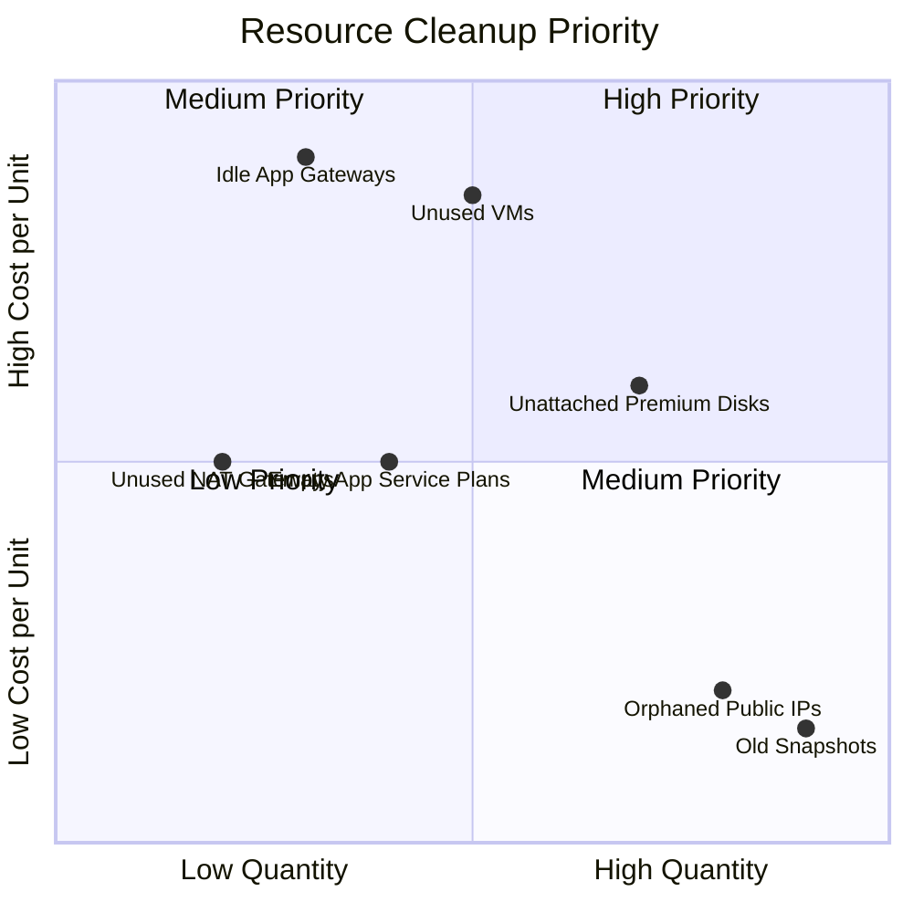

# How to Identify and Delete Unused Azure Resources with Azure Advisor

Author: [nawazdhandala](https://www.github.com/nawazdhandala)

Tags: Azure, Azure Advisor, Cost Optimization, Unused Resources, FinOps, Cloud Costs, Governance

Description: Learn how to use Azure Advisor and other tools to find and clean up unused Azure resources that waste money every month.

---

Cloud waste is a universal problem. Studies consistently show that 25-35% of cloud spending goes to unused or underutilized resources. In Azure, this waste accumulates quietly - an unattached disk here, an idle public IP there, a load balancer with no backends. Each one costs a few dollars a day, and before you know it, you are spending thousands of dollars a month on resources nobody is using.

Azure Advisor is your first line of defense against this waste. It automatically identifies many types of unused resources and recommends actions. But Advisor does not catch everything, so I will also show you how to find the common resource types it misses.

## Step 1: Review Azure Advisor Cost Recommendations

Azure Advisor analyzes your resource usage patterns and surfaces cost-saving recommendations. Start here:

```bash
# List all cost recommendations from Azure Advisor
az advisor recommendation list \
  --category Cost \
  --output table

# Get detailed cost recommendations with savings estimates
az advisor recommendation list \
  --category Cost \
  --query "[].{Impact: impact, Problem: shortDescription.problem, Solution: shortDescription.solution, Resource: resourceMetadata.resourceId, Savings: extendedProperties.annualSavingsAmount}" \
  --output table
```

Advisor typically identifies:

- Underutilized VMs (low CPU, low network usage)
- Idle ExpressRoute circuits
- Unassociated public IP addresses
- Unattached managed disks
- Underutilized App Service Plans
- Oversized database instances

## Step 2: Find Unattached Managed Disks

Managed disks are one of the biggest silent cost drivers. When you delete a VM, the disks are often left behind. Premium SSD disks cost real money even when unattached.

```bash
# Find all unattached managed disks
az disk list \
  --query "[?managedBy==null && diskState=='Unattached'].{Name: name, ResourceGroup: resourceGroup, Size: diskSizeGb, SKU: sku.name, Location: location}" \
  --output table
```

Review each disk. If you are certain it is not needed (no VM to reattach it to, no data recovery needs), delete it:

```bash
# Delete an unattached disk
az disk delete \
  --resource-group myResourceGroup \
  --name myOrphanedDisk \
  --yes
```

Before bulk-deleting, create a snapshot of any disk you are not 100% sure about. A snapshot is much cheaper than the original disk:

```bash
# Create a snapshot before deleting (costs much less than keeping the disk)
az snapshot create \
  --resource-group myResourceGroup \
  --name myDiskSnapshot \
  --source /subscriptions/<sub-id>/resourceGroups/myRG/providers/Microsoft.Compute/disks/myOrphanedDisk \
  --sku Standard_LRS
```

## Step 3: Find Unassociated Public IP Addresses

Static public IP addresses cost money whether they are in use or not. Dynamic public IPs only cost money when associated, but stale static IPs add up.

```bash
# Find all unassociated public IP addresses
az network public-ip list \
  --query "[?ipConfiguration==null && natGateway==null].{Name: name, RG: resourceGroup, IP: ipAddress, SKU: sku.name, Allocation: publicIpAllocationMethod}" \
  --output table
```

Standard SKU static public IPs cost around $3.65/month each. If you have 50 orphaned ones, that is $180/month for nothing.

```bash
# Delete an unassociated public IP
az network public-ip delete \
  --resource-group myResourceGroup \
  --name myUnusedPublicIP
```

## Step 4: Find Empty or Unused Network Resources

Several network resources cost money even when not actively used:

### Idle Load Balancers

Load balancers with no backend pool members are not doing anything useful but still incur charges:

```bash
# Find load balancers with empty backend pools
az network lb list \
  --query "[?length(backendAddressPools)==\`0\` || backendAddressPools[0].backendIPConfigurations==null].{Name: name, RG: resourceGroup, SKU: sku.name}" \
  --output table
```

### Unused NAT Gateways

NAT Gateways cost around $32/month plus data processing charges, even if no subnet is using them:

```bash
# Find NAT Gateways not associated with any subnet
az network nat gateway list \
  --query "[?subnets==null || length(subnets)==\`0\`].{Name: name, RG: resourceGroup}" \
  --output table
```

### Unused Application Gateways

Application Gateway v2 costs at least $175/month for the fixed cost alone:

```bash
# Find Application Gateways with no backend pool members
az network application-gateway list \
  --query "[].{Name: name, RG: resourceGroup, BackendPools: backendAddressPools[*].name}" \
  --output table
```

## Step 5: Find Idle or Stopped VMs

VMs that are stopped but not deallocated still incur compute charges. Only deallocated VMs stop accruing compute costs (though you still pay for disk storage).

```bash
# Find VMs that are stopped but NOT deallocated (still being billed for compute)
az vm list \
  --show-details \
  --query "[?powerState=='VM stopped'].{Name: name, RG: resourceGroup, Size: hardwareProfile.vmSize}" \
  --output table
```

Either deallocate these VMs to stop compute billing, or delete them if they are no longer needed:

```bash
# Deallocate a stopped VM to stop compute charges
az vm deallocate \
  --resource-group myResourceGroup \
  --name myStoppedVM

# Or delete it entirely if not needed
az vm delete \
  --resource-group myResourceGroup \
  --name myStoppedVM \
  --yes
```

## Step 6: Find Unused App Service Plans

App Service Plans charge for allocated capacity, even if no web apps are deployed to them:

```bash
# Find App Service Plans with no apps
az appservice plan list \
  --query "[?numberOfSites==\`0\`].{Name: name, RG: resourceGroup, SKU: sku.name, Location: location}" \
  --output table
```

An empty Standard S1 plan costs about $70/month. Delete empty plans:

```bash
# Delete an empty App Service Plan
az appservice plan delete \
  --resource-group myResourceGroup \
  --name myEmptyAppPlan \
  --yes
```

## Step 7: Find Old Snapshots and Images

Snapshots and custom VM images accumulate over time. Old deployment snapshots and images from months ago are often forgotten:

```bash
# Find snapshots older than 90 days
az snapshot list \
  --query "[?timeCreated < '$(date -u -d '90 days ago' +%Y-%m-%dT%H:%M:%SZ)'].{Name: name, RG: resourceGroup, SizeGB: diskSizeGb, Created: timeCreated}" \
  --output table
```

Review old snapshots and delete ones that are no longer needed for recovery purposes.

## Step 8: Automate Cleanup with Azure Policy and Tags

To prevent waste from accumulating, implement governance:

### Tag Resources with Owners and Expiry Dates

Use tags to track who owns each resource and when it should be reviewed:

```bash
# Tag a resource with owner and review date
az resource tag \
  --ids /subscriptions/<sub-id>/resourceGroups/myRG/providers/Microsoft.Compute/disks/myDisk \
  --tags Owner=teamA ReviewDate=2026-03-15 Environment=dev
```

### Use Azure Policy to Enforce Tagging

Create a policy that requires an Owner tag on all resources:

```json
{
  "mode": "All",
  "policyRule": {
    "if": {
      "field": "tags['Owner']",
      "exists": "false"
    },
    "then": {
      "effect": "deny"
    }
  }
}
```

### Set Up Scheduled Cleanup Scripts

Create an Azure Automation runbook that runs weekly to find and report (or delete) unused resources:

```python
# Azure Automation runbook to identify unused resources
# This generates a report - modify to auto-delete if desired

import json
from azure.identity import DefaultAzureCredential
from azure.mgmt.compute import ComputeManagementClient
from azure.mgmt.network import NetworkManagementClient

credential = DefaultAzureCredential()
subscription_id = "<sub-id>"

# Initialize management clients
compute_client = ComputeManagementClient(credential, subscription_id)
network_client = NetworkManagementClient(credential, subscription_id)

# Find unattached disks
unattached_disks = []
for disk in compute_client.disks.list():
    if disk.disk_state == "Unattached":
        unattached_disks.append({
            "name": disk.name,
            "size_gb": disk.disk_size_gb,
            "sku": disk.sku.name
        })

print(f"Found {len(unattached_disks)} unattached disks")
for disk in unattached_disks:
    print(f"  - {disk['name']}: {disk['size_gb']}GB ({disk['sku']})")
```

## Cleanup Priority Matrix

Focus on the resources with the highest costs first:



## Summary

Finding and deleting unused Azure resources is one of the fastest ways to reduce your monthly cloud bill. Start with Azure Advisor for the easy wins, then systematically check for unattached disks, orphaned public IPs, empty App Service Plans, idle load balancers, and stopped VMs. Implement tagging and Azure Policy to prevent waste from accumulating in the first place. Make cleanup a regular process, not a one-time spring cleaning. The waste will come back if you do not have ongoing governance in place.
