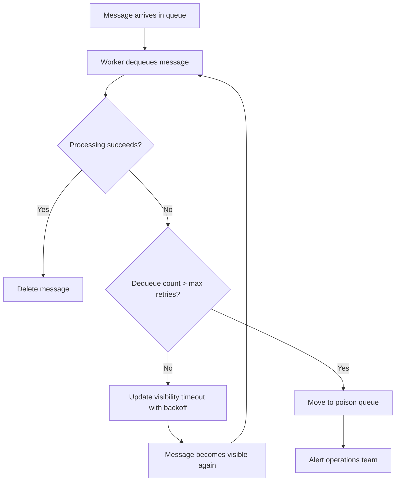

# How to Implement a Retry Pattern with Azure Queue Storage

Author: [nawazdhandala](https://www.github.com/nawazdhandala)

Tags: Azure, Queue Storage, Retry Pattern, Cloud Architecture, Resilience, Distributed Systems, Error Handling

Description: Learn how to implement robust retry patterns with Azure Queue Storage to handle transient failures and build resilient cloud applications.

---

When you work with distributed cloud services, transient failures are a fact of life. Network hiccups, throttling responses, and brief service interruptions can all cause message processing to fail momentarily. Azure Queue Storage gives you built-in mechanisms to deal with these situations, but getting the retry pattern right takes some thought. In this post, I will walk you through implementing a solid retry strategy that keeps your message processing reliable without burning through resources.

## Why Retry Patterns Matter for Queue Processing

Azure Queue Storage is often the backbone of decoupled architectures. A web API drops a message into the queue, and a background worker picks it up later. But what happens when the worker fails to process that message? Maybe the downstream database was temporarily unavailable, or an external API returned a 503.

Without a proper retry strategy, you either lose the message or get stuck in an infinite loop of failed processing attempts. Neither outcome is acceptable in production.

Azure Queue Storage has a built-in mechanism called the dequeue count. Every time a message is dequeued for processing, this counter increments. Combined with the visibility timeout, this gives you the foundation for building retry logic.

## Understanding the Visibility Timeout

When a worker dequeues a message, that message becomes invisible to other consumers for a period called the visibility timeout. If the worker processes the message successfully and deletes it, great. If not, the message reappears in the queue after the timeout expires, ready to be picked up again.

This is your first line of defense. The default visibility timeout is 30 seconds, but you should tune it based on how long your processing typically takes.

Here is how to dequeue a message with a custom visibility timeout using the Azure SDK for Python.

```python
from azure.storage.queue import QueueClient
import os

# Connect to the queue using a connection string
connection_string = os.environ["AZURE_STORAGE_CONNECTION_STRING"]
queue_client = QueueClient.from_connection_string(connection_string, "my-task-queue")

# Dequeue a message with a 60-second visibility timeout
# This gives the worker 60 seconds to process before the message reappears
messages = queue_client.receive_messages(
    messages_per_page=1,
    visibility_timeout=60
)

for message in messages:
    try:
        # Process the message
        process_task(message.content)
        # Delete the message after successful processing
        queue_client.delete_message(message)
    except Exception as e:
        # Let the message become visible again after timeout
        print(f"Processing failed: {e}")
```

## Implementing Exponential Backoff with Dequeue Count

The simplest retry approach is to let the message reappear and get picked up again. But if you just use a fixed visibility timeout, you will retry at the same interval every time. This can be a problem if the downstream service needs more time to recover.

A better approach is exponential backoff. You can read the dequeue count from the message and adjust the visibility timeout accordingly.

```python
import math

def calculate_backoff_timeout(dequeue_count, base_timeout=30, max_timeout=3600):
    """
    Calculate exponential backoff based on how many times
    the message has been dequeued. Caps at max_timeout seconds.
    """
    timeout = base_timeout * (2 ** (dequeue_count - 1))
    return min(timeout, max_timeout)

# Receive and process with exponential backoff
messages = queue_client.receive_messages(messages_per_page=1, visibility_timeout=30)

for message in messages:
    try:
        process_task(message.content)
        queue_client.delete_message(message)
    except TransientError as e:
        # Calculate next retry delay based on dequeue count
        next_timeout = calculate_backoff_timeout(message.dequeue_count)
        # Update visibility timeout so the message reappears later
        queue_client.update_message(
            message,
            visibility_timeout=next_timeout
        )
        print(f"Retry #{message.dequeue_count}, next attempt in {next_timeout}s")
```

With this pattern, the first retry happens after 30 seconds, the second after 60, then 120, 240, and so on. This gives the failing dependency progressively more time to recover.

## Setting a Maximum Retry Limit

You do not want messages retrying forever. At some point, a message that keeps failing needs to be moved aside so it does not clog up the queue. The dequeue count is your tool for this.

```python
MAX_RETRIES = 5

messages = queue_client.receive_messages(messages_per_page=1, visibility_timeout=30)

for message in messages:
    if message.dequeue_count > MAX_RETRIES:
        # Move the message to a poison queue for manual investigation
        poison_queue_client.send_message(message.content)
        queue_client.delete_message(message)
        print(f"Message moved to poison queue after {MAX_RETRIES} retries")
        continue

    try:
        process_task(message.content)
        queue_client.delete_message(message)
    except Exception as e:
        next_timeout = calculate_backoff_timeout(message.dequeue_count)
        queue_client.update_message(message, visibility_timeout=next_timeout)
```

The poison queue pattern is standard practice. You create a separate queue (often named with a "-poison" suffix) where you park messages that have exceeded the retry limit. This lets you investigate failures without blocking new message processing.

## Adding Jitter to Prevent Thundering Herd

If many workers fail at the same time - say, because a shared database goes down - they will all retry at roughly the same moment when the backoff period expires. This thundering herd effect can overwhelm the recovering service.

Adding random jitter spreads out the retries.

```python
import random

def calculate_backoff_with_jitter(dequeue_count, base_timeout=30, max_timeout=3600):
    """
    Exponential backoff with full jitter.
    Randomizes the timeout between 0 and the calculated backoff value.
    """
    exponential_timeout = base_timeout * (2 ** (dequeue_count - 1))
    capped_timeout = min(exponential_timeout, max_timeout)
    # Full jitter: random value between base_timeout and capped_timeout
    return random.randint(base_timeout, capped_timeout)
```

## Implementing Retry in .NET

If you are working with the .NET SDK, the approach is similar but the API is slightly different.

```csharp
using Azure.Storage.Queues;
using Azure.Storage.Queues.Models;

// Create the queue client
var queueClient = new QueueClient(connectionString, "my-task-queue");

// Receive messages with a visibility timeout
var messages = await queueClient.ReceiveMessagesAsync(
    maxMessages: 1,
    visibilityTimeout: TimeSpan.FromSeconds(30)
);

foreach (var message in messages.Value)
{
    // Check if max retries exceeded
    if (message.DequeueCount > 5)
    {
        // Send to poison queue
        await poisonQueueClient.SendMessageAsync(message.Body.ToString());
        await queueClient.DeleteMessageAsync(message.MessageId, message.PopReceipt);
        continue;
    }

    try
    {
        await ProcessTaskAsync(message.Body.ToString());
        // Delete on success
        await queueClient.DeleteMessageAsync(message.MessageId, message.PopReceipt);
    }
    catch (Exception ex)
    {
        // Calculate backoff and update visibility
        var backoff = TimeSpan.FromSeconds(30 * Math.Pow(2, message.DequeueCount - 1));
        var capped = TimeSpan.FromSeconds(Math.Min(backoff.TotalSeconds, 3600));
        await queueClient.UpdateMessageAsync(
            message.MessageId,
            message.PopReceipt,
            visibilityTimeout: capped
        );
    }
}
```

## Monitoring Your Retry Behavior

A retry pattern without monitoring is flying blind. You need to track how often messages are retried and how many end up in the poison queue.

Azure Monitor and Application Insights can help here. Log the dequeue count and processing outcome for each message so you can set up alerts when the poison queue starts filling up.

Here is the kind of flow you should aim for.



## Best Practices Summary

First, always set a maximum retry count. Five retries with exponential backoff covers most transient failure scenarios without excessive delays.

Second, use exponential backoff with jitter. This prevents thundering herd problems and gives failing services time to recover.

Third, implement a poison queue. Messages that cannot be processed after multiple retries need to go somewhere for investigation, not silently disappear.

Fourth, tune your visibility timeout to match your processing time. If your task takes 45 seconds, a 30-second visibility timeout will cause premature retries and duplicate processing.

Fifth, monitor everything. Track dequeue counts, poison queue depth, and processing success rates. Set up alerts so you know when something is going wrong before your users notice.

The retry pattern is one of those things that seems simple on the surface but has real nuance in practice. Getting it right means your Azure Queue Storage workloads will handle the inevitable bumps in distributed systems gracefully, and your on-call engineers will thank you for the poison queue when they need to debug a failure at 2 AM.
