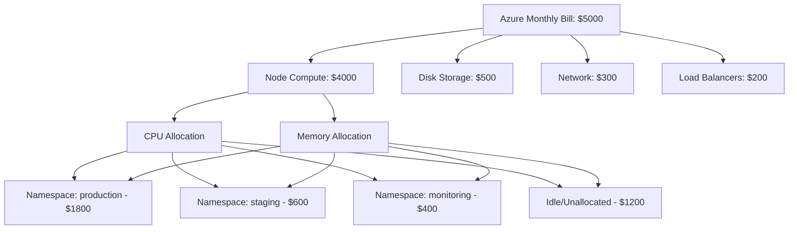

# How to Implement AKS Cluster Cost Analysis with Azure Cost Management and Kubecost

Author: [nawazdhandala](https://www.github.com/nawazdhandala)

Tags: AKS, Kubernetes, Cost Management, Kubecost, Azure, FinOps, Optimization

Description: Learn how to analyze and optimize AKS cluster costs using Azure Cost Management and Kubecost for namespace-level and pod-level cost visibility.

---

Running AKS clusters is easy. Understanding what they cost is surprisingly hard. The Azure bill shows you the total spend on virtual machines, disks, and networking, but it does not tell you which team, which service, or which namespace is responsible for what portion of that cost. A cluster with 10 nodes costs the same whether it is running at 20% utilization or 90%. Without visibility into how resources are consumed at the Kubernetes level, you are flying blind.

Azure Cost Management gives you the infrastructure view, and Kubecost fills in the Kubernetes-level detail. Together, they provide the full picture from cloud bill down to individual pod costs.

## Azure Cost Management for AKS

Azure Cost Management is built into the Azure portal and provides cost analysis for all your Azure resources. For AKS, it breaks down costs by resource type - the VMs in your node pools, managed disks, public IPs, load balancers, and so on.

### Viewing AKS Costs by Resource Group

The simplest way to see your AKS costs is to look at the node resource group (the `MC_` resource group).

```bash
# Find your node resource group
az aks show \
  --resource-group myRG \
  --name myAKS \
  --query nodeResourceGroup -o tsv

# Get cost summary for the last 30 days (requires Cost Management API access)
az costmanagement query \
  --type ActualCost \
  --scope "/subscriptions/<sub-id>/resourceGroups/MC_myRG_myAKS_eastus" \
  --timeframe MonthToDate \
  --dataset-aggregation '{"totalCost":{"name":"Cost","function":"Sum"}}' \
  --dataset-grouping name=ResourceType type=Dimension
```

### Tagging Resources for Cost Allocation

AKS supports propagating tags to the underlying Azure resources. Use tags to track costs by team, project, or environment.

```bash
# Add tags to the AKS cluster
az aks update \
  --resource-group myRG \
  --name myAKS \
  --tags team=platform project=main-app environment=production

# Add tags to specific node pools
az aks nodepool update \
  --resource-group myRG \
  --cluster-name myAKS \
  --name gpupool \
  --tags team=data workload=ml cost-center=CC-1234
```

Then in Azure Cost Management, you can filter and group costs by these tags to see how much each team or project is spending.

### Setting Up Budget Alerts

Create budgets with alerts to catch cost spikes before they become problems.

```bash
# Create a monthly budget with alerts
az consumption budget create \
  --budget-name "aks-monthly-budget" \
  --amount 5000 \
  --category cost \
  --time-grain monthly \
  --start-date "2026-02-01" \
  --end-date "2027-01-31" \
  --resource-group myRG \
  --notification-key "over-80-percent" \
  --notification-enabled true \
  --notification-threshold 80 \
  --notification-contact-emails "ops@example.com" \
  --notification-operator "GreaterThan"
```

## Installing Kubecost on AKS

While Azure Cost Management gives you the infrastructure view, Kubecost provides Kubernetes-native cost allocation. It shows costs broken down by namespace, deployment, label, and even individual pod. AKS has a built-in Kubecost integration through the cost analysis add-on.

```bash
# Enable the AKS cost analysis add-on (uses Kubecost under the hood)
az aks update \
  --resource-group myRG \
  --name myAKS \
  --enable-cost-analysis
```

Alternatively, install the full Kubecost using Helm for more features.

```bash
# Add the Kubecost Helm repo
helm repo add kubecost https://kubecost.github.io/cost-analyzer/
helm repo update

# Install Kubecost
helm install kubecost kubecost/cost-analyzer \
  --namespace kubecost \
  --create-namespace \
  --set kubecostToken="<your-token>" \
  --set prometheus.server.persistentVolume.size=32Gi \
  --set persistentVolume.size=32Gi

# Check that Kubecost is running
kubectl get pods -n kubecost
```

Access the Kubecost dashboard.

```bash
# Port-forward to the Kubecost UI
kubectl port-forward -n kubecost deployment/kubecost-cost-analyzer 9090:9090

# Open http://localhost:9090 in your browser
```

## Configuring Kubecost for Azure Pricing

By default, Kubecost uses public Azure pricing. For accurate costs that reflect your actual pricing (reserved instances, enterprise agreements, spot pricing), configure the Azure integration.

```yaml
# kubecost-azure-config.yaml
# Configure Kubecost to use actual Azure pricing data
apiVersion: v1
kind: Secret
metadata:
  name: cloud-integration
  namespace: kubecost
type: Opaque
stringData:
  cloud-integration.json: |
    {
      "azure": [
        {
          "azureSubscriptionID": "<your-subscription-id>",
          "azureOfferDurableID": "MS-AZR-0017P",
          "azureBillingRegion": "US",
          "azureClientID": "<service-principal-client-id>",
          "azureClientPassword": "<service-principal-password>",
          "azureTenantID": "<your-tenant-id>"
        }
      ]
    }
```

```bash
# Apply the secret
kubectl apply -f kubecost-azure-config.yaml

# Restart Kubecost to pick up the configuration
kubectl rollout restart deployment kubecost-cost-analyzer -n kubecost
```

## Understanding Kubecost Allocation Model

Kubecost calculates costs by taking the total cluster cost (from Azure) and allocating it based on actual resource consumption. Here is how the allocation works.



The "idle" cost represents resources that are provisioned but not used by any pod. This is often the biggest optimization opportunity.

## Querying Costs with the Kubecost API

Kubecost exposes an API for programmatic cost queries. This is useful for building custom reports and integrating with your FinOps tooling.

```bash
# Get namespace-level cost allocation for the last 7 days
curl -s "http://localhost:9090/model/allocation?window=7d&aggregate=namespace" | jq '.data[0] | to_entries[] | {namespace: .key, totalCost: .value.totalCost}'

# Get costs by deployment
curl -s "http://localhost:9090/model/allocation?window=7d&aggregate=deployment" | jq '.data[0] | to_entries[] | select(.value.totalCost > 10) | {deployment: .key, totalCost: .value.totalCost}'

# Get costs by label (useful for team cost allocation)
curl -s "http://localhost:9090/model/allocation?window=7d&aggregate=label:team" | jq '.data[0] | to_entries[] | {team: .key, totalCost: .value.totalCost}'
```

## Identifying Cost Optimization Opportunities

### Finding Over-Provisioned Workloads

The biggest cost savings come from right-sizing over-provisioned workloads.

```bash
# Use Kubecost API to find workloads requesting much more than they use
curl -s "http://localhost:9090/model/allocation?window=7d&aggregate=deployment" | \
  jq '.data[0] | to_entries[] | select(.value.cpuEfficiency < 0.3) | {
    deployment: .key,
    cpuRequested: .value.cpuCoreRequestAverage,
    cpuUsed: .value.cpuCoreUsageAverage,
    efficiency: .value.cpuEfficiency
  }'
```

For deployments with less than 30% CPU efficiency, you are paying for resources that are sitting idle. Reduce the requests and limits.

### Finding Idle Namespaces

```bash
# Check for namespaces with minimal resource usage but provisioned pods
kubectl get pods --all-namespaces -o json | jq '
  .items | group_by(.metadata.namespace) | map({
    namespace: .[0].metadata.namespace,
    podCount: length,
    totalCPURequests: [.[].spec.containers[].resources.requests.cpu // "0"] | length
  }) | sort_by(.podCount) | reverse'
```

### Spot Instance Savings

For fault-tolerant workloads, using spot node pools can reduce costs by 60-80%.

```bash
# Add a spot node pool for batch workloads
az aks nodepool add \
  --resource-group myRG \
  --cluster-name myAKS \
  --name spotpool \
  --node-count 3 \
  --priority Spot \
  --eviction-policy Delete \
  --spot-max-price -1 \
  --labels kubernetes.azure.com/scalesetpriority=spot \
  --node-taints kubernetes.azure.com/scalesetpriority=spot:NoSchedule
```

## Creating Cost Reports

Set up automated cost reports that go out to team leads weekly.

```bash
#!/bin/bash
# weekly-cost-report.sh
# Generates a weekly cost report per namespace

KUBECOST_URL="http://localhost:9090"
WINDOW="7d"

echo "AKS Cluster Cost Report - $(date)"
echo "================================"

# Get namespace costs
curl -s "${KUBECOST_URL}/model/allocation?window=${WINDOW}&aggregate=namespace" | \
  jq -r '.data[0] | to_entries[] |
    select(.value.totalCost > 1) |
    "\(.key)\t$\(.value.totalCost | . * 100 | round / 100)"' | \
  sort -t'$' -k2 -rn | \
  column -t -s$'\t'

echo ""
echo "Total Cluster Cost: $(curl -s "${KUBECOST_URL}/model/allocation?window=${WINDOW}&aggregate=cluster" | jq '.data[0] | to_entries[0].value.totalCost')"
echo "Idle Cost: $(curl -s "${KUBECOST_URL}/model/allocation?window=${WINDOW}&aggregate=cluster" | jq '.data[0] | to_entries[0].value.totalCost * (1 - .data[0] | to_entries[0].value.cpuEfficiency)')"
```

## Wrapping Up

Cost visibility on AKS requires both the infrastructure perspective from Azure Cost Management and the Kubernetes-level detail from Kubecost. Azure Cost Management tells you what your VMs, disks, and network cost. Kubecost tells you which namespaces, deployments, and teams are consuming those resources. The combination lets you make informed decisions about right-sizing workloads, identifying idle resources, and allocating costs to the right teams. Start by installing Kubecost and letting it collect a week of data. The initial report will almost certainly reveal over-provisioned workloads and idle resources that represent quick cost savings.
