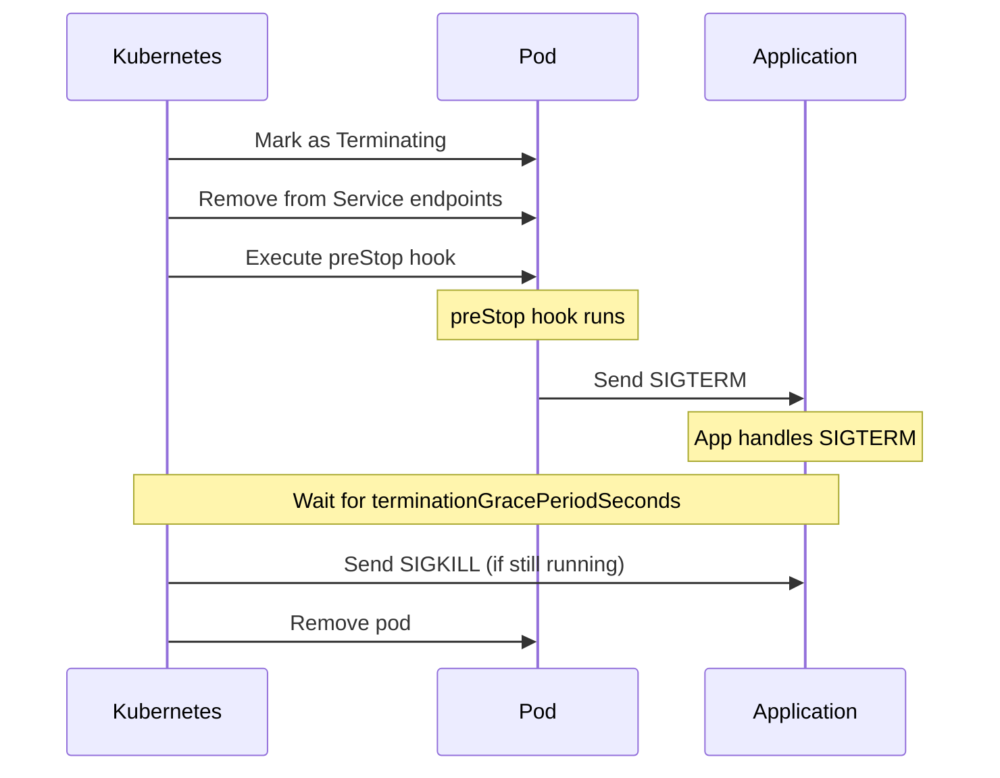

# How to Implement AKS Long-Running Workload Graceful Shutdown with preStop Hooks and terminationGracePeriodSeconds

Author: [nawazdhandala](https://www.github.com/nawazdhandala)

Tags: AKS, Graceful Shutdown, preStop, Kubernetes, terminationGracePeriodSeconds, Workload Management, Azure

Description: Learn how to configure preStop hooks and termination grace periods in AKS to give long-running workloads enough time to complete work before pod termination.

---

Kubernetes is designed to kill pods frequently. Node upgrades, scaling events, deployments, and spot VM evictions all terminate pods as part of normal operations. For short-lived request handlers, the default 30-second termination grace period is plenty. But for workloads that process long-running jobs - video transcoding, data pipeline stages, ML training steps, batch imports - 30 seconds is nowhere near enough.

If your pods get killed mid-job, you lose work. If your pods are processing financial transactions, you risk data inconsistency. If your pods maintain stateful connections, clients experience abrupt disconnections. This guide covers how to use `preStop` hooks and `terminationGracePeriodSeconds` to give your workloads the time they need to shut down cleanly.

## The Pod Termination Sequence

When Kubernetes decides to terminate a pod, it follows this sequence:



The key points:

1. The pod is removed from Service endpoints first (no new traffic arrives)
2. The preStop hook runs (can be a command, HTTP request, or sleep)
3. SIGTERM is sent to the main process
4. Kubernetes waits for `terminationGracePeriodSeconds` (counting from when the preStop hook started)
5. SIGKILL is sent if the process has not exited

The total time available for shutdown is `terminationGracePeriodSeconds`, which includes the preStop hook execution time.

## Step 1: Configure terminationGracePeriodSeconds

The first thing to do is increase the grace period from the default 30 seconds to whatever your workload needs.

```yaml
# long-running-deployment.yaml
# Deployment with extended termination grace period for long-running jobs
apiVersion: apps/v1
kind: Deployment
metadata:
  name: video-transcoder
spec:
  replicas: 5
  selector:
    matchLabels:
      app: video-transcoder
  template:
    metadata:
      labels:
        app: video-transcoder
    spec:
      # Allow up to 10 minutes for graceful shutdown
      terminationGracePeriodSeconds: 600
      containers:
      - name: transcoder
        image: myregistry.azurecr.io/transcoder:v2
        resources:
          requests:
            cpu: "2"
            memory: "4Gi"
```

For extremely long-running workloads (multi-hour jobs), you can set this to much higher values:

```yaml
# batch-processor.yaml
# Batch processing pod with a 1-hour termination grace period
apiVersion: v1
kind: Pod
metadata:
  name: batch-processor
spec:
  # 1 hour to finish the current batch
  terminationGracePeriodSeconds: 3600
  containers:
  - name: processor
    image: myregistry.azurecr.io/batch-processor:v1
```

There is no hard upper limit on `terminationGracePeriodSeconds`, but be practical. Setting it to 24 hours means node drains during upgrades will take that long per pod.

## Step 2: Implement preStop Hooks

preStop hooks run before SIGTERM is sent. They are useful for several purposes:

### Waiting for In-Flight Requests to Drain

When a pod is removed from Service endpoints, there is a brief window where in-flight requests are still arriving. A preStop sleep gives the load balancer and kube-proxy time to update.

```yaml
# web-server-deployment.yaml
# Web server with preStop hook to drain in-flight requests
apiVersion: apps/v1
kind: Deployment
metadata:
  name: api-server
spec:
  replicas: 5
  selector:
    matchLabels:
      app: api-server
  template:
    metadata:
      labels:
        app: api-server
    spec:
      terminationGracePeriodSeconds: 60
      containers:
      - name: api
        image: myregistry.azurecr.io/api:v3
        ports:
        - containerPort: 8080
        lifecycle:
          preStop:
            exec:
              # Wait 10 seconds for endpoint removal to propagate
              # This gives kube-proxy and ingress controllers time to
              # remove this pod from their routing tables
              command: ["/bin/sh", "-c", "sleep 10"]
```

### Triggering a Checkpoint Save

For stateful processing, use preStop to save progress before shutdown.

```yaml
# stateful-processor.yaml
# Processor that checkpoints state before termination
apiVersion: apps/v1
kind: Deployment
metadata:
  name: data-pipeline
spec:
  replicas: 3
  selector:
    matchLabels:
      app: data-pipeline
  template:
    metadata:
      labels:
        app: data-pipeline
    spec:
      terminationGracePeriodSeconds: 300
      containers:
      - name: pipeline
        image: myregistry.azurecr.io/pipeline:v1
        lifecycle:
          preStop:
            exec:
              # Save the current processing state to persistent storage
              command:
              - /bin/sh
              - -c
              - |
                echo "Saving checkpoint..."
                /app/save-checkpoint.sh
                echo "Checkpoint saved, ready for SIGTERM"
```

### Notifying External Systems

```yaml
# worker-with-notification.yaml
# Worker that deregisters from an external coordinator before shutdown
apiVersion: apps/v1
kind: Deployment
metadata:
  name: task-worker
spec:
  replicas: 10
  selector:
    matchLabels:
      app: task-worker
  template:
    metadata:
      labels:
        app: task-worker
    spec:
      terminationGracePeriodSeconds: 120
      containers:
      - name: worker
        image: myregistry.azurecr.io/task-worker:v1
        lifecycle:
          preStop:
            httpGet:
              # Notify the coordinator to stop sending new tasks
              path: /deregister
              port: 8080
```

## Step 3: Handle SIGTERM in Your Application

The preStop hook runs first, then SIGTERM is sent. Your application needs to handle SIGTERM properly.

### Python Example

```python
# worker.py
# Python worker that handles SIGTERM for graceful shutdown
import signal
import sys
import time

# Track the current job
current_job = None
shutting_down = False

def sigterm_handler(signum, frame):
    """Handle SIGTERM by finishing the current job and exiting."""
    global shutting_down
    shutting_down = True
    print("SIGTERM received - finishing current job then exiting")

# Register the SIGTERM handler
signal.signal(signal.SIGTERM, sigterm_handler)

def process_job(job):
    """Process a single job. This could take several minutes."""
    global current_job
    current_job = job
    print(f"Processing job {job['id']}")
    # Simulate work
    for step in range(job['total_steps']):
        if shutting_down:
            # Save progress and exit cleanly
            save_checkpoint(job, step)
            print(f"Job {job['id']} checkpointed at step {step}")
            return False
        # Do actual work here
        time.sleep(1)
    current_job = None
    return True

def save_checkpoint(job, step):
    """Save job progress to persistent storage for resumption."""
    # Write to a shared database or persistent volume
    print(f"Checkpoint saved: job={job['id']}, step={step}")

def main():
    while not shutting_down:
        job = get_next_job()  # Fetch from queue
        if job:
            completed = process_job(job)
            if not completed:
                break  # Job was interrupted, exit after checkpoint
    print("Worker shutting down cleanly")
    sys.exit(0)

if __name__ == "__main__":
    main()
```

### Go Example

```go
// main.go
// Go service that handles SIGTERM for graceful shutdown
package main

import (
    "context"
    "fmt"
    "net/http"
    "os"
    "os/signal"
    "syscall"
    "time"
)

func main() {
    // Create a context that is cancelled on SIGTERM
    ctx, cancel := context.WithCancel(context.Background())

    // Set up signal handling
    sigChan := make(chan os.Signal, 1)
    signal.Notify(sigChan, syscall.SIGTERM, syscall.SIGINT)

    // Start the HTTP server
    server := &http.Server{Addr: ":8080"}
    http.HandleFunc("/", handler)

    go func() {
        if err := server.ListenAndServe(); err != http.ErrServerClosed {
            fmt.Printf("HTTP server error: %v\n", err)
        }
    }()

    // Wait for SIGTERM
    sig := <-sigChan
    fmt.Printf("Received signal: %v\n", sig)

    // Create a deadline for graceful shutdown
    shutdownCtx, shutdownCancel := context.WithTimeout(ctx, 30*time.Second)
    defer shutdownCancel()

    // Stop accepting new connections, finish existing ones
    if err := server.Shutdown(shutdownCtx); err != nil {
        fmt.Printf("Shutdown error: %v\n", err)
    }

    cancel()
    fmt.Println("Server stopped gracefully")
}

func handler(w http.ResponseWriter, r *http.Request) {
    // Handle the request
    fmt.Fprintf(w, "OK")
}
```

## Step 4: Configure PodDisruptionBudgets

PDBs work alongside termination grace periods to control how many pods can be terminated simultaneously.

```yaml
# pdb.yaml
# PDB that ensures at least 3 replicas are always available
apiVersion: policy/v1
kind: PodDisruptionBudget
metadata:
  name: video-transcoder-pdb
spec:
  minAvailable: 3
  selector:
    matchLabels:
      app: video-transcoder
```

This ensures that during rolling updates or node drains, Kubernetes never terminates more pods than would leave you below 3 running replicas. Combined with a long grace period, this means your in-progress jobs are protected.

## Step 5: Handle AKS-Specific Scenarios

### Node Upgrades

During AKS node upgrades, pods are drained from nodes one at a time. Your terminationGracePeriodSeconds is respected during the drain. However, the overall upgrade process has its own timeout. If your pods take too long to terminate, the upgrade may time out.

Configure the node surge and drain timeout appropriately:

```bash
# Set a longer drain timeout for node pools running long-running workloads
az aks nodepool update \
  --resource-group myResourceGroup \
  --cluster-name myAKSCluster \
  --name longrunpool \
  --max-surge 33%
```

### Spot VM Evictions

If you are using spot node pools, VMs can be evicted with only 30 seconds notice. For long-running workloads on spot VMs, implement aggressive checkpointing.

```yaml
# spot-worker.yaml
# Worker on spot nodes with frequent checkpointing
apiVersion: apps/v1
kind: Deployment
metadata:
  name: spot-worker
spec:
  replicas: 10
  selector:
    matchLabels:
      app: spot-worker
  template:
    metadata:
      labels:
        app: spot-worker
    spec:
      # Spot VMs only get 30 seconds notice
      terminationGracePeriodSeconds: 30
      nodeSelector:
        kubernetes.azure.com/scalesetpriority: spot
      tolerations:
      - key: kubernetes.azure.com/scalesetpriority
        operator: Equal
        value: spot
        effect: NoSchedule
      containers:
      - name: worker
        image: myregistry.azurecr.io/spot-worker:v1
        lifecycle:
          preStop:
            exec:
              # Immediately save state since time is limited
              command: ["/app/emergency-checkpoint.sh"]
```

## Step 6: Monitor Graceful Shutdown

Track whether your pods are shutting down cleanly or being killed.

```bash
# Check for pods that were killed (OOMKilled or deadline exceeded)
kubectl get events --field-selector reason=Killing --sort-by='.lastTimestamp' | tail -20

# Check for pods that took a long time to terminate
kubectl get events --field-selector reason=Killing -o json | \
  jq -r '.items[] | "\(.involvedObject.name) - \(.message)"' | tail -20
```

Set up monitoring for SIGKILL events (which mean the grace period was not long enough):

```yaml
# monitoring-configmap.yaml
# Prometheus alerting rule for pods killed during shutdown
apiVersion: v1
kind: ConfigMap
metadata:
  name: shutdown-alerts
data:
  alerts.yaml: |
    groups:
    - name: pod-shutdown
      rules:
      - alert: PodForcefullyKilled
        expr: increase(kube_pod_container_status_last_terminated_reason{reason="OOMKilled"}[1h]) > 0
        for: 5m
        labels:
          severity: warning
        annotations:
          summary: "Pod was forcefully killed during shutdown"
```

## Best Practices Summary

1. **Set terminationGracePeriodSeconds based on your actual worst-case shutdown time**, plus a buffer. If your longest job step takes 5 minutes, set the grace period to 7-8 minutes.

2. **Always add a preStop sleep of 5-10 seconds** for web servers and API services. This handles the endpoint removal propagation delay.

3. **Implement checkpointing for long-running work.** Do not rely solely on the grace period - save progress frequently so that interrupted work can be resumed.

4. **Handle SIGTERM in your application code.** Do not leave it to the default behavior, which may kill the process immediately.

5. **Use PodDisruptionBudgets** to control the rate of pod terminations during voluntary disruptions.

6. **Test your graceful shutdown** by deliberately killing pods and verifying that work is not lost.

Graceful shutdown is one of those things that is easy to ignore during development but painful to deal with in production. Getting it right from the start saves you from data loss, job failures, and frustrated users when Kubernetes inevitably needs to move your pods around.
