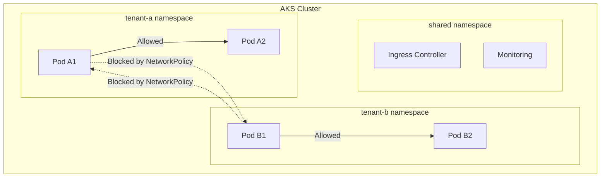

# How to Implement AKS Multi-Tenancy with Namespace Isolation and Network Policies

Author: [nawazdhandala](https://www.github.com/nawazdhandala)

Tags: AKS, Multi-Tenancy, Namespaces, Network Policies, RBAC, Kubernetes, Security

Description: Learn how to build a secure multi-tenant AKS cluster using namespace isolation, network policies, resource quotas, and RBAC to separate tenant workloads.

---

Running multiple tenants on a single AKS cluster saves money and reduces operational overhead. But without proper isolation, one tenant's workload can affect others through resource contention, network access, or accidental cross-namespace access. A noisy neighbor can exhaust cluster resources, and a compromised workload can reach services it should not have access to.

This guide covers building a solid multi-tenancy foundation on AKS using namespace isolation, network policies, resource quotas, and RBAC. These are the building blocks that keep tenants separated without the cost of running dedicated clusters for each.

## Multi-Tenancy Architecture

The approach uses Kubernetes namespaces as the primary isolation boundary. Each tenant gets their own namespace with:

- Resource quotas to prevent resource hogging
- Limit ranges to set default resource constraints
- Network policies to block cross-tenant traffic
- RBAC roles scoped to their namespace
- Optionally, dedicated node pools for stronger isolation



## Step 1: Create Tenant Namespaces

Start by creating namespaces for each tenant with appropriate labels.

```yaml
# tenant-namespaces.yaml
# Namespace definitions for each tenant with identifying labels
apiVersion: v1
kind: Namespace
metadata:
  name: tenant-a
  labels:
    tenant: tenant-a
    environment: production
---
apiVersion: v1
kind: Namespace
metadata:
  name: tenant-b
  labels:
    tenant: tenant-b
    environment: production
---
apiVersion: v1
kind: Namespace
metadata:
  name: tenant-c
  labels:
    tenant: tenant-c
    environment: production
```

```bash
kubectl apply -f tenant-namespaces.yaml
```

## Step 2: Apply Resource Quotas

Resource quotas prevent any single tenant from consuming more than their fair share of cluster resources.

```yaml
# resource-quota-tenant-a.yaml
# Resource quota limiting tenant-a's resource consumption
apiVersion: v1
kind: ResourceQuota
metadata:
  name: tenant-quota
  namespace: tenant-a
spec:
  hard:
    # Compute resources
    requests.cpu: "8"
    requests.memory: "16Gi"
    limits.cpu: "16"
    limits.memory: "32Gi"
    # Object counts
    pods: "50"
    services: "20"
    services.loadbalancers: "2"
    persistentvolumeclaims: "10"
    # Storage
    requests.storage: "100Gi"
```

Apply similar quotas for each tenant, adjusting the values based on their needs.

```yaml
# resource-quota-tenant-b.yaml
# Smaller quota for a smaller tenant
apiVersion: v1
kind: ResourceQuota
metadata:
  name: tenant-quota
  namespace: tenant-b
spec:
  hard:
    requests.cpu: "4"
    requests.memory: "8Gi"
    limits.cpu: "8"
    limits.memory: "16Gi"
    pods: "25"
    services: "10"
    services.loadbalancers: "1"
    persistentvolumeclaims: "5"
    requests.storage: "50Gi"
```

## Step 3: Set Default Resource Limits with LimitRanges

LimitRanges ensure that every pod in a tenant's namespace has resource requests and limits, even if the developer forgets to set them.

```yaml
# limit-range.yaml
# Default resource constraints for pods in a tenant namespace
apiVersion: v1
kind: LimitRange
metadata:
  name: tenant-limits
  namespace: tenant-a
spec:
  limits:
  - type: Container
    # Default limits applied when none are specified
    default:
      cpu: "500m"
      memory: "512Mi"
    # Default requests applied when none are specified
    defaultRequest:
      cpu: "100m"
      memory: "128Mi"
    # Maximum any single container can request
    max:
      cpu: "4"
      memory: "8Gi"
    # Minimum any single container must request
    min:
      cpu: "50m"
      memory: "64Mi"
  - type: Pod
    # Maximum total resources for all containers in a pod
    max:
      cpu: "8"
      memory: "16Gi"
```

Apply this to each tenant namespace.

## Step 4: Implement Network Policies

Network policies are the critical piece that prevents cross-tenant traffic. Start with a deny-all policy, then add specific allow rules.

### Default Deny All Traffic

```yaml
# deny-all.yaml
# Deny all ingress and egress traffic by default
# Apply this to every tenant namespace
apiVersion: networking.k8s.io/v1
kind: NetworkPolicy
metadata:
  name: deny-all
  namespace: tenant-a
spec:
  podSelector: {}
  policyTypes:
  - Ingress
  - Egress
```

### Allow Intra-Namespace Traffic

```yaml
# allow-same-namespace.yaml
# Allow pods within the same namespace to communicate freely
apiVersion: networking.k8s.io/v1
kind: NetworkPolicy
metadata:
  name: allow-same-namespace
  namespace: tenant-a
spec:
  podSelector: {}
  policyTypes:
  - Ingress
  - Egress
  ingress:
  - from:
    # Allow traffic from pods in the same namespace
    - podSelector: {}
  egress:
  - to:
    # Allow traffic to pods in the same namespace
    - podSelector: {}
```

### Allow DNS Resolution

```yaml
# allow-dns.yaml
# Allow all pods to resolve DNS (required for service discovery)
apiVersion: networking.k8s.io/v1
kind: NetworkPolicy
metadata:
  name: allow-dns
  namespace: tenant-a
spec:
  podSelector: {}
  policyTypes:
  - Egress
  egress:
  - to:
    - namespaceSelector: {}
    ports:
    - protocol: UDP
      port: 53
    - protocol: TCP
      port: 53
```

### Allow External Egress

```yaml
# allow-external-egress.yaml
# Allow pods to reach external services (internet, Azure services)
apiVersion: networking.k8s.io/v1
kind: NetworkPolicy
metadata:
  name: allow-external-egress
  namespace: tenant-a
spec:
  podSelector: {}
  policyTypes:
  - Egress
  egress:
  # Allow traffic to IPs outside the cluster CIDR
  - to:
    - ipBlock:
        cidr: 0.0.0.0/0
        except:
        # Block access to other pods (cluster pod CIDR)
        - 10.244.0.0/16
```

### Allow Ingress from Shared Services

```yaml
# allow-ingress-controller.yaml
# Allow the ingress controller (in the shared namespace) to reach tenant pods
apiVersion: networking.k8s.io/v1
kind: NetworkPolicy
metadata:
  name: allow-ingress-controller
  namespace: tenant-a
spec:
  podSelector:
    matchLabels:
      expose: "true"
  policyTypes:
  - Ingress
  ingress:
  - from:
    - namespaceSelector:
        matchLabels:
          purpose: shared-services
    - podSelector:
        matchLabels:
          app: ingress-nginx
    ports:
    - protocol: TCP
      port: 8080
```

Apply all these policies to each tenant namespace. You can use a script to template them:

```bash
# Apply network policies to all tenant namespaces
for NS in tenant-a tenant-b tenant-c; do
  for POLICY in deny-all.yaml allow-same-namespace.yaml allow-dns.yaml allow-external-egress.yaml allow-ingress-controller.yaml; do
    # Replace namespace in each policy file and apply
    sed "s/namespace: tenant-a/namespace: $NS/" $POLICY | kubectl apply -f -
  done
done
```

## Step 5: Configure RBAC

Create roles that give each tenant access only to their namespace.

```yaml
# tenant-role.yaml
# Role giving full access within a specific namespace
apiVersion: rbac.authorization.k8s.io/v1
kind: Role
metadata:
  name: tenant-admin
  namespace: tenant-a
rules:
- apiGroups: ["", "apps", "batch", "networking.k8s.io"]
  resources: ["*"]
  verbs: ["*"]
- apiGroups: [""]
  resources: ["namespaces", "nodes"]
  verbs: ["get", "list"]
```

```yaml
# tenant-rolebinding.yaml
# Bind the role to an Azure AD group for tenant-a
apiVersion: rbac.authorization.k8s.io/v1
kind: RoleBinding
metadata:
  name: tenant-a-admins
  namespace: tenant-a
roleRef:
  apiGroup: rbac.authorization.k8s.io
  kind: Role
  name: tenant-admin
subjects:
- kind: Group
  name: "<azure-ad-group-id-for-tenant-a>"
  apiGroup: rbac.authorization.k8s.io
```

For a read-only role (useful for monitoring or auditing access):

```yaml
# tenant-viewer-role.yaml
# Read-only role for viewing resources in a namespace
apiVersion: rbac.authorization.k8s.io/v1
kind: Role
metadata:
  name: tenant-viewer
  namespace: tenant-a
rules:
- apiGroups: ["", "apps", "batch"]
  resources: ["*"]
  verbs: ["get", "list", "watch"]
```

## Step 6: Optional - Node Pool Isolation

For stronger isolation, dedicate node pools to specific tenants using taints and tolerations.

```bash
# Create a dedicated node pool for tenant-a
az aks nodepool add \
  --resource-group myResourceGroup \
  --cluster-name myAKSCluster \
  --name tenanta \
  --node-count 3 \
  --node-taints tenant=tenant-a:NoSchedule \
  --labels tenant=tenant-a
```

Add tolerations to tenant-a's workloads:

```yaml
# tenant-a-deployment.yaml
# Deployment with node affinity and toleration for dedicated node pool
apiVersion: apps/v1
kind: Deployment
metadata:
  name: tenant-a-app
  namespace: tenant-a
spec:
  replicas: 3
  selector:
    matchLabels:
      app: tenant-a-app
  template:
    metadata:
      labels:
        app: tenant-a-app
    spec:
      nodeSelector:
        tenant: tenant-a
      tolerations:
      - key: "tenant"
        operator: "Equal"
        value: "tenant-a"
        effect: "NoSchedule"
      containers:
      - name: app
        image: myregistry.azurecr.io/tenant-a-app:v1
```

## Validation

Test that isolation works by trying to access a service across namespaces.

```bash
# Deploy a test pod in tenant-a
kubectl run test-a --namespace=tenant-a --image=curlimages/curl --rm -it -- \
  curl -m 5 http://service-b.tenant-b.svc.cluster.local:8080

# This should timeout or be refused due to network policies
# Expected: connection timed out
```

Also verify that intra-namespace traffic works:

```bash
# Deploy a test pod in tenant-a accessing a service in the same namespace
kubectl run test-a --namespace=tenant-a --image=curlimages/curl --rm -it -- \
  curl -m 5 http://service-a.tenant-a.svc.cluster.local:8080

# This should succeed
```

## Monitoring Tenant Resource Usage

Track how much each tenant is consuming relative to their quota.

```bash
# Check resource quota usage for a tenant
kubectl describe resourcequota tenant-quota -n tenant-a

# Check across all tenants
for NS in tenant-a tenant-b tenant-c; do
  echo "=== $NS ==="
  kubectl get resourcequota -n $NS -o custom-columns=\
NAMESPACE:.metadata.namespace,\
CPU_USED:.status.used.requests\\.cpu,\
CPU_HARD:.status.hard.requests\\.cpu,\
MEM_USED:.status.used.requests\\.memory,\
MEM_HARD:.status.hard.requests\\.memory
done
```

Multi-tenancy in AKS requires layering multiple isolation mechanisms together. No single feature provides complete isolation. Namespaces give you the boundary, resource quotas prevent resource hogging, network policies block unauthorized traffic, and RBAC restricts API access. Used together, they create a practical multi-tenant environment that balances security with operational efficiency.
