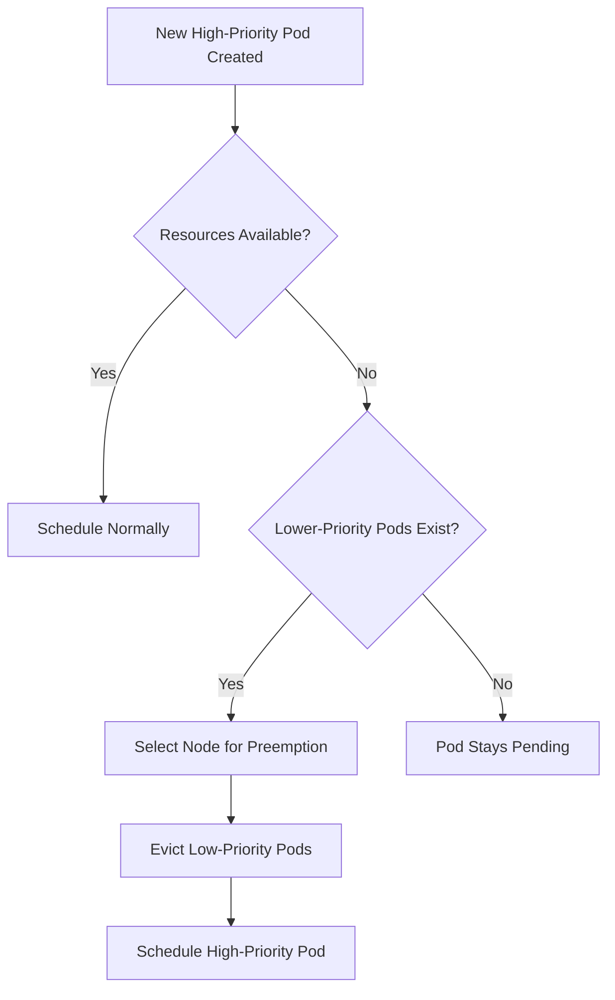

# How to Implement AKS Pod Priority and Preemption for Critical Workload Scheduling

Author: [nawazdhandala](https://www.github.com/nawazdhandala)

Tags: AKS, Pod Priority, Preemption, Kubernetes, Scheduling, Workload Management, Azure

Description: Learn how to use Kubernetes PriorityClasses in AKS to guarantee that critical workloads always get scheduled, even when cluster resources are tight.

---

When your AKS cluster runs out of resources, the Kubernetes scheduler has to make hard choices about which pods get to run and which ones wait. By default, scheduling is first-come-first-served. If a batch processing job grabbed all available CPU before your production API server needs to scale up, your API pods sit in Pending state until resources free up. That is not a good outcome.

Pod Priority and Preemption give you control over these decisions. You assign priority levels to your workloads, and when resources are scarce, the scheduler can evict lower-priority pods to make room for higher-priority ones. In this guide, I will walk through setting up PriorityClasses, assigning them to workloads, and handling the edge cases that trip people up.

## How Priority and Preemption Work

Kubernetes uses two concepts here:

**Priority** is a numeric value assigned to a pod. Higher numbers mean higher priority. When the scheduler cannot find a node with enough resources for a new pod, it checks whether evicting lower-priority pods on any node would free up enough resources.

**Preemption** is the act of evicting those lower-priority pods. The scheduler picks the node where preemption causes the least disruption (fewest pods evicted, lowest total priority removed) and evicts the necessary pods.



## Step 1: Define PriorityClasses

PriorityClasses are cluster-scoped resources. You create them once and reference them from any pod in any namespace.

Here is a practical set of PriorityClasses that covers most use cases:

```yaml
# priority-classes.yaml
# Defines a hierarchy of priority levels for different workload types

# System-critical workloads (monitoring, logging, networking)
apiVersion: scheduling.k8s.io/v1
kind: PriorityClass
metadata:
  name: system-critical
value: 1000000
globalDefault: false
preemptionPolicy: PreemptLowerPriority
description: "For system components like monitoring, logging, and networking"
---
# Production workloads (customer-facing services)
apiVersion: scheduling.k8s.io/v1
kind: PriorityClass
metadata:
  name: production-high
value: 100000
globalDefault: false
preemptionPolicy: PreemptLowerPriority
description: "For customer-facing production services"
---
# Standard production workloads (internal services)
apiVersion: scheduling.k8s.io/v1
kind: PriorityClass
metadata:
  name: production-standard
value: 50000
globalDefault: true
preemptionPolicy: PreemptLowerPriority
description: "Default priority for standard production workloads"
---
# Development and testing workloads
apiVersion: scheduling.k8s.io/v1
kind: PriorityClass
metadata:
  name: development
value: 10000
globalDefault: false
preemptionPolicy: PreemptLowerPriority
description: "For dev/test workloads that can be preempted"
---
# Batch processing and background jobs
apiVersion: scheduling.k8s.io/v1
kind: PriorityClass
metadata:
  name: batch-low
value: 1000
globalDefault: false
preemptionPolicy: Never
description: "For batch jobs that should never preempt other workloads"
```

Apply the PriorityClasses:

```bash
kubectl apply -f priority-classes.yaml
```

A few things to note about this setup:

- **`production-standard` has `globalDefault: true`**: Any pod that does not specify a PriorityClass gets this priority. Only one PriorityClass can be the global default.
- **`batch-low` has `preemptionPolicy: Never`**: These pods have low priority and will be preempted by others, but they will never preempt anything themselves. This is useful for batch jobs that should not disrupt other workloads even if they are lower priority.
- **Value ranges**: Kubernetes reserves values above 1 billion for system use. Keep your custom values well below that.

## Step 2: Assign PriorityClasses to Workloads

Reference the PriorityClass in your pod spec using the `priorityClassName` field.

### Critical API Service

```yaml
# api-deployment.yaml
# Customer-facing API service with high priority
apiVersion: apps/v1
kind: Deployment
metadata:
  name: api-server
  namespace: production
spec:
  replicas: 5
  selector:
    matchLabels:
      app: api-server
  template:
    metadata:
      labels:
        app: api-server
    spec:
      # Assign high production priority
      priorityClassName: production-high
      containers:
      - name: api
        image: myregistry.azurecr.io/api-server:v2.1
        resources:
          requests:
            cpu: "500m"
            memory: "512Mi"
          limits:
            cpu: "1"
            memory: "1Gi"
```

### Batch Processing Job

```yaml
# batch-job.yaml
# Background data processing job with low priority
apiVersion: batch/v1
kind: Job
metadata:
  name: data-processing
  namespace: batch
spec:
  template:
    spec:
      # Low priority - can be preempted and will not preempt others
      priorityClassName: batch-low
      restartPolicy: OnFailure
      containers:
      - name: processor
        image: myregistry.azurecr.io/data-processor:v1.3
        resources:
          requests:
            cpu: "2"
            memory: "4Gi"
```

### Monitoring Stack

```yaml
# prometheus-deployment.yaml
# Monitoring system with system-critical priority
apiVersion: apps/v1
kind: Deployment
metadata:
  name: prometheus
  namespace: monitoring
spec:
  replicas: 2
  selector:
    matchLabels:
      app: prometheus
  template:
    metadata:
      labels:
        app: prometheus
    spec:
      # System-critical priority - monitoring must always run
      priorityClassName: system-critical
      containers:
      - name: prometheus
        image: prom/prometheus:v2.50.0
        resources:
          requests:
            cpu: "500m"
            memory: "2Gi"
```

## Step 3: Test Preemption Behavior

To verify that preemption works as expected, create a scenario where the cluster is full of low-priority pods and then deploy a high-priority pod.

```bash
# First, fill the cluster with low-priority pods
kubectl create deployment filler --image=nginx --replicas=50
kubectl patch deployment filler -p \
  '{"spec":{"template":{"spec":{"priorityClassName":"batch-low","containers":[{"name":"nginx","resources":{"requests":{"cpu":"500m","memory":"256Mi"}}}]}}}}'

# Wait for them to be running
kubectl get pods -l app=filler --no-headers | wc -l

# Now deploy a high-priority pod that needs resources
kubectl run critical-pod \
  --image=nginx \
  --restart=Never \
  --overrides='{"spec":{"priorityClassName":"production-high","containers":[{"name":"critical-pod","resources":{"requests":{"cpu":"2","memory":"2Gi"}}}]}}'

# Watch the critical pod get scheduled by preempting filler pods
kubectl get events --sort-by='.lastTimestamp' | grep Preempted
```

You should see events indicating that some filler pods were preempted to make room for the critical pod.

## Step 4: Handle Preemption Gracefully

When a pod gets preempted, it receives a SIGTERM signal and has time to shut down gracefully (controlled by `terminationGracePeriodSeconds`). Design your workloads to handle this:

```yaml
# graceful-batch-job.yaml
# Batch job that checkpoints progress when preempted
apiVersion: batch/v1
kind: Job
metadata:
  name: checkpoint-job
spec:
  template:
    spec:
      priorityClassName: batch-low
      # Give the job 60 seconds to save its progress
      terminationGracePeriodSeconds: 60
      restartPolicy: OnFailure
      containers:
      - name: worker
        image: myregistry.azurecr.io/checkpoint-worker:v1
        # SIGTERM handler should save progress to persistent storage
        lifecycle:
          preStop:
            exec:
              command: ["/bin/sh", "-c", "save-checkpoint.sh"]
        resources:
          requests:
            cpu: "1"
            memory: "2Gi"
```

## Interaction with Cluster Autoscaler

Pod priority interacts with the AKS cluster autoscaler in important ways. The autoscaler considers pod priority when making scaling decisions:

- The autoscaler will scale up the cluster to accommodate pending high-priority pods
- When scaling down, the autoscaler prefers to remove nodes running low-priority pods
- Pods with priority above a configurable threshold are exempt from scale-down eviction

```bash
# Configure autoscaler to prioritize high-priority workloads
az aks update \
  --resource-group myResourceGroup \
  --name myAKSCluster \
  --cluster-autoscaler-profile \
    expendable-pods-priority-cutoff=-10
```

The `expendable-pods-priority-cutoff` setting tells the autoscaler that pods with priority below this value can be evicted freely during scale-down. Set it to a value below your lowest meaningful priority class.

## Best Practices

**Do not overuse system-critical priority.** Reserve the highest priority for truly essential infrastructure components. If everything is "critical," nothing is.

**Always set resource requests.** Priority and preemption only work properly when pods have resource requests. Without requests, the scheduler cannot calculate whether preempting a pod would free enough resources.

**Use PodDisruptionBudgets alongside priority.** PDBs protect against too many pods being evicted simultaneously. Even during preemption, Kubernetes respects PDBs (though it may eventually override them if the pending pod has been waiting too long).

**Monitor preemption events.** Set up alerts for preemption events in your monitoring system. Frequent preemptions indicate that your cluster is undersized or that resource allocation needs rebalancing.

```bash
# Check for recent preemption events across the cluster
kubectl get events --all-namespaces \
  --field-selector reason=Preempted \
  --sort-by='.lastTimestamp'
```

**Be careful with the global default.** Every pod without an explicit PriorityClass gets the global default. If you set the default too high, low-priority workloads that forget to set their PriorityClass will be treated as production workloads.

**Test preemption in staging.** Preemption behavior can be surprising. Run load tests that exhaust cluster resources and verify that the right pods survive. This is especially important if you have stateful workloads that do not handle eviction well.

Pod priority and preemption are essential tools for running mixed workloads on AKS. Getting the PriorityClass hierarchy right from the start saves you from the 2 AM incident where your batch jobs starved your production API of resources.
