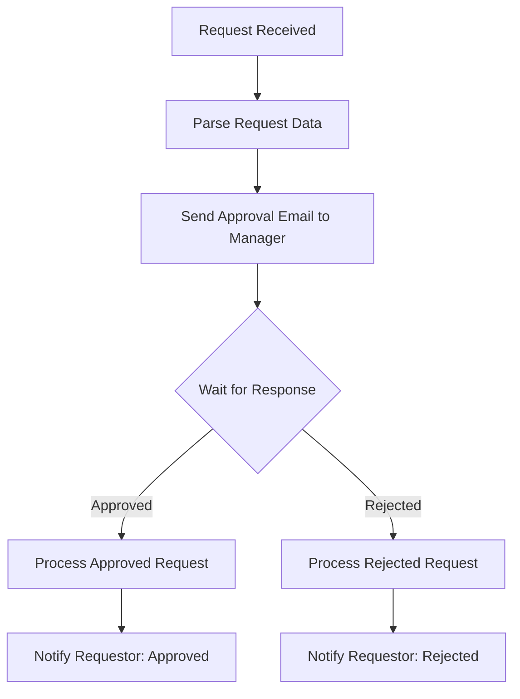

# How to Implement Approval Workflows in Azure Logic Apps

Author: [nawazdhandala](https://www.github.com/nawazdhandala)

Tags: Azure, Logic Apps, Approval Workflows, Human-in-the-Loop, Office 365, Teams, Business Process

Description: Build human approval workflows in Azure Logic Apps using email approvals, Microsoft Teams, and custom webhook-based approval mechanisms.

---

Not every business process can be fully automated. Purchase orders above a certain amount need manager approval. New user accounts need security team sign-off. Content publishing needs editorial review. Azure Logic Apps makes it straightforward to build approval workflows that pause execution, wait for a human decision, and then continue based on the response.

## How Approval Actions Work

Logic Apps approval actions send a notification to an approver (via email, Teams, or a custom channel), then pause the workflow until the approver responds. The response - Approve or Reject - determines how the workflow continues. Under the hood, the workflow run is suspended and resumed when the callback is received.

## Email-Based Approval with Office 365

The Office 365 Outlook connector includes a built-in "Send approval email" action. It sends a formatted email with Approve and Reject buttons that the approver can click directly from their email client.

```json
{
  "definition": {
    "actions": {
      "Parse_Request": {
        "type": "ParseJson",
        "inputs": {
          "content": "@triggerBody()",
          "schema": {
            "type": "object",
            "properties": {
              "requestId": { "type": "string" },
              "requestorEmail": { "type": "string" },
              "description": { "type": "string" },
              "amount": { "type": "number" },
              "category": { "type": "string" }
            }
          }
        },
        "runAfter": {}
      },
      "Send_Approval_Email": {
        "type": "ApiConnectionWebhook",
        "inputs": {
          "host": {
            "connection": {
              "name": "@parameters('$connections')['office365']['connectionId']"
            }
          },
          "body": {
            "NotificationUrl": "@{listCallbackUrl()}",
            "Message": {
              "To": "manager@mycompany.com",
              "Subject": "Approval Required: @{body('Parse_Request')?['description']}",
              "Options": "Approve, Reject",
              "Body": "A new purchase request requires your approval.\n\nRequest ID: @{body('Parse_Request')?['requestId']}\nRequestor: @{body('Parse_Request')?['requestorEmail']}\nCategory: @{body('Parse_Request')?['category']}\nAmount: $@{body('Parse_Request')?['amount']}\n\nPlease review and approve or reject this request.",
              "Importance": "High"
            }
          },
          "path": "/approvalmail/$subscriptions"
        },
        "runAfter": {
          "Parse_Request": ["Succeeded"]
        }
      },
      "Check_Approval_Response": {
        "type": "If",
        "expression": {
          "equals": ["@body('Send_Approval_Email')?['SelectedOption']", "Approve"]
        },
        "actions": {
          "Process_Approved_Request": {
            "type": "Http",
            "inputs": {
              "method": "POST",
              "uri": "@appsetting('PurchaseApiUrl')/approve",
              "body": {
                "requestId": "@body('Parse_Request')?['requestId']",
                "approvedBy": "@body('Send_Approval_Email')?['UserEmailAddress']",
                "approvedAt": "@utcNow()"
              }
            },
            "runAfter": {}
          },
          "Notify_Requestor_Approved": {
            "type": "ApiConnection",
            "inputs": {
              "host": {
                "connection": {
                  "name": "@parameters('$connections')['office365']['connectionId']"
                }
              },
              "method": "post",
              "path": "/v2/Mail",
              "body": {
                "To": "@body('Parse_Request')?['requestorEmail']",
                "Subject": "Your request has been approved",
                "Body": "Your purchase request @{body('Parse_Request')?['requestId']} for $@{body('Parse_Request')?['amount']} has been approved."
              }
            },
            "runAfter": {
              "Process_Approved_Request": ["Succeeded"]
            }
          }
        },
        "else": {
          "actions": {
            "Process_Rejected_Request": {
              "type": "Http",
              "inputs": {
                "method": "POST",
                "uri": "@appsetting('PurchaseApiUrl')/reject",
                "body": {
                  "requestId": "@body('Parse_Request')?['requestId']",
                  "rejectedBy": "@body('Send_Approval_Email')?['UserEmailAddress']",
                  "rejectedAt": "@utcNow()"
                }
              },
              "runAfter": {}
            },
            "Notify_Requestor_Rejected": {
              "type": "ApiConnection",
              "inputs": {
                "host": {
                  "connection": {
                    "name": "@parameters('$connections')['office365']['connectionId']"
                  }
                },
                "method": "post",
                "path": "/v2/Mail",
                "body": {
                  "To": "@body('Parse_Request')?['requestorEmail']",
                  "Subject": "Your request has been rejected",
                  "Body": "Your purchase request @{body('Parse_Request')?['requestId']} has been rejected."
                }
              },
              "runAfter": {
                "Process_Rejected_Request": ["Succeeded"]
              }
            }
          }
        },
        "runAfter": {
          "Send_Approval_Email": ["Succeeded"]
        }
      }
    },
    "triggers": {
      "manual": {
        "type": "Request",
        "kind": "Http",
        "inputs": { "method": "POST" }
      }
    }
  }
}
```

## Approval Flow Visualization



## Microsoft Teams Approval

For organizations using Teams, you can post an adaptive card with approval buttons directly in a Teams channel or chat.

```json
{
  "Post_Approval_Card_to_Teams": {
    "type": "ApiConnection",
    "inputs": {
      "host": {
        "connection": {
          "name": "@parameters('$connections')['teams']['connectionId']"
        }
      },
      "method": "post",
      "path": "/v1.0/teams/@{parameters('teamId')}/channels/@{parameters('channelId')}/messages",
      "body": {
        "body": {
          "contentType": "html",
          "content": "<attachment id=\"approval-card\"></attachment>"
        },
        "attachments": [
          {
            "id": "approval-card",
            "contentType": "application/vnd.microsoft.card.adaptive",
            "content": {
              "type": "AdaptiveCard",
              "version": "1.4",
              "body": [
                {
                  "type": "TextBlock",
                  "text": "Purchase Request Approval",
                  "weight": "bolder",
                  "size": "large"
                },
                {
                  "type": "FactSet",
                  "facts": [
                    { "title": "Requestor", "value": "@{body('Parse_Request')?['requestorEmail']}" },
                    { "title": "Amount", "value": "$@{body('Parse_Request')?['amount']}" },
                    { "title": "Category", "value": "@{body('Parse_Request')?['category']}" }
                  ]
                }
              ],
              "actions": [
                {
                  "type": "Action.Http",
                  "title": "Approve",
                  "method": "POST",
                  "url": "@{listCallbackUrl()}",
                  "body": "{ \"decision\": \"approve\" }"
                },
                {
                  "type": "Action.Http",
                  "title": "Reject",
                  "method": "POST",
                  "url": "@{listCallbackUrl()}",
                  "body": "{ \"decision\": \"reject\" }"
                }
              ]
            }
          }
        ]
      }
    }
  }
}
```

## Multi-Level Approvals

Some processes need multiple levels of approval. For example, purchases over $5,000 need both a manager and a VP.

```json
{
  "actions": {
    "Check_Amount_Threshold": {
      "type": "If",
      "expression": {
        "greater": ["@body('Parse_Request')?['amount']", 5000]
      },
      "actions": {
        "Manager_Approval": {
          "type": "ApiConnectionWebhook",
          "inputs": {
            "body": {
              "Message": {
                "To": "@body('Parse_Request')?['managerEmail']",
                "Subject": "Approval Needed (Level 1): $@{body('Parse_Request')?['amount']}",
                "Options": "Approve, Reject"
              }
            }
          },
          "runAfter": {}
        },
        "Check_Manager_Decision": {
          "type": "If",
          "expression": {
            "equals": ["@body('Manager_Approval')?['SelectedOption']", "Approve"]
          },
          "actions": {
            "VP_Approval": {
              "type": "ApiConnectionWebhook",
              "inputs": {
                "body": {
                  "Message": {
                    "To": "@body('Parse_Request')?['vpEmail']",
                    "Subject": "Approval Needed (Level 2): $@{body('Parse_Request')?['amount']} - Manager Approved",
                    "Options": "Approve, Reject"
                  }
                }
              },
              "runAfter": {}
            }
          },
          "runAfter": {
            "Manager_Approval": ["Succeeded"]
          }
        }
      },
      "else": {
        "actions": {
          "Single_Level_Approval": {
            "type": "ApiConnectionWebhook",
            "inputs": {
              "body": {
                "Message": {
                  "To": "@body('Parse_Request')?['managerEmail']",
                  "Subject": "Approval Needed: $@{body('Parse_Request')?['amount']}",
                  "Options": "Approve, Reject"
                }
              }
            },
            "runAfter": {}
          }
        }
      },
      "runAfter": {
        "Parse_Request": ["Succeeded"]
      }
    }
  }
}
```

## Custom Webhook-Based Approval

If you do not use Office 365 or Teams, you can build a custom approval mechanism using webhooks. The Logic App generates a callback URL and sends it to your custom approval UI. When the approver makes a decision, the UI calls the callback URL to resume the workflow.

```json
{
  "Wait_For_Custom_Approval": {
    "type": "HttpWebhook",
    "inputs": {
      "subscribe": {
        "method": "POST",
        "uri": "@appsetting('ApprovalServiceUrl')/pending",
        "body": {
          "callbackUrl": "@{listCallbackUrl()}",
          "requestId": "@body('Parse_Request')?['requestId']",
          "requestorEmail": "@body('Parse_Request')?['requestorEmail']",
          "amount": "@body('Parse_Request')?['amount']",
          "approverEmail": "manager@mycompany.com"
        }
      },
      "unsubscribe": {
        "method": "DELETE",
        "uri": "@appsetting('ApprovalServiceUrl')/pending/@{body('Parse_Request')?['requestId']}"
      }
    },
    "runAfter": {
      "Parse_Request": ["Succeeded"]
    }
  }
}
```

The `subscribe` action registers the pending approval with your custom service. The `unsubscribe` action is called if the workflow is cancelled or the timeout expires.

## Handling Timeouts

Approval workflows should not wait forever. Set a timeout so that unanswered approvals eventually expire.

```json
{
  "Send_Approval_Email": {
    "type": "ApiConnectionWebhook",
    "inputs": { ... },
    "limit": {
      "timeout": "P3D"
    }
  }
}
```

This sets a 3-day timeout (P3D in ISO 8601 duration format). After 3 days without a response, the action times out. Use a run-after condition to handle the timeout.

```json
{
  "Handle_Approval_Timeout": {
    "type": "Http",
    "inputs": {
      "method": "POST",
      "uri": "@appsetting('NotificationApiUrl')/send",
      "body": {
        "to": "@body('Parse_Request')?['requestorEmail']",
        "message": "Your approval request has expired without a response."
      }
    },
    "runAfter": {
      "Send_Approval_Email": ["TimedOut"]
    }
  }
}
```

## Summary

Approval workflows are one of the most practical uses of Logic Apps. Use the Office 365 connector for email-based approvals, Teams adaptive cards for in-channel approvals, or custom webhooks for bespoke approval UIs. Add multi-level chains for high-value requests, set timeouts to prevent workflows from hanging indefinitely, and always notify requestors of the outcome. The combination of automated processing and human decision-making gives you the best of both worlds.
