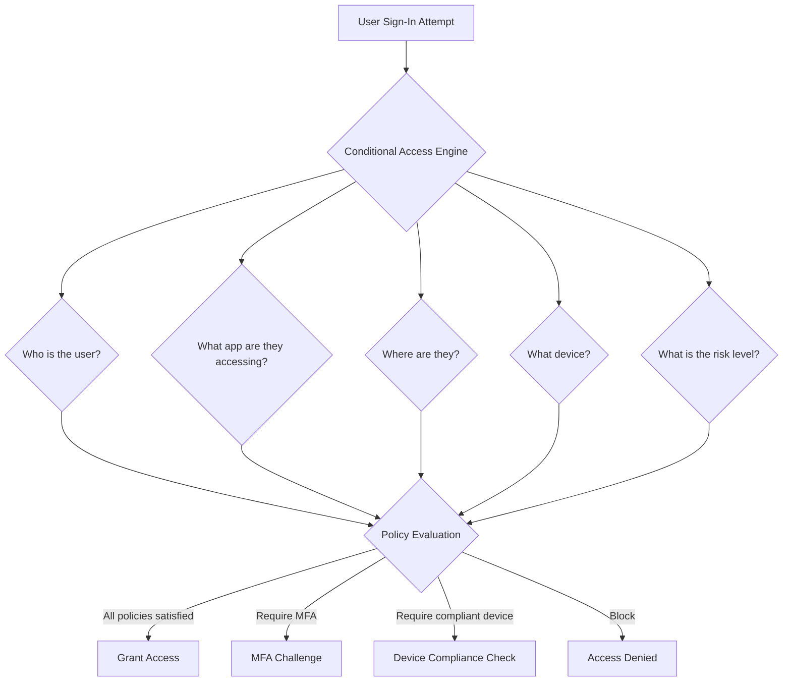

# How to Implement Azure AD Conditional Access for Industry-Specific Compliance in SaaS Apps

Author: [nawazdhandala](https://www.github.com/nawazdhandala)

Tags: Azure AD, Conditional Access, Compliance, SaaS, Industry Regulations, Zero Trust, Security Policies

Description: Implement Azure AD Conditional Access policies for industry-specific compliance requirements in SaaS applications covering healthcare, finance, and government.

---

Different industries have different security requirements for accessing cloud applications. A healthcare organization handling patient data must comply with HIPAA. A financial services company needs to meet SOX and PCI DSS requirements. A government contractor must follow FedRAMP and NIST guidelines. These regulations translate into specific access control requirements: where users can sign in from, what devices they can use, and how strongly they must authenticate.

Azure AD Conditional Access lets you define policies that enforce these requirements at the identity layer. Before a user gets a token for your SaaS application, Conditional Access evaluates the context - who is the user, what device are they on, where are they, and what application are they accessing - and makes an allow, block, or require-MFA decision. In this guide, I will build Conditional Access policies for several industry compliance scenarios.

## How Conditional Access Works

Conditional Access policies follow an if-then model. If certain conditions are met (user, application, location, device, risk level), then enforce certain controls (block, require MFA, require compliant device, limit session).



Policies are evaluated collectively. If multiple policies apply, the most restrictive controls win. This is the principle of AND logic - the user must satisfy all applicable policies.

## Healthcare - HIPAA Compliance

HIPAA requires access controls for electronic Protected Health Information (ePHI). Key requirements include unique user identification, automatic logoff, and encryption. Here is how to configure Conditional Access to meet these.

### Policy 1: Require MFA for All ePHI Access

HIPAA does not explicitly mandate MFA, but it is considered a reasonable security measure under the Technical Safeguards. Most HIPAA auditors expect it.

```bash
# Create a Conditional Access policy requiring MFA for the healthcare SaaS app
# Using Microsoft Graph API via az rest

az rest --method POST \
  --url "https://graph.microsoft.com/v1.0/identity/conditionalAccess/policies" \
  --headers "Content-Type=application/json" \
  --body '{
    "displayName": "HIPAA - Require MFA for ePHI Access",
    "state": "enabled",
    "conditions": {
      "applications": {
        "includeApplications": ["<your-saas-app-id>"]
      },
      "users": {
        "includeGroups": ["<healthcare-users-group-id>"]
      }
    },
    "grantControls": {
      "operator": "OR",
      "builtInControls": ["mfa"]
    }
  }'
```

### Policy 2: Block Access from Untrusted Locations

HIPAA requires controlling physical access to ePHI systems. In cloud terms, this translates to restricting access to known locations.

```bash
# First, create a named location for the hospital network
az rest --method POST \
  --url "https://graph.microsoft.com/v1.0/identity/conditionalAccess/namedLocations" \
  --headers "Content-Type=application/json" \
  --body '{
    "@odata.type": "#microsoft.graph.ipNamedLocation",
    "displayName": "Hospital Network",
    "isTrusted": true,
    "ipRanges": [
      {"@odata.type": "#microsoft.graph.iPv4CidrRange", "cidrAddress": "203.0.113.0/24"},
      {"@odata.type": "#microsoft.graph.iPv4CidrRange", "cidrAddress": "198.51.100.0/24"}
    ]
  }'

# Create policy to block access from outside trusted locations
az rest --method POST \
  --url "https://graph.microsoft.com/v1.0/identity/conditionalAccess/policies" \
  --headers "Content-Type=application/json" \
  --body '{
    "displayName": "HIPAA - Block Untrusted Locations",
    "state": "enabled",
    "conditions": {
      "applications": {
        "includeApplications": ["<your-saas-app-id>"]
      },
      "users": {
        "includeGroups": ["<hipaa-restricted-group>"]
      },
      "locations": {
        "includeLocations": ["All"],
        "excludeLocations": ["<hospital-network-location-id>", "AllTrusted"]
      }
    },
    "grantControls": {
      "operator": "OR",
      "builtInControls": ["block"]
    }
  }'
```

### Policy 3: Enforce Session Timeout

HIPAA requires automatic logoff after a period of inactivity. Configure a session control that limits the sign-in frequency.

```bash
az rest --method POST \
  --url "https://graph.microsoft.com/v1.0/identity/conditionalAccess/policies" \
  --headers "Content-Type=application/json" \
  --body '{
    "displayName": "HIPAA - Session Timeout 30 Minutes",
    "state": "enabled",
    "conditions": {
      "applications": {
        "includeApplications": ["<your-saas-app-id>"]
      },
      "users": {
        "includeGroups": ["<healthcare-users-group-id>"]
      }
    },
    "sessionControls": {
      "signInFrequency": {
        "value": 30,
        "type": "minutes",
        "isEnabled": true
      },
      "persistentBrowser": {
        "mode": "never",
        "isEnabled": true
      }
    }
  }'
```

The `persistentBrowser: never` setting ensures users cannot check "stay signed in" and must re-authenticate after 30 minutes of inactivity. This directly satisfies the HIPAA automatic logoff requirement.

## Financial Services - SOX and PCI DSS Compliance

Financial services need strong authentication, audit trails, and device compliance. Conditional Access policies for this industry focus on device health and risk-based access.

### Policy 4: Require Compliant Devices

SOX requires controls over systems that process financial data. Requiring device compliance ensures that only managed, patched, and encrypted devices can access your SaaS application.

```bash
az rest --method POST \
  --url "https://graph.microsoft.com/v1.0/identity/conditionalAccess/policies" \
  --headers "Content-Type=application/json" \
  --body '{
    "displayName": "Financial - Require Compliant Device",
    "state": "enabled",
    "conditions": {
      "applications": {
        "includeApplications": ["<your-saas-app-id>"]
      },
      "users": {
        "includeGroups": ["<finance-users-group-id>"]
      },
      "platforms": {
        "includePlatforms": ["all"]
      }
    },
    "grantControls": {
      "operator": "AND",
      "builtInControls": ["mfa", "compliantDevice"]
    }
  }'
```

Using the AND operator means users must satisfy both MFA and device compliance. A compliant device is one enrolled in Intune that meets your compliance policy (encrypted, up-to-date OS, no jailbreak).

### Policy 5: Block High-Risk Sign-Ins

Azure AD Identity Protection detects risky sign-ins based on impossible travel, anonymous IP addresses, malware-linked IPs, and unusual sign-in patterns. For financial services, block high-risk sign-ins outright.

```bash
az rest --method POST \
  --url "https://graph.microsoft.com/v1.0/identity/conditionalAccess/policies" \
  --headers "Content-Type=application/json" \
  --body '{
    "displayName": "Financial - Block High Risk Sign-Ins",
    "state": "enabled",
    "conditions": {
      "applications": {
        "includeApplications": ["<your-saas-app-id>"]
      },
      "users": {
        "includeGroups": ["<finance-users-group-id>"]
      },
      "signInRiskLevels": ["high"]
    },
    "grantControls": {
      "operator": "OR",
      "builtInControls": ["block"]
    }
  }'
```

For medium-risk sign-ins, require MFA instead of blocking.

```bash
az rest --method POST \
  --url "https://graph.microsoft.com/v1.0/identity/conditionalAccess/policies" \
  --headers "Content-Type=application/json" \
  --body '{
    "displayName": "Financial - MFA for Medium Risk Sign-Ins",
    "state": "enabled",
    "conditions": {
      "applications": {
        "includeApplications": ["<your-saas-app-id>"]
      },
      "users": {
        "includeGroups": ["<finance-users-group-id>"]
      },
      "signInRiskLevels": ["medium"]
    },
    "grantControls": {
      "operator": "OR",
      "builtInControls": ["mfa"]
    }
  }'
```

## Government - FedRAMP and NIST 800-53

Government contractors and agencies follow NIST 800-53 controls, which are comprehensive. Key Conditional Access controls include PIV/smart card authentication, geographic restrictions, and session recording.

### Policy 6: Require Phishing-Resistant MFA

NIST 800-53 IA-2 requires multi-factor authentication. For higher impact levels, it requires phishing-resistant methods like FIDO2 keys or certificate-based authentication.

```bash
az rest --method POST \
  --url "https://graph.microsoft.com/v1.0/identity/conditionalAccess/policies" \
  --headers "Content-Type=application/json" \
  --body '{
    "displayName": "Government - Require Phishing-Resistant MFA",
    "state": "enabled",
    "conditions": {
      "applications": {
        "includeApplications": ["<your-saas-app-id>"]
      },
      "users": {
        "includeGroups": ["<government-users-group-id>"]
      }
    },
    "grantControls": {
      "operator": "OR",
      "authenticationStrength": {
        "id": "00000000-0000-0000-0000-000000000004"
      }
    }
  }'
```

The authentication strength ID `00000000-0000-0000-0000-000000000004` refers to the "Phishing-resistant MFA" built-in strength, which allows only FIDO2 security keys, Windows Hello for Business, and certificate-based authentication. SMS and phone call are excluded.

### Policy 7: Restrict to US-Only Access

Government data often has geographic restrictions. Block access from outside the United States.

```bash
# Create named location for the US
az rest --method POST \
  --url "https://graph.microsoft.com/v1.0/identity/conditionalAccess/namedLocations" \
  --headers "Content-Type=application/json" \
  --body '{
    "@odata.type": "#microsoft.graph.countryNamedLocation",
    "displayName": "United States",
    "countriesAndRegions": ["US"],
    "includeUnknownCountriesAndRegions": false
  }'

# Block access from outside the US
az rest --method POST \
  --url "https://graph.microsoft.com/v1.0/identity/conditionalAccess/policies" \
  --headers "Content-Type=application/json" \
  --body '{
    "displayName": "Government - US Only Access",
    "state": "enabled",
    "conditions": {
      "applications": {
        "includeApplications": ["<your-saas-app-id>"]
      },
      "users": {
        "includeGroups": ["<government-users-group-id>"]
      },
      "locations": {
        "includeLocations": ["All"],
        "excludeLocations": ["<us-location-id>"]
      }
    },
    "grantControls": {
      "operator": "OR",
      "builtInControls": ["block"]
    }
  }'
```

## Implementing in Your SaaS Application

Your SaaS application needs to handle the scenarios where Conditional Access blocks or challenges a user. When Conditional Access requires MFA and the user has not completed it, the token request fails with a specific error that your application should handle gracefully.

```python
from msal import ConfidentialClientApplication

def handle_conditional_access_challenge(error_response):
    """Handle Conditional Access challenges during token acquisition."""
    if "claims" in error_response:
        # Azure AD is requesting additional claims (like MFA)
        # Redirect the user to re-authenticate with the required claims
        claims_challenge = error_response["claims"]

        # Include the claims challenge in the new auth request
        auth_url = msal_app.get_authorization_request_url(
            scopes=["User.Read"],
            claims_challenge=claims_challenge,
            redirect_uri=REDIRECT_URI
        )
        return redirect(auth_url)

    elif error_response.get("error") == "interaction_required":
        # User needs to interact (consent, MFA, etc.)
        return redirect("/auth/login?prompt=login")

    else:
        # Access is blocked by policy
        return render_template("access_denied.html", reason=error_response.get("error_description"))
```

## Testing Conditional Access Policies

Always test policies in report-only mode before enforcing them. Report-only mode logs what the policy would do without actually blocking or challenging users.

Set the policy state to "enabledForReportingButNotEnforced" during testing. Review the sign-in logs in Azure AD to see which sign-ins would have been affected. Once you are confident the policy targets the right users and scenarios, switch to "enabled."

## Wrapping Up

Conditional Access is the enforcement layer that turns compliance requirements into actual access controls. Each industry has specific regulations, but they all translate into combinations of MFA requirements, device compliance, geographic restrictions, and session controls. Define policies per compliance framework, target them to the right user groups, and test thoroughly in report-only mode. Your SaaS application should handle Conditional Access challenges gracefully so users get clear feedback when they need to take action. The policies run at the Azure AD layer, which means they apply consistently regardless of which client or device the user is on.
