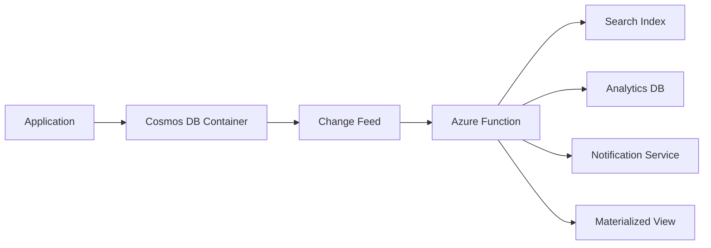

# How to Implement Azure Functions with Cosmos DB Change Feed Trigger

Author: [nawazdhandala](https://www.github.com/nawazdhandala)

Tags: Azure Functions, Cosmos DB, Change Feed, Event-Driven, Serverless, Azure, Real-Time

Description: Build real-time data processing pipelines using Azure Functions with the Cosmos DB change feed trigger to react to document changes as they happen.

---

The Cosmos DB change feed is one of those features that unlocks entirely new architectural patterns once you understand it. Every time a document is created or updated in a Cosmos DB container, the change feed captures that event. Azure Functions can subscribe to this feed and react to changes in near real-time - typically within a few seconds of the change occurring.

This is incredibly useful for building event-driven architectures. You can materialize views, sync data to search indexes, trigger notifications, audit changes, or propagate updates to downstream services - all without modifying the code that writes to Cosmos DB.

## How the Change Feed Works

The change feed is an ordered log of changes within each logical partition of a Cosmos DB container. It captures inserts and updates (not deletes, by default). Each change is delivered exactly once to your function in the order it occurred within that partition.



The change feed processor (which the Azure Functions trigger uses internally) handles partitioning, checkpointing, and load balancing automatically. If your container has 100 physical partitions, the processor distributes the work across multiple function instances.

## Setting Up the Project

Create a new function project and add the Cosmos DB extension.

```bash
# Create a new function project
func init CosmosChangeFeed --dotnet-isolated
cd CosmosChangeFeed

# Add the Cosmos DB extension package
dotnet add package Microsoft.Azure.Functions.Worker.Extensions.CosmosDB
```

## Basic Change Feed Trigger

Here is the simplest change feed trigger. It fires whenever documents are created or updated in the monitored container.

```csharp
using Microsoft.Azure.Functions.Worker;
using Microsoft.Extensions.Logging;

public class ProductChangeHandler
{
    private readonly ILogger<ProductChangeHandler> _logger;

    public ProductChangeHandler(ILogger<ProductChangeHandler> logger)
    {
        _logger = logger;
    }

    // This function triggers when documents change in the "products" container
    // The lease container tracks which changes have been processed
    [Function("OnProductChanged")]
    public void Run(
        [CosmosDBTrigger(
            databaseName: "ecommerce",
            containerName: "products",
            Connection = "CosmosDBConnection",
            LeaseContainerName = "leases",
            CreateLeaseContainerIfNotExists = true)]
        IReadOnlyList<Product> changedProducts)
    {
        if (changedProducts == null || changedProducts.Count == 0)
            return;

        _logger.LogInformation("Processing {Count} product changes", changedProducts.Count);

        foreach (var product in changedProducts)
        {
            _logger.LogInformation(
                "Product changed: {Id} - {Name}, Price: {Price}",
                product.Id, product.Name, product.Price);

            // React to the change - update search index, send notification, etc.
        }
    }
}

// Model matching the Cosmos DB document structure
public class Product
{
    public string Id { get; set; }
    public string Name { get; set; }
    public decimal Price { get; set; }
    public string Category { get; set; }
    public DateTime LastModified { get; set; }
}
```

The `LeaseContainerName` parameter specifies a container that tracks which changes have been processed. This is what enables exactly-once delivery and allows the function to pick up where it left off after restarts.

## Real-World Example: Syncing to a Search Index

One of the most common use cases is keeping a search index in sync with Cosmos DB. Here is how you would sync product data to Azure Cognitive Search.

```csharp
using Azure.Search.Documents;
using Azure.Search.Documents.Models;

public class SearchIndexSync
{
    private readonly ILogger<SearchIndexSync> _logger;
    private readonly SearchClient _searchClient;

    public SearchIndexSync(ILogger<SearchIndexSync> logger, SearchClient searchClient)
    {
        _logger = logger;
        _searchClient = searchClient;
    }

    // Sync Cosmos DB changes to Azure Cognitive Search in near real-time
    [Function("SyncProductsToSearch")]
    public async Task Run(
        [CosmosDBTrigger(
            databaseName: "ecommerce",
            containerName: "products",
            Connection = "CosmosDBConnection",
            LeaseContainerName = "leases",
            LeaseContainerPrefix = "search-sync-")]
        IReadOnlyList<Product> changedProducts)
    {
        if (changedProducts == null || changedProducts.Count == 0)
            return;

        _logger.LogInformation("Syncing {Count} products to search index",
            changedProducts.Count);

        // Build a batch of index actions
        var batch = IndexDocumentsBatch.Create(
            changedProducts.Select(p => IndexDocumentsAction.MergeOrUpload(
                new SearchProduct
                {
                    Id = p.Id,
                    Name = p.Name,
                    Price = p.Price,
                    Category = p.Category,
                    LastModified = p.LastModified
                })).ToArray());

        try
        {
            // Upload the batch to the search index
            var result = await _searchClient.IndexDocumentsAsync(batch);

            var succeeded = result.Value.Results.Count(r => r.Succeeded);
            var failed = result.Value.Results.Count(r => !r.Succeeded);

            _logger.LogInformation(
                "Search sync complete: {Succeeded} succeeded, {Failed} failed",
                succeeded, failed);
        }
        catch (Exception ex)
        {
            _logger.LogError(ex, "Failed to sync products to search index");
            throw; // Re-throw to trigger retry
        }
    }
}
```

## Handling Deletes

By default, the change feed does not capture deletes. To handle deleted documents, use the soft-delete pattern: add a `deleted` flag to documents instead of actually deleting them, and have a separate cleanup process remove them later.

```csharp
[Function("HandleProductChangesWithDeletes")]
public async Task HandleWithDeletes(
    [CosmosDBTrigger(
        databaseName: "ecommerce",
        containerName: "products",
        Connection = "CosmosDBConnection",
        LeaseContainerName = "leases",
        LeaseContainerPrefix = "delete-handler-")]
    IReadOnlyList<ProductWithSoftDelete> changedProducts)
{
    foreach (var product in changedProducts)
    {
        if (product.IsDeleted)
        {
            // Handle the delete - remove from search index, cache, etc.
            _logger.LogInformation("Product deleted: {Id}", product.Id);
            await _searchClient.DeleteDocumentsAsync("id", new[] { product.Id });
        }
        else
        {
            // Handle the create/update
            _logger.LogInformation("Product upserted: {Id}", product.Id);
            await SyncToSearchIndex(product);
        }
    }
}

public class ProductWithSoftDelete : Product
{
    // Soft-delete flag - set to true instead of physically deleting
    public bool IsDeleted { get; set; }

    // TTL in seconds - Cosmos DB will auto-delete after this period
    // Set this when IsDeleted is set to true
    [JsonPropertyName("ttl")]
    public int? TimeToLive { get; set; }
}
```

Cosmos DB also supports change feed with delete detection in "all versions and deletes" mode. This captures actual deletes but requires the container to be configured with this mode enabled.

## Multiple Consumers

You can have multiple functions consuming the same change feed by using different lease container prefixes. Each consumer gets its own independent checkpoint.

```csharp
// Consumer 1: Sync to search index
[Function("SyncToSearch")]
public void SyncToSearch(
    [CosmosDBTrigger(
        databaseName: "ecommerce",
        containerName: "products",
        Connection = "CosmosDBConnection",
        LeaseContainerName = "leases",
        LeaseContainerPrefix = "search-")]  // Unique prefix for this consumer
    IReadOnlyList<Product> changes) { /* ... */ }

// Consumer 2: Send notifications
[Function("SendNotifications")]
public void SendNotifications(
    [CosmosDBTrigger(
        databaseName: "ecommerce",
        containerName: "products",
        Connection = "CosmosDBConnection",
        LeaseContainerName = "leases",
        LeaseContainerPrefix = "notify-")]  // Different prefix
    IReadOnlyList<Product> changes) { /* ... */ }

// Consumer 3: Update analytics
[Function("UpdateAnalytics")]
public void UpdateAnalytics(
    [CosmosDBTrigger(
        databaseName: "ecommerce",
        containerName: "products",
        Connection = "CosmosDBConnection",
        LeaseContainerName = "leases",
        LeaseContainerPrefix = "analytics-")]  // Different prefix
    IReadOnlyList<Product> changes) { /* ... */ }
```

## Performance Tuning

The change feed trigger has several configuration options that affect performance.

```json
{
  "version": "2.0",
  "extensions": {
    "cosmosDB": {
      "connectionMode": "Direct",
      "maxItemsPerInvocation": 100,
      "feedPollDelay": 5000,
      "leaseAcquireInterval": 13000,
      "leaseExpirationInterval": 60000,
      "leaseRenewInterval": 17000,
      "maxConcurrency": 0
    }
  }
}
```

Key settings to understand:

- `maxItemsPerInvocation`: Controls batch size. Higher values mean fewer function invocations but more documents per batch.
- `feedPollDelay`: Milliseconds between polling for new changes. Lower values mean faster detection but more RU consumption on the lease container.
- `connectionMode`: Use "Direct" for better performance in production.

## Error Handling and Idempotency

The change feed guarantees at-least-once delivery, which means your function might process the same change more than once (for example, if the function crashes before the checkpoint is saved). Your processing logic must be idempotent.

```csharp
// Idempotent processing - safe to run multiple times for the same document
[Function("IdempotentProcessor")]
public async Task Process(
    [CosmosDBTrigger(
        databaseName: "ecommerce",
        containerName: "orders",
        Connection = "CosmosDBConnection",
        LeaseContainerName = "leases")]
    IReadOnlyList<Order> changedOrders)
{
    foreach (var order in changedOrders)
    {
        // Use the document's _etag or a version field to detect duplicates
        // Upsert operations are naturally idempotent
        await _analyticsDb.UpsertOrderSummaryAsync(new OrderSummary
        {
            OrderId = order.Id,
            Total = order.TotalAmount,
            Status = order.Status,
            LastUpdated = order.LastModified
        });
    }
}
```

## Summary

The Cosmos DB change feed trigger turns your database into an event source. Changes flow automatically to your functions, where you can materialize views, sync indexes, send notifications, or feed analytics pipelines. The framework handles partitioning, checkpointing, and load balancing. Your job is to write idempotent processing logic and configure the trigger settings for your throughput requirements. This pattern is the backbone of many real-time data architectures on Azure.
