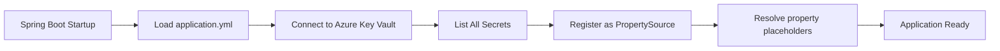

# How to Implement Azure Key Vault Integration in Spring Boot with azure-spring-boot-starter-keyvault-secrets

Author: [nawazdhandala](https://www.github.com/nawazdhandala)

Tags: Azure Key Vault, Spring Boot, Secrets Management, Java, Azure Security, Cloud Configuration, Azure SDK

Description: Learn how to integrate Azure Key Vault with Spring Boot using the Key Vault secrets starter to securely manage application secrets and configuration.

---

Hard-coding secrets in configuration files is a recipe for trouble. Database passwords, API keys, and connection strings have a way of ending up in source control, shared across Slack channels, or sitting in plaintext on developer machines. Azure Key Vault provides a centralized, secure store for secrets, and the Spring Boot starter for Key Vault makes it possible to inject secrets directly into your application configuration as if they were normal properties.

In this post, we will integrate Azure Key Vault with a Spring Boot application using the `azure-spring-boot-starter-keyvault-secrets` library. Your application will read secrets from Key Vault at startup and use them as regular Spring configuration properties.

## Why Key Vault?

Key Vault solves several problems at once:

- Secrets are stored encrypted at rest, not in plaintext files
- Access is controlled through Azure RBAC and access policies
- Every secret access is logged for auditing
- Secret rotation can be automated
- Developers do not need to know production secrets - they use their own Key Vault for development

The Spring Boot starter makes this integration transparent. You store a secret named `database-password` in Key Vault, and your Spring Boot app reads it as `${database-password}`. No extra code required.

## Setting Up Azure Key Vault

Create a Key Vault and add some secrets.

```bash
# Create a resource group
az group create --name keyvault-demo-rg --location eastus

# Create a Key Vault
az keyvault create \
  --name my-app-keyvault \
  --resource-group keyvault-demo-rg \
  --location eastus

# Add secrets to the vault
az keyvault secret set --vault-name my-app-keyvault --name "database-url" \
  --value "jdbc:mysql://myserver.mysql.database.azure.com:3306/mydb"

az keyvault secret set --vault-name my-app-keyvault --name "database-username" \
  --value "appuser"

az keyvault secret set --vault-name my-app-keyvault --name "database-password" \
  --value "SuperSecretPassword123!"

az keyvault secret set --vault-name my-app-keyvault --name "api-key" \
  --value "sk-abc123def456"

az keyvault secret set --vault-name my-app-keyvault --name "redis-connection-string" \
  --value "myredis.redis.cache.windows.net:6380,password=rediskey,ssl=True"
```

Note the naming convention. Key Vault secret names can contain alphanumeric characters and hyphens. The Spring Boot starter converts hyphens to dots when mapping to Spring properties, so `database-password` becomes accessible as `database.password` in your application.

## Project Dependencies

Add the Key Vault secrets starter to your Spring Boot project.

```xml
<!-- pom.xml -->
<dependencies>
    <dependency>
        <groupId>org.springframework.boot</groupId>
        <artifactId>spring-boot-starter-web</artifactId>
    </dependency>

    <!-- Azure Spring Boot starter for Key Vault secrets -->
    <dependency>
        <groupId>com.azure.spring</groupId>
        <artifactId>spring-cloud-azure-starter-keyvault-secrets</artifactId>
        <version>5.8.0</version>
    </dependency>

    <!-- Spring Data JPA for database access (to demonstrate using secrets) -->
    <dependency>
        <groupId>org.springframework.boot</groupId>
        <artifactId>spring-boot-starter-data-jpa</artifactId>
    </dependency>

    <dependency>
        <groupId>com.mysql</groupId>
        <artifactId>mysql-connector-j</artifactId>
        <scope>runtime</scope>
    </dependency>
</dependencies>

<dependencyManagement>
    <dependencies>
        <dependency>
            <groupId>com.azure.spring</groupId>
            <artifactId>spring-cloud-azure-dependencies</artifactId>
            <version>5.8.0</version>
            <type>pom</type>
            <scope>import</scope>
        </dependency>
    </dependencies>
</dependencyManagement>
```

## Basic Configuration

Configure the Key Vault endpoint and authentication in `application.yml`.

```yaml
# application.yml
spring:
  cloud:
    azure:
      keyvault:
        secret:
          endpoint: https://my-app-keyvault.vault.azure.net
          # Authentication is handled automatically via DefaultAzureCredential
          # In production: uses managed identity
          # In development: uses Azure CLI credentials

  # Use secrets from Key Vault in your datasource configuration
  datasource:
    url: ${database-url}
    username: ${database-username}
    password: ${database-password}

  jpa:
    hibernate:
      ddl-auto: update
```

That is it. When the application starts, the starter loads all secrets from Key Vault and makes them available as Spring properties. Your datasource configuration references `${database-url}`, which resolves to the value of the `database-url` secret in Key Vault.

## How the Property Resolution Works

The Spring Cloud Azure starter acts as a PropertySource. During application startup, it connects to Key Vault, lists all secrets, and registers their names and values in the Spring Environment. This means any place you use `@Value`, `${...}` in YAML, or `Environment.getProperty()` can access Key Vault secrets.



## Using Secrets with @Value

Inject secrets directly into your beans.

```java
import org.springframework.beans.factory.annotation.Value;
import org.springframework.stereotype.Service;

@Service
public class ExternalApiClient {

    // Injected from Key Vault secret named "api-key"
    @Value("${api-key}")
    private String apiKey;

    // Injected from Key Vault secret named "redis-connection-string"
    @Value("${redis-connection-string}")
    private String redisConnectionString;

    public void callExternalApi() {
        // Use the API key from Key Vault
        System.out.println("Calling API with key: " + apiKey.substring(0, 5) + "...");
    }

    public String getRedisConnection() {
        return redisConnectionString;
    }
}
```

## Using @ConfigurationProperties

For structured configuration, use `@ConfigurationProperties` with Key Vault secrets.

```java
import org.springframework.boot.context.properties.ConfigurationProperties;
import org.springframework.context.annotation.Configuration;

@Configuration
@ConfigurationProperties(prefix = "database")
public class DatabaseProperties {

    // Maps to Key Vault secret "database-url"
    private String url;

    // Maps to Key Vault secret "database-username"
    private String username;

    // Maps to Key Vault secret "database-password"
    private String password;

    // Getters and setters
    public String getUrl() { return url; }
    public void setUrl(String url) { this.url = url; }
    public String getUsername() { return username; }
    public void setUsername(String username) { this.username = username; }
    public String getPassword() { return password; }
    public void setPassword(String password) { this.password = password; }
}
```

Remember that Key Vault secrets use hyphens, and Spring converts them to dots. So `database-url` in Key Vault becomes `database.url` in Spring, which maps to the `url` field under the `database` prefix.

## Multiple Key Vaults

You can configure your application to read from multiple Key Vaults. This is useful when different teams manage different sets of secrets.

```yaml
spring:
  cloud:
    azure:
      keyvault:
        secret:
          property-sources:
            - endpoint: https://shared-keyvault.vault.azure.net
              # Shared secrets like API keys
            - endpoint: https://team-keyvault.vault.azure.net
              # Team-specific secrets
              # Secrets from this vault take precedence
```

Secrets from later property sources override those from earlier ones if there are naming conflicts.

## Secret Rotation Without Restarts

By default, secrets are loaded at startup. If a secret changes in Key Vault, your application does not pick up the change until it restarts. You can enable periodic refresh.

```yaml
spring:
  cloud:
    azure:
      keyvault:
        secret:
          endpoint: https://my-app-keyvault.vault.azure.net
          property-source-enabled: true
          # Refresh secrets every 5 minutes
          refresh-interval: 5m
```

With refresh enabled, the starter periodically checks Key Vault for updated secrets and updates the Spring Environment. Be aware that some beans (like datasource connections) might not pick up the new values without a reconnect.

## Local Development Setup

For local development, authenticate through the Azure CLI.

```bash
# Login to Azure
az login

# Grant yourself access to the Key Vault
az keyvault set-policy \
  --name my-app-keyvault \
  --upn your-email@domain.com \
  --secret-permissions get list
```

You can also use a development-specific Key Vault with test secrets.

```yaml
# application-dev.yml
spring:
  cloud:
    azure:
      keyvault:
        secret:
          endpoint: https://my-dev-keyvault.vault.azure.net
```

## Production with Managed Identity

In production, use a managed identity so no credentials are stored anywhere.

```bash
# Enable managed identity on your App Service
az webapp identity assign --name my-spring-app --resource-group my-rg

# Grant the managed identity access to Key Vault
az keyvault set-policy \
  --name my-app-keyvault \
  --object-id <managed-identity-principal-id> \
  --secret-permissions get list
```

No code changes needed. `DefaultAzureCredential` picks up the managed identity automatically.

## Creating a Health Check for Key Vault

Verify that your application can access Key Vault by adding a health indicator.

```java
import org.springframework.boot.actuate.health.Health;
import org.springframework.boot.actuate.health.HealthIndicator;
import org.springframework.core.env.Environment;
import org.springframework.stereotype.Component;

@Component
public class KeyVaultHealthIndicator implements HealthIndicator {

    private final Environment environment;

    public KeyVaultHealthIndicator(Environment environment) {
        this.environment = environment;
    }

    @Override
    public Health health() {
        try {
            // Try to read a known secret
            String dbUrl = environment.getProperty("database-url");
            if (dbUrl != null && !dbUrl.isEmpty()) {
                return Health.up()
                    .withDetail("keyVault", "Connected")
                    .withDetail("secretsLoaded", true)
                    .build();
            }
            return Health.down()
                .withDetail("keyVault", "Secrets not loaded")
                .build();
        } catch (Exception e) {
            return Health.down()
                .withDetail("keyVault", "Error: " + e.getMessage())
                .build();
        }
    }
}
```

## Security Best Practices

When working with Key Vault in production, follow these guidelines:

First, use managed identities instead of service principals with client secrets. You are using Key Vault to avoid storing secrets - do not store a secret to access Key Vault.

Second, apply the principle of least privilege. Give your application only `get` and `list` permissions on secrets. Do not grant `set`, `delete`, or `purge` permissions unless the application needs to manage secrets.

Third, enable soft delete and purge protection on your Key Vault. This prevents accidental deletion of secrets and the vault itself.

Fourth, use separate Key Vaults for different environments. Do not share a Key Vault between development and production.

Fifth, audit secret access. Key Vault logs every operation to Azure Monitor. Set up alerts for unexpected access patterns.

## Wrapping Up

The Spring Boot starter for Azure Key Vault secrets is the simplest way to keep secrets out of your configuration files. Configure the vault endpoint, let `DefaultAzureCredential` handle authentication, and reference secrets as Spring properties. Use managed identities in production, the Azure CLI during development, and separate vaults for each environment. Your application code stays the same everywhere - only the Key Vault endpoint changes.
