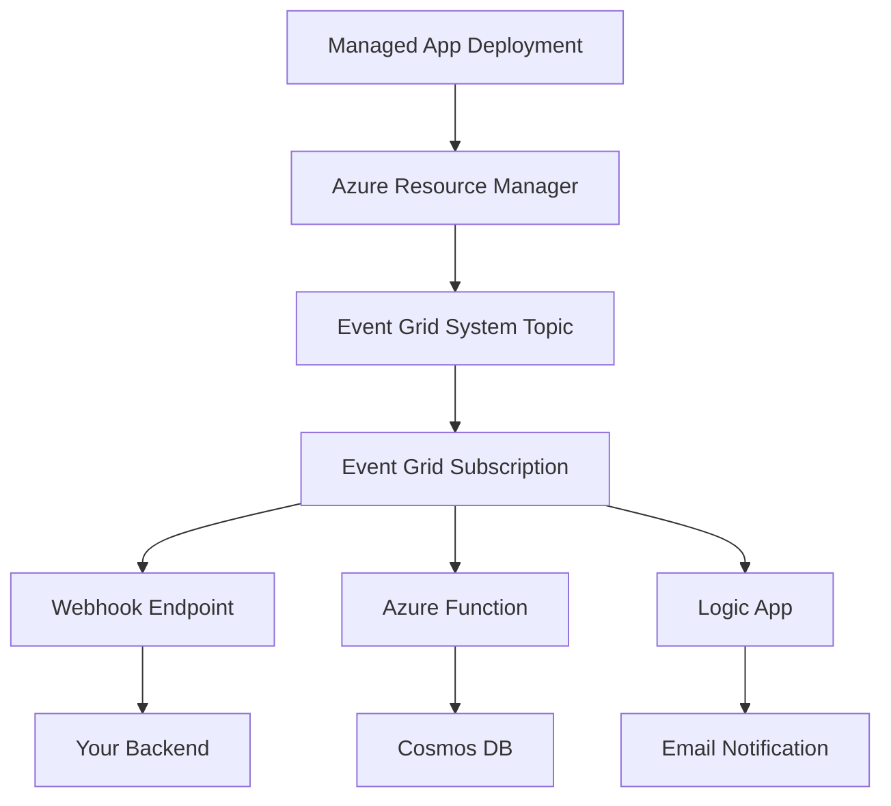

# How to Implement Azure Managed Application Notifications with Azure Event Grid and Webhooks

Author: [nawazdhandala](https://www.github.com/nawazdhandala)

Tags: Azure Event Grid, Managed Applications, Webhooks, Notifications, Azure Marketplace, ISV, Event-Driven

Description: Implement real-time notifications for Azure Managed Application lifecycle events using Azure Event Grid subscriptions and webhook handlers.

---

When you publish a managed application on the Azure Marketplace, you need visibility into what is happening with your deployments. When does a customer deploy your application? When do they delete it? When do they change configuration parameters? Without notifications, you are flying blind - you only find out about issues when customers contact support.

Azure Event Grid provides a native eventing mechanism for Azure resource lifecycle events, and managed applications emit events at every stage of their lifecycle. In this guide, I will show you how to set up Event Grid subscriptions, build webhook handlers, and use these notifications to automate your operational workflows.

## Managed Application Lifecycle Events

Managed applications emit several types of events through Azure Resource Manager notifications:

- **Deployment succeeded** - A customer successfully deployed your managed application
- **Deployment failed** - A deployment attempt failed
- **Update succeeded** - A customer or your team updated the managed application
- **Delete initiated** - A customer is deleting the managed application
- **Resource action** - A custom action was invoked on the managed application

Each of these events gives you an opportunity to take action: send a welcome email, alert your support team, clean up external resources, or update your customer database.

## Architecture



## Setting Up the Event Grid System Topic

First, create a system topic that captures events from your managed application deployments. This requires the publisher's Azure AD tenant to have the right permissions:

```bash
# Create an Event Grid system topic for managed application events
az eventgrid system-topic create \
  --name topic-managed-app-events \
  --resource-group rg-saas-operations \
  --location global \
  --topic-type "Microsoft.Solutions.Applications" \
  --source "/subscriptions/{publisher-sub-id}/resourceGroups/{managed-rg}"
```

For marketplace managed applications, you can also use the notification endpoint URL configured in Partner Center. This is a simpler approach that sends HTTP POST requests directly to your webhook endpoint whenever a lifecycle event occurs.

## Configuring Notification Endpoint in Partner Center

In the Partner Center technical configuration for your managed application plan, specify a notification endpoint URL:

```
Notification Endpoint URL: https://api.yoursaas.com/webhooks/managed-app
```

This URL receives POST requests with the event details every time something happens to any deployment of your managed application across all customer subscriptions.

## Building the Webhook Handler

Create a webhook endpoint that processes managed application notifications:

```csharp
// Webhook controller that handles managed application lifecycle notifications
[ApiController]
[Route("webhooks/managed-app")]
public class ManagedAppWebhookController : ControllerBase
{
    private readonly ICustomerService _customerService;
    private readonly INotificationService _notifications;
    private readonly IDeploymentTracker _deploymentTracker;
    private readonly ILogger<ManagedAppWebhookController> _logger;

    public ManagedAppWebhookController(
        ICustomerService customerService,
        INotificationService notifications,
        IDeploymentTracker deploymentTracker,
        ILogger<ManagedAppWebhookController> logger)
    {
        _customerService = customerService;
        _notifications = notifications;
        _deploymentTracker = deploymentTracker;
        _logger = logger;
    }

    [HttpPost]
    public async Task<IActionResult> HandleNotification(
        [FromBody] ManagedAppNotification notification)
    {
        _logger.LogInformation(
            "Received notification: {EventType} for {ApplicationId}",
            notification.EventType, notification.ApplicationId);

        // Validate the notification signature to prevent spoofing
        if (!ValidateSignature(notification))
        {
            _logger.LogWarning("Invalid notification signature");
            return Unauthorized();
        }

        switch (notification.EventType)
        {
            case "PUT":
                await HandleDeployment(notification);
                break;

            case "PATCH":
                await HandleUpdate(notification);
                break;

            case "DELETE":
                await HandleDeletion(notification);
                break;

            default:
                _logger.LogInformation(
                    "Unhandled event type: {EventType}", notification.EventType);
                break;
        }

        // Always return 200 to acknowledge receipt
        return Ok();
    }

    private async Task HandleDeployment(ManagedAppNotification notification)
    {
        // A customer deployed your managed application
        _logger.LogInformation(
            "New deployment: {AppId} in subscription {SubId}",
            notification.ApplicationId, notification.SubscriptionId);

        // Track the deployment
        await _deploymentTracker.RecordDeploymentAsync(new Deployment
        {
            ApplicationId = notification.ApplicationId,
            CustomerSubscriptionId = notification.SubscriptionId,
            CustomerTenantId = notification.CustomerTenantId,
            PlanId = notification.PlanId,
            ManagedResourceGroupId = notification.ManagedResourceGroupId,
            DeployedAt = DateTime.UtcNow,
            Status = "Active"
        });

        // Send welcome notification to the customer
        await _notifications.SendWelcomeEmailAsync(
            notification.CustomerTenantId,
            notification.PlanId);

        // Alert the sales team about the new deployment
        await _notifications.NotifySlackChannelAsync(
            "#new-customers",
            $"New managed app deployment in tenant {notification.CustomerTenantId} on plan {notification.PlanId}");
    }

    private async Task HandleUpdate(ManagedAppNotification notification)
    {
        _logger.LogInformation(
            "Application updated: {AppId}", notification.ApplicationId);

        await _deploymentTracker.RecordUpdateAsync(
            notification.ApplicationId,
            notification.Parameters);
    }

    private async Task HandleDeletion(ManagedAppNotification notification)
    {
        _logger.LogWarning(
            "Application deleted: {AppId} by tenant {TenantId}",
            notification.ApplicationId, notification.CustomerTenantId);

        // Update the deployment status
        await _deploymentTracker.MarkAsDeletedAsync(notification.ApplicationId);

        // Clean up any external resources
        await CleanUpExternalResourcesAsync(notification.ApplicationId);

        // Notify the customer success team
        await _notifications.NotifySlackChannelAsync(
            "#churn-alerts",
            $"Managed app deleted by tenant {notification.CustomerTenantId}. " +
            $"Investigate potential churn.");
    }

    private async Task CleanUpExternalResourcesAsync(string applicationId)
    {
        // Clean up any resources outside the managed resource group
        // e.g., DNS records, external API registrations, monitoring configs
        var deployment = await _deploymentTracker.GetAsync(applicationId);

        if (deployment != null)
        {
            // Remove DNS entries
            // Deregister from monitoring
            // Archive customer data
            _logger.LogInformation(
                "Cleaned up external resources for {AppId}", applicationId);
        }
    }

    private bool ValidateSignature(ManagedAppNotification notification)
    {
        // Validate the notification came from Azure
        // Check the sig parameter in the notification URL
        return true; // Simplified - implement actual validation
    }
}
```

## The Notification Payload

Here is the structure of a managed application notification:

```csharp
// Model representing a managed application lifecycle notification
public class ManagedAppNotification
{
    // The type of event: PUT, PATCH, DELETE
    public string EventType { get; set; }

    // The resource ID of the managed application
    public string ApplicationId { get; set; }

    // The customer's Azure subscription ID
    public string SubscriptionId { get; set; }

    // The customer's Azure AD tenant ID
    public string CustomerTenantId { get; set; }

    // The managed resource group where resources are deployed
    public string ManagedResourceGroupId { get; set; }

    // The plan ID from Partner Center
    public string PlanId { get; set; }

    // The provisioning state of the application
    public string ProvisioningState { get; set; }

    // Parameters provided during deployment or update
    public Dictionary<string, object> Parameters { get; set; }

    // Error details if the operation failed
    public NotificationError Error { get; set; }
}
```

## Using Event Grid for More Granular Events

If you need events beyond the basic lifecycle notifications, set up Event Grid subscriptions on the managed resource group to capture events from individual resources:

```csharp
// Azure Function that creates Event Grid subscriptions when a managed app is deployed
public class EventGridSetupFunction
{
    private readonly EventGridManagementClient _eventGridClient;

    [FunctionName("SetupEventGridForDeployment")]
    public async Task Run(
        [HttpTrigger(AuthorizationLevel.Function, "post")] HttpRequest req,
        ILogger log)
    {
        var notification = await JsonSerializer
            .DeserializeAsync<ManagedAppNotification>(req.Body);

        if (notification.EventType != "PUT") return;

        // Create an Event Grid subscription on the managed resource group
        var subscriptionName = $"sub-{notification.ApplicationId.GetHashCode():x}";

        var subscription = new EventSubscription
        {
            Destination = new WebHookEventSubscriptionDestination
            {
                EndpointUrl = "https://api.yoursaas.com/webhooks/resource-events"
            },
            Filter = new EventSubscriptionFilter
            {
                IncludedEventTypes = new List<string>
                {
                    "Microsoft.Resources.ResourceWriteSuccess",
                    "Microsoft.Resources.ResourceDeleteSuccess",
                    "Microsoft.Resources.ResourceActionSuccess"
                },
                SubjectBeginsWith = notification.ManagedResourceGroupId
            }
        };

        await _eventGridClient.EventSubscriptions.CreateOrUpdateAsync(
            notification.ManagedResourceGroupId,
            subscriptionName,
            subscription);

        log.LogInformation(
            "Created Event Grid subscription for {ManagedRg}",
            notification.ManagedResourceGroupId);
    }
}
```

## Tracking Deployment Health

Use notifications to build a deployment health dashboard:

```csharp
// Service that tracks the health of all managed application deployments
public class DeploymentHealthService
{
    private readonly Container _deploymentsContainer;

    public async Task<DeploymentHealthReport> GetHealthReportAsync()
    {
        var query = new QueryDefinition(
            @"SELECT
                c.status,
                COUNT(1) as count
              FROM c
              GROUP BY c.status");

        var statusCounts = new Dictionary<string, int>();
        using var iterator = _deploymentsContainer.GetItemQueryIterator<dynamic>(query);

        while (iterator.HasMoreResults)
        {
            var response = await iterator.ReadNextAsync();
            foreach (var item in response)
            {
                statusCounts[(string)item.status] = (int)item.count;
            }
        }

        return new DeploymentHealthReport
        {
            TotalDeployments = statusCounts.Values.Sum(),
            ActiveDeployments = statusCounts.GetValueOrDefault("Active", 0),
            FailedDeployments = statusCounts.GetValueOrDefault("Failed", 0),
            DeletedDeployments = statusCounts.GetValueOrDefault("Deleted", 0),
            GeneratedAt = DateTime.UtcNow
        };
    }
}
```

## Retry and Reliability

Webhooks can fail. Azure retries notifications with an exponential backoff, but you should also build your own retry mechanism for critical actions:

```csharp
// Durable function orchestration for reliable notification processing
[FunctionName("ProcessNotificationReliably")]
public async Task RunOrchestrator(
    [OrchestrationTrigger] IDurableOrchestrationContext context)
{
    var notification = context.GetInput<ManagedAppNotification>();

    // Retry up to 3 times with exponential backoff
    var retryOptions = new RetryOptions(
        firstRetryInterval: TimeSpan.FromSeconds(5),
        maxNumberOfAttempts: 3)
    {
        BackoffCoefficient = 2.0
    };

    // Track the deployment
    await context.CallActivityWithRetryAsync(
        "TrackDeployment", retryOptions, notification);

    // Send notifications
    await context.CallActivityWithRetryAsync(
        "SendNotifications", retryOptions, notification);

    // Set up monitoring
    await context.CallActivityWithRetryAsync(
        "ConfigureMonitoring", retryOptions, notification);
}
```

## Wrapping Up

Notifications are the operational backbone of a managed application business. Without them, you have no idea when customers deploy, update, or delete your application. Azure Event Grid and the Partner Center notification endpoint give you two complementary mechanisms for staying informed. The notification endpoint handles the high-level lifecycle events, while Event Grid subscriptions give you granular visibility into what is happening inside the managed resource group. Build your webhook handlers to be idempotent and reliable, track every deployment in a central store, and use the notification events to trigger automated workflows. This is what separates a managed application that just works from one that delivers a great operational experience for both you and your customers.
