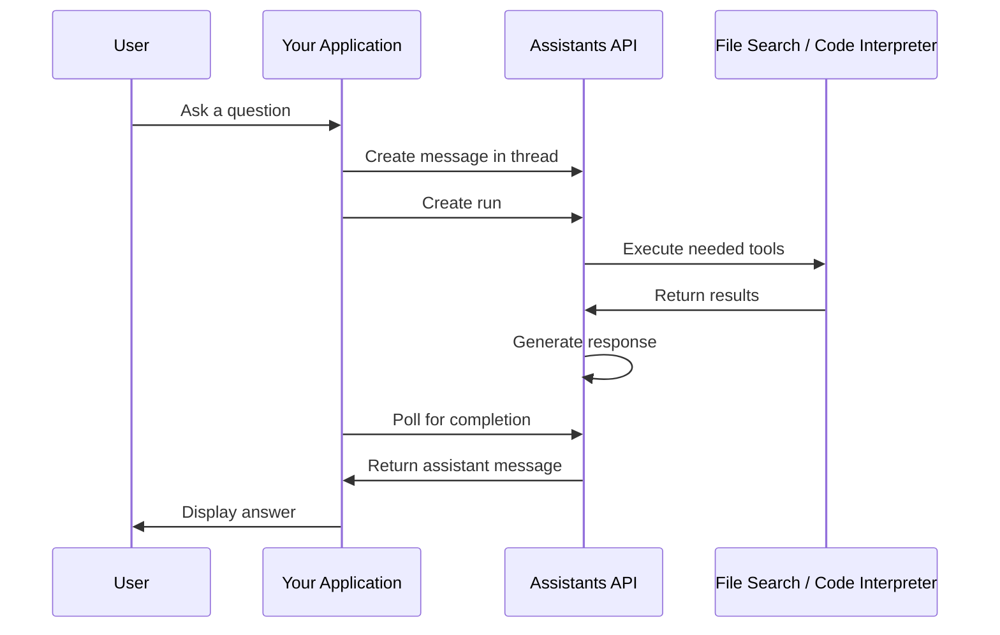

# How to Implement Azure OpenAI Assistants API with File Search and Code Interpreter

Author: [nawazdhandala](https://www.github.com/nawazdhandala)

Tags: Azure OpenAI, Assistants API, File Search, Code Interpreter, AI Agents, Python, Retrieval

Description: Build intelligent assistants using the Azure OpenAI Assistants API with file search for document retrieval and code interpreter for dynamic computation.

---

The Assistants API is a higher-level abstraction on top of Azure OpenAI that manages conversation state, tool execution, and file handling for you. Instead of manually maintaining conversation history, implementing RAG pipelines, and managing code execution, you configure an assistant with tools and let the API handle the orchestration.

Two of the most powerful built-in tools are File Search (for retrieving information from uploaded documents) and Code Interpreter (for writing and executing Python code on the fly). Together, they let you build assistants that can answer questions from your documents and perform calculations, data analysis, and chart generation without you writing any of that logic yourself.

## How the Assistants API Works

The Assistants API introduces several concepts:

- **Assistant**: A configured entity with a model, instructions, and tools
- **Thread**: A conversation session that persists messages
- **Message**: A user or assistant message within a thread
- **Run**: An execution of the assistant on a thread (processes pending messages)
- **Vector Store**: A collection of files indexed for search



## Prerequisites

- An Azure OpenAI resource with a supported model deployed (gpt-4o recommended)
- Python 3.9+ with the `openai` package (version 1.12+)
- Files to upload for the file search feature

```bash
pip install openai
```

## Step 1: Create an Assistant with File Search and Code Interpreter

```python
# create_assistant.py - Set up an assistant with both tools enabled
from openai import AzureOpenAI

client = AzureOpenAI(
    azure_endpoint="https://your-resource.openai.azure.com/",
    api_key="your-api-key",
    api_version="2024-05-01-preview"
)

# Create the assistant with both tools
assistant = client.beta.assistants.create(
    name="Data Analysis Assistant",
    instructions="""You are a data analysis assistant for a monitoring company.
    You help users understand their data by searching through uploaded documents
    and performing calculations. When asked about data, first check the uploaded
    files for relevant information. When calculations or charts are needed, use
    the code interpreter. Always explain your reasoning and show your work.""",
    model="gpt-4o",
    tools=[
        {"type": "file_search"},     # Enable document retrieval
        {"type": "code_interpreter"}  # Enable Python code execution
    ]
)

print(f"Assistant created: {assistant.id}")
```

## Step 2: Upload Files and Create a Vector Store

File Search uses vector stores to index and search your documents. Upload files and create a vector store:

```python
# upload_files.py - Upload documents and create a vector store for file search
# Upload files to the assistants API
uploaded_files = []

# Upload a product documentation PDF
file1 = client.files.create(
    file=open("docs/monitoring-guide.pdf", "rb"),
    purpose="assistants"
)
uploaded_files.append(file1.id)

# Upload a CSV with metrics data
file2 = client.files.create(
    file=open("data/monthly-metrics.csv", "rb"),
    purpose="assistants"
)
uploaded_files.append(file2.id)

# Upload an incident report
file3 = client.files.create(
    file=open("reports/q4-incident-report.md", "rb"),
    purpose="assistants"
)
uploaded_files.append(file3.id)

print(f"Uploaded {len(uploaded_files)} files")

# Create a vector store and add the files for file search
vector_store = client.beta.vector_stores.create(
    name="Company Knowledge Base",
    file_ids=uploaded_files
)

# Wait for the files to be processed and indexed
print(f"Vector store created: {vector_store.id}")
print(f"Status: {vector_store.status}")
print(f"File counts: {vector_store.file_counts}")

# Attach the vector store to the assistant
assistant = client.beta.assistants.update(
    assistant_id=assistant.id,
    tool_resources={
        "file_search": {
            "vector_store_ids": [vector_store.id]
        }
    }
)

print("Vector store attached to assistant")
```

## Step 3: Create a Thread and Send Messages

Threads represent conversations. Create a thread and add messages:

```python
# conversation.py - Create a conversation thread and interact with the assistant

# Create a new conversation thread
thread = client.beta.threads.create()
print(f"Thread created: {thread.id}")

# Send a message that will trigger file search
message = client.beta.threads.messages.create(
    thread_id=thread.id,
    role="user",
    content="What are the recommended alert thresholds for HTTP monitoring according to our documentation?"
)

# Create a run to process the message
run = client.beta.threads.runs.create(
    thread_id=thread.id,
    assistant_id=assistant.id
)

print(f"Run created: {run.id}, Status: {run.status}")
```

## Step 4: Poll for Completion and Get the Response

Runs are asynchronous. You need to poll until the run completes:

```python
# poll_and_respond.py - Wait for the run to complete and display the response
import time

def wait_for_run(client, thread_id: str, run_id: str) -> object:
    """Poll the run status until it completes or fails."""
    while True:
        run = client.beta.threads.runs.retrieve(
            thread_id=thread_id,
            run_id=run_id
        )

        if run.status == "completed":
            print("Run completed successfully")
            return run
        elif run.status == "failed":
            print(f"Run failed: {run.last_error}")
            return run
        elif run.status == "requires_action":
            # Handle function calling if you have custom functions
            print("Run requires action (function calling)")
            return run
        elif run.status in ("cancelling", "cancelled", "expired"):
            print(f"Run ended with status: {run.status}")
            return run
        else:
            # Status is queued or in_progress
            print(f"Status: {run.status}, waiting...")
            time.sleep(2)

# Wait for the run to finish
completed_run = wait_for_run(client, thread.id, run.id)

# Retrieve the assistant's response
messages = client.beta.threads.messages.list(
    thread_id=thread.id,
    order="desc",
    limit=1
)

# Display the response
for message in messages.data:
    if message.role == "assistant":
        for content_block in message.content:
            if content_block.type == "text":
                print("Assistant:", content_block.text.value)
                # Show citations from file search
                if content_block.text.annotations:
                    print("\nSources:")
                    for annotation in content_block.text.annotations:
                        if annotation.type == "file_citation":
                            print(f"  - File: {annotation.file_citation.file_id}")
```

## Step 5: Use Code Interpreter for Data Analysis

Send a message that requires computation. The assistant will automatically use Code Interpreter:

```python
# data_analysis.py - Ask the assistant to analyze data using code interpreter

# Upload a CSV file for analysis in this specific thread
data_file = client.files.create(
    file=open("data/server-metrics-february.csv", "rb"),
    purpose="assistants"
)

# Send a message with the file attached, requesting analysis
message = client.beta.threads.messages.create(
    thread_id=thread.id,
    role="user",
    content="I've uploaded server metrics for February. Can you analyze the data, "
            "find the peak usage hours, calculate the average response time by server, "
            "and create a chart showing response time trends?",
    attachments=[
        {
            "file_id": data_file.id,
            "tools": [{"type": "code_interpreter"}]
        }
    ]
)

# Create a run
run = client.beta.threads.runs.create(
    thread_id=thread.id,
    assistant_id=assistant.id
)

# Wait for completion
completed_run = wait_for_run(client, thread.id, run.id)

# Get the response, which may include generated images (charts)
messages = client.beta.threads.messages.list(
    thread_id=thread.id,
    order="desc",
    limit=1
)

for message in messages.data:
    if message.role == "assistant":
        for content_block in message.content:
            if content_block.type == "text":
                print("Analysis:", content_block.text.value)
            elif content_block.type == "image_file":
                # The assistant generated a chart - download it
                image_file_id = content_block.image_file.file_id
                image_data = client.files.content(image_file_id)
                with open("response_chart.png", "wb") as f:
                    f.write(image_data.read())
                print("Chart saved to response_chart.png")
```

## Step 6: Build a Complete Chat Loop

Put it all together in an interactive chat loop:

```python
# chat.py - Interactive chat loop with the assistant
def chat_with_assistant(client, assistant_id: str):
    """Run an interactive chat session with the assistant."""
    # Create a new thread for this session
    thread = client.beta.threads.create()
    print("Chat started. Type 'quit' to exit.")
    print("-" * 50)

    while True:
        # Get user input
        user_input = input("\nYou: ").strip()
        if user_input.lower() in ("quit", "exit"):
            break

        # Send the message
        client.beta.threads.messages.create(
            thread_id=thread.id,
            role="user",
            content=user_input
        )

        # Create and wait for the run
        run = client.beta.threads.runs.create(
            thread_id=thread.id,
            assistant_id=assistant_id
        )

        completed_run = wait_for_run(client, thread.id, run.id)

        # Display the response
        messages = client.beta.threads.messages.list(
            thread_id=thread.id,
            order="desc",
            limit=1
        )

        for msg in messages.data:
            if msg.role == "assistant":
                for block in msg.content:
                    if block.type == "text":
                        print(f"\nAssistant: {block.text.value}")

        # Show token usage for cost tracking
        if completed_run.usage:
            print(f"\n[Tokens - Prompt: {completed_run.usage.prompt_tokens}, "
                  f"Completion: {completed_run.usage.completion_tokens}]")

# Start the chat
chat_with_assistant(client, assistant.id)
```

## Managing Costs

The Assistants API has several cost components:

- **Token usage**: Model tokens for messages and tool calls
- **File storage**: $0.10/GB/day for files uploaded to the API
- **Vector store storage**: $0.10/GB/day for indexed files
- **Code Interpreter sessions**: Charged per session

To manage costs, clean up resources when they are no longer needed:

```python
# cleanup.py - Clean up assistant resources to avoid ongoing charges
# Delete the vector store (stops storage charges)
client.beta.vector_stores.delete(vector_store.id)

# Delete uploaded files
for file_id in uploaded_files:
    client.files.delete(file_id)

# Delete the assistant
client.beta.assistants.delete(assistant.id)

print("Cleanup complete")
```

## Summary

The Azure OpenAI Assistants API simplifies building intelligent assistants by handling conversation state, file indexing, and code execution for you. File Search lets your assistant answer questions from uploaded documents without you building a RAG pipeline. Code Interpreter lets it perform data analysis, create charts, and run calculations without you managing a Python sandbox. The trade-off is less control compared to building these components yourself, but for many use cases the convenience and speed of development are worth it.
