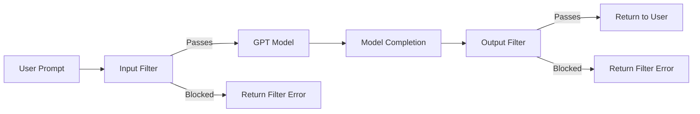

# How to Implement Azure OpenAI Content Filtering with Custom Severity Thresholds

Author: [nawazdhandala](https://www.github.com/nawazdhandala)

Tags: Azure OpenAI, Content Filtering, Safety, Moderation, Responsible AI, GPT, Enterprise Security

Description: Configure custom content filtering policies in Azure OpenAI to control severity thresholds for hate, violence, sexual, and self-harm categories.

---

Azure OpenAI comes with default content filters that block harmful content in both prompts and completions. These defaults work well for most applications, but sometimes you need to adjust them. A healthcare application might need to allow medical terminology that the default filters incorrectly flag. A content moderation platform might need to see potentially harmful content to classify it. A children's education app might need stricter filtering than the default.

Custom content filtering in Azure OpenAI lets you create policies that adjust the severity thresholds for each content category. You can make filters stricter or more permissive depending on your application's requirements and your organization's risk tolerance.

## How Content Filtering Works

Azure OpenAI evaluates both the input (user prompt) and output (model completion) against four content categories:

| Category | What It Detects |
|----------|----------------|
| Hate | Content targeting identity groups based on race, gender, religion, etc. |
| Violence | Content depicting or promoting violence against people or animals |
| Sexual | Sexually explicit content |
| Self-Harm | Content related to self-harm or suicide |

Each category has four severity levels:

- **Safe**: Content that is clearly benign
- **Low**: Content that is mildly concerning but generally acceptable
- **Medium**: Content that is moderately concerning
- **High**: Content that is clearly harmful

The default filter blocks content at Medium and High severity for all categories. Custom policies let you change where the threshold sits.



## Prerequisites

- An Azure OpenAI resource
- Access to Azure OpenAI Studio (https://oai.azure.com)
- Sufficient permissions to create content filter configurations (Cognitive Services Contributor or Owner role)

## Step 1: Understand the Default Content Filter

Before customizing, understand what the default filter does. The default configuration:

- Applies to both prompts and completions
- Blocks Medium and High severity content across all four categories
- Is automatically applied to all deployments unless you assign a custom policy

You can see the default behavior by testing with the API:

```python
# test_default_filter.py - Test the default content filtering behavior
from openai import AzureOpenAI

client = AzureOpenAI(
    azure_endpoint="https://your-resource.openai.azure.com/",
    api_key="your-api-key",
    api_version="2024-06-01"
)

# A normal request that should pass the filter
try:
    response = client.chat.completions.create(
        model="gpt-4o",
        messages=[
            {"role": "user", "content": "Explain how firewall rules work in networking."}
        ]
    )
    print("Response:", response.choices[0].message.content[:200])
    print("Filter results:", response.choices[0].content_filter_results)
except Exception as e:
    print(f"Blocked: {e}")
```

The response includes `content_filter_results` that show the severity assessment for each category:

```json
{
    "hate": {"filtered": false, "severity": "safe"},
    "violence": {"filtered": false, "severity": "safe"},
    "sexual": {"filtered": false, "severity": "safe"},
    "self_harm": {"filtered": false, "severity": "safe"}
}
```

## Step 2: Create a Custom Content Filter Policy

In Azure OpenAI Studio, navigate to "Content filters" in the left menu. Click "Create content filter" to start building a custom policy.

Name your policy descriptively - for example, "healthcare-relaxed-policy" or "children-strict-policy."

### Configure Input Filters

For the input (prompt) filters, set the threshold for each category. The threshold determines the minimum severity level that gets blocked:

| Threshold Setting | What Gets Through | What Gets Blocked |
|-------------------|-------------------|-------------------|
| Allow all | Everything | Nothing |
| Low and above | Only Safe content | Low, Medium, High |
| Medium and above | Safe and Low | Medium and High (default) |
| High only | Safe, Low, Medium | Only High |

For a healthcare application that discusses medical conditions:

```
Input Filter Configuration:
  Hate:      Medium and above (default)
  Violence:  High only (allow medical violence descriptions)
  Sexual:    Medium and above (default)
  Self-Harm: High only (allow discussions of patient self-harm history)
```

### Configure Output Filters

Apply the same logic to output (completion) filters. You might want different thresholds for outputs than inputs.

For the healthcare example:

```
Output Filter Configuration:
  Hate:      Medium and above (default)
  Violence:  High only (allow clinical descriptions)
  Sexual:    Medium and above (default)
  Self-Harm: High only (allow clinical assessments)
```

## Step 3: Create the Policy via REST API

You can also create content filter policies programmatically:

```python
# create_filter_policy.py - Create a custom content filter policy via REST API
import requests

endpoint = "https://your-resource.openai.azure.com"
api_key = "your-api-key"
api_version = "2024-06-01"

headers = {
    "api-key": api_key,
    "Content-Type": "application/json"
}

# Define the custom content filter policy
policy = {
    "name": "healthcare-policy",
    "description": "Relaxed filtering for healthcare applications that need to discuss medical conditions",
    "basePolicyName": "Microsoft.DefaultV2",
    "contentFilters": [
        {
            "name": "hate",
            "blocking": True,
            "enabled": True,
            "source": "Prompt",
            "severityThreshold": "Medium"  # Block Medium and above
        },
        {
            "name": "violence",
            "blocking": True,
            "enabled": True,
            "source": "Prompt",
            "severityThreshold": "High"  # Only block High (allow medical descriptions)
        },
        {
            "name": "sexual",
            "blocking": True,
            "enabled": True,
            "source": "Prompt",
            "severityThreshold": "Medium"
        },
        {
            "name": "self_harm",
            "blocking": True,
            "enabled": True,
            "source": "Prompt",
            "severityThreshold": "High"  # Only block High (allow clinical discussions)
        },
        {
            "name": "hate",
            "blocking": True,
            "enabled": True,
            "source": "Completion",
            "severityThreshold": "Medium"
        },
        {
            "name": "violence",
            "blocking": True,
            "enabled": True,
            "source": "Completion",
            "severityThreshold": "High"
        },
        {
            "name": "sexual",
            "blocking": True,
            "enabled": True,
            "source": "Completion",
            "severityThreshold": "Medium"
        },
        {
            "name": "self_harm",
            "blocking": True,
            "enabled": True,
            "source": "Completion",
            "severityThreshold": "High"
        }
    ]
}

# Create the policy
response = requests.put(
    f"{endpoint}/openai/content-filters/{policy['name']}?api-version={api_version}",
    headers=headers,
    json=policy
)

if response.status_code == 200:
    print(f"Policy '{policy['name']}' created successfully")
else:
    print(f"Error: {response.status_code} - {response.text}")
```

## Step 4: Assign the Policy to a Deployment

A content filter policy only takes effect when assigned to a model deployment. You can do this in Azure OpenAI Studio or via the API.

In Azure OpenAI Studio:
1. Go to "Deployments"
2. Select your deployment (or create a new one)
3. Under "Content filter," select your custom policy instead of "DefaultV2"
4. Save the deployment

Via the REST API:

```python
# assign_policy.py - Assign a content filter policy to a deployment
deployment_config = {
    "model": {
        "format": "OpenAI",
        "name": "gpt-4o",
        "version": "2024-08-06"
    },
    "sku": {
        "name": "Standard",
        "capacity": 10
    },
    "properties": {
        "contentFilter": {
            "policyName": "healthcare-policy"  # Your custom policy name
        }
    }
}

# Create or update the deployment with the custom filter
response = requests.put(
    f"{endpoint}/openai/deployments/gpt4o-healthcare?api-version={api_version}",
    headers=headers,
    json=deployment_config
)

if response.status_code == 200:
    print("Deployment updated with custom content filter")
else:
    print(f"Error: {response.status_code} - {response.text}")
```

## Step 5: Handle Filter Responses in Your Application

When content is blocked, the API returns a specific error. Your application should handle this gracefully:

```python
# handle_filtering.py - Gracefully handle content filter blocks
from openai import AzureOpenAI, APIError

client = AzureOpenAI(
    azure_endpoint="https://your-resource.openai.azure.com/",
    api_key="your-api-key",
    api_version="2024-06-01"
)

def safe_completion(messages: list, deployment: str = "gpt4o-healthcare") -> dict:
    """
    Make an API call with proper content filter error handling.
    Returns the response text or a structured error.
    """
    try:
        response = client.chat.completions.create(
            model=deployment,
            messages=messages,
            max_tokens=1000
        )

        choice = response.choices[0]

        # Check if the output was partially filtered
        filter_results = choice.content_filter_results
        filtered_categories = []
        if filter_results:
            for category in ["hate", "violence", "sexual", "self_harm"]:
                cat_result = getattr(filter_results, category, None)
                if cat_result and cat_result.filtered:
                    filtered_categories.append(category)

        return {
            "status": "success",
            "content": choice.message.content,
            "filtered_categories": filtered_categories,
            "finish_reason": choice.finish_reason
        }

    except APIError as e:
        # Check if the error is a content filter block
        if e.status_code == 400 and "content_filter" in str(e):
            return {
                "status": "blocked",
                "content": None,
                "error": "Your request was blocked by the content filter.",
                "details": str(e)
            }
        else:
            return {
                "status": "error",
                "content": None,
                "error": str(e)
            }

# Usage
result = safe_completion([
    {"role": "system", "content": "You are a medical assistant."},
    {"role": "user", "content": "Describe the symptoms of a sprained ankle."}
])

if result["status"] == "success":
    print("Response:", result["content"])
    if result["filtered_categories"]:
        print("Note: Some categories were flagged:", result["filtered_categories"])
elif result["status"] == "blocked":
    print("Blocked:", result["error"])
```

## Step 6: Enable Additional Protections

Beyond the four severity categories, Azure OpenAI offers additional protection features that you can enable in your content filter policy:

**Jailbreak detection**: Detects attempts to bypass the system prompt or content filters through prompt injection.

**Protected material detection**: Identifies generated text that closely matches known copyrighted content.

**Groundedness detection**: Checks if the model's response is grounded in the provided context (useful for RAG applications).

```python
# Additional protections in the filter policy
additional_protections = {
    "jailbreak": {
        "enabled": True,
        "blocking": True  # Block detected jailbreak attempts
    },
    "protectedMaterialText": {
        "enabled": True,
        "blocking": True  # Block content matching protected material
    },
    "protectedMaterialCode": {
        "enabled": True,
        "blocking": False  # Detect but do not block (log for review)
    }
}
```

## Step 7: Monitor Content Filter Activity

Track how often content is being filtered to understand your application's safety profile:

```python
# monitor_filtering.py - Log and analyze content filter events
import logging
from datetime import datetime

# Set up a dedicated logger for content filter events
filter_logger = logging.getLogger("content_filter")
filter_logger.setLevel(logging.INFO)
handler = logging.FileHandler("content_filter_events.log")
filter_logger.addHandler(handler)

def log_filter_event(request_id: str, direction: str, category: str,
                     severity: str, blocked: bool, user_id: str = None):
    """Log a content filter event for monitoring and analysis."""
    event = {
        "timestamp": datetime.utcnow().isoformat(),
        "request_id": request_id,
        "direction": direction,  # "input" or "output"
        "category": category,
        "severity": severity,
        "blocked": blocked,
        "user_id": user_id
    }
    filter_logger.info(str(event))

    # Alert on high-frequency blocks from a single user
    # (potential abuse or misuse)
    if blocked:
        print(f"ALERT: Content blocked - {category} ({severity}) "
              f"for user {user_id}")
```

## Common Scenarios and Recommended Settings

**Children's educational app (stricter)**:
- All categories: Block Low and above
- Enable jailbreak detection
- Enable protected material detection

**Enterprise customer support bot (default)**:
- All categories: Block Medium and above (default)
- Enable jailbreak detection

**Medical/healthcare application (more permissive)**:
- Violence: Block High only
- Self-Harm: Block High only
- Hate and Sexual: Block Medium and above
- Enable all additional protections

**Content moderation platform (most permissive)**:
- Requires Microsoft approval for unfiltered access
- Contact Microsoft to request access to annotation-only mode

## Summary

Content filtering in Azure OpenAI is not one-size-fits-all. Custom severity thresholds let you balance safety with functionality for your specific use case. The process involves creating a content filter policy with per-category severity thresholds, assigning it to a model deployment, handling filter responses gracefully in your application, and monitoring filter activity over time. Start with the default policy and adjust only when you have a clear justification for changing the thresholds. Document your rationale for any changes, as auditors and compliance teams will want to understand why you deviated from the defaults.
