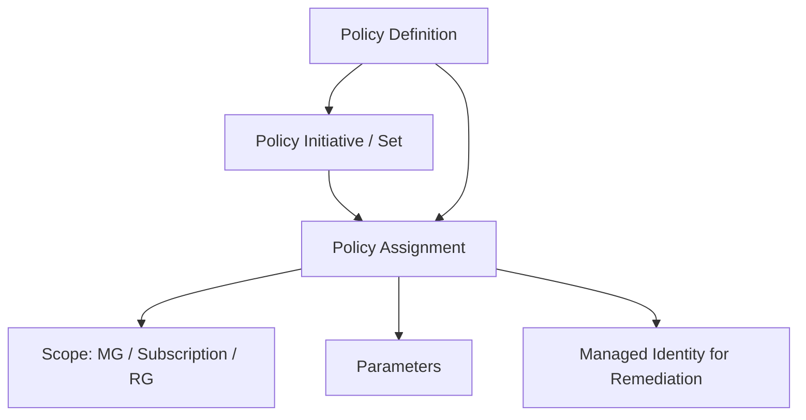

# How to Implement Azure Policy as Code Using Terraform azurerm_policy_definition

Author: [nawazdhandala](https://www.github.com/nawazdhandala)

Tags: Terraform, Azure Policy, Governance, Compliance, Infrastructure as Code, Azure, Security

Description: Implement Azure Policy as Code using Terraform to define, assign, and enforce governance rules across your Azure environment programmatically.

---

Azure Policy is the backbone of governance in Azure. It lets you define rules that resources must follow - things like requiring specific tags, restricting allowed VM sizes, enforcing encryption, or mandating network configurations. Managing these policies through the portal works for a handful of rules, but it breaks down quickly at scale. You end up with undocumented policies, inconsistent assignments, and no way to track changes.

Policy as Code solves this by managing your Azure policies in Terraform alongside the rest of your infrastructure. Every policy definition, initiative, assignment, and exemption is version controlled, peer reviewed, and deployed through your CI/CD pipeline.

## How Azure Policy Works

Before diving into the Terraform code, here is how the Azure Policy system is structured:



A **policy definition** is the rule itself - what to check and what action to take. An **initiative** (also called a policy set) groups multiple definitions together. An **assignment** applies a definition or initiative to a scope (management group, subscription, or resource group).

## Creating a Custom Policy Definition

Let me start with a practical example - a policy that requires all resources to have specific tags. This is by far the most common custom policy I see in production environments.

```hcl
# policies/require-tags/main.tf - Policy that enforces required tags on resources

# Define a custom policy that checks for required tags
resource "azurerm_policy_definition" "require_tags" {
  name         = "require-mandatory-tags"
  display_name = "Require mandatory tags on all resources"
  description  = "Enforces that resources have the required tags: Environment, CostCenter, and Owner"
  policy_type  = "Custom"
  mode         = "Indexed"  # Applies to resources that support tags and location

  # Policy metadata for categorization in the Azure portal
  metadata = jsonencode({
    version  = "1.0.0"
    category = "Tags"
  })

  # Parameters allow reuse of the policy with different tag requirements
  parameters = jsonencode({
    tagName1 = {
      type = "String"
      metadata = {
        displayName = "First required tag name"
        description = "Name of the first tag that must exist"
      }
      defaultValue = "Environment"
    }
    tagName2 = {
      type = "String"
      metadata = {
        displayName = "Second required tag name"
      }
      defaultValue = "CostCenter"
    }
    tagName3 = {
      type = "String"
      metadata = {
        displayName = "Third required tag name"
      }
      defaultValue = "Owner"
    }
  })

  # The policy rule - check that all three tags exist
  policy_rule = jsonencode({
    if = {
      anyOf = [
        {
          field = "[concat('tags[', parameters('tagName1'), ']')]"
          exists = "false"
        },
        {
          field = "[concat('tags[', parameters('tagName2'), ']')]"
          exists = "false"
        },
        {
          field = "[concat('tags[', parameters('tagName3'), ']')]"
          exists = "false"
        }
      ]
    }
    then = {
      effect = "deny"  # Block resource creation if tags are missing
    }
  })
}
```

The `mode` parameter is important. "Indexed" applies to resources that support tags and location (most Azure resources). "All" applies to everything including resource types that do not support tags.

## Creating a Policy Initiative

Group related policies into an initiative for easier management:

```hcl
# policies/governance-initiative/main.tf - Group policies into an initiative

# Custom policy: restrict allowed locations
resource "azurerm_policy_definition" "allowed_locations" {
  name         = "restrict-resource-locations"
  display_name = "Restrict resource locations to approved regions"
  description  = "Only allow resource creation in specific Azure regions"
  policy_type  = "Custom"
  mode         = "Indexed"

  metadata = jsonencode({
    version  = "1.0.0"
    category = "General"
  })

  parameters = jsonencode({
    allowedLocations = {
      type = "Array"
      metadata = {
        displayName = "Allowed locations"
        description = "List of Azure regions where resources can be created"
        strongType  = "location"
      }
    }
  })

  policy_rule = jsonencode({
    if = {
      not = {
        field = "location"
        in    = "[parameters('allowedLocations')]"
      }
    }
    then = {
      effect = "deny"
    }
  })
}

# Custom policy: require TLS 1.2 on storage accounts
resource "azurerm_policy_definition" "storage_tls" {
  name         = "require-storage-tls12"
  display_name = "Require TLS 1.2 for storage accounts"
  description  = "Storage accounts must use TLS 1.2 or higher"
  policy_type  = "Custom"
  mode         = "Indexed"

  metadata = jsonencode({
    version  = "1.0.0"
    category = "Storage"
  })

  policy_rule = jsonencode({
    if = {
      allOf = [
        {
          field  = "type"
          equals = "Microsoft.Storage/storageAccounts"
        },
        {
          field   = "Microsoft.Storage/storageAccounts/minimumTlsVersion"
          notEquals = "TLS1_2"
        }
      ]
    }
    then = {
      effect = "deny"
    }
  })
}

# Combine policies into an initiative
resource "azurerm_policy_set_definition" "governance" {
  name         = "governance-baseline"
  display_name = "Governance Baseline Initiative"
  description  = "Core governance policies for all subscriptions"
  policy_type  = "Custom"

  metadata = jsonencode({
    version  = "1.0.0"
    category = "Governance"
  })

  # Parameters at the initiative level
  parameters = jsonencode({
    allowedLocations = {
      type = "Array"
      metadata = {
        displayName = "Allowed locations"
        strongType  = "location"
      }
      defaultValue = ["eastus2", "westus2", "centralus"]
    }
    requiredTag1 = {
      type         = "String"
      defaultValue = "Environment"
    }
    requiredTag2 = {
      type         = "String"
      defaultValue = "CostCenter"
    }
    requiredTag3 = {
      type         = "String"
      defaultValue = "Owner"
    }
  })

  # Reference each policy in the initiative
  policy_definition_reference {
    policy_definition_id = azurerm_policy_definition.require_tags.id
    parameter_values = jsonencode({
      tagName1 = { value = "[parameters('requiredTag1')]" }
      tagName2 = { value = "[parameters('requiredTag2')]" }
      tagName3 = { value = "[parameters('requiredTag3')]" }
    })
    reference_id = "RequireMandatoryTags"
  }

  policy_definition_reference {
    policy_definition_id = azurerm_policy_definition.allowed_locations.id
    parameter_values = jsonencode({
      allowedLocations = { value = "[parameters('allowedLocations')]" }
    })
    reference_id = "RestrictLocations"
  }

  policy_definition_reference {
    policy_definition_id = azurerm_policy_definition.storage_tls.id
    reference_id         = "RequireStorageTLS12"
  }
}
```

## Assigning the Policy

Policies do nothing until they are assigned to a scope. Here is how to assign the initiative to a management group:

```hcl
# policies/assignments/main.tf - Assign the governance initiative

data "azurerm_management_group" "production" {
  name = "mg-production"
}

# Assign the governance initiative to the production management group
resource "azurerm_management_group_policy_assignment" "governance" {
  name                 = "governance-baseline"
  display_name         = "Governance Baseline"
  description          = "Core governance policies applied to all production subscriptions"
  policy_definition_id = azurerm_policy_set_definition.governance.id
  management_group_id  = data.azurerm_management_group.production.id

  # Pass parameter values specific to this assignment
  parameters = jsonencode({
    allowedLocations = {
      value = ["eastus2", "westus2"]  # More restrictive for production
    }
    requiredTag1 = { value = "Environment" }
    requiredTag2 = { value = "CostCenter" }
    requiredTag3 = { value = "Owner" }
  })

  # Non-compliance messages shown to users when blocked
  non_compliance_message {
    content                        = "This resource does not comply with the governance baseline. Ensure required tags are present and the resource is in an allowed region."
    policy_definition_reference_id = "RequireMandatoryTags"
  }

  non_compliance_message {
    content                        = "Resources can only be created in approved Azure regions (eastus2, westus2)."
    policy_definition_reference_id = "RestrictLocations"
  }
}
```

## Policies with Remediation

Some policies do not just deny but can actively fix non-compliant resources. These use the `deployIfNotExists` or `modify` effects and require a managed identity:

```hcl
# Policy that adds a tag if it is missing (modify effect)
resource "azurerm_policy_definition" "inherit_rg_tag" {
  name         = "inherit-environment-tag-from-rg"
  display_name = "Inherit Environment tag from resource group"
  description  = "Adds the Environment tag from the resource group if missing on the resource"
  policy_type  = "Custom"
  mode         = "Indexed"

  metadata = jsonencode({
    version  = "1.0.0"
    category = "Tags"
  })

  policy_rule = jsonencode({
    if = {
      allOf = [
        {
          field  = "tags['Environment']"
          exists = "false"
        },
        {
          # Only apply if the resource group has the tag
          value  = "[resourceGroup().tags['Environment']]"
          notEquals = ""
        }
      ]
    }
    then = {
      effect = "modify"
      details = {
        roleDefinitionIds = [
          "/providers/Microsoft.Authorization/roleDefinitions/b24988ac-6180-42a0-ab88-20f7382dd24c"  # Contributor
        ]
        operations = [
          {
            operation = "addOrReplace"
            field     = "tags['Environment']"
            value     = "[resourceGroup().tags['Environment']]"
          }
        ]
      }
    }
  })
}

# Assign with managed identity for remediation
resource "azurerm_subscription_policy_assignment" "inherit_tag" {
  name                 = "inherit-env-tag"
  display_name         = "Inherit Environment Tag"
  policy_definition_id = azurerm_policy_definition.inherit_rg_tag.id
  subscription_id      = data.azurerm_subscription.current.id

  # Managed identity is required for modify/deployIfNotExists policies
  identity {
    type = "SystemAssigned"
  }

  location = "eastus2"  # Required when identity is specified
}

# Grant the managed identity the Contributor role for remediation
resource "azurerm_role_assignment" "policy_remediation" {
  scope                = data.azurerm_subscription.current.id
  role_definition_name = "Contributor"
  principal_id         = azurerm_subscription_policy_assignment.inherit_tag.identity[0].principal_id
}

# Create a remediation task for existing non-compliant resources
resource "azurerm_subscription_policy_remediation" "inherit_tag" {
  name                 = "remediate-inherit-env-tag"
  subscription_id      = data.azurerm_subscription.current.id
  policy_assignment_id = azurerm_subscription_policy_assignment.inherit_tag.id
}
```

## Testing Policies Before Assignment

Always test policies before assigning them with a deny effect. Use audit mode first:

```hcl
# Assign in audit mode first to see what would be affected
resource "azurerm_subscription_policy_assignment" "test" {
  name                 = "test-require-tags"
  display_name         = "[TEST] Require Tags - Audit Only"
  policy_definition_id = azurerm_policy_definition.require_tags.id
  subscription_id      = data.azurerm_subscription.current.id

  # Override the effect to audit instead of deny
  parameters = jsonencode({
    tagName1 = { value = "Environment" }
    tagName2 = { value = "CostCenter" }
    tagName3 = { value = "Owner" }
  })
}
```

After verifying the compliance results look correct, switch to deny mode for enforcement.

## Organizing Policies in Your Repository

For a large organization with many policies, structure matters:

```
policies/
  definitions/
    tags/
      require-mandatory-tags.tf
      inherit-rg-tags.tf
    networking/
      require-nsg-on-subnets.tf
      deny-public-ip.tf
    storage/
      require-tls12.tf
      require-encryption.tf
  initiatives/
    governance-baseline.tf
    security-baseline.tf
  assignments/
    management-groups/
      production.tf
      development.tf
    subscriptions/
      shared-services.tf
```

This keeps things discoverable. When someone asks "what policy prevents public IPs?", you know exactly where to look.

## Wrapping Up

Azure Policy as Code with Terraform gives you auditable, version-controlled governance across your entire Azure environment. Start with audit mode to understand your compliance posture, then switch to deny for enforcement. Use initiatives to group related policies, and always include meaningful non-compliance messages so that users understand why their deployment was blocked and what to fix. The investment in building a policy-as-code practice pays off quickly as your Azure footprint grows.
