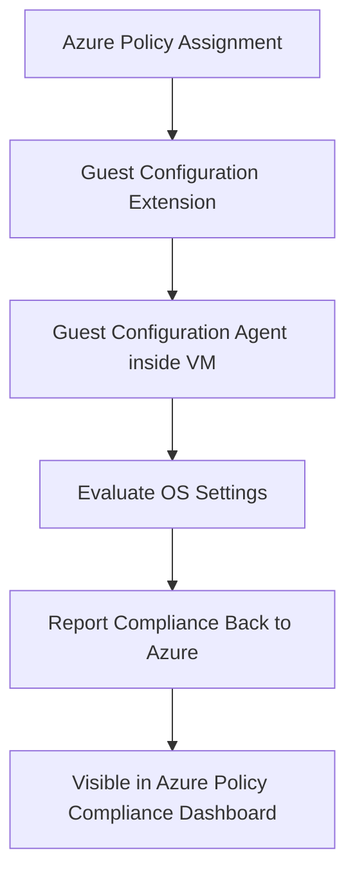

# How to Implement Azure Policy Guest Configuration to Audit Settings Inside Virtual Machines

Author: [nawazdhandala](https://www.github.com/nawazdhandala)

Tags: Azure, Azure Policy, Guest Configuration, Virtual Machines, Compliance Auditing, Security Baselines, Configuration Management

Description: A practical guide to using Azure Policy Guest Configuration to audit and enforce operating system settings inside Azure virtual machines for compliance.

---

Azure Policy is great at governing what resources exist in your Azure environment, but standard policies can only see the Azure control plane - things like resource properties, tags, locations, and SKUs. They cannot see what is happening inside a virtual machine. Is the firewall enabled? Are password policies correctly configured? Is TLS 1.0 disabled? That is where Guest Configuration comes in. It extends Azure Policy's reach inside the VM, letting you audit (and in some cases enforce) operating system-level settings.

In this guide, I will walk through how Guest Configuration works, how to set it up, and how to create custom policies that check for the specific settings your organization cares about.

## How Guest Configuration Works

Guest Configuration uses a combination of Azure Policy and an in-guest agent to evaluate settings inside VMs. Here is the high-level flow:



The Guest Configuration agent runs inside the VM and periodically evaluates the machine against the assigned configuration. It reports the results back to Azure, where they show up in the policy compliance dashboard just like any other policy result.

The agent is part of the Azure Connected Machine agent (for Arc-enabled servers) or the Guest Configuration VM extension (for Azure VMs). When you assign a Guest Configuration policy, Azure automatically deploys the extension if it is not already present - this is handled by prerequisite policies that you need to have in place.

## Prerequisites

Before you can use Guest Configuration, make sure these are in place:

1. **System-assigned managed identity** on the VM. Guest Configuration requires this to authenticate with Azure.
2. **Guest Configuration extension** installed on the VM. The built-in prerequisite policies can deploy this automatically.
3. **Network connectivity** for the agent to communicate with Azure. The VM needs outbound HTTPS access to specific Azure endpoints.

Let us deploy the prerequisite policies first. These policies ensure that every VM gets the Guest Configuration extension and a managed identity.

This assigns the built-in prerequisite policies at the subscription level:

```bash
# Assign the prerequisite policy that deploys the Guest Configuration extension
# This handles both Windows and Linux VMs
az policy assignment create \
  --name "deploy-gc-extension-windows" \
  --display-name "Deploy Guest Configuration extension on Windows VMs" \
  --policy "/providers/Microsoft.Authorization/policyDefinitions/385f5831-96d4-41db-9a3c-cd3af78aaae6" \
  --scope "/subscriptions/$(az account show --query id -o tsv)" \
  --mi-system-assigned \
  --location eastus

az policy assignment create \
  --name "deploy-gc-extension-linux" \
  --display-name "Deploy Guest Configuration extension on Linux VMs" \
  --policy "/providers/Microsoft.Authorization/policyDefinitions/331e8ea8-378a-410f-a2e5-ae22f38bb0da" \
  --scope "/subscriptions/$(az account show --query id -o tsv)" \
  --mi-system-assigned \
  --location eastus

# Assign the prerequisite policy that adds system-assigned managed identity
az policy assignment create \
  --name "add-system-identity-to-vms" \
  --display-name "Add system-assigned managed identity to VMs" \
  --policy "/providers/Microsoft.Authorization/policyDefinitions/3cf2ab00-13f1-4d0c-8971-2ac904541a7e" \
  --scope "/subscriptions/$(az account show --query id -o tsv)" \
  --mi-system-assigned \
  --location eastus
```

## Step 1: Assign Built-In Guest Configuration Policies

Azure provides a rich library of built-in Guest Configuration policies. These cover common compliance requirements like CIS benchmarks, password policies, installed software, and service configurations.

Let us look at what is available and assign a few useful ones. This command lists built-in Guest Configuration policy definitions:

```bash
# List available Guest Configuration policies
az policy definition list \
  --query "[?contains(policyType,'BuiltIn') && contains(metadata.category,'Guest Configuration')].{name:displayName, id:name}" \
  -o table | head -30
```

Here are some commonly used built-in policies:

- **Audit Windows VMs that do not have the password complexity setting enabled** - Checks Windows password policy.
- **Audit Linux VMs that have accounts without passwords** - Checks for insecure Linux accounts.
- **Audit Windows VMs on which Windows Defender Exploit Guard is not enabled** - Checks endpoint protection.
- **Audit Windows VMs that are not joined to the specified domain** - Checks domain membership.

Let us assign the password complexity policy as an example:

```bash
# Assign a built-in Guest Configuration policy to audit password complexity
az policy assignment create \
  --name "audit-windows-password-complexity" \
  --display-name "Audit Windows VMs without password complexity" \
  --policy "/providers/Microsoft.Authorization/policyDefinitions/bf16e0bb-31e1-4646-8202-60a235cc7e74" \
  --scope "/subscriptions/$(az account show --query id -o tsv)" \
  --enforcement-mode Default
```

## Step 2: Create a Custom Guest Configuration Package

The built-in policies cover many scenarios, but you will probably need custom checks too. Creating a custom Guest Configuration policy involves three steps: author the configuration, package it, and create a policy definition.

Guest Configuration uses PowerShell Desired State Configuration (DSC) for Windows and Chef InSpec for Linux. I will show the Windows DSC approach.

First, install the required PowerShell modules:

```powershell
# Install the Guest Configuration module for authoring custom packages
Install-Module -Name GuestConfiguration -Force
Install-Module -Name PSDesiredStateConfiguration -Force -AllowPrerelease
```

Now, create a DSC configuration that checks a specific setting. This example audits whether TLS 1.0 is disabled on Windows VMs:

```powershell
# Define a DSC configuration that checks if TLS 1.0 is disabled
# This is an audit-only configuration - it reports but does not change settings
Configuration AuditTLS10Disabled
{
    Import-DscResource -ModuleName PSDesiredStateConfiguration

    Node "localhost"
    {
        # Check the TLS 1.0 Server registry key
        Registry TLS10ServerDisabled
        {
            Ensure    = "Present"
            Key       = "HKLM:\SYSTEM\CurrentControlSet\Control\SecurityProviders\SCHANNEL\Protocols\TLS 1.0\Server"
            ValueName = "Enabled"
            ValueData = "0"
            ValueType = "Dword"
        }

        # Check the TLS 1.0 Client registry key
        Registry TLS10ClientDisabled
        {
            Ensure    = "Present"
            Key       = "HKLM:\SYSTEM\CurrentControlSet\Control\SecurityProviders\SCHANNEL\Protocols\TLS 1.0\Client"
            ValueName = "Enabled"
            ValueData = "0"
            ValueType = "Dword"
        }
    }
}

# Compile the configuration into a MOF file
AuditTLS10Disabled -OutputPath ./AuditTLS10Disabled
```

## Step 3: Package and Publish the Configuration

Next, package the compiled MOF into a Guest Configuration package and upload it to Azure storage.

This script creates the package and publishes it to a storage account:

```powershell
# Create the Guest Configuration package from the compiled MOF
# The Type parameter of "Audit" means this will only report - not remediate
New-GuestConfigurationPackage `
    -Name "AuditTLS10Disabled" `
    -Configuration "./AuditTLS10Disabled/localhost.mof" `
    -Type Audit `
    -Path "./package"

# Test the package locally before publishing (optional but recommended)
$testResult = Test-GuestConfigurationPackage `
    -Path "./package/AuditTLS10Disabled.zip"
Write-Output "Local test result: $($testResult.complianceStatus)"

# Publish the package to Azure storage
# This uploads the zip file and returns a SAS URI
$publishResult = Publish-GuestConfigurationPackage `
    -Path "./package/AuditTLS10Disabled.zip" `
    -ResourceGroupName "rg-guest-config" `
    -StorageAccountName "stguestconfigs"

# Save the content URI - you need this for the policy definition
$contentUri = $publishResult.ContentUri
Write-Output "Package published at: $contentUri"
```

## Step 4: Create the Policy Definition

Now create an Azure Policy definition that references your custom Guest Configuration package.

This creates a policy definition from the published package:

```powershell
# Generate the policy definition from the Guest Configuration package
# This creates the JSON files needed for the policy
New-GuestConfigurationPolicy `
    -ContentUri $contentUri `
    -DisplayName "Audit Windows VMs where TLS 1.0 is not disabled" `
    -Description "Checks that TLS 1.0 is disabled on Windows virtual machines" `
    -Path "./policy" `
    -Platform Windows `
    -Mode Audit `
    -Version "1.0.0"

# Publish the policy definition to Azure
Publish-GuestConfigurationPolicy -Path "./policy"
```

## Step 5: Assign the Custom Policy

Once the policy definition is published, assign it to your target scope just like any other Azure Policy.

```bash
# Find the custom policy definition
POLICY_ID=$(az policy definition list \
  --query "[?displayName=='Audit Windows VMs where TLS 1.0 is not disabled'].name" \
  -o tsv)

# Assign it to your subscription
az policy assignment create \
  --name "audit-tls10-disabled" \
  --display-name "Audit Windows VMs where TLS 1.0 is not disabled" \
  --policy "$POLICY_ID" \
  --scope "/subscriptions/$(az account show --query id -o tsv)" \
  --enforcement-mode Default
```

## Step 6: Check Compliance Results

After assigning the policy, give it some time for the Guest Configuration agent to run evaluations. The agent checks compliance every 15 minutes, but the initial evaluation on existing VMs might take up to 24 hours.

You can check compliance results in the Azure portal under Policy and then Compliance, or using the CLI:

```bash
# Check compliance state for the policy assignment
az policy state list \
  --policy-assignment "audit-tls10-disabled" \
  --query "[].{resource:resourceId, compliance:complianceState, timestamp:timestamp}" \
  -o table
```

For more detailed per-resource compliance information, including which specific checks passed or failed:

```bash
# Get detailed Guest Configuration assignment results for a specific VM
az vm guest-configuration assignment list \
  --resource-group rg-production \
  --vm-name vm-web-01 \
  --query "[].{name:name, complianceStatus:properties.complianceStatus, lastChecked:properties.latestReportId}" \
  -o table
```

## Audit vs. Apply and Monitor

Guest Configuration supports two modes:

- **Audit** - Reports on whether settings are compliant without making changes. This is the safer option and what I recommend starting with.
- **Apply and Monitor** - Actually changes non-compliant settings to make them compliant, then continues monitoring. This is powerful but carries risk since it modifies VM configurations.

For the Apply and Monitor mode, change the `Type` parameter to `ApplyAndMonitor` when creating the package and use the `DeployIfNotExists` effect in the policy instead of `AuditIfNotExists`.

## Troubleshooting

**Compliance shows "Not started"** - The Guest Configuration extension might not be installed. Check the prerequisite policies and run a remediation task.

**Extension installation fails** - Verify the VM has a system-assigned managed identity and outbound internet access to Azure endpoints.

**Results are stale** - The agent evaluates every 15 minutes. If you need immediate results, you can trigger a manual evaluation from the VM by restarting the Guest Configuration service.

**Custom configuration fails** - Test the package locally with `Test-GuestConfigurationPackage` before publishing. Most issues are in the DSC resource configuration.

## Wrapping Up

Azure Policy Guest Configuration bridges the gap between cloud-level governance and OS-level compliance. It gives you a single pane of glass to see whether your VMs are configured correctly, both in terms of their Azure resource properties and their internal operating system settings. Start with the built-in policies for quick wins, then build custom packages for your organization-specific requirements. The ability to detect configuration drift inside VMs through the same compliance framework that governs your entire Azure environment is a significant advantage for any team that needs to demonstrate compliance.
