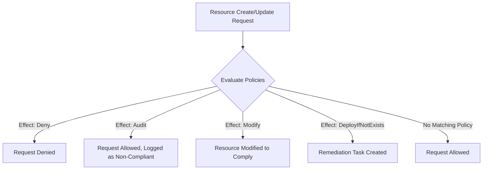

# How to Implement Azure Policy to Enforce Compliance Across All Subscriptions

Author: [nawazdhandala](https://www.github.com/nawazdhandala)

Tags: Azure, Azure Policy, Compliance, Governance, Security, Automation, Enterprise

Description: Implement Azure Policy to enforce compliance rules, security standards, and governance requirements across all your Azure subscriptions automatically.

---

Azure Policy is the enforcement engine for cloud governance. It evaluates your Azure resources against a set of rules and can deny non-compliant deployments, audit violations, or automatically remediate resources to bring them into compliance. If you manage more than a few subscriptions, Azure Policy is not optional - it is essential.

In this post, I will walk through implementing Azure Policy effectively, from built-in policies to custom definitions, initiative bundles, exemptions, and remediation.

## How Azure Policy Works

Every time a resource is created or modified in Azure, the Azure Resource Manager (ARM) checks it against all applicable policies before the operation completes. Depending on the policy effect, the operation might be denied, the resource might be audited as non-compliant, or the resource might be automatically modified to comply.

The evaluation flow looks like this:



## Starting with Built-in Policies

Azure has hundreds of built-in policies covering security, networking, storage, compute, and more. Start with these before writing custom policies.

Here are the most important built-in policies to enable:

```bash
# 1. Require tags on resource groups
az policy assignment create \
  --name "require-costcenter-rg" \
  --scope "/providers/Microsoft.Management/managementGroups/contoso-landing-zones" \
  --policy "/providers/Microsoft.Authorization/policyDefinitions/96670d01-0a4d-4649-9c89-2d3abc0a5025" \
  --params '{"tagName": {"value": "CostCenter"}}'

# 2. Allowed locations - restrict where resources can be deployed
az policy assignment create \
  --name "allowed-locations" \
  --scope "/providers/Microsoft.Management/managementGroups/contoso" \
  --policy "/providers/Microsoft.Authorization/policyDefinitions/e56962a6-4747-49cd-b67b-bf8b01975c4c" \
  --params '{"listOfAllowedLocations": {"value": ["eastus", "eastus2", "westus", "westeurope"]}}'

# 3. Require HTTPS for storage accounts
az policy assignment create \
  --name "require-https-storage" \
  --scope "/providers/Microsoft.Management/managementGroups/contoso" \
  --policy "/providers/Microsoft.Authorization/policyDefinitions/404c3081-a854-4457-ae30-26a93ef643f9"

# 4. Deny public network access for Key Vaults
az policy assignment create \
  --name "deny-public-keyvault" \
  --scope "/providers/Microsoft.Management/managementGroups/contoso-landing-zones" \
  --policy "/providers/Microsoft.Authorization/policyDefinitions/55615ac9-af46-4a59-874e-391cc3dfb490"

# 5. Require TLS 1.2 minimum for Azure SQL
az policy assignment create \
  --name "require-tls12-sql" \
  --scope "/providers/Microsoft.Management/managementGroups/contoso" \
  --policy "/providers/Microsoft.Authorization/policyDefinitions/32e6bbec-16b6-44c2-be37-c5b672d103cf"
```

## Policy Initiatives (Policy Sets)

Individual policies are useful, but managing dozens of them individually is tedious. Policy initiatives group related policies into a single assignment:

```bash
# Assign the Azure Security Benchmark initiative
# This includes hundreds of security-related policies
az policy assignment create \
  --name "azure-security-benchmark" \
  --scope "/providers/Microsoft.Management/managementGroups/contoso" \
  --policy-set-definition "/providers/Microsoft.Authorization/policySetDefinitions/1f3afdf9-d0c9-4c3d-847f-89da613e70a8" \
  --mi-system-assigned \
  --identity-scope "/providers/Microsoft.Management/managementGroups/contoso" \
  --location eastus
```

You can also create custom initiatives that bundle your organization's specific requirements:

```json
{
  "properties": {
    "displayName": "Contoso Core Governance",
    "description": "Core governance policies required for all Contoso subscriptions",
    "policyDefinitions": [
      {
        "policyDefinitionId": "/providers/Microsoft.Authorization/policyDefinitions/96670d01-0a4d-4649-9c89-2d3abc0a5025",
        "parameters": {
          "tagName": { "value": "CostCenter" }
        }
      },
      {
        "policyDefinitionId": "/providers/Microsoft.Authorization/policyDefinitions/96670d01-0a4d-4649-9c89-2d3abc0a5025",
        "parameters": {
          "tagName": { "value": "Owner" }
        }
      },
      {
        "policyDefinitionId": "/providers/Microsoft.Authorization/policyDefinitions/96670d01-0a4d-4649-9c89-2d3abc0a5025",
        "parameters": {
          "tagName": { "value": "Environment" }
        }
      },
      {
        "policyDefinitionId": "/providers/Microsoft.Authorization/policyDefinitions/e56962a6-4747-49cd-b67b-bf8b01975c4c",
        "parameters": {
          "listOfAllowedLocations": {
            "value": "[parameters('allowedLocations')]"
          }
        }
      }
    ],
    "parameters": {
      "allowedLocations": {
        "type": "Array",
        "metadata": {
          "displayName": "Allowed Locations",
          "description": "Azure regions where resources can be deployed"
        }
      }
    }
  }
}
```

## Writing Custom Policies

When built-in policies do not cover your specific requirements, write custom ones. Here is an example that enforces a naming convention:

```json
{
  "mode": "All",
  "displayName": "Require naming convention for resource groups",
  "description": "Resource groups must follow the pattern rg-{workload}-{environment}-{region}",
  "policyRule": {
    "if": {
      "allOf": [
        {
          "field": "type",
          "equals": "Microsoft.Resources/subscriptions/resourceGroups"
        },
        {
          "not": {
            "field": "name",
            "match": "rg-*-*-*"
          }
        }
      ]
    },
    "then": {
      "effect": "[parameters('effect')]"
    }
  },
  "parameters": {
    "effect": {
      "type": "String",
      "allowedValues": ["Audit", "Deny"],
      "defaultValue": "Audit",
      "metadata": {
        "displayName": "Effect",
        "description": "Audit or Deny non-compliant resource groups"
      }
    }
  }
}
```

Here is another custom policy that ensures all SQL databases have auditing enabled:

```json
{
  "mode": "All",
  "displayName": "Ensure SQL database auditing is enabled",
  "description": "Deploys SQL database auditing to a central storage account if not configured",
  "policyRule": {
    "if": {
      "field": "type",
      "equals": "Microsoft.Sql/servers/databases"
    },
    "then": {
      "effect": "DeployIfNotExists",
      "details": {
        "type": "Microsoft.Sql/servers/databases/auditingSettings",
        "name": "default",
        "existenceCondition": {
          "field": "Microsoft.Sql/servers/databases/auditingSettings/state",
          "equals": "Enabled"
        },
        "roleDefinitionIds": [
          "/providers/Microsoft.Authorization/roleDefinitions/056cd41c-7e88-42e1-933e-a3ba3b6e6caa"
        ],
        "deployment": {
          "properties": {
            "mode": "incremental",
            "template": {
              "$schema": "https://schema.management.azure.com/schemas/2019-04-01/deploymentTemplate.json#",
              "contentVersion": "1.0.0.0",
              "resources": [
                {
                  "type": "Microsoft.Sql/servers/databases/auditingSettings",
                  "apiVersion": "2021-11-01",
                  "name": "[concat(field('fullName'), '/default')]",
                  "properties": {
                    "state": "Enabled",
                    "storageEndpoint": "[parameters('storageEndpoint')]",
                    "storageAccountAccessKey": "[parameters('storageAccountKey')]",
                    "retentionDays": 90
                  }
                }
              ]
            }
          }
        }
      }
    }
  }
}
```

## Remediation Tasks

Policies with `DeployIfNotExists` or `Modify` effects can automatically fix non-compliant resources through remediation tasks:

```bash
# Create a remediation task for existing non-compliant resources
az policy remediation create \
  --name "remediate-sql-auditing" \
  --policy-assignment "ensure-sql-auditing" \
  --scope "/providers/Microsoft.Management/managementGroups/contoso-landing-zones" \
  --resource-discovery-mode ReEvaluateCompliance

# Check remediation progress
az policy remediation show \
  --name "remediate-sql-auditing" \
  --scope "/providers/Microsoft.Management/managementGroups/contoso-landing-zones" \
  --query "{status: provisioningState, succeeded: deploymentStatus.totalDeployments, failed: deploymentStatus.failedDeployments}"
```

## Policy Exemptions

Sometimes a specific resource legitimately needs an exemption from a policy. Use policy exemptions instead of removing the policy:

```bash
# Create a temporary exemption for a specific resource
az policy exemption create \
  --name "legacy-storage-exemption" \
  --scope "/subscriptions/{sub}/resourceGroups/{rg}/providers/Microsoft.Storage/storageAccounts/legacyaccount" \
  --policy-assignment "require-https-storage" \
  --exemption-category "Waiver" \
  --description "Legacy application requires HTTP. Migration planned for Q3 2026." \
  --expires-on "2026-09-30"
```

Exemptions should always have:
- A clear description explaining why the exemption is needed
- An expiration date
- An owner responsible for remediation

## Compliance Dashboard

Monitor compliance across all subscriptions:

```bash
# Get compliance summary for a management group
az policy state summarize \
  --management-group "contoso" \
  --query "{
    totalPolicies: results.policyAssignments | length(@),
    compliantResources: results.resourceDetails[?complianceState=='Compliant'] | length(@),
    nonCompliantResources: results.nonCompliantResources
  }"

# List non-compliant resources for a specific policy
az policy state list \
  --policy-assignment "require-costcenter-rg" \
  --filter "complianceState eq 'NonCompliant'" \
  --query "[].{resource: resourceId, policy: policyDefinitionName}" \
  --output table
```

## Rolling Out Policies Safely

Never deploy a Deny policy directly to production without testing:

1. **Start with Audit.** Deploy the policy in Audit mode to see what would be affected.
2. **Review the compliance report.** Check which existing resources are non-compliant.
3. **Remediate existing resources.** Fix or exempt non-compliant resources.
4. **Switch to Deny.** Once compliance is at an acceptable level, change the effect to Deny.
5. **Monitor for exemption requests.** Be responsive to teams that need legitimate exemptions.

```bash
# Step 1: Deploy in Audit mode
az policy assignment create \
  --name "naming-convention" \
  --scope "/providers/Microsoft.Management/managementGroups/contoso-landing-zones" \
  --policy "custom-naming-convention" \
  --params '{"effect": {"value": "Audit"}}'

# Step 2: Check compliance after a few days
az policy state summarize \
  --management-group "contoso-landing-zones" \
  --policy-assignment "naming-convention"

# Step 3: After fixing non-compliant resources, switch to Deny
az policy assignment update \
  --name "naming-convention" \
  --scope "/providers/Microsoft.Management/managementGroups/contoso-landing-zones" \
  --params '{"effect": {"value": "Deny"}}'
```

## Summary

Azure Policy is the backbone of governance at scale. Start with built-in policies for common requirements like tagging, location restrictions, and security baselines. Group policies into initiatives for easier management. Write custom policies when built-in ones do not cover your needs. Always roll out new policies in Audit mode first, remediate existing resources, and then switch to Deny. Use exemptions for legitimate exceptions and set expiration dates so they do not become permanent workarounds. The goal is a compliance-by-default environment where teams cannot accidentally create non-compliant resources.
