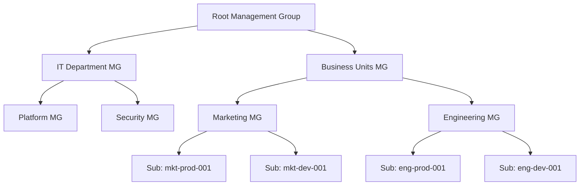

# How to Implement Azure RBAC Permissions Boundaries Using Management Group Hierarchy

Author: [nawazdhandala](https://www.github.com/nawazdhandala)

Tags: Azure, RBAC, Management Groups, Permissions Boundaries, Access Control, Governance, Azure Policy

Description: Learn how to use Azure management group hierarchy to create effective permissions boundaries that limit the scope of role assignments across your organization.

---

As your Azure environment grows, controlling who can do what and where becomes increasingly complex. A team lead who needs Contributor access to their project's resources should not accidentally end up with access to the finance team's subscriptions. Management groups give you a hierarchical structure to organize subscriptions, and when combined with RBAC role assignments at different levels of that hierarchy, they create natural permissions boundaries that keep access scoped appropriately.

In this post, I will explain how to design a management group hierarchy that supports clean permissions boundaries, how to assign roles at the right level, and how to use deny assignments and Azure Policy to enforce guardrails.

## Understanding Management Group Hierarchy and RBAC Inheritance

Azure RBAC follows an inheritance model. Role assignments at a higher scope automatically apply to all child scopes. This means a role assignment at a management group flows down to all subscriptions, resource groups, and resources underneath it.



If you assign the Contributor role to a user at the "Engineering MG" level, that user gets Contributor access to both `eng-prod-001` and `eng-dev-001` subscriptions and everything in them. They do not get any access to Marketing subscriptions. The management group boundary naturally limits their permissions scope.

This is the core concept: the management group hierarchy defines the permissions boundaries.

## Step 1: Design Your Management Group Structure

The management group structure should reflect your organizational boundaries for access control. Here are two common patterns:

**Pattern 1: Business Unit Isolation** - Each business unit gets its own management group branch. Teams within a business unit can have broad access within their branch but no access outside it.

**Pattern 2: Environment Isolation** - Production and non-production environments are separated at the management group level. Different access policies apply to each environment.

Most organizations use a hybrid approach. Here is a practical structure that I have seen work well:

```bash
# Create the management group hierarchy
# Top-level groups under the root
az account management-group create \
  --name "mg-platform" \
  --display-name "Platform Services"

az account management-group create \
  --name "mg-workloads" \
  --display-name "Workloads"

az account management-group create \
  --name "mg-sandbox" \
  --display-name "Sandbox"

# Under Platform - shared services that support all workloads
az account management-group create \
  --name "mg-identity" \
  --display-name "Identity" \
  --parent "mg-platform"

az account management-group create \
  --name "mg-connectivity" \
  --display-name "Connectivity" \
  --parent "mg-platform"

az account management-group create \
  --name "mg-management" \
  --display-name "Management" \
  --parent "mg-platform"

# Under Workloads - separated by business unit
az account management-group create \
  --name "mg-engineering" \
  --display-name "Engineering" \
  --parent "mg-workloads"

az account management-group create \
  --name "mg-marketing" \
  --display-name "Marketing" \
  --parent "mg-workloads"

# Under each business unit - separated by environment
az account management-group create \
  --name "mg-eng-prod" \
  --display-name "Engineering Production" \
  --parent "mg-engineering"

az account management-group create \
  --name "mg-eng-nonprod" \
  --display-name "Engineering Non-Production" \
  --parent "mg-engineering"
```

## Step 2: Move Subscriptions into the Hierarchy

Place each subscription under the appropriate management group.

```bash
# Move subscriptions to their management groups
# Engineering production subscriptions
az account management-group subscription add \
  --name "mg-eng-prod" \
  --subscription "eng-prod-001"

az account management-group subscription add \
  --name "mg-eng-prod" \
  --subscription "eng-prod-002"

# Engineering non-production subscriptions
az account management-group subscription add \
  --name "mg-eng-nonprod" \
  --subscription "eng-dev-001"

az account management-group subscription add \
  --name "mg-eng-nonprod" \
  --subscription "eng-staging-001"

# Marketing subscriptions
az account management-group subscription add \
  --name "mg-marketing" \
  --subscription "mkt-prod-001"
```

## Step 3: Assign Roles at the Correct Scope

The key to effective permissions boundaries is assigning roles at the lowest appropriate scope. Here are the guidelines I follow:

**Platform team** - Gets access at the `mg-platform` level because they manage shared infrastructure across the organization.

**Business unit leads** - Get Reader access at the `mg-workloads` level (for visibility) and Contributor at their specific business unit management group.

**Development teams** - Get Contributor at the non-production management group under their business unit, and Reader at the production management group.

**Security team** - Gets Security Reader at the root management group for organization-wide visibility.

This script sets up the role assignments following these principles:

```bash
# Platform team - manages identity, networking, and shared services
az role assignment create \
  --assignee-object-id "<platform-team-group-id>" \
  --assignee-principal-type Group \
  --role "Contributor" \
  --scope "/providers/Microsoft.Management/managementGroups/mg-platform"

# Engineering leads - full access within engineering, read elsewhere
az role assignment create \
  --assignee-object-id "<eng-leads-group-id>" \
  --assignee-principal-type Group \
  --role "Contributor" \
  --scope "/providers/Microsoft.Management/managementGroups/mg-engineering"

# Engineering developers - full access in non-prod, read in prod
az role assignment create \
  --assignee-object-id "<eng-devs-group-id>" \
  --assignee-principal-type Group \
  --role "Contributor" \
  --scope "/providers/Microsoft.Management/managementGroups/mg-eng-nonprod"

az role assignment create \
  --assignee-object-id "<eng-devs-group-id>" \
  --assignee-principal-type Group \
  --role "Reader" \
  --scope "/providers/Microsoft.Management/managementGroups/mg-eng-prod"

# Security team - read access across everything
az role assignment create \
  --assignee-object-id "<security-team-group-id>" \
  --assignee-principal-type Group \
  --role "Security Reader" \
  --scope "/providers/Microsoft.Management/managementGroups/<root-mg-id>"
```

## Step 4: Restrict Role Assignment Delegation

One common problem with permissions boundaries is that someone with Owner or User Access Administrator at a management group level can assign roles to others, potentially granting access beyond what was intended. You can limit this with role assignment conditions.

Role assignment conditions (preview) let you restrict what roles a user can assign and to whom. This creates a conditional role assignment that limits what roles the engineering lead can delegate:

```bash
# Assign User Access Administrator with conditions
# This limits the engineering lead to only assigning specific roles
az role assignment create \
  --assignee-object-id "<eng-lead-id>" \
  --assignee-principal-type User \
  --role "Role Based Access Control Administrator" \
  --scope "/providers/Microsoft.Management/managementGroups/mg-engineering" \
  --condition "((!(ActionMatches{'Microsoft.Authorization/roleAssignments/write'})) OR (@Request[Microsoft.Authorization/roleAssignments:RoleDefinitionId] ForAnyOfAnyValues:GuidEquals {acdd72a7-3385-48ef-bd42-f606fba81ae7, b24988ac-6180-42a0-ab88-20f7382dd24c}))" \
  --condition-version "2.0"
```

The condition above restricts the assignee to only granting the Reader (`acdd72a7...`) and Contributor (`b24988ac...`) roles. They cannot grant Owner or User Access Administrator, which prevents privilege escalation.

## Step 5: Apply Azure Policy Guardrails

Azure Policy at the management group level acts as an additional permissions boundary by preventing certain actions regardless of RBAC permissions. Even if someone has Contributor access, a deny policy can prevent them from doing specific things.

This applies policies at the production management group to prevent risky changes:

```bash
# Deny creation of public IP addresses in production
az policy assignment create \
  --name "deny-public-ips-prod" \
  --display-name "Deny Public IP Addresses in Production" \
  --policy "/providers/Microsoft.Authorization/policyDefinitions/6c112d4e-5bc7-47ae-a041-ea2d9dccd749" \
  --scope "/providers/Microsoft.Management/managementGroups/mg-eng-prod" \
  --enforcement-mode Default

# Require specific resource types only
az policy assignment create \
  --name "allowed-resource-types" \
  --display-name "Allowed Resource Types" \
  --policy "/providers/Microsoft.Authorization/policyDefinitions/a08ec900-254a-4555-9bf5-e42af04b5c5c" \
  --scope "/providers/Microsoft.Management/managementGroups/mg-eng-prod" \
  --enforcement-mode Default \
  --params '{"listOfResourceTypesAllowed":{"value":["Microsoft.Compute/virtualMachines","Microsoft.Storage/storageAccounts","Microsoft.Web/sites","Microsoft.Sql/servers"]}}'
```

## Step 6: Create Custom Role Definitions at the Right Scope

Sometimes the built-in roles are too broad. Custom roles let you define exactly what permissions a team needs. Create custom roles at the management group level so they are available across all subscriptions in that branch.

This creates a custom role for application developers that gives them enough access to manage their apps but not the underlying infrastructure:

```bash
# Create a custom role for application developers
az role definition create --role-definition '{
    "Name": "Application Developer",
    "Description": "Can manage web apps and related resources but not networking or VMs",
    "Actions": [
        "Microsoft.Web/sites/*",
        "Microsoft.Web/serverfarms/*",
        "Microsoft.Storage/storageAccounts/read",
        "Microsoft.Storage/storageAccounts/listKeys/action",
        "Microsoft.Insights/components/*",
        "Microsoft.Insights/alertRules/*",
        "Microsoft.Resources/deployments/*",
        "Microsoft.Resources/subscriptions/resourceGroups/read",
        "Microsoft.Support/*"
    ],
    "NotActions": [
        "Microsoft.Web/sites/config/snapshots/read"
    ],
    "AssignableScopes": [
        "/providers/Microsoft.Management/managementGroups/mg-engineering"
    ]
}'
```

## Step 7: Audit and Monitor Role Assignments

Regularly audit role assignments to make sure they still align with your permissions boundaries. This KQL query helps identify role assignments that might be too broad:

```kusto
// Find all role assignments at management group scope
// These have the broadest impact and should be reviewed carefully
AzureActivity
| where TimeGenerated > ago(30d)
| where OperationNameValue == "Microsoft.Authorization/roleAssignments/write"
| where ActivityStatusValue == "Success"
| extend Scope = tostring(parse_json(Properties).requestbody)
| project
    TimeGenerated,
    Caller,
    Scope,
    ResourceGroup,
    SubscriptionId
| order by TimeGenerated desc
```

You can also use Azure Resource Graph to get a snapshot of current assignments:

```bash
# List all role assignments at management group scope
az role assignment list \
  --scope "/providers/Microsoft.Management/managementGroups/mg-workloads" \
  --include-inherited \
  --query "[].{principal:principalName, role:roleDefinitionName, scope:scope}" \
  -o table
```

## Common Mistakes to Avoid

**Assigning roles at the root management group.** Every assignment here cascades to everything in your Azure environment. Only the absolute minimum should be assigned at root - typically just emergency access accounts and the security team's reader access.

**Not using groups for role assignments.** Always assign roles to Entra ID groups, not individual users. This makes it much easier to manage access as people join and leave teams.

**Ignoring the sandbox.** Developers need a place to experiment. Without a sandbox management group, they will push for broader permissions in the workload management groups. Give them a sandbox with Contributor access and relaxed policies.

**Forgetting about service principals.** Automated pipelines and service principals also need role assignments. Include them in your permissions boundary design.

## Wrapping Up

Management group hierarchy is the foundation of permissions boundaries in Azure. When designed correctly, it creates natural blast radius limits - a compromised credential or a misconfigured role assignment can only affect the branch of the hierarchy where the assignment exists. Combine the hierarchy with principled role assignments at the correct scope, conditional role delegation to prevent escalation, and Azure Policy guardrails to enforce additional constraints. The result is a governance model that scales with your organization while keeping access appropriately scoped.
