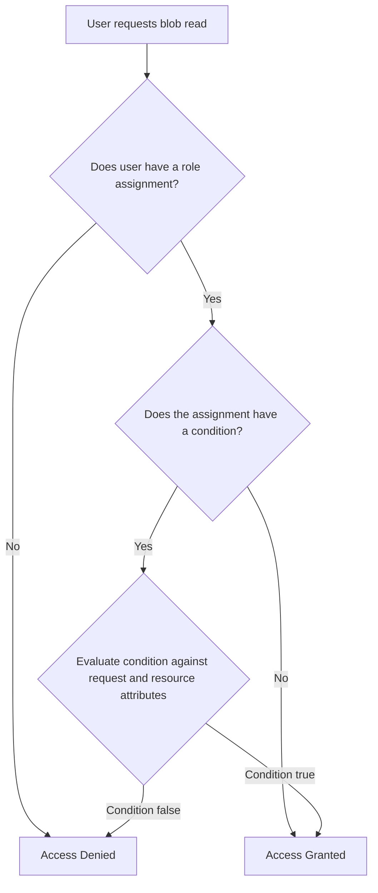

# How to Implement Azure RBAC with Attribute-Based Access Control (ABAC) Conditions for Storage

Author: [nawazdhandala](https://www.github.com/nawazdhandala)

Tags: Azure, RBAC, ABAC, Storage, Access Control, Security, Authorization

Description: Learn how to add attribute-based conditions to Azure RBAC role assignments for fine-grained storage access control based on blob metadata and tags.

---

Standard Azure RBAC lets you assign roles like Storage Blob Data Reader or Storage Blob Data Contributor to users or groups at a scope like a subscription, resource group, or storage account. But what if you need more granularity? What if you want a user to read only blobs that have a specific tag, or write only to containers that match a naming pattern? That is where Attribute-Based Access Control (ABAC) comes in.

ABAC adds conditions to role assignments. Instead of saying "this user can read all blobs in this storage account," you say "this user can read blobs in this storage account where the blob index tag 'department' equals 'finance'." This post covers how to set that up from start to finish.

## How ABAC Conditions Work in Azure

ABAC conditions are expressions attached to role assignments. They evaluate attributes of the resource, the request, the principal, or the environment to determine if the assignment applies. For Azure Storage, the most common attributes are:

- **Blob index tags:** Key-value pairs attached to blobs
- **Container name:** The name of the blob container
- **Blob path/prefix:** The virtual directory path of the blob
- **Encryption scope:** Which encryption scope the blob uses
- **Version ID:** For versioned blobs

When a user tries to perform an action, Azure evaluates both the role assignment AND the condition. If the condition evaluates to false, the action is denied even though the user has the role.

The feature currently works with these roles for Azure Blob Storage:

- Storage Blob Data Reader
- Storage Blob Data Contributor
- Storage Blob Data Owner

It also works with custom roles that include blob data actions.

## Prerequisites

Before implementing ABAC conditions, make sure you have:

- Azure subscription with at least one storage account using Azure Data Lake Storage Gen2 or Blob Storage
- Owner or User Access Administrator role at the scope where you are creating assignments
- Blob index tags enabled on your storage account (this is on by default for most account types)
- The users you are assigning roles to should authenticate using Azure AD (not shared keys or SAS tokens, which bypass RBAC entirely)

## Setting Up Blob Index Tags

Blob index tags are the most useful attribute for ABAC conditions. They let you tag blobs with arbitrary key-value pairs, and then your ABAC conditions can reference those tags.

First, upload some blobs with tags so you have data to work with:

```bash
# Upload a blob with index tags
# Tags are key-value pairs separated by '&'
az storage blob upload \
  --account-name mystorageaccount \
  --container-name documents \
  --name finance/report-q1.pdf \
  --file ./report-q1.pdf \
  --tags "department=finance&classification=internal" \
  --auth-mode login

# Upload another blob with different tags
az storage blob upload \
  --account-name mystorageaccount \
  --container-name documents \
  --name engineering/design-doc.pdf \
  --file ./design-doc.pdf \
  --tags "department=engineering&classification=confidential" \
  --auth-mode login

# Verify tags on a blob
az storage blob tag list \
  --account-name mystorageaccount \
  --container-name documents \
  --name finance/report-q1.pdf \
  --auth-mode login
```

## Creating a Role Assignment with an ABAC Condition

Now let us create a role assignment that grants a user the Storage Blob Data Reader role, but only for blobs tagged with `department=finance`.

In the Azure portal:

1. Go to the storage account
2. Click Access Control (IAM)
3. Click "Add role assignment"
4. Select "Storage Blob Data Reader"
5. On the Members tab, select the user or group
6. On the Conditions tab, click "Add condition"

The condition builder in the portal provides a visual editor. Here is what to configure:

- **Action:** Select "Read a blob" (this maps to `Microsoft.Storage/storageAccounts/blobServices/containers/blobs/read`)
- **Expression:** Build an expression:
  - Attribute source: Resource
  - Attribute: "Blob index tags [Values in key]"
  - Key: "department"
  - Operator: "StringEquals"
  - Value: "finance"

This creates a condition that allows the read action only when the blob has an index tag with key "department" and value "finance."

Here is the same thing using Azure CLI with the condition expressed in the Azure ABAC condition language:

```bash
# Create a role assignment with an ABAC condition
# This grants Storage Blob Data Reader only for blobs tagged department=finance
az role assignment create \
  --assignee "user@contoso.com" \
  --role "Storage Blob Data Reader" \
  --scope "/subscriptions/{sub-id}/resourceGroups/{rg}/providers/Microsoft.Storage/storageAccounts/mystorageaccount" \
  --condition "( \
    ( \
      !(ActionMatches{'Microsoft.Storage/storageAccounts/blobServices/containers/blobs/read'} \
        AND NOT SubOperationMatches{'Blob.List'}) \
    ) \
    OR \
    ( \
      @Resource[Microsoft.Storage/storageAccounts/blobServices/containers/blobs/tags:department<\$key_case_sensitive\$>] StringEquals 'finance' \
    ) \
  )" \
  --condition-version "2.0"
```

The condition syntax looks intimidating at first. Let me break it down:

- The outer structure is `!(ActionMatches) OR (attribute condition)`. This reads as: "Either this is not the action we are restricting, OR the attribute condition is met."
- `ActionMatches` specifies which actions the condition applies to
- `SubOperationMatches` with `Blob.List` excludes list operations (since listing does not check individual blob tags)
- The `@Resource` expression checks the blob's index tag

## Condition Syntax for Common Scenarios

Here are several condition patterns you will likely need:

**Restrict by container name:**

```
(
  !(ActionMatches{'Microsoft.Storage/storageAccounts/blobServices/containers/blobs/read'})
  OR
  (
    @Resource[Microsoft.Storage/storageAccounts/blobServices/containers:name]
    StringEquals 'approved-container'
  )
)
```

**Restrict by blob path prefix:**

```
(
  !(ActionMatches{'Microsoft.Storage/storageAccounts/blobServices/containers/blobs/read'})
  OR
  (
    @Resource[Microsoft.Storage/storageAccounts/blobServices/containers/blobs:path]
    StringStartsWith 'projects/alpha/'
  )
)
```

**Combine multiple conditions (AND logic):**

```
(
  !(ActionMatches{'Microsoft.Storage/storageAccounts/blobServices/containers/blobs/read'})
  OR
  (
    @Resource[Microsoft.Storage/storageAccounts/blobServices/containers/blobs/tags:department<$key_case_sensitive$>]
    StringEquals 'finance'
    AND
    @Resource[Microsoft.Storage/storageAccounts/blobServices/containers/blobs/tags:classification<$key_case_sensitive$>]
    StringNotEquals 'confidential'
  )
)
```

## Applying Conditions with Bicep

For infrastructure as code, here is how to define an ABAC-conditioned role assignment in Bicep:

```bicep
// Bicep template for RBAC assignment with ABAC condition
// Grants blob read access only for blobs tagged with department=finance

// Parameters
param principalId string
param storageAccountId string

// Role definition ID for Storage Blob Data Reader
var storageBlobDataReaderRoleId = '2a2b9908-6ea1-4ae2-8e65-a410df84e7d1'

resource roleAssignment 'Microsoft.Authorization/roleAssignments@2022-04-01' = {
  name: guid(storageAccountId, principalId, storageBlobDataReaderRoleId)
  properties: {
    roleDefinitionId: subscriptionResourceId(
      'Microsoft.Authorization/roleDefinitions',
      storageBlobDataReaderRoleId
    )
    principalId: principalId
    principalType: 'User'
    // ABAC condition restricting to department=finance tagged blobs
    condition: '((!(ActionMatches{\'Microsoft.Storage/storageAccounts/blobServices/containers/blobs/read\'} AND NOT SubOperationMatches{\'Blob.List\'})) OR (@Resource[Microsoft.Storage/storageAccounts/blobServices/containers/blobs/tags:department<$key_case_sensitive$>] StringEquals \'finance\'))'
    conditionVersion: '2.0'
  }
}
```

## Understanding the Authorization Flow

When a user tries to read a blob, here is what happens:



If a user has multiple role assignments, Azure evaluates all of them. Access is granted if ANY assignment (with its condition, if present) allows the action. This means you cannot use ABAC conditions to restrict access granted by another unconditioned assignment. If the user has Storage Blob Data Contributor without a condition at the same scope, they will have full access regardless of any conditioned Reader assignment.

## Testing Your Conditions

After creating the conditioned role assignment, test it by having the target user try to access blobs with matching and non-matching tags.

```bash
# Sign in as the test user
az login

# This should succeed - blob has department=finance tag
az storage blob download \
  --account-name mystorageaccount \
  --container-name documents \
  --name finance/report-q1.pdf \
  --file ./downloaded-report.pdf \
  --auth-mode login

# This should fail - blob has department=engineering tag
az storage blob download \
  --account-name mystorageaccount \
  --container-name documents \
  --name engineering/design-doc.pdf \
  --file ./downloaded-design.pdf \
  --auth-mode login
```

The failed request should return a 403 Forbidden error. Check the storage account's diagnostic logs for detailed authorization failure reasons.

## Important Limitations

Be aware of these limitations when planning your ABAC implementation:

- ABAC conditions only work with Azure AD authentication. Shared key and SAS token access bypasses RBAC entirely. Disable shared key access on storage accounts where you rely on ABAC.
- Blob index tags must be set when blobs are uploaded or updated afterward. If a blob has no tags, conditions that check tags will not match, effectively denying access.
- There is a limit on condition complexity - conditions can have up to 10 expressions combined.
- List operations have special handling. When a user lists blobs, individual tag-based filtering is not applied at the list level. The user might see blob names in a list but fail when trying to read them.

## Best Practices

- Disable shared key access on storage accounts where you use ABAC. Otherwise, anyone with the account key bypasses all your conditions.
- Standardize your tagging taxonomy. ABAC conditions are only as good as the tags on your blobs. Define and enforce a tagging policy.
- Use the portal's condition builder for initial setup and then export to CLI or Bicep for production deployment.
- Test conditions thoroughly with users who have only the conditioned assignment. Do not test with accounts that have Owner or Contributor roles, as those will bypass blob-level conditions.
- Document your conditions. The condition syntax is not intuitive, so keep a reference of what each conditioned assignment does and why.

## Summary

Azure ABAC conditions let you go beyond the coarse-grained scope model of traditional RBAC. By attaching conditions to role assignments that check blob index tags, container names, or path prefixes, you can implement fine-grained access control that matches your data classification scheme. The initial setup takes some effort, especially learning the condition syntax, but the result is a much more precise authorization model for your storage data.
