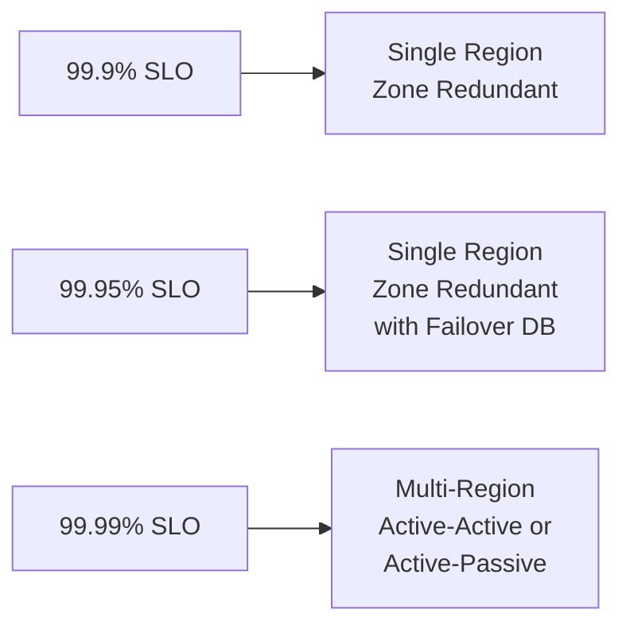

# How to Implement Azure Well-Architected Framework Reliability Best Practices

Author: [nawazdhandala](https://www.github.com/nawazdhandala)

Tags: Azure, Well-Architected Framework, Reliability, High Availability, Disaster Recovery, Resilience

Description: Implement Azure Well-Architected Framework reliability best practices with practical guidance on redundancy, fault tolerance, disaster recovery, and monitoring.

---

The Azure Well-Architected Framework is Microsoft's guide to building high-quality cloud workloads. The Reliability pillar focuses on ensuring your application continues to function when things go wrong - because in the cloud, things will go wrong. Disks fail, regions go down, services throttle, and networks partition.

This post translates the Reliability pillar's principles into concrete actions you can take in your Azure environment.

## The Core Reliability Principles

The Well-Architected Framework breaks reliability into several design principles:

1. **Design for business requirements** - Understand your availability targets and design accordingly
2. **Design for resilience** - Build the ability to recover from failures
3. **Design for recovery** - Plan for disaster recovery and data loss scenarios
4. **Design for operations** - Build observability and automation into everything
5. **Keep it simple** - Avoid unnecessary complexity that introduces new failure modes

Let us turn each of these into specific Azure implementations.

## Define Your Reliability Targets

Before building anything, define your targets. The two most important metrics are:

- **SLO (Service Level Objective)**: The availability target for your service (e.g., 99.95%)
- **RTO (Recovery Time Objective)**: Maximum acceptable downtime during a disaster
- **RPO (Recovery Point Objective)**: Maximum acceptable data loss measured in time

These targets drive every design decision. A system that needs 99.99% availability (52 minutes of downtime per year) requires a completely different architecture than one that accepts 99.9% (8.7 hours per year).



## Implement Availability Zones

Availability Zones are physically separate data centers within an Azure region. They protect against data center-level failures (power, cooling, networking).

Most Azure services support zone redundancy. Enable it for all production workloads.

### Zone-Redundant VMs

Instead of deploying all VMs in a single zone, spread them across zones.

```bash
# Create VMs in different availability zones behind a load balancer
az vm create \
  --resource-group prod-rg \
  --name web-vm-1 \
  --image Ubuntu2204 \
  --zone 1 \
  --size Standard_D2s_v3 \
  --vnet-name prod-vnet \
  --subnet web-subnet

az vm create \
  --resource-group prod-rg \
  --name web-vm-2 \
  --image Ubuntu2204 \
  --zone 2 \
  --size Standard_D2s_v3 \
  --vnet-name prod-vnet \
  --subnet web-subnet

# Use a Standard SKU load balancer (zone-redundant by default)
az network lb create \
  --resource-group prod-rg \
  --name web-lb \
  --sku Standard \
  --frontend-ip-name frontend \
  --backend-pool-name web-servers
```

### Zone-Redundant Storage

```bash
# Create a zone-redundant storage account (ZRS)
az storage account create \
  --resource-group prod-rg \
  --name prodstorageaccount \
  --location eastus \
  --sku Standard_ZRS \
  --kind StorageV2
```

ZRS replicates your data across three availability zones. For disaster recovery across regions, use GZRS (Geo-Zone-Redundant Storage).

### Zone-Redundant Database

```bash
# Create a zone-redundant Azure SQL Database
az sql db create \
  --resource-group prod-rg \
  --server my-sql-server \
  --name my-database \
  --service-objective P1 \
  --zone-redundant true
```

## Design for Transient Failures

Cloud services experience transient failures - temporary network issues, service throttling, brief unavailability during maintenance. Your application must handle these gracefully.

### Implement Retry with Exponential Backoff

```csharp
// Using Polly for retry policies in .NET
using Polly;
using Polly.Extensions.Http;

// Configure a retry policy for HTTP clients
var retryPolicy = HttpPolicyExtensions
    .HandleTransientHttpError()
    .WaitAndRetryAsync(
        retryCount: 3,
        sleepDurationProvider: attempt =>
            TimeSpan.FromSeconds(Math.Pow(2, attempt)), // 2, 4, 8 seconds
        onRetry: (response, timespan, retryCount, context) =>
        {
            // Log the retry for observability
            logger.LogWarning(
                "Retry {RetryCount} after {Delay}ms for {Url}",
                retryCount,
                timespan.TotalMilliseconds,
                response.Result?.RequestMessage?.RequestUri);
        });

// Configure a circuit breaker to prevent cascading failures
var circuitBreakerPolicy = HttpPolicyExtensions
    .HandleTransientHttpError()
    .CircuitBreakerAsync(
        handledEventsAllowedBeforeBreaking: 5,  // Open after 5 failures
        durationOfBreak: TimeSpan.FromSeconds(30) // Stay open for 30 seconds
    );

// Combine policies: retry first, then circuit breaker
builder.Services.AddHttpClient("MyApi")
    .AddPolicyHandler(retryPolicy)
    .AddPolicyHandler(circuitBreakerPolicy);
```

### Use Circuit Breakers

The circuit breaker pattern prevents your application from repeatedly calling a failing service. After a configurable number of failures, the circuit "opens" and requests fail immediately without waiting for a timeout.

This is critical for preventing cascading failures. If Service A calls Service B, and Service B is down, you do not want Service A's threads to be blocked waiting for Service B timeouts.

## Design for Multi-Region Disaster Recovery

For applications that need high availability across regional outages, implement a multi-region architecture.

### Active-Passive with Azure Front Door

```bash
# Create an Azure Front Door profile for global load balancing
az afd profile create \
  --resource-group prod-rg \
  --profile-name my-front-door \
  --sku Standard_AzureFrontDoor

# Add the primary region endpoint
az afd endpoint create \
  --resource-group prod-rg \
  --profile-name my-front-door \
  --endpoint-name myapp

# Create an origin group with health probing
az afd origin-group create \
  --resource-group prod-rg \
  --profile-name my-front-door \
  --origin-group-name backend-pool \
  --probe-request-type GET \
  --probe-protocol Https \
  --probe-path /health \
  --probe-interval-in-seconds 30

# Add primary region origin (priority 1)
az afd origin create \
  --resource-group prod-rg \
  --profile-name my-front-door \
  --origin-group-name backend-pool \
  --origin-name primary \
  --host-name myapp-eastus.azurewebsites.net \
  --priority 1 \
  --weight 1000

# Add secondary region origin (priority 2 - failover target)
az afd origin create \
  --resource-group prod-rg \
  --profile-name my-front-door \
  --origin-group-name backend-pool \
  --origin-name secondary \
  --host-name myapp-westus.azurewebsites.net \
  --priority 2 \
  --weight 1000
```

Azure Front Door automatically routes traffic to the primary region and fails over to the secondary if health probes fail.

### Database Replication

```bash
# Create a geo-replicated Azure SQL Database
az sql db replica create \
  --resource-group prod-rg \
  --server my-sql-server-eastus \
  --name my-database \
  --partner-server my-sql-server-westus \
  --partner-resource-group dr-rg
```

For PostgreSQL Flexible Server, use read replicas across regions.

## Implement Health Endpoints

Every service should expose a health endpoint that probes can check.

```csharp
// .NET health check that verifies all dependencies
builder.Services.AddHealthChecks()
    .AddSqlServer(
        connectionString: builder.Configuration.GetConnectionString("Default"),
        name: "sql-database",
        timeout: TimeSpan.FromSeconds(5))
    .AddRedis(
        redisConnectionString: builder.Configuration["Redis:ConnectionString"],
        name: "redis-cache",
        timeout: TimeSpan.FromSeconds(3))
    .AddUrlGroup(
        uri: new Uri("https://external-api.example.com/health"),
        name: "external-api",
        timeout: TimeSpan.FromSeconds(5));

// Map the health endpoint
app.MapHealthChecks("/health", new HealthCheckOptions
{
    // Return detailed status for internal monitoring
    ResponseWriter = UIResponseWriter.WriteHealthCheckUIResponse
});
```

Use the health endpoint as the target for:

- Azure Front Door health probes
- Load balancer health probes
- Kubernetes liveness and readiness probes
- Azure Monitor availability tests

## Backup and Recovery

Reliable systems have tested backup and recovery procedures.

### Automated Backups

Most Azure PaaS services include automated backups, but verify the configuration:

```bash
# Check Azure SQL backup retention
az sql db show \
  --resource-group prod-rg \
  --server my-sql-server \
  --name my-database \
  --query "backupStorageRedundancy" \
  --output tsv

# Configure long-term retention for SQL Database
az sql db ltr-policy set \
  --resource-group prod-rg \
  --server my-sql-server \
  --database my-database \
  --weekly-retention P4W \
  --monthly-retention P12M \
  --yearly-retention P5Y \
  --week-of-year 1
```

### Test Recovery Regularly

Backups are worthless if you have never tested restoring them. Schedule quarterly recovery drills.

```bash
# Practice restoring a database to verify backups work
az sql db restore \
  --resource-group dr-test-rg \
  --server dr-test-server \
  --name restored-db \
  --resource-group prod-rg \
  --server my-sql-server \
  --source-database my-database \
  --dest-name recovery-test-db \
  --time "2026-02-15T12:00:00Z"
```

## Observability

You cannot fix what you cannot see. Build observability into every component.

### Application-Level Monitoring

Use Application Insights for end-to-end distributed tracing:

```bash
# Enable Application Insights for an App Service
az monitor app-insights component create \
  --app my-app-insights \
  --location eastus \
  --resource-group prod-rg \
  --workspace "/subscriptions/<sub-id>/resourceGroups/prod-rg/providers/Microsoft.OperationalInsights/workspaces/prod-workspace"

az webapp config appsettings set \
  --resource-group prod-rg \
  --name my-web-app \
  --settings APPLICATIONINSIGHTS_CONNECTION_STRING="<connection-string>"
```

### Infrastructure Monitoring

Set up Azure Monitor with alerts for key reliability metrics:

- Response time degradation
- Error rate increase
- Resource utilization thresholds
- Health endpoint failures

### Dependency Mapping

Use Application Insights Application Map to visualize dependencies between services. This helps you identify single points of failure and understand the blast radius of component failures.

## Chaos Engineering

Once you have built resilience into your system, test it. Azure Chaos Studio lets you inject faults into your Azure resources to validate that your application handles failures correctly.

```bash
# Create a Chaos Studio experiment that stops a VM
# This tests whether your load balancer correctly routes traffic
# to remaining healthy instances
az chaos experiment create \
  --resource-group prod-rg \
  --name vm-stop-experiment \
  --location eastus \
  --identity-type SystemAssigned
```

Start small: test a single VM failure. Then progress to zone failures, dependency outages, and eventually full region failover.

## The Reliability Checklist

A quick checklist for Azure workload reliability:

- Availability zones enabled for all production resources
- Retry policies with exponential backoff for all external calls
- Circuit breakers to prevent cascading failures
- Health endpoints on every service
- Automated backups with tested recovery procedures
- Monitoring and alerting for all critical metrics
- Multi-region deployment for high-availability requirements
- Chaos engineering tests run regularly
- Runbooks documented for common failure scenarios
- RTO and RPO defined and validated through drills

Reliability is not a feature you add at the end. It is a property that emerges from consistent application of these practices throughout your architecture. Start with the highest-impact items - availability zones and retry policies - and build from there. Every improvement makes your system more resilient to the failures that will inevitably occur.
