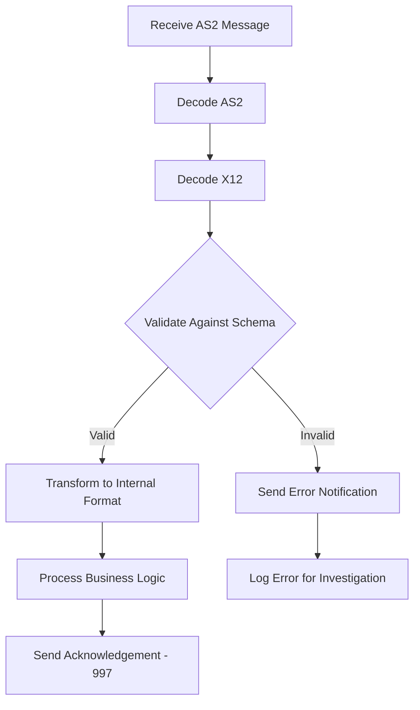

# How to Implement B2B EDI Processing with Azure Logic Apps

Author: [nawazdhandala](https://www.github.com/nawazdhandala)

Tags: Azure, Logic Apps, EDI, B2B Integration, AS2, X12, Enterprise Integration

Description: Set up end-to-end B2B EDI document processing with Azure Logic Apps using integration accounts, AS2, and X12 message handling.

---

Electronic Data Interchange (EDI) has been the backbone of B2B communication for decades. Purchase orders, invoices, shipping notices, and inventory updates flow between trading partners as structured EDI documents. Azure Logic Apps with Integration Accounts gives you a fully managed platform for receiving, validating, transforming, and sending EDI messages without running your own EDI translation software.

## What You Need

B2B EDI processing in Azure requires several components:

- **Integration Account**: A container for your B2B artifacts (schemas, maps, agreements, partners, certificates)
- **Logic App**: The workflow that orchestrates the EDI message flow
- **Trading Partner agreements**: AS2 agreements for transport and X12/EDIFACT agreements for message format
- **Schemas**: XSD schemas that define the structure of your EDI messages
- **Maps**: XSLT transforms for converting between EDI and your internal formats

## Setting Up the Integration Account

The integration account holds all your B2B artifacts. You need at least a Standard tier for production EDI processing.

```bash
# Create an integration account
az resource create \
  --resource-group rg-b2b \
  --resource-type "Microsoft.Logic/integrationAccounts" \
  --name ia-b2b-production \
  --location eastus2 \
  --properties '{
    "sku": { "name": "Standard" }
  }'
```

Link the integration account to your Logic App.

```bash
# Link integration account to Logic App
az logicapp config appsettings set \
  --name logic-edi-processor \
  --resource-group rg-b2b \
  --settings "WORKFLOWS_INTEGRATION_ACCOUNT_ID=/subscriptions/{sub-id}/resourceGroups/rg-b2b/providers/Microsoft.Logic/integrationAccounts/ia-b2b-production"
```

## Defining Trading Partners

A trading partner represents a business entity you exchange EDI documents with. Each partner has an identity (typically a business qualifier and value) and may have certificates for signing and encryption.

```bash
# Create your organization as a partner
az rest --method PUT \
  --uri "https://management.azure.com/subscriptions/{sub-id}/resourceGroups/rg-b2b/providers/Microsoft.Logic/integrationAccounts/ia-b2b-production/partners/MyCompany?api-version=2019-05-01" \
  --body '{
    "properties": {
      "partnerType": "B2B",
      "content": {
        "b2b": {
          "businessIdentities": [
            {
              "qualifier": "ZZ",
              "value": "MYCOMPANY"
            }
          ]
        }
      }
    },
    "location": "eastus2"
  }'

# Create a trading partner
az rest --method PUT \
  --uri "https://management.azure.com/subscriptions/{sub-id}/resourceGroups/rg-b2b/providers/Microsoft.Logic/integrationAccounts/ia-b2b-production/partners/SupplierCorp?api-version=2019-05-01" \
  --body '{
    "properties": {
      "partnerType": "B2B",
      "content": {
        "b2b": {
          "businessIdentities": [
            {
              "qualifier": "ZZ",
              "value": "SUPPLIERCORP"
            }
          ]
        }
      }
    },
    "location": "eastus2"
  }'
```

## Uploading EDI Schemas

X12 EDI messages have specific schemas. Upload the schemas for the transaction sets you will be processing.

```bash
# Upload an X12 850 Purchase Order schema
az rest --method PUT \
  --uri "https://management.azure.com/subscriptions/{sub-id}/resourceGroups/rg-b2b/providers/Microsoft.Logic/integrationAccounts/ia-b2b-production/schemas/X12_00401_850?api-version=2019-05-01" \
  --body '{
    "properties": {
      "schemaType": "Xml",
      "content": "... base64 encoded XSD schema ...",
      "contentType": "application/xml"
    },
    "location": "eastus2"
  }'
```

## Creating an X12 Agreement

An agreement defines the rules for exchanging EDI messages between two partners. It includes the message encoding settings, acknowledgment requirements, and schema mappings.

The agreement configuration is detailed, but here are the key sections.

```json
{
  "properties": {
    "agreementType": "X12",
    "hostPartner": "MyCompany",
    "guestPartner": "SupplierCorp",
    "hostIdentity": {
      "qualifier": "ZZ",
      "value": "MYCOMPANY"
    },
    "guestIdentity": {
      "qualifier": "ZZ",
      "value": "SUPPLIERCORP"
    },
    "content": {
      "x12": {
        "receiveAgreement": {
          "protocolSettings": {
            "validationSettings": {
              "validateCharacterSet": true,
              "checkDuplicateInterchangeControlNumber": true,
              "interchangeControlNumberValidityDays": 30,
              "checkDuplicateGroupControlNumber": true,
              "checkDuplicateTransactionSetControlNumber": true,
              "validateEDITypes": true,
              "validateXSDTypes": true
            },
            "envelopeSettings": {
              "controlStandardsId": 85,
              "useControlStandardsIdAsRepetitionCharacter": false,
              "senderApplicationId": "SUPPLIERCORP",
              "receiverApplicationId": "MYCOMPANY",
              "controlVersionNumber": "00401"
            },
            "acknowledgementSettings": {
              "needTechnicalAcknowledgement": true,
              "needFunctionalAcknowledgement": true
            }
          }
        },
        "sendAgreement": {
          "protocolSettings": {
            "envelopeSettings": {
              "controlStandardsId": 85,
              "senderApplicationId": "MYCOMPANY",
              "receiverApplicationId": "SUPPLIERCORP",
              "controlVersionNumber": "00401"
            }
          }
        }
      }
    }
  }
}
```

## The EDI Processing Workflow

Here is the typical flow for receiving an EDI document from a trading partner.



The workflow definition for receiving and processing an X12 850 Purchase Order.

```json
{
  "definition": {
    "actions": {
      "Decode_AS2_Message": {
        "type": "ApiConnection",
        "inputs": {
          "host": {
            "connection": {
              "name": "@parameters('$connections')['as2']['connectionId']"
            }
          },
          "method": "post",
          "path": "/decode",
          "body": "@triggerBody()"
        },
        "runAfter": {}
      },
      "Decode_X12_Message": {
        "type": "ApiConnection",
        "inputs": {
          "host": {
            "connection": {
              "name": "@parameters('$connections')['x12']['connectionId']"
            }
          },
          "method": "post",
          "path": "/decode",
          "body": "@body('Decode_AS2_Message')?['AS2Message']?['Content']"
        },
        "runAfter": {
          "Decode_AS2_Message": ["Succeeded"]
        }
      },
      "Process_Purchase_Order": {
        "type": "Http",
        "inputs": {
          "method": "POST",
          "uri": "@parameters('erpApiUrl')/purchase-orders",
          "headers": {
            "Content-Type": "application/json"
          },
          "body": "@body('Decode_X12_Message')?['goodMessages']"
        },
        "runAfter": {
          "Decode_X12_Message": ["Succeeded"]
        }
      },
      "Generate_997_Acknowledgement": {
        "type": "ApiConnection",
        "inputs": {
          "host": {
            "connection": {
              "name": "@parameters('$connections')['x12']['connectionId']"
            }
          },
          "method": "post",
          "path": "/encode",
          "body": {
            "x12AcknowledgementPayload": "@body('Decode_X12_Message')?['functionalAcknowledgement']"
          }
        },
        "runAfter": {
          "Process_Purchase_Order": ["Succeeded"]
        }
      }
    },
    "triggers": {
      "When_AS2_message_is_received": {
        "type": "Request",
        "kind": "Http",
        "inputs": {
          "method": "POST"
        }
      }
    }
  }
}
```

## Common EDI Transaction Sets

Here are the most frequently used X12 transaction sets you will likely process:

| Transaction Set | Description |
|----------------|-------------|
| 850 | Purchase Order |
| 855 | Purchase Order Acknowledgement |
| 856 | Advance Ship Notice |
| 810 | Invoice |
| 820 | Payment Order |
| 997 | Functional Acknowledgement |
| 834 | Benefit Enrollment |
| 837 | Health Care Claim |
| 270/271 | Eligibility Inquiry/Response |

## Monitoring B2B Messages

The integration account provides a tracking experience for B2B messages. You can see every interchange, group, and transaction set, along with their processing status, acknowledgements, and errors.

Enable diagnostic logging to send B2B tracking data to a Log Analytics workspace.

```bash
# Enable B2B tracking diagnostics
az monitor diagnostic-settings create \
  --name "b2b-tracking" \
  --resource "/subscriptions/{sub-id}/resourceGroups/rg-b2b/providers/Microsoft.Logic/integrationAccounts/ia-b2b-production" \
  --workspace "/subscriptions/{sub-id}/resourceGroups/rg-monitoring/providers/Microsoft.OperationalInsights/workspaces/law-prod" \
  --logs '[{"category": "IntegrationAccountTrackingEvents", "enabled": true}]'
```

## Error Handling for EDI

EDI processing has unique error scenarios. Schema validation failures, missing segments, invalid element values, and duplicate control numbers are all common. Your workflow needs to handle each case appropriately.

For validation errors, send a 997 acknowledgement with error details back to the trading partner so they can correct and resend.

For processing errors (your internal systems are down), hold the message and retry. Do not send a negative acknowledgement unless the message itself is bad.

## Security Considerations

EDI messages often contain sensitive business data. Encryption and signing are standard in AS2 transport.

- Use certificates for AS2 message signing (proves the sender's identity)
- Use certificates for AS2 message encryption (protects content in transit)
- Store certificates in Azure Key Vault and reference them from the integration account
- Enable MDN (Message Disposition Notification) for delivery confirmation

## Summary

B2B EDI processing with Azure Logic Apps replaces traditional on-premises EDI translation software with a fully managed cloud service. Set up an integration account with your trading partner definitions, schemas, and agreements. Build workflows that decode AS2 messages, validate and decode X12 transactions, transform to your internal format, and generate acknowledgements. The integration account's tracking capabilities give you the visibility you need to troubleshoot failed transactions and maintain healthy trading partner relationships.
