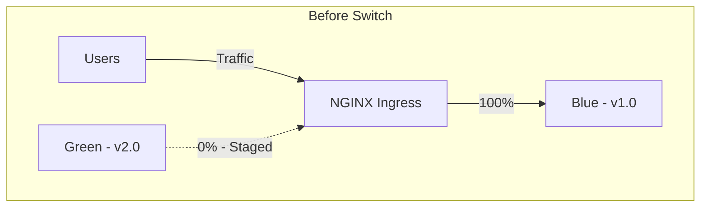
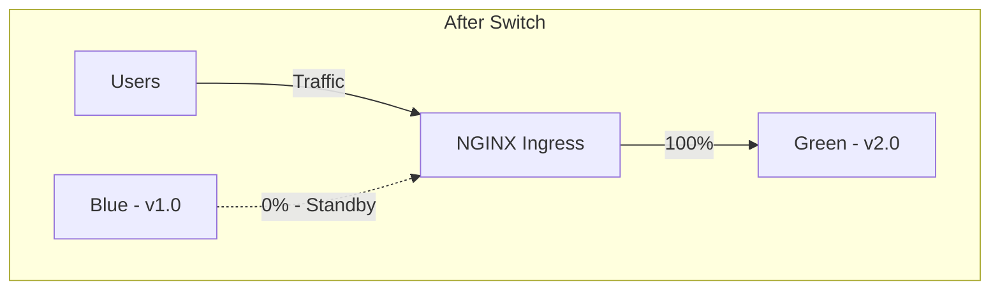

# How to Implement Blue-Green Deployments on AKS with NGINX Ingress Annotations

Author: [nawazdhandala](https://www.github.com/nawazdhandala)

Tags: AKS, Blue-Green Deployment, NGINX Ingress, Kubernetes, Deployment Strategy, Azure, DevOps

Description: How to implement blue-green deployments on AKS using NGINX Ingress Controller annotations for zero-downtime releases with instant rollback.

---

Rolling updates are the default Kubernetes deployment strategy, but they have a drawback: during the rollout, both old and new versions serve traffic simultaneously. If the new version has a bug, some users experience it while the rollback happens. Blue-green deployments solve this by running both versions side by side but only directing traffic to one at a time. The switch is instant, and rollback is just pointing traffic back to the previous version.

## How Blue-Green Deployments Work

In a blue-green deployment, you maintain two complete environments:

- **Blue**: The current production version serving all traffic.
- **Green**: The new version deployed and verified but not yet receiving traffic.

When you are ready to release, you switch the ingress to point at the green environment. If something goes wrong, you switch back to blue. At no point do users experience a mix of versions.





## Prerequisites

- An AKS cluster with NGINX Ingress Controller installed
- kubectl configured for the cluster
- A domain name pointing to your ingress controller's IP
- Helm (optional, for managing deployments)

## Step 1: Deploy the Blue Environment

Start by deploying the current version as the "blue" environment.

```yaml
# blue-deployment.yaml
# Blue environment - current production version
apiVersion: apps/v1
kind: Deployment
metadata:
  name: my-app-blue
  namespace: default
  labels:
    app: my-app
    version: blue
spec:
  replicas: 3
  selector:
    matchLabels:
      app: my-app
      version: blue
  template:
    metadata:
      labels:
        app: my-app
        version: blue
    spec:
      containers:
      - name: my-app
        image: myacr.azurecr.io/my-app:1.0.0
        ports:
        - containerPort: 8080
        readinessProbe:
          httpGet:
            path: /health
            port: 8080
          initialDelaySeconds: 5
          periodSeconds: 5
        resources:
          requests:
            cpu: 100m
            memory: 128Mi
---
# Service for the blue deployment
apiVersion: v1
kind: Service
metadata:
  name: my-app-blue
  namespace: default
  labels:
    app: my-app
    version: blue
spec:
  type: ClusterIP
  ports:
  - port: 80
    targetPort: 8080
  selector:
    app: my-app
    version: blue
```

## Step 2: Create the Production Ingress

Create an ingress resource that routes all traffic to the blue service.

```yaml
# production-ingress.yaml
# Main ingress pointing to the active (blue) service
apiVersion: networking.k8s.io/v1
kind: Ingress
metadata:
  name: my-app-production
  namespace: default
  annotations:
    nginx.ingress.kubernetes.io/ssl-redirect: "true"
spec:
  ingressClassName: nginx
  tls:
  - hosts:
    - myapp.example.com
    secretName: myapp-tls
  rules:
  - host: myapp.example.com
    http:
      paths:
      - path: /
        pathType: Prefix
        backend:
          service:
            name: my-app-blue
            port:
              number: 80
```

Apply both the deployment and ingress.

```bash
kubectl apply -f blue-deployment.yaml
kubectl apply -f production-ingress.yaml
```

## Step 3: Deploy the Green Environment

Deploy the new version as the "green" environment. It runs alongside blue but does not receive production traffic yet.

```yaml
# green-deployment.yaml
# Green environment - new version staged for release
apiVersion: apps/v1
kind: Deployment
metadata:
  name: my-app-green
  namespace: default
  labels:
    app: my-app
    version: green
spec:
  replicas: 3
  selector:
    matchLabels:
      app: my-app
      version: green
  template:
    metadata:
      labels:
        app: my-app
        version: green
    spec:
      containers:
      - name: my-app
        image: myacr.azurecr.io/my-app:2.0.0
        ports:
        - containerPort: 8080
        readinessProbe:
          httpGet:
            path: /health
            port: 8080
          initialDelaySeconds: 5
          periodSeconds: 5
        resources:
          requests:
            cpu: 100m
            memory: 128Mi
---
# Service for the green deployment
apiVersion: v1
kind: Service
metadata:
  name: my-app-green
  namespace: default
  labels:
    app: my-app
    version: green
spec:
  type: ClusterIP
  ports:
  - port: 80
    targetPort: 8080
  selector:
    app: my-app
    version: green
```

```bash
kubectl apply -f green-deployment.yaml
```

## Step 4: Verify the Green Environment

Before switching traffic, verify the green environment is healthy. You can test it through a separate preview ingress or by port-forwarding.

```yaml
# preview-ingress.yaml
# Preview ingress for testing the green environment before switching
apiVersion: networking.k8s.io/v1
kind: Ingress
metadata:
  name: my-app-preview
  namespace: default
  annotations:
    nginx.ingress.kubernetes.io/ssl-redirect: "true"
spec:
  ingressClassName: nginx
  tls:
  - hosts:
    - preview.myapp.example.com
    secretName: preview-tls
  rules:
  - host: preview.myapp.example.com
    http:
      paths:
      - path: /
        pathType: Prefix
        backend:
          service:
            name: my-app-green
            port:
              number: 80
```

Or use port-forwarding for quick testing.

```bash
# Port-forward to the green service
kubectl port-forward svc/my-app-green 8080:80

# Test locally
curl http://localhost:8080/health
curl http://localhost:8080/api/version
```

Run your smoke tests, integration tests, and manual verification against the green environment.

## Step 5: Switch Traffic to Green

The switch is a single update to the production ingress - change the backend service from blue to green.

```bash
# Switch the production ingress to point at the green service
# This is the actual deployment moment - instant traffic switch
kubectl patch ingress my-app-production -n default \
  --type='json' \
  -p='[{"op": "replace", "path": "/spec/rules/0/http/paths/0/backend/service/name", "value": "my-app-green"}]'
```

Or apply an updated ingress manifest.

```yaml
# production-ingress-green.yaml
# Updated ingress now pointing to green
apiVersion: networking.k8s.io/v1
kind: Ingress
metadata:
  name: my-app-production
  namespace: default
  annotations:
    nginx.ingress.kubernetes.io/ssl-redirect: "true"
spec:
  ingressClassName: nginx
  tls:
  - hosts:
    - myapp.example.com
    secretName: myapp-tls
  rules:
  - host: myapp.example.com
    http:
      paths:
      - path: /
        pathType: Prefix
        backend:
          service:
            name: my-app-green
            port:
              number: 80
```

The traffic switch happens in seconds as NGINX reloads its configuration.

## Step 6: Rollback If Needed

If the green environment has issues in production, switch back to blue instantly.

```bash
# Emergency rollback - point traffic back to blue
kubectl patch ingress my-app-production -n default \
  --type='json' \
  -p='[{"op": "replace", "path": "/spec/rules/0/http/paths/0/backend/service/name", "value": "my-app-blue"}]'
```

This is the main advantage of blue-green over rolling updates. Rollback is instant - no waiting for pods to restart or scale down.

## Step 7: Canary Testing with NGINX Annotations

Before switching all traffic, you can use NGINX canary annotations to send a percentage of traffic to the green service. This acts as a safety net.

```yaml
# canary-ingress.yaml
# Canary ingress that sends 10% of traffic to green for testing
apiVersion: networking.k8s.io/v1
kind: Ingress
metadata:
  name: my-app-canary
  namespace: default
  annotations:
    nginx.ingress.kubernetes.io/canary: "true"
    # Send 10% of traffic to green
    nginx.ingress.kubernetes.io/canary-weight: "10"
spec:
  ingressClassName: nginx
  tls:
  - hosts:
    - myapp.example.com
    secretName: myapp-tls
  rules:
  - host: myapp.example.com
    http:
      paths:
      - path: /
        pathType: Prefix
        backend:
          service:
            name: my-app-green
            port:
              number: 80
```

The canary ingress must have the same host as the production ingress. NGINX routes 10% of requests to green and 90% to the production (blue) backend.

You can gradually increase the canary weight.

```bash
# Increase canary to 25%
kubectl annotate ingress my-app-canary \
  nginx.ingress.kubernetes.io/canary-weight="25" --overwrite

# Increase to 50%
kubectl annotate ingress my-app-canary \
  nginx.ingress.kubernetes.io/canary-weight="50" --overwrite

# Full switch - remove canary and update production ingress
kubectl delete ingress my-app-canary
kubectl patch ingress my-app-production -n default \
  --type='json' \
  -p='[{"op": "replace", "path": "/spec/rules/0/http/paths/0/backend/service/name", "value": "my-app-green"}]'
```

### Header-Based Canary

You can also route specific requests to green using a header. This is useful for testing with specific users or internal traffic.

```yaml
annotations:
  nginx.ingress.kubernetes.io/canary: "true"
  # Route requests with X-Canary: always header to green
  nginx.ingress.kubernetes.io/canary-by-header: "X-Canary"
  nginx.ingress.kubernetes.io/canary-by-header-value: "always"
```

## Step 8: Clean Up the Old Environment

After the green deployment is stable (give it at least a few hours or a full traffic cycle), clean up the blue environment.

```bash
# Remove the old blue deployment and service
kubectl delete deployment my-app-blue
kubectl delete service my-app-blue

# The green environment is now "blue" for the next release cycle
# Optionally rename for clarity
```

## Automating Blue-Green with a Script

Here is a script that automates the blue-green deployment process.

```bash
#!/bin/bash
# blue-green-deploy.sh
# Automates blue-green deployment on AKS with NGINX Ingress

NEW_IMAGE="$1"
NAMESPACE="default"
APP_NAME="my-app"

# Determine current active color
CURRENT=$(kubectl get ingress ${APP_NAME}-production -n $NAMESPACE \
  -o jsonpath='{.spec.rules[0].http.paths[0].backend.service.name}' \
  | sed "s/${APP_NAME}-//")

if [ "$CURRENT" = "blue" ]; then
    NEW_COLOR="green"
else
    NEW_COLOR="blue"
fi

echo "Current: $CURRENT, Deploying to: $NEW_COLOR"

# Update the inactive deployment with the new image
kubectl set image deployment/${APP_NAME}-${NEW_COLOR} \
  ${APP_NAME}=${NEW_IMAGE} -n $NAMESPACE

# Wait for rollout to complete
kubectl rollout status deployment/${APP_NAME}-${NEW_COLOR} -n $NAMESPACE --timeout=300s

if [ $? -ne 0 ]; then
    echo "Rollout failed - not switching traffic"
    exit 1
fi

# Switch traffic to the new version
kubectl patch ingress ${APP_NAME}-production -n $NAMESPACE \
  --type='json' \
  -p="[{\"op\": \"replace\", \"path\": \"/spec/rules/0/http/paths/0/backend/service/name\", \"value\": \"${APP_NAME}-${NEW_COLOR}\"}]"

echo "Traffic switched to $NEW_COLOR with image $NEW_IMAGE"
```

## Considerations

**Resource usage**: Blue-green requires double the resources during the deployment window since both versions run simultaneously. Plan your cluster capacity accordingly.

**Database migrations**: If the new version requires database schema changes, you need a migration strategy that works with both versions. Forward-compatible migrations (add columns, do not remove them) are safest.

**Session affinity**: If your application uses sticky sessions, the switch might disrupt active sessions. Consider draining connections before switching or using session storage external to the application.

**Cost**: Running two full deployments doubles your pod resource consumption. For large deployments, this cost adds up. Consider scaling down the inactive deployment to 1 replica after switching.

## Summary

Blue-green deployments on AKS with NGINX Ingress give you instant traffic switching and instant rollback. The implementation uses separate Deployments and Services for each color, with the Ingress resource controlling which one receives traffic. Adding canary annotations lets you gradually shift traffic before committing to the full switch. This pattern works well for applications where zero-downtime releases and fast rollback are non-negotiable requirements.
