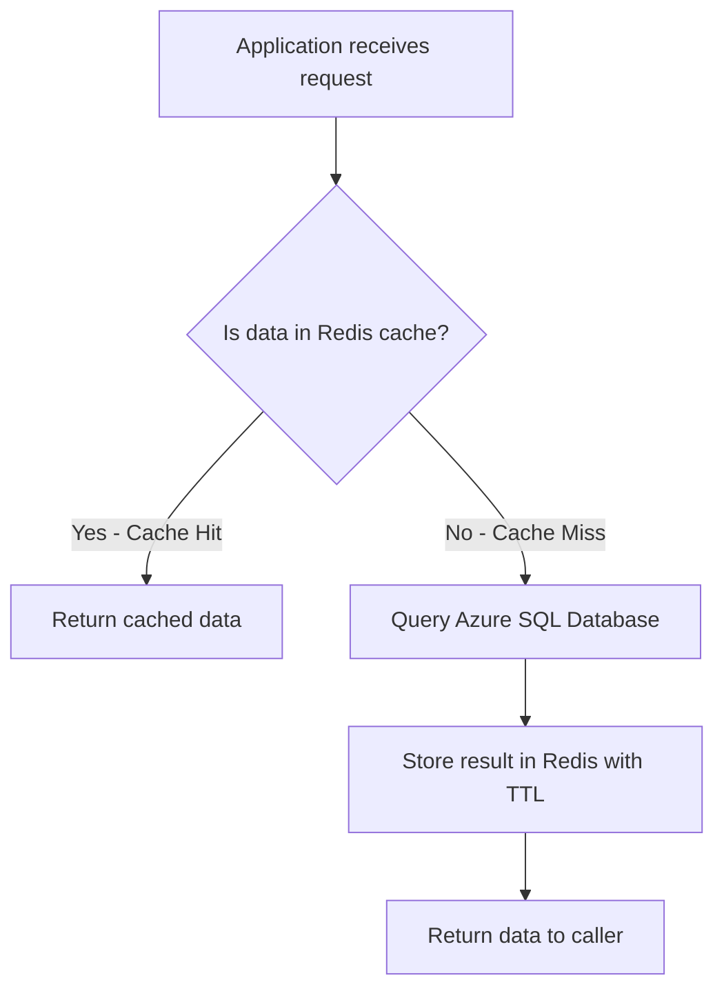

# How to Implement Cache-Aside Pattern with Azure Cache for Redis and Azure SQL

Author: [nawazdhandala](https://www.github.com/nawazdhandala)

Tags: Azure, Redis, Cache-Aside Pattern, Azure SQL, Caching Patterns, Performance, Azure Cache for Redis

Description: Implement the cache-aside pattern using Azure Cache for Redis and Azure SQL Database to reduce database load and improve response times.

---

The cache-aside pattern is the most common caching strategy in production systems, and for good reason. It is simple, predictable, and gives your application full control over what gets cached and when. The idea is straightforward: your application checks the cache first, and if the data is not there, it fetches from the database, stores the result in the cache, and then returns it. Subsequent requests for the same data are served directly from the cache.

This guide shows how to implement the cache-aside pattern with Azure Cache for Redis as the cache layer and Azure SQL Database as the primary data store.

## How Cache-Aside Works

The flow is best understood as a sequence of decisions your application makes on every read:



For writes, the pattern is also simple: write to the database, then invalidate (delete) the cache entry. The next read will repopulate the cache with the fresh data.

This is different from write-through or write-behind patterns, where the cache itself handles writing to the database. Cache-aside keeps the cache as a passive read-through layer, which is easier to reason about and debug.

## When to Use Cache-Aside

Cache-aside is ideal when:

- **Read-heavy workloads**: If your application reads the same data far more often than it writes it, cache-aside shines. Think product catalogs, user profiles, configuration settings.
- **Tolerance for stale data**: The cache might serve slightly stale data between a write and the cache invalidation. If your application can tolerate a few seconds of staleness, cache-aside is fine.
- **Independent cache and database**: You want the cache to be a performance optimization, not a critical dependency. If Redis goes down, your app should still work (just slower).

Cache-aside is not ideal for:

- **Write-heavy workloads with strict consistency**: If every read must reflect the latest write, the invalidation lag can be a problem.
- **Data that changes every few seconds**: The cache hit rate will be too low to justify the overhead.

## Prerequisites

- An Azure Cache for Redis instance (Standard tier or higher)
- An Azure SQL Database with some sample data
- A .NET or Node.js application (we will show both)
- Connection details for both services

## Step 1: Set Up the Database Table

Let us assume we have a product catalog stored in Azure SQL. Here is a simple table:

```sql
-- Create a products table for our cache-aside demo
CREATE TABLE Products (
    ProductId INT PRIMARY KEY,
    Name NVARCHAR(200) NOT NULL,
    Description NVARCHAR(1000),
    Price DECIMAL(10, 2) NOT NULL,
    Category NVARCHAR(100),
    LastModified DATETIME2 DEFAULT GETUTCDATE()
);

-- Insert some sample data
INSERT INTO Products (ProductId, Name, Description, Price, Category) VALUES
(1, 'Wireless Mouse', 'Ergonomic wireless mouse with USB receiver', 29.99, 'Electronics'),
(2, 'Mechanical Keyboard', 'Cherry MX Blue switches, full size', 89.99, 'Electronics'),
(3, 'USB-C Hub', '7-port USB-C hub with HDMI output', 49.99, 'Electronics'),
(4, 'Standing Desk Mat', 'Anti-fatigue mat for standing desks', 39.99, 'Furniture'),
(5, 'Monitor Arm', 'Adjustable single monitor arm, VESA mount', 119.99, 'Furniture');
```

## Step 2: Implement in C# (.NET)

Here is a complete implementation of the cache-aside pattern in C# using StackExchange.Redis and Dapper for database access.

```csharp
using System.Text.Json;
using Dapper;
using Microsoft.Data.SqlClient;
using StackExchange.Redis;

// Service class implementing the cache-aside pattern for product data
public class ProductService
{
    private readonly IDatabase _cache;
    private readonly string _sqlConnectionString;
    private readonly TimeSpan _cacheTtl = TimeSpan.FromMinutes(15);

    public ProductService(IConnectionMultiplexer redis, string sqlConnectionString)
    {
        _cache = redis.GetDatabase();
        _sqlConnectionString = sqlConnectionString;
    }

    // Read operation: Check cache first, then fall back to database
    public async Task<Product> GetProductAsync(int productId)
    {
        string cacheKey = $"product:{productId}";

        // Step 1: Try to get from cache
        string cachedValue = await _cache.StringGetAsync(cacheKey);

        if (cachedValue != null)
        {
            // Cache hit - deserialize and return
            return JsonSerializer.Deserialize<Product>(cachedValue);
        }

        // Step 2: Cache miss - query the database
        using var connection = new SqlConnection(_sqlConnectionString);
        var product = await connection.QuerySingleOrDefaultAsync<Product>(
            "SELECT ProductId, Name, Description, Price, Category FROM Products WHERE ProductId = @Id",
            new { Id = productId }
        );

        if (product == null)
        {
            return null;
        }

        // Step 3: Store in cache with TTL for future requests
        string serialized = JsonSerializer.Serialize(product);
        await _cache.StringSetAsync(cacheKey, serialized, _cacheTtl);

        return product;
    }

    // Write operation: Update database, then invalidate cache
    public async Task UpdateProductAsync(Product product)
    {
        string cacheKey = $"product:{product.ProductId}";

        // Step 1: Update the database first (source of truth)
        using var connection = new SqlConnection(_sqlConnectionString);
        await connection.ExecuteAsync(
            @"UPDATE Products
              SET Name = @Name, Description = @Description,
                  Price = @Price, Category = @Category,
                  LastModified = GETUTCDATE()
              WHERE ProductId = @ProductId",
            product
        );

        // Step 2: Invalidate the cache entry
        // The next read will repopulate the cache with fresh data
        await _cache.KeyDeleteAsync(cacheKey);
    }

    // Bulk read with cache-aside for multiple products
    public async Task<List<Product>> GetProductsByCategoryAsync(string category)
    {
        string cacheKey = $"products:category:{category.ToLower()}";

        // Try cache first
        string cachedValue = await _cache.StringGetAsync(cacheKey);
        if (cachedValue != null)
        {
            return JsonSerializer.Deserialize<List<Product>>(cachedValue);
        }

        // Cache miss - query database
        using var connection = new SqlConnection(_sqlConnectionString);
        var products = (await connection.QueryAsync<Product>(
            "SELECT ProductId, Name, Description, Price, Category FROM Products WHERE Category = @Category",
            new { Category = category }
        )).ToList();

        // Cache the result set
        if (products.Any())
        {
            string serialized = JsonSerializer.Serialize(products);
            await _cache.StringSetAsync(cacheKey, serialized, _cacheTtl);
        }

        return products;
    }
}

// Simple product model
public class Product
{
    public int ProductId { get; set; }
    public string Name { get; set; }
    public string Description { get; set; }
    public decimal Price { get; set; }
    public string Category { get; set; }
}
```

## Step 3: Implement in Node.js

Here is the same pattern in Node.js:

```javascript
const { createClient } = require('redis');
const sql = require('mssql');

// Cache TTL in seconds (15 minutes)
const CACHE_TTL = 900;

// Initialize Redis client
const redisClient = createClient({
    url: 'rediss://my-cache.redis.cache.windows.net:6380',
    password: '<redis-access-key>'
});
redisClient.connect();

// SQL connection pool configuration
const sqlConfig = {
    server: 'my-server.database.windows.net',
    database: 'ProductsDB',
    user: '<sql-user>',
    password: '<sql-password>',
    options: { encrypt: true }
};

// Read with cache-aside pattern
async function getProduct(productId) {
    const cacheKey = `product:${productId}`;

    // Step 1: Check the cache
    const cached = await redisClient.get(cacheKey);
    if (cached) {
        console.log(`Cache hit for ${cacheKey}`);
        return JSON.parse(cached);
    }

    // Step 2: Cache miss - query Azure SQL
    console.log(`Cache miss for ${cacheKey}, querying database`);
    const pool = await sql.connect(sqlConfig);
    const result = await pool.request()
        .input('productId', sql.Int, productId)
        .query('SELECT ProductId, Name, Description, Price, Category FROM Products WHERE ProductId = @productId');

    if (result.recordset.length === 0) {
        return null;
    }

    const product = result.recordset[0];

    // Step 3: Populate cache for future reads
    await redisClient.setEx(cacheKey, CACHE_TTL, JSON.stringify(product));

    return product;
}

// Write with cache invalidation
async function updateProduct(product) {
    const cacheKey = `product:${product.ProductId}`;

    // Step 1: Update the database
    const pool = await sql.connect(sqlConfig);
    await pool.request()
        .input('productId', sql.Int, product.ProductId)
        .input('name', sql.NVarChar(200), product.Name)
        .input('price', sql.Decimal(10, 2), product.Price)
        .query('UPDATE Products SET Name = @name, Price = @price WHERE ProductId = @productId');

    // Step 2: Invalidate cache
    await redisClient.del(cacheKey);

    // Also invalidate any category-level cache entries
    // This is important for list queries that might include this product
    await redisClient.del(`products:category:${product.Category.toLowerCase()}`);
}
```

## Handling Edge Cases

### Cache Stampede

When a popular cache entry expires, hundreds of requests might simultaneously miss the cache and hit the database. This is called a cache stampede. You can prevent it with a distributed lock:

```csharp
// Cache stampede prevention using a Redis lock
public async Task<Product> GetProductWithLockAsync(int productId)
{
    string cacheKey = $"product:{productId}";
    string lockKey = $"lock:{cacheKey}";

    // Try cache first
    string cachedValue = await _cache.StringGetAsync(cacheKey);
    if (cachedValue != null)
        return JsonSerializer.Deserialize<Product>(cachedValue);

    // Try to acquire a lock (only one thread will succeed)
    bool lockAcquired = await _cache.StringSetAsync(
        lockKey, "1", TimeSpan.FromSeconds(5), When.NotExists);

    if (lockAcquired)
    {
        try
        {
            // Double-check cache after acquiring lock
            cachedValue = await _cache.StringGetAsync(cacheKey);
            if (cachedValue != null)
                return JsonSerializer.Deserialize<Product>(cachedValue);

            // Fetch from database and populate cache
            var product = await FetchFromDatabaseAsync(productId);
            if (product != null)
            {
                await _cache.StringSetAsync(cacheKey,
                    JsonSerializer.Serialize(product), _cacheTtl);
            }
            return product;
        }
        finally
        {
            await _cache.KeyDeleteAsync(lockKey);
        }
    }
    else
    {
        // Another thread is populating the cache, wait briefly and retry
        await Task.Delay(50);
        return await GetProductWithLockAsync(productId);
    }
}
```

### Cache Invalidation for Related Data

When you update a product, you need to invalidate not just the product cache entry, but also any list or aggregate cache entries that include that product. This is why the Node.js example above also deletes the category cache key.

For complex relationships, consider using Redis key patterns with SCAN to find and delete related entries, or maintain a set of related cache keys that need invalidation.

### Null Caching

If a product does not exist, should you cache the "not found" result? If you do not, repeated requests for a nonexistent product will keep hitting the database. A common approach is to cache a null marker with a shorter TTL:

```csharp
// Cache null results with a shorter TTL to prevent repeated database queries
if (product == null)
{
    await _cache.StringSetAsync(cacheKey, "null", TimeSpan.FromMinutes(2));
    return null;
}
```

## Monitoring and Metrics

Track these metrics to understand how well your cache-aside implementation is working:

- **Cache hit ratio**: Should be 80%+ for read-heavy workloads. If it is lower, your TTL might be too short or your data changes too frequently.
- **Cache latency (P99)**: Should be under 5ms for Azure Cache for Redis. If it is higher, check your cache tier and network configuration.
- **Database query rate**: Should decrease after implementing cache-aside. If it does not, your cache keys might be too granular.

## Wrapping Up

The cache-aside pattern with Azure Cache for Redis and Azure SQL is a proven approach to reducing database load and improving response times. The core logic is simple - check cache, miss to database, populate cache - but the edge cases matter. Handle stampedes with distributed locks, invalidate related cache entries on writes, and consider caching null results. With proper monitoring of your hit ratio and latency, you will have a caching layer that meaningfully improves your application's performance.
