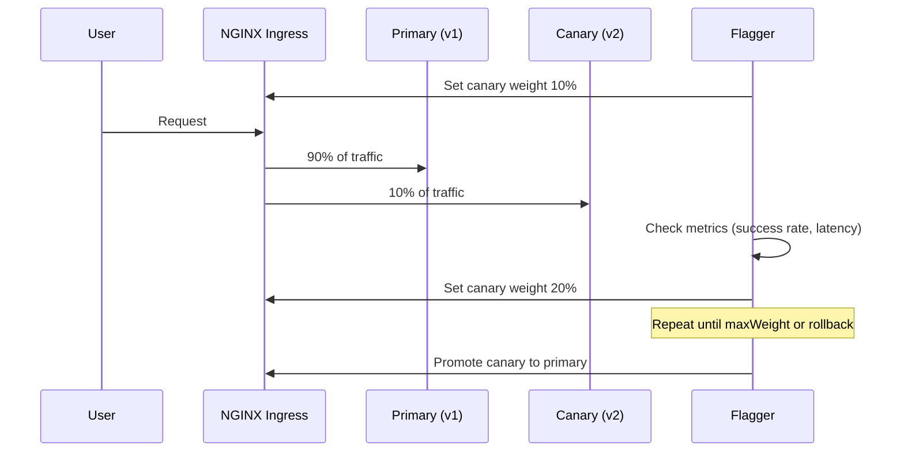

# How to Implement Canary Deployments on AKS Using Flagger and NGINX Ingress

Author: [nawazdhandala](https://www.github.com/nawazdhandala)

Tags: AKS, Canary Deployments, Flagger, NGINX Ingress, Kubernetes, Progressive Delivery, DevOps

Description: Step-by-step guide to implementing automated canary deployments on AKS using Flagger with NGINX Ingress for safe, progressive rollouts.

---

Deploying new versions of your application is always a moment of tension. You have tested everything in staging, the CI pipeline is green, but that nagging feeling about production never quite goes away. Canary deployments help reduce that risk by routing a small percentage of traffic to the new version first, monitoring it, and only promoting it to full traffic if everything looks healthy. In this guide, I will show you how to set up Flagger with NGINX Ingress on AKS to automate this entire process.

## What Flagger Does

Flagger is a progressive delivery operator for Kubernetes. It automates the process of gradually shifting traffic from an old version to a new version while monitoring metrics. If the new version starts throwing errors or latency spikes, Flagger automatically rolls back. You define the canary strategy once, and Flagger handles the rest every time you push a new image.

Flagger works with several ingress providers and service meshes. For this guide, we will use the NGINX Ingress Controller since it is one of the most common ingress solutions on AKS.

## Prerequisites

You need an AKS cluster running with kubectl configured, Helm 3 installed, and basic familiarity with Kubernetes deployments and services. I will assume you already have an AKS cluster. If not, create one with `az aks create`.

## Step 1: Install NGINX Ingress Controller

Flagger uses NGINX's traffic splitting capabilities through canary annotations. Install the ingress controller using Helm.

```bash
# Add the ingress-nginx Helm repository
helm repo add ingress-nginx https://kubernetes.github.io/ingress-nginx
helm repo update

# Install NGINX Ingress Controller
helm install ingress-nginx ingress-nginx/ingress-nginx \
  --namespace ingress-nginx \
  --create-namespace \
  --set controller.metrics.enabled=true \
  --set controller.metrics.serviceMonitor.enabled=false
```

The `controller.metrics.enabled=true` flag is important because Flagger needs Prometheus metrics from NGINX to make promotion decisions.

## Step 2: Install Flagger and Its Prometheus Instance

Flagger needs a metrics source to evaluate canary health. It ships with a built-in Prometheus server that scrapes NGINX metrics.

```bash
# Add the Flagger Helm repository
helm repo add flagger https://flagger.app
helm repo update

# Install Flagger with NGINX Ingress provider
helm install flagger flagger/flagger \
  --namespace ingress-nginx \
  --set provider=nginx \
  --set metricsServer=http://flagger-prometheus:9090

# Install Flagger's Prometheus instance
helm install flagger-prometheus flagger/flagger-prometheus \
  --namespace ingress-nginx
```

## Step 3: Deploy Your Application

Let us deploy a sample application that we will use for canary testing. This deployment represents your production workload.

```yaml
# app-deployment.yaml
# Base deployment for the application that Flagger will manage
apiVersion: apps/v1
kind: Deployment
metadata:
  name: podinfo
  namespace: default
  labels:
    app: podinfo
spec:
  replicas: 2
  selector:
    matchLabels:
      app: podinfo
  template:
    metadata:
      labels:
        app: podinfo
    spec:
      containers:
        - name: podinfo
          # Starting with version 6.0.0
          image: ghcr.io/stefanprodan/podinfo:6.0.0
          ports:
            - containerPort: 9898
              name: http
          resources:
            requests:
              cpu: 100m
              memory: 64Mi
```

Apply the deployment and create a ClusterIP service for it.

```yaml
# app-service.yaml
# Service that exposes the application within the cluster
apiVersion: v1
kind: Service
metadata:
  name: podinfo
  namespace: default
spec:
  type: ClusterIP
  selector:
    app: podinfo
  ports:
    - port: 80
      targetPort: http
      name: http
```

Create an ingress resource for the application.

```yaml
# app-ingress.yaml
# Ingress resource that Flagger will use for traffic splitting
apiVersion: networking.k8s.io/v1
kind: Ingress
metadata:
  name: podinfo
  namespace: default
  annotations:
    kubernetes.io/ingress.class: nginx
spec:
  rules:
    - host: app.example.com
      http:
        paths:
          - path: /
            pathType: Prefix
            backend:
              service:
                name: podinfo
                port:
                  number: 80
```

Apply all three manifests with kubectl.

```bash
# Apply the deployment, service, and ingress
kubectl apply -f app-deployment.yaml
kubectl apply -f app-service.yaml
kubectl apply -f app-ingress.yaml
```

## Step 4: Create the Canary Resource

This is where the magic happens. The Canary resource tells Flagger how to manage progressive delivery for your application.

```yaml
# canary.yaml
# Flagger Canary resource defining the progressive delivery strategy
apiVersion: flagger.app/v1beta1
kind: Canary
metadata:
  name: podinfo
  namespace: default
spec:
  targetRef:
    apiVersion: apps/v1
    kind: Deployment
    name: podinfo
  ingressRef:
    apiVersion: networking.k8s.io/v1
    kind: Ingress
    name: podinfo
  # How often Flagger checks canary health
  progressDeadlineSeconds: 60
  service:
    port: 80
    targetPort: http
  analysis:
    # How often to run analysis
    interval: 30s
    # Number of successful checks before promotion
    threshold: 5
    # Maximum percentage of traffic to route to canary
    maxWeight: 50
    # Traffic increment per step
    stepWeight: 10
    metrics:
      # Built-in NGINX success rate metric
      - name: request-success-rate
        thresholdRange:
          min: 99
        interval: 1m
      # Built-in NGINX latency metric
      - name: request-duration
        thresholdRange:
          max: 500
        interval: 1m
    webhooks:
      # Load test webhook to generate traffic during analysis
      - name: load-test
        url: http://flagger-loadtester.default/
        timeout: 5s
        metadata:
          cmd: "hey -z 1m -q 10 -c 2 http://podinfo-canary/healthz"
```

Let me break down the analysis section. Flagger will check the canary every 30 seconds. It starts by sending 10% of traffic to the new version, then increases by 10% each step up to 50%. At each step, it checks that the success rate stays above 99% and latency stays below 500ms. After 5 successful checks, it promotes the canary to primary.

## Step 5: Install the Load Tester

Flagger needs traffic flowing to evaluate metrics. The load tester generates synthetic traffic during canary analysis.

```bash
# Install Flagger's load tester for generating test traffic
helm install flagger-loadtester flagger/loadtester \
  --namespace default
```

Now apply the canary resource.

```bash
# Apply the canary definition
kubectl apply -f canary.yaml
```

Flagger will initialize by creating the canary and primary deployments. Check the status.

```bash
# Watch Flagger initialize the canary
kubectl get canary podinfo -w
```

You should see the status go from `Initializing` to `Initialized`.

## Step 6: Trigger a Canary Deployment

To trigger a canary rollout, update the container image in the deployment.

```bash
# Update the image to trigger a canary deployment
kubectl set image deployment/podinfo \
  podinfo=ghcr.io/stefanprodan/podinfo:6.1.0
```

Now watch Flagger in action.

```bash
# Watch the canary progress through its stages
kubectl describe canary podinfo
```

You will see events like this as Flagger progresses through the rollout:

```
Starting canary analysis for podinfo.default
Advance podinfo.default canary weight 10
Advance podinfo.default canary weight 20
Advance podinfo.default canary weight 30
Advance podinfo.default canary weight 40
Advance podinfo.default canary weight 50
Promotion completed! Scaling down canary.
```

## How the Traffic Flow Works

Here is a diagram showing how Flagger manages traffic during a canary deployment.



## Handling Failed Rollouts

If the canary version starts failing, Flagger will detect it through the metrics and automatically roll back. You can simulate a failure by deploying a broken image.

```bash
# Deploy a version that returns 500 errors
kubectl set image deployment/podinfo \
  podinfo=ghcr.io/stefanprodan/podinfo:6.1.0-broken
```

Flagger will detect the drop in success rate and roll back.

```
Halt podinfo.default advancement success rate 82.33% < 99%
Rolling back podinfo.default failed checks threshold reached 5
Canary failed! Scaling down podinfo.default
```

## Adding Slack Notifications

You probably want to know when deployments succeed or fail. Flagger supports alerting through various providers. Add an alert provider to your canary.

```yaml
# alert-provider.yaml
# Configure Slack notifications for canary events
apiVersion: flagger.app/v1beta1
kind: AlertProvider
metadata:
  name: slack
  namespace: default
spec:
  type: slack
  channel: deployments
  address: https://hooks.slack.com/services/YOUR/SLACK/WEBHOOK
```

Then reference it in your canary's `analysis` section by adding an `alerts` field.

## Production Tips

**Start conservative.** Begin with a stepWeight of 5 and maxWeight of 30 until you are comfortable with the process. You can always increase later.

**Use realistic load testing.** The built-in load tester works for demos, but in production you want real traffic hitting the canary. Remove the load test webhook and rely on organic traffic.

**Monitor the Flagger logs.** Run `kubectl logs -f deploy/flagger -n ingress-nginx` to see detailed analysis output. This is invaluable when debugging why a canary was rejected.

**Set appropriate thresholds.** A 99% success rate threshold is tight. If your application naturally has some error rate, adjust the threshold or you will get constant rollbacks.

Canary deployments with Flagger transform the deployment process from a nerve-wracking event into a controlled, observable rollout. Once you have it set up, every deployment automatically gets the safety net of progressive delivery, and you can push changes with much more confidence.
