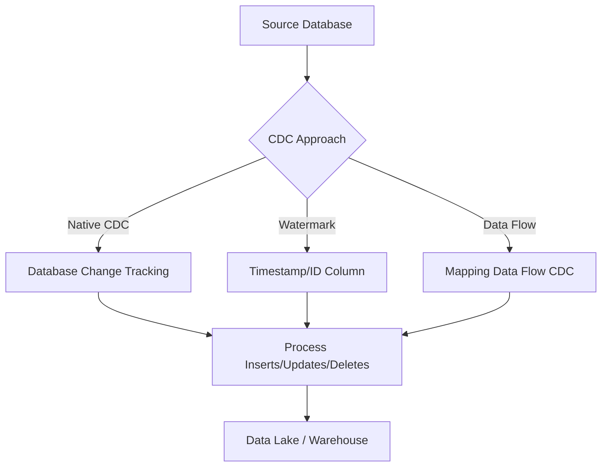

# How to Implement Change Data Capture (CDC) in Azure Data Factory

Author: [nawazdhandala](https://www.github.com/nawazdhandala)

Tags: Azure Data Factory, Change Data Capture, CDC, Data Integration, Incremental Loading, ETL, Azure SQL

Description: Implement Change Data Capture in Azure Data Factory to efficiently replicate only changed data from source databases to your data lake or warehouse.

---

Loading full tables every time you run a data pipeline is wasteful. If your source table has 50 million rows and only 500 changed since the last load, why process all 50 million? Change Data Capture (CDC) solves this by tracking which rows have been inserted, updated, or deleted since the last extraction, and only processing those changes.

Azure Data Factory supports CDC through several mechanisms: native CDC connectors for specific databases, watermark-based incremental loading for general sources, and mapping data flows with CDC support. In this guide, I will cover multiple approaches so you can pick the one that fits your source system.

## CDC Approaches in Azure Data Factory

There are three main approaches:

1. **Native CDC connector**: ADF has built-in CDC support for Azure SQL Database, SQL Server, and a few other sources. This uses the database's own change tracking mechanism.
2. **Watermark-based incremental loading**: Use a timestamp or incrementing ID column to track what has changed since the last load.
3. **Mapping Data Flow CDC**: ADF's data flow activities have a native CDC source transformation.



## Approach 1: Native CDC with Azure SQL Database

Azure SQL Database has a built-in CDC feature that tracks changes at the table level. ADF can read from these change tables directly.

### Enable CDC on Azure SQL Database

First, enable CDC on the database and the specific tables you want to track:

```sql
-- Enable CDC on the database
EXEC sys.sp_cdc_enable_db;

-- Enable CDC on the Orders table
-- This creates a change table that logs all inserts, updates, and deletes
EXEC sys.sp_cdc_enable_table
    @source_schema = N'dbo',
    @source_name = N'Orders',
    @role_name = NULL,
    @supports_net_changes = 1;  -- Enable net changes (latest state per row)

-- Verify CDC is enabled
SELECT name, is_cdc_enabled
FROM sys.databases
WHERE name = DB_NAME();

-- Check which tables have CDC enabled
SELECT s.name AS schema_name, t.name AS table_name
FROM sys.tables t
JOIN sys.schemas s ON t.schema_id = s.schema_id
WHERE t.is_tracked_by_cdc = 1;
```

### Create the ADF Pipeline with CDC Source

In ADF, use the CDC source in a mapping data flow:

Create a new data flow and add a "Source" transformation. Select "Azure SQL Database" as the source and enable the "Change data capture" option.

The CDC source automatically handles:
- Reading only changed rows since the last run
- Identifying whether each row is an insert, update, or delete
- Providing both before and after values for updates

Here is the pipeline JSON that uses a CDC-enabled data flow:

```json
{
    "name": "CDCPipeline",
    "properties": {
        "activities": [
            {
                "name": "CDCDataFlow",
                "type": "ExecuteDataFlow",
                "typeProperties": {
                    "dataflow": {
                        "referenceName": "OrdersCDCFlow",
                        "type": "DataFlowReference"
                    },
                    "compute": {
                        "coreCount": 8,
                        "computeType": "General"
                    }
                }
            }
        ]
    }
}
```

## Approach 2: Watermark-Based Incremental Loading

This is the most universal approach. It works with any data source that has a reliable timestamp or incrementing ID column. The basic idea is to store the highest watermark value from the last run and query for rows with a higher value on the next run.

### Step 1: Create a Watermark Table

Create a table to store the last-processed watermark for each source table:

```sql
-- Create a control table to track watermarks
CREATE TABLE dbo.WatermarkTable (
    TableName VARCHAR(200) PRIMARY KEY,
    WatermarkColumn VARCHAR(200) NOT NULL,
    WatermarkValue DATETIME2 NOT NULL,
    LastRunTime DATETIME2 NOT NULL DEFAULT GETDATE()
);

-- Initialize the watermark for the Orders table
INSERT INTO dbo.WatermarkTable (TableName, WatermarkColumn, WatermarkValue)
VALUES ('dbo.Orders', 'ModifiedDate', '1900-01-01');
```

### Step 2: Build the Incremental Loading Pipeline

The pipeline has three steps: read the current watermark, copy changed rows, and update the watermark.

```json
{
    "name": "IncrementalLoadPipeline",
    "properties": {
        "activities": [
            {
                "name": "GetCurrentWatermark",
                "type": "Lookup",
                "typeProperties": {
                    "source": {
                        "type": "AzureSqlSource",
                        "sqlReaderQuery": "SELECT WatermarkValue FROM dbo.WatermarkTable WHERE TableName = 'dbo.Orders'"
                    },
                    "dataset": {
                        "referenceName": "WatermarkDataset",
                        "type": "DatasetReference"
                    }
                }
            },
            {
                "name": "GetMaxSourceWatermark",
                "type": "Lookup",
                "typeProperties": {
                    "source": {
                        "type": "AzureSqlSource",
                        "sqlReaderQuery": "SELECT MAX(ModifiedDate) AS MaxModifiedDate FROM dbo.Orders"
                    },
                    "dataset": {
                        "referenceName": "SourceOrdersDataset",
                        "type": "DatasetReference"
                    }
                }
            },
            {
                "name": "CopyChangedRows",
                "type": "Copy",
                "dependsOn": [
                    {"activity": "GetCurrentWatermark", "dependencyConditions": ["Succeeded"]},
                    {"activity": "GetMaxSourceWatermark", "dependencyConditions": ["Succeeded"]}
                ],
                "typeProperties": {
                    "source": {
                        "type": "AzureSqlSource",
                        "sqlReaderQuery": {
                            "value": "SELECT * FROM dbo.Orders WHERE ModifiedDate > '@{activity('GetCurrentWatermark').output.firstRow.WatermarkValue}' AND ModifiedDate <= '@{activity('GetMaxSourceWatermark').output.firstRow.MaxModifiedDate}'",
                            "type": "Expression"
                        }
                    },
                    "sink": {
                        "type": "ParquetSink",
                        "storeSettings": {
                            "type": "AzureBlobFSWriteSettings"
                        }
                    }
                }
            },
            {
                "name": "UpdateWatermark",
                "type": "SqlServerStoredProcedure",
                "dependsOn": [
                    {"activity": "CopyChangedRows", "dependencyConditions": ["Succeeded"]}
                ],
                "typeProperties": {
                    "storedProcedureName": "sp_UpdateWatermark",
                    "storedProcedureParameters": {
                        "TableName": {"value": "dbo.Orders"},
                        "NewWatermark": {
                            "value": {
                                "value": "@activity('GetMaxSourceWatermark').output.firstRow.MaxModifiedDate",
                                "type": "Expression"
                            }
                        }
                    }
                }
            }
        ]
    }
}
```

Create the stored procedure for updating the watermark:

```sql
-- Stored procedure to update the watermark after successful loading
CREATE PROCEDURE sp_UpdateWatermark
    @TableName VARCHAR(200),
    @NewWatermark DATETIME2
AS
BEGIN
    UPDATE dbo.WatermarkTable
    SET WatermarkValue = @NewWatermark,
        LastRunTime = GETDATE()
    WHERE TableName = @TableName;
END;
```

## Approach 3: ADF Mapping Data Flow with CDC Capabilities

ADF mapping data flows provide a visual approach to CDC with built-in support for merge operations (upsert + delete).

Create a mapping data flow that reads changed data and applies it to the destination:

```json
{
    "name": "OrdersCDCFlow",
    "properties": {
        "type": "MappingDataFlow",
        "typeProperties": {
            "sources": [
                {
                    "name": "SourceChanges",
                    "dataset": {
                        "referenceName": "OrdersChangesDataset",
                        "type": "DatasetReference"
                    }
                }
            ],
            "sinks": [
                {
                    "name": "TargetTable",
                    "dataset": {
                        "referenceName": "TargetOrdersDataset",
                        "type": "DatasetReference"
                    }
                }
            ],
            "transformations": [
                {
                    "name": "AlterRow",
                    "description": "Mark rows for insert, update, or delete based on CDC operation"
                }
            ]
        }
    }
}
```

In the data flow designer, the "Alter Row" transformation lets you define conditions for each operation:

- **Insert if**: The row is new (CDC operation = 'I')
- **Update if**: The row was modified (CDC operation = 'U')
- **Delete if**: The row was deleted (CDC operation = 'D')
- **Upsert if**: Insert or update based on whether the key exists

## Handling Deletes

Deletes are the trickiest part of CDC. When a row is deleted from the source, you need to decide how to handle it in the destination:

- **Hard delete**: Remove the row from the destination too
- **Soft delete**: Set a flag (e.g., `is_deleted = true`) and a deletion timestamp
- **Ignore**: Keep the row in the destination as historical data

For soft deletes, add logic in your data flow or downstream processing:

```sql
-- Soft delete approach: mark deleted rows instead of removing them
MERGE INTO dbo.TargetOrders AS target
USING dbo.StagingChanges AS source
ON target.OrderId = source.OrderId
WHEN MATCHED AND source.CdcOperation = 'D' THEN
    UPDATE SET target.IsDeleted = 1,
               target.DeletedDate = GETDATE()
WHEN MATCHED AND source.CdcOperation = 'U' THEN
    UPDATE SET target.CustomerName = source.CustomerName,
               target.OrderAmount = source.OrderAmount,
               target.ModifiedDate = source.ModifiedDate,
               target.IsDeleted = 0
WHEN NOT MATCHED AND source.CdcOperation IN ('I', 'U') THEN
    INSERT (OrderId, CustomerName, OrderAmount, ModifiedDate, IsDeleted)
    VALUES (source.OrderId, source.CustomerName, source.OrderAmount,
            source.ModifiedDate, 0);
```

## Monitoring CDC Pipelines

CDC pipelines need extra monitoring because missed changes can create data inconsistencies. Set up alerts for:

- **Pipeline failures**: Any failure means changes were not captured
- **Row count anomalies**: A sudden spike or drop in changed rows might indicate a problem
- **Watermark drift**: If the watermark falls too far behind the current time, investigate
- **Latency**: Track how long it takes from a change in the source to it appearing in the destination

```python
# monitoring.py - Script to check CDC pipeline health
import requests
from datetime import datetime, timedelta

# Check watermark freshness
def check_watermark_freshness(connection_string, max_lag_minutes=60):
    """Alert if the watermark is too far behind current time."""
    import pyodbc
    conn = pyodbc.connect(connection_string)
    cursor = conn.cursor()

    cursor.execute("""
        SELECT TableName, WatermarkValue, LastRunTime
        FROM dbo.WatermarkTable
    """)

    now = datetime.utcnow()
    for row in cursor:
        lag = now - row.WatermarkValue
        lag_minutes = lag.total_seconds() / 60

        if lag_minutes > max_lag_minutes:
            print(f"WARNING: {row.TableName} watermark is {lag_minutes:.0f} minutes behind")
        else:
            print(f"OK: {row.TableName} watermark lag is {lag_minutes:.0f} minutes")

    conn.close()
```

## Summary

Change Data Capture in Azure Data Factory dramatically reduces the cost and time of data synchronization. Instead of reprocessing entire tables, you only handle the changes. Whether you use native database CDC for the most accurate tracking, watermark-based loading for universal compatibility, or mapping data flows for a visual approach, the principle is the same: capture what changed, apply it to the destination, and track your progress. The choice of approach depends on your source system capabilities, the volume of changes, and whether you need to handle deletes.
