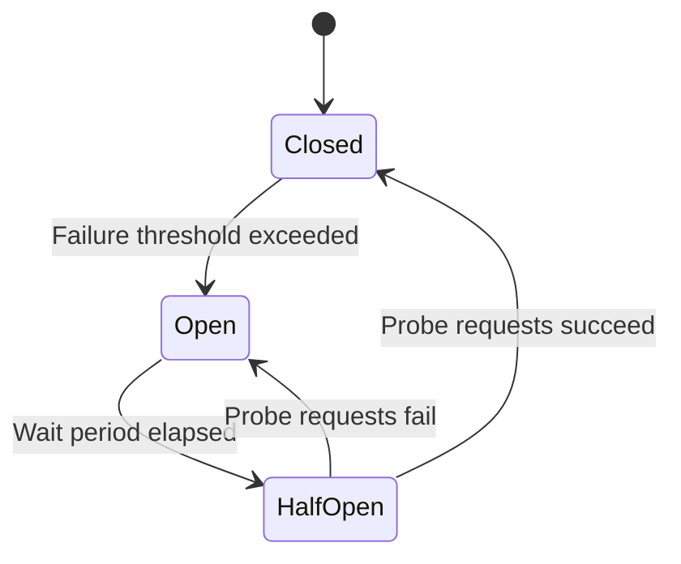

# How to Implement Circuit Breaker Pattern in Azure API Management Policies

Author: [nawazdhandala](https://www.github.com/nawazdhandala)

Tags: Azure, API Management, Circuit Breaker, Resilience, API Patterns, Fault Tolerance

Description: Learn how to implement the circuit breaker pattern in Azure API Management to protect your backends from cascading failures and improve API resilience.

---

When a backend service starts failing, the worst thing your API gateway can do is keep sending requests to it. Every failed request ties up a connection, wastes time waiting for a timeout, and adds load to an already struggling service. The circuit breaker pattern addresses this by detecting when a backend is unhealthy and temporarily stopping requests to it, giving the backend time to recover.

Azure API Management now supports a native circuit breaker configuration on backend entities. In this post, I will cover both the native approach and a custom policy-based implementation for scenarios where you need more control.

## How the Circuit Breaker Pattern Works

The pattern has three states:

**Closed** (normal operation): Requests flow through to the backend normally. The circuit breaker monitors the responses and counts failures.

**Open** (tripped): After the failure count exceeds a threshold within a time window, the circuit "opens." No requests are sent to the backend. Instead, the circuit breaker returns an error immediately. This is fast and avoids piling onto a failing backend.

**Half-Open** (testing recovery): After a configured wait period, the circuit allows a limited number of requests through to test if the backend has recovered. If these probe requests succeed, the circuit closes again. If they fail, it stays open.



## Native Circuit Breaker on APIM Backends

APIM supports circuit breaker configuration directly on backend entities. This is the recommended approach because it is managed by the platform and does not require custom policy logic.

You can configure it through the Azure Portal, ARM templates, or the REST API. Here is the ARM template configuration:

```json
{
    "type": "Microsoft.ApiManagement/service/backends",
    "apiVersion": "2023-09-01-preview",
    "name": "[concat(parameters('apimName'), '/order-service')]",
    "properties": {
        "url": "https://orders.azurewebsites.net",
        "protocol": "http",
        "circuitBreaker": {
            "rules": [
                {
                    "failureCondition": {
                        "count": 5,
                        "interval": "PT1M",
                        "statusCodeRanges": [
                            {
                                "min": 500,
                                "max": 599
                            }
                        ]
                    },
                    "name": "myBreakerRule",
                    "tripDuration": "PT1M",
                    "acceptRetryAfter": true
                }
            ]
        }
    }
}
```

This configuration means:
- If the backend returns 5 or more 5xx errors within 1 minute, trip the circuit
- Keep the circuit open for 1 minute (`tripDuration`)
- If the backend sends a `Retry-After` header, respect it

Reference this backend in your API policy:

```xml
<!-- Use the backend with circuit breaker configured -->
<inbound>
    <base />
    <set-backend-service backend-id="order-service" />
</inbound>
```

When the circuit trips, APIM returns a 503 Service Unavailable response to the client without contacting the backend.

## Custom Policy-Based Circuit Breaker

If you need more control than the native circuit breaker provides - for example, custom failure detection logic, different behaviors in the open state, or integration with external health monitoring - you can implement a circuit breaker with APIM policies and the built-in cache.

The idea is to track failure counts in the cache and check them on each request:

```xml
<!-- Custom circuit breaker using APIM cache -->
<!-- Tracks backend failures and opens the circuit when threshold is exceeded -->
<inbound>
    <base />

    <!-- Check if circuit is open -->
    <cache-lookup-value key="circuit-order-service-state" variable-name="circuitState" default-value="closed" />

    <choose>
        <!-- If circuit is open, return 503 immediately -->
        <when condition="@((string)context.Variables["circuitState"] == "open")">
            <return-response>
                <set-status code="503" reason="Service Unavailable" />
                <set-header name="Content-Type" exists-action="override">
                    <value>application/json</value>
                </set-header>
                <set-header name="Retry-After" exists-action="override">
                    <value>30</value>
                </set-header>
                <set-body>{"error": "circuit_open", "message": "Backend service is temporarily unavailable. Please retry later."}</set-body>
            </return-response>
        </when>
    </choose>
</inbound>

<outbound>
    <base />

    <choose>
        <!-- Track failures: if backend returns 5xx, increment failure counter -->
        <when condition="@(context.Response.StatusCode >= 500)">
            <!-- Get current failure count -->
            <cache-lookup-value key="circuit-order-service-failures" variable-name="failureCount" default-value="0" />

            <!-- Increment failure count -->
            <cache-store-value key="circuit-order-service-failures"
                value="@((int.Parse((string)context.Variables["failureCount"]) + 1).ToString())"
                duration="60" />

            <!-- If failures exceed threshold, open the circuit -->
            <choose>
                <when condition="@(int.Parse((string)context.Variables["failureCount"]) + 1 >= 5)">
                    <cache-store-value key="circuit-order-service-state" value="open" duration="30" />
                    <!-- Reset failure counter -->
                    <cache-store-value key="circuit-order-service-failures" value="0" duration="60" />
                </when>
            </choose>
        </when>
        <otherwise>
            <!-- On success, reset the failure counter -->
            <cache-store-value key="circuit-order-service-failures" value="0" duration="60" />
        </otherwise>
    </choose>
</outbound>
```

In this implementation:
- The failure count is stored in the APIM cache with a 60-second TTL
- After 5 failures, the circuit state is set to "open" with a 30-second TTL
- When the cache entry expires (after 30 seconds), the circuit automatically transitions to "half-open" because the default value is "closed"
- If the next request after the circuit opens succeeds, the failure counter resets and the circuit stays closed

## Adding Half-Open State

The basic implementation above transitions directly from open to closed when the cache entry expires. For a proper half-open state where only a limited number of probe requests are allowed, add a check:

```xml
<!-- Enhanced circuit breaker with explicit half-open state -->
<inbound>
    <base />
    <cache-lookup-value key="circuit-order-service-state" variable-name="circuitState" default-value="closed" />

    <choose>
        <when condition="@((string)context.Variables["circuitState"] == "open")">
            <return-response>
                <set-status code="503" reason="Service Unavailable" />
                <set-header name="Retry-After" exists-action="override">
                    <value>30</value>
                </set-header>
                <set-body>{"error": "circuit_open"}</set-body>
            </return-response>
        </when>
        <when condition="@((string)context.Variables["circuitState"] == "half-open")">
            <!-- Allow this probe request through but limit concurrency -->
            <cache-lookup-value key="circuit-order-service-probes" variable-name="probeCount" default-value="0" />
            <choose>
                <when condition="@(int.Parse((string)context.Variables["probeCount"]) >= 1)">
                    <!-- Already have a probe in flight, reject -->
                    <return-response>
                        <set-status code="503" reason="Service Unavailable" />
                        <set-body>{"error": "circuit_half_open_probe_in_progress"}</set-body>
                    </return-response>
                </when>
                <otherwise>
                    <!-- Allow this probe through -->
                    <cache-store-value key="circuit-order-service-probes" value="1" duration="10" />
                </otherwise>
            </choose>
        </when>
    </choose>
</inbound>
```

## Circuit Breaker with Fallback

Instead of returning a 503 when the circuit is open, you might want to return cached data or a degraded response. This is sometimes called a "graceful degradation" pattern:

```xml
<!-- Circuit breaker with fallback to cached data -->
<inbound>
    <base />
    <cache-lookup-value key="circuit-order-service-state" variable-name="circuitState" default-value="closed" />

    <choose>
        <when condition="@((string)context.Variables["circuitState"] == "open")">
            <!-- Try to return cached response -->
            <cache-lookup-value key="@("cached-response-" + context.Request.Url.Path)" variable-name="cachedResponse" />
            <choose>
                <when condition="@(context.Variables.ContainsKey("cachedResponse"))">
                    <return-response>
                        <set-status code="200" reason="OK" />
                        <set-header name="X-Circuit-Breaker" exists-action="override">
                            <value>fallback-cache</value>
                        </set-header>
                        <set-body>@((string)context.Variables["cachedResponse"])</set-body>
                    </return-response>
                </when>
                <otherwise>
                    <return-response>
                        <set-status code="503" reason="Service Unavailable" />
                        <set-body>{"error": "circuit_open", "message": "No cached data available"}</set-body>
                    </return-response>
                </otherwise>
            </choose>
        </when>
    </choose>
</inbound>

<!-- Cache successful responses for fallback use -->
<outbound>
    <base />
    <choose>
        <when condition="@(context.Response.StatusCode == 200)">
            <cache-store-value
                key="@("cached-response-" + context.Request.Url.Path)"
                value="@(context.Response.Body.As<string>(preserveContent: true))"
                duration="300" />
        </when>
    </choose>
</outbound>
```

## Monitoring Circuit Breaker Activity

Track when circuits trip and recover by logging to Application Insights:

```xml
<!-- Log circuit breaker state changes -->
<choose>
    <when condition="@(int.Parse((string)context.Variables["failureCount"]) + 1 >= 5)">
        <trace source="circuit-breaker" severity="error">
            <message>Circuit breaker OPENED for order-service after 5 failures</message>
        </trace>
    </when>
</choose>
```

Set up alerts on these trace messages so your operations team knows when a backend is having issues.

## Choosing the Right Approach

Use the **native circuit breaker** when:
- Simple failure count thresholds are sufficient
- You want zero policy maintenance
- You are using backend pools with load balancing

Use the **custom policy approach** when:
- You need custom failure detection (specific error codes, response body patterns)
- You want fallback responses instead of 503s
- You need to coordinate circuit breaker state across multiple APIs
- You want to integrate with external health monitoring

## Summary

The circuit breaker pattern prevents cascading failures by stopping requests to unhealthy backends. APIM's native circuit breaker on backend entities is the simplest approach and handles most scenarios. For advanced needs, the policy-based implementation gives you full control over failure detection, state transitions, and fallback behavior. Either way, always add monitoring so you know when circuits trip - a tripped circuit breaker is an early warning that something needs attention.
