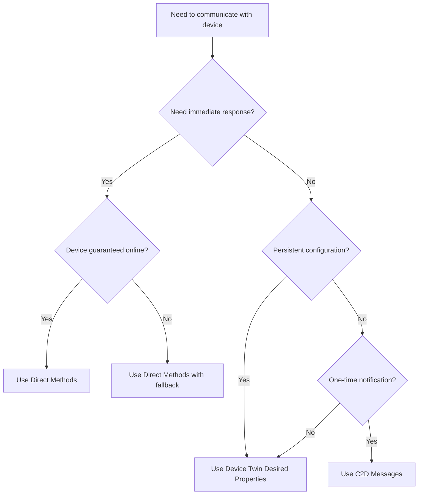

# How to Implement Cloud-to-Device Messaging Patterns in Azure IoT Hub

Author: [nawazdhandala](https://www.github.com/nawazdhandala)

Tags: Azure IoT Hub, Cloud-to-Device, Messaging Patterns, IoT Communication, Direct Methods, Device Twins, Azure Cloud

Description: A practical guide to implementing cloud-to-device messaging patterns in Azure IoT Hub including direct methods, desired properties, and C2D messages.

---

Most IoT tutorials focus on the device-to-cloud direction - sending telemetry, uploading files, reporting state. But real-world IoT systems need bidirectional communication. You need to push firmware updates, change device configurations, trigger immediate actions, and send commands. Azure IoT Hub provides three distinct cloud-to-device (C2D) communication patterns, each designed for different scenarios. Picking the wrong one leads to frustrating debugging sessions and unreliable behavior. This guide covers all three patterns with working code examples so you can choose the right tool for each job.

## The Three C2D Patterns

Azure IoT Hub supports three ways to send information from the cloud to a device:

1. **Direct methods** - synchronous request-response calls with immediate feedback
2. **Device twin desired properties** - persistent state that the device picks up when it reconnects
3. **Cloud-to-device messages** - one-way messages queued for the device

Each pattern has different delivery guarantees, latency characteristics, and use cases. Let us dig into each one.

## Pattern 1: Direct Methods

Direct methods work like remote procedure calls. The back end invokes a method on a specific device, the device executes a handler, and returns a response. If the device is offline, the call fails immediately - there is no queuing.

This pattern is ideal for commands that need immediate feedback: "reboot now", "capture a photo", "run diagnostics and return the result."

Here is the device-side handler in Node.js.

```javascript
// device-direct-method.js - Handle direct method calls on the device
const { Client } = require('azure-iot-device');
const { Mqtt } = require('azure-iot-device-mqtt');

const connectionString = 'HostName=my-hub.azure-devices.net;DeviceId=device-01;SharedAccessKey=...';
const client = Client.fromConnectionString(connectionString, Mqtt);

// Register a handler for the 'reboot' method
client.onDeviceMethod('reboot', (request, response) => {
  console.log('Reboot requested with payload:', request.payload);

  // Simulate a reboot delay
  const delaySeconds = request.payload?.delay || 5;

  // Send a success response back to the caller
  response.send(200, { message: `Rebooting in ${delaySeconds} seconds` }, (err) => {
    if (err) {
      console.error('Failed to send method response:', err.message);
    }
  });

  // Actually perform the reboot after the delay
  setTimeout(() => {
    console.log('Rebooting device now...');
    process.exit(0);
  }, delaySeconds * 1000);
});

// Register a handler for 'getDiagnostics'
client.onDeviceMethod('getDiagnostics', (request, response) => {
  // Gather device diagnostics
  const diagnostics = {
    uptime: process.uptime(),
    memoryUsage: process.memoryUsage(),
    nodeVersion: process.version,
    timestamp: new Date().toISOString()
  };

  // Return diagnostics in the response
  response.send(200, diagnostics);
});

client.open().then(() => {
  console.log('Device connected. Waiting for direct method calls...');
});
```

And here is how the back end invokes the method.

```javascript
// service-invoke-method.js - Invoke a direct method from the back end
const { Client } = require('azure-iothub');

const serviceConnectionString = 'HostName=my-hub.azure-devices.net;SharedAccessKeyName=service;SharedAccessKey=...';
const serviceClient = Client.fromConnectionString(serviceConnectionString);

async function invokeReboot(deviceId) {
  // Define the method parameters
  const methodParams = {
    methodName: 'reboot',
    payload: { delay: 10 },
    responseTimeoutInSeconds: 30,  // How long to wait for the device response
    connectTimeoutInSeconds: 15     // How long to wait for the device connection
  };

  try {
    const result = await serviceClient.invokeDeviceMethod(deviceId, methodParams);
    console.log(`Method status: ${result.result.status}`);
    console.log(`Response payload:`, result.result.payload);
  } catch (err) {
    // If the device is offline, this will throw
    console.error('Method invocation failed:', err.message);
  }
}

serviceClient.open().then(() => invokeReboot('device-01'));
```

The key thing to understand is the timeout behavior. If the device does not respond within `responseTimeoutInSeconds`, the call fails. There is no retry or queuing. This is by design - if you need guaranteed delivery to offline devices, use one of the other patterns.

## Pattern 2: Device Twin Desired Properties

Device twins are JSON documents stored in IoT Hub that represent the state of each device. They have two sections: **desired properties** (set by the back end) and **reported properties** (set by the device). When the back end updates a desired property, the device gets notified the next time it connects or immediately if it is already online.

This pattern is perfect for configuration changes: setting a reporting interval, enabling a feature flag, updating a threshold value.

```javascript
// device-twin.js - React to desired property changes on the device
const { Client } = require('azure-iot-device');
const { Mqtt } = require('azure-iot-device-mqtt');

const connectionString = 'HostName=my-hub.azure-devices.net;DeviceId=device-01;SharedAccessKey=...';
const client = Client.fromConnectionString(connectionString, Mqtt);

async function main() {
  await client.open();

  // Get the current twin
  const twin = await client.getTwin();

  // Read initial desired properties
  console.log('Current desired properties:', JSON.stringify(twin.properties.desired));

  // Listen for future desired property changes
  twin.on('properties.desired', (delta) => {
    console.log('Desired properties changed:', JSON.stringify(delta));

    // Apply the new configuration
    if (delta.reportingInterval) {
      console.log(`Updating reporting interval to ${delta.reportingInterval} seconds`);
      // Apply the change in your device logic here
    }

    if (delta.temperatureThreshold) {
      console.log(`Updating temperature threshold to ${delta.temperatureThreshold}`);
    }

    // Report back that we have applied the change
    const reportedPatch = {
      reportingInterval: delta.reportingInterval || twin.properties.reported.reportingInterval,
      temperatureThreshold: delta.temperatureThreshold || twin.properties.reported.temperatureThreshold,
      lastConfigUpdate: new Date().toISOString()
    };

    twin.properties.reported.update(reportedPatch, (err) => {
      if (err) {
        console.error('Failed to update reported properties:', err.message);
      } else {
        console.log('Reported properties updated successfully');
      }
    });
  });
}

main().catch(console.error);
```

On the service side, updating desired properties is straightforward.

```javascript
// service-update-twin.js - Update desired properties from the back end
const { Registry } = require('azure-iothub');

const connectionString = 'HostName=my-hub.azure-devices.net;SharedAccessKeyName=service;SharedAccessKey=...';
const registry = Registry.fromConnectionString(connectionString);

async function updateDeviceConfig(deviceId) {
  // Get the current twin
  const twin = await registry.getTwin(deviceId);

  // Prepare the desired property patch
  const patch = {
    properties: {
      desired: {
        reportingInterval: 30,
        temperatureThreshold: 75.0
      }
    }
  };

  // Update the twin with the new desired properties
  const updatedTwin = await registry.updateTwin(deviceId, patch, twin.responseBody.etag);
  console.log('Twin updated. New desired properties:', updatedTwin.responseBody.properties.desired);
}

updateDeviceConfig('device-01').catch(console.error);
```

The major advantage here is persistence. If the device is offline when you set a desired property, it will receive the update when it reconnects. The twin stores the latest desired state, so the device always converges to the correct configuration.

## Pattern 3: Cloud-to-Device Messages

C2D messages are one-way messages queued in IoT Hub for a specific device. The device receives them when it connects and pulls from the queue. Messages have a configurable time-to-live (default 1 hour, max 48 hours) and support acknowledgment.

This pattern is suitable for notifications, one-time commands, or any message that should be delivered once but does not need an immediate response.

```javascript
// service-send-c2d.js - Send a cloud-to-device message
const { Client } = require('azure-iothub');
const { Message } = require('azure-iot-common');

const connectionString = 'HostName=my-hub.azure-devices.net;SharedAccessKeyName=service;SharedAccessKey=...';
const serviceClient = Client.fromConnectionString(connectionString);

async function sendMessage(deviceId, payload) {
  await serviceClient.open();

  // Create the message with a JSON payload
  const message = new Message(JSON.stringify(payload));

  // Set message properties
  message.ack = 'full';                    // Request delivery acknowledgment
  message.expiryTimeUtc = new Date(Date.now() + 3600000).toISOString(); // 1 hour TTL
  message.messageId = `msg-${Date.now()}`;  // Unique message ID for tracking
  message.contentType = 'application/json';

  // Add custom application properties for routing on the device
  message.properties.add('command-type', 'firmware-check');

  await serviceClient.send(deviceId, message);
  console.log(`Message sent to ${deviceId}`);
}

sendMessage('device-01', { action: 'checkFirmwareUpdate', version: '2.1.0' });
```

The device receives these messages through a message listener.

```javascript
// device-receive-c2d.js - Receive C2D messages on the device
const { Client } = require('azure-iot-device');
const { Mqtt } = require('azure-iot-device-mqtt');

const connectionString = 'HostName=my-hub.azure-devices.net;DeviceId=device-01;SharedAccessKey=...';
const client = Client.fromConnectionString(connectionString, Mqtt);

client.open().then(() => {
  console.log('Listening for cloud-to-device messages...');

  client.on('message', (msg) => {
    console.log('Received message:');
    console.log(`  ID: ${msg.messageId}`);
    console.log(`  Body: ${msg.getData().toString()}`);
    console.log(`  Properties:`, msg.properties.propertyList);

    // Complete the message to remove it from the queue
    client.complete(msg, (err) => {
      if (err) {
        console.error('Failed to complete message:', err.message);
      }
    });
  });
});
```

## Choosing the Right Pattern

Here is a decision framework for picking the right pattern.



| Scenario | Pattern | Why |
|---|---|---|
| Reboot command | Direct method | Need immediate confirmation |
| Change reporting interval | Device twin | Persistent config the device reads on reconnect |
| Send alert notification | C2D message | One-time delivery, no response needed |
| Request diagnostics | Direct method | Need return data |
| Update firmware URL | Device twin | Device applies when ready |

## Rate Limits and Quotas

Each IoT Hub tier has different limits for C2D operations. On S1 tier, you can send 100 C2D messages per unit per second and invoke 20 direct methods per unit per second. Device twin updates are limited to 10 per unit per second. If you are building a system that needs to blast commands to thousands of devices simultaneously, plan your tier accordingly and consider using IoT Hub jobs for bulk operations.

## Wrapping Up

The three C2D patterns in Azure IoT Hub cover the full spectrum of cloud-to-device communication needs. Direct methods give you synchronous RPC with immediate feedback. Device twin desired properties give you persistent configuration that survives disconnections. C2D messages give you queued, fire-and-forget notifications. Most production systems end up using all three in combination. The key is matching each use case to the right pattern rather than trying to force everything through a single channel.
