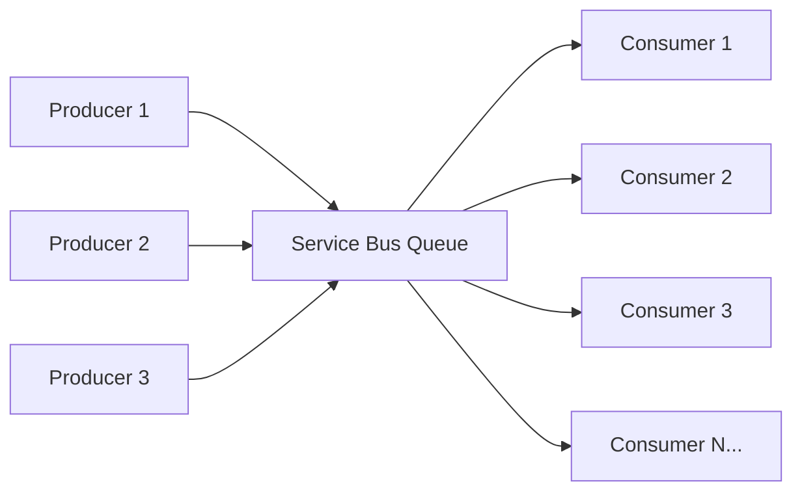

# How to Implement Competing Consumers Pattern with Azure Service Bus

Author: [nawazdhandala](https://www.github.com/nawazdhandala)

Tags: Azure Service Bus, Competing Consumers, Scalability, Load Balancing, Azure, Messaging, Design Patterns

Description: Implement the competing consumers pattern with Azure Service Bus to scale message processing horizontally across multiple workers with proper concurrency control.

---

The competing consumers pattern is one of the fundamental building blocks of scalable message-driven systems. The idea is simple: multiple consumer instances read from the same queue, and each message is processed by exactly one consumer. As load increases, you add more consumers. As it decreases, you remove them. Azure Service Bus queues implement this pattern natively - you just need to configure it correctly.

In this post, I will walk through implementing competing consumers, tuning concurrency, handling the edge cases that come with parallel processing, and scaling the consumer count based on load.

## The Pattern



Multiple producers publish messages to a queue. Multiple consumer instances compete to receive and process those messages. Service Bus ensures that each message is delivered to exactly one consumer (using the PeekLock mechanism). If a consumer fails to process a message, the lock expires and the message becomes available for another consumer to pick up.

## Basic Implementation

Here is a consumer that processes messages from a queue. You run multiple instances of this to implement competing consumers.

```csharp
using Azure.Messaging.ServiceBus;
using Microsoft.Extensions.Hosting;
using Microsoft.Extensions.Logging;

public class OrderConsumer : BackgroundService
{
    private readonly ServiceBusClient _client;
    private readonly ILogger<OrderConsumer> _logger;
    private readonly IOrderService _orderService;
    private ServiceBusProcessor _processor;

    public OrderConsumer(
        ServiceBusClient client,
        ILogger<OrderConsumer> logger,
        IOrderService orderService)
    {
        _client = client;
        _logger = logger;
        _orderService = orderService;
    }

    protected override async Task ExecuteAsync(CancellationToken stoppingToken)
    {
        _processor = _client.CreateProcessor("orders", new ServiceBusProcessorOptions
        {
            // Process up to 10 messages concurrently on this instance
            MaxConcurrentCalls = 10,

            // Use PeekLock so messages are not lost if processing fails
            ReceiveMode = ServiceBusReceiveMode.PeekLock,

            // Auto-complete after successful processing
            AutoCompleteMessages = false,

            // How long to keep the message locked while processing
            MaxAutoLockRenewalDuration = TimeSpan.FromMinutes(10),

            // Prefetch messages for better throughput
            PrefetchCount = 20
        });

        _processor.ProcessMessageAsync += HandleMessageAsync;
        _processor.ProcessErrorAsync += HandleErrorAsync;

        await _processor.StartProcessingAsync(stoppingToken);

        _logger.LogInformation("Order consumer started with MaxConcurrentCalls=10");

        // Keep running until cancellation is requested
        await Task.Delay(Timeout.Infinite, stoppingToken);
    }

    private async Task HandleMessageAsync(ProcessMessageEventArgs args)
    {
        var message = args.Message;

        _logger.LogInformation(
            "Consumer {Instance} processing message {Id}",
            Environment.MachineName, message.MessageId);

        try
        {
            var order = message.Body.ToObjectFromJson<Order>();
            await _orderService.ProcessAsync(order);
            await args.CompleteMessageAsync(message);
        }
        catch (Exception ex)
        {
            _logger.LogError(ex, "Failed to process message {Id}", message.MessageId);
            // Abandon so another consumer can pick it up
            await args.AbandonMessageAsync(message);
        }
    }

    private Task HandleErrorAsync(ProcessErrorEventArgs args)
    {
        _logger.LogError(args.Exception,
            "Error from Service Bus: {Source}", args.ErrorSource);
        return Task.CompletedTask;
    }

    public override async Task StopAsync(CancellationToken cancellationToken)
    {
        if (_processor != null)
        {
            await _processor.StopProcessingAsync(cancellationToken);
            await _processor.DisposeAsync();
        }
        await base.StopAsync(cancellationToken);
    }
}
```

## Using Azure Functions as Competing Consumers

Azure Functions is the simplest way to implement competing consumers because the scaling is handled automatically.

```csharp
public class OrderFunction
{
    private readonly IOrderService _orderService;
    private readonly ILogger<OrderFunction> _logger;

    public OrderFunction(IOrderService orderService, ILogger<OrderFunction> logger)
    {
        _orderService = orderService;
        _logger = logger;
    }

    // Each function instance is a competing consumer
    // Azure Functions automatically scales instances based on queue depth
    [Function("ProcessOrder")]
    public async Task Run(
        [ServiceBusTrigger("orders", Connection = "ServiceBusConnection")]
        ServiceBusReceivedMessage message,
        ServiceBusMessageActions messageActions)
    {
        _logger.LogInformation(
            "Processing order message {Id} on instance {Instance}",
            message.MessageId, Environment.MachineName);

        try
        {
            var order = message.Body.ToObjectFromJson<Order>();
            await _orderService.ProcessAsync(order);
            await messageActions.CompleteMessageAsync(message);
        }
        catch (Exception ex)
        {
            _logger.LogError(ex, "Failed to process order {Id}", message.MessageId);
            throw; // Let the runtime handle the retry
        }
    }
}
```

Configure the concurrency in `host.json`.

```json
{
  "version": "2.0",
  "extensions": {
    "serviceBus": {
      "prefetchCount": 20,
      "messageHandlerOptions": {
        "maxConcurrentCalls": 16,
        "autoComplete": false
      },
      "maxMessageBatchSize": 1000,
      "maxConcurrentCalls": 16
    }
  }
}
```

## Tuning Concurrency

The `MaxConcurrentCalls` setting controls how many messages a single consumer instance processes simultaneously. Getting this right is important for throughput and resource utilization.

```csharp
// For CPU-bound processing (e.g., data transformation, calculation)
// Keep concurrency close to the number of CPU cores
var cpuBoundOptions = new ServiceBusProcessorOptions
{
    MaxConcurrentCalls = Environment.ProcessorCount,
    PrefetchCount = Environment.ProcessorCount * 2
};

// For I/O-bound processing (e.g., HTTP calls, database writes)
// Higher concurrency is appropriate since threads spend time waiting
var ioBoundOptions = new ServiceBusProcessorOptions
{
    MaxConcurrentCalls = 32,
    PrefetchCount = 64
};

// For mixed workloads, start moderate and tune based on metrics
var mixedOptions = new ServiceBusProcessorOptions
{
    MaxConcurrentCalls = 16,
    PrefetchCount = 32
};
```

The `PrefetchCount` setting tells Service Bus to batch-fetch messages in advance. This reduces round trips and improves throughput. Set it to roughly 2x the `MaxConcurrentCalls` value. Too high a prefetch count can cause message lock expirations if your consumer cannot process them fast enough.

## Handling Lock Expiration

When a consumer takes too long to process a message, the PeekLock expires and the message becomes available to other consumers. This can lead to duplicate processing.

```csharp
// Configure auto-lock renewal for long-running processing
var processor = _client.CreateProcessor("orders", new ServiceBusProcessorOptions
{
    MaxConcurrentCalls = 10,
    // Auto-renew locks for up to 30 minutes
    // This prevents lock expiration during long processing
    MaxAutoLockRenewalDuration = TimeSpan.FromMinutes(30)
});
```

If your processing might take longer than the maximum auto-renew duration, consider breaking the work into smaller chunks or using Durable Functions for long-running orchestrations.

## Ensuring Idempotent Processing

With competing consumers, you must design for at-least-once delivery. A message might be processed more than once if a consumer crashes after processing but before completing the message, or if the lock expires.

```csharp
public class IdempotentOrderProcessor : IOrderService
{
    private readonly IDatabase _db;
    private readonly ILogger<IdempotentOrderProcessor> _logger;

    public async Task ProcessAsync(Order order)
    {
        // Check if this order has already been processed
        // Use a unique identifier from the message (not a random value)
        var existingResult = await _db.GetProcessingResultAsync(order.Id);

        if (existingResult != null)
        {
            _logger.LogInformation(
                "Order {Id} already processed at {Time}, skipping",
                order.Id, existingResult.ProcessedAt);
            return;
        }

        // Use optimistic concurrency to prevent race conditions
        // between competing consumers
        try
        {
            var result = new ProcessingResult
            {
                OrderId = order.Id,
                ProcessedAt = DateTime.UtcNow,
                ProcessedBy = Environment.MachineName
            };

            // This will fail with a unique constraint violation
            // if another consumer already processed this order
            await _db.InsertProcessingResultAsync(result);

            // Do the actual work only if we won the race
            await FulfillOrder(order);
        }
        catch (DuplicateKeyException)
        {
            _logger.LogInformation(
                "Order {Id} was processed by another consumer, skipping",
                order.Id);
        }
    }
}
```

## Scaling Based on Queue Depth

For container-based deployments, you can use KEDA (Kubernetes Event-Driven Autoscaling) to scale consumers based on the queue depth.

```yaml
# KEDA ScaledObject for Kubernetes
apiVersion: keda.sh/v1alpha1
kind: ScaledObject
metadata:
  name: order-consumer-scaler
spec:
  scaleTargetRef:
    name: order-consumer  # Name of the Kubernetes deployment
  minReplicaCount: 1       # Minimum number of consumer pods
  maxReplicaCount: 20      # Maximum number of consumer pods
  triggers:
    - type: azure-servicebus
      metadata:
        # Scale based on the number of active messages in the queue
        queueName: orders
        namespace: my-servicebus
        messageCount: "50"  # Target: 50 messages per consumer instance
      authenticationRef:
        name: servicebus-auth
```

This configuration scales the consumer deployment between 1 and 20 pods, adding a new pod for every 50 messages in the queue.

## Monitoring Competing Consumers

Track these key metrics to understand your consumer performance.

```kusto
// Query for Application Insights: consumer throughput by instance
customEvents
| where timestamp > ago(1h)
| where name == "MessageProcessed"
| summarize
    MessagesProcessed = count(),
    AvgDurationMs = avg(todouble(customDimensions["DurationMs"])),
    ErrorCount = countif(customDimensions["Success"] == "false")
    by bin(timestamp, 5m), tostring(customDimensions["Instance"])
| render timechart
```

```bash
# Check queue depth to see if consumers are keeping up
az servicebus queue show \
  --name orders \
  --namespace-name my-servicebus \
  --resource-group my-rg \
  --query "countDetails"
```

## Graceful Shutdown

When scaling down or deploying, consumers need to stop gracefully - finish processing current messages before shutting down.

```csharp
public override async Task StopAsync(CancellationToken cancellationToken)
{
    _logger.LogInformation("Consumer shutting down gracefully");

    if (_processor != null)
    {
        // StopProcessingAsync waits for current messages to finish
        // before shutting down the processor
        await _processor.StopProcessingAsync(cancellationToken);
        _logger.LogInformation("Processor stopped, all in-flight messages completed");
        await _processor.DisposeAsync();
    }

    await base.StopAsync(cancellationToken);
}
```

## Summary

The competing consumers pattern with Azure Service Bus gives you horizontal scalability for message processing. Deploy multiple consumer instances that read from the same queue, configure concurrency per instance with `MaxConcurrentCalls`, ensure idempotent processing to handle at-least-once delivery, and scale instances based on queue depth. Azure Functions provides the simplest implementation with automatic scaling, while container-based consumers with KEDA give you more control. The key considerations are concurrency tuning, lock management, and idempotent processing - get these right and the pattern scales smoothly from a single consumer to dozens.
