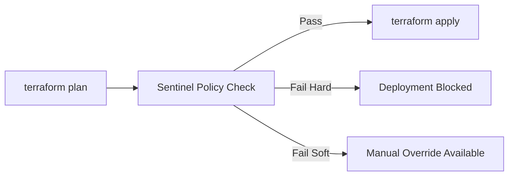

# How to Implement Compliance as Code for Azure Using Terraform Sentinel Policies

Author: [nawazdhandala](https://www.github.com/nawazdhandala)

Tags: Terraform, Sentinel, Azure, Compliance, Policy as Code, Governance, HashiCorp

Description: Implement compliance as code for Azure infrastructure using Terraform Sentinel policies to enforce security standards and governance rules before deployment.

---

Compliance in cloud environments is usually handled reactively. Resources get deployed, then an auditor or a scanning tool flags non-compliant configurations, and someone scrambles to fix them. This is slow, expensive, and stressful. Compliance as Code flips this model by enforcing compliance rules before resources are deployed. If a Terraform plan violates a policy, the deployment is blocked before anything touches Azure.

HashiCorp Sentinel is a policy-as-code framework built into Terraform Cloud and Terraform Enterprise. It evaluates policies against the Terraform plan, state, and configuration data, and it can enforce hard and soft guardrails on your infrastructure. In this post, I will show you how to write Sentinel policies for Azure compliance requirements.

## How Sentinel Works

Sentinel policies run between the plan and apply phases in Terraform Cloud:



There are three enforcement levels:

- **Advisory**: Logs a warning but does not block. Good for new policies you are evaluating.
- **Soft mandatory**: Blocks by default but authorized users can override. Good for policies with legitimate exceptions.
- **Hard mandatory**: Blocks with no override possible. Use for non-negotiable security requirements.

## Setting Up Sentinel

Sentinel policies live in a Git repository and are linked to your Terraform Cloud organization. Create a repository structure like this:

```
sentinel-policies/
  policies/
    azure-encryption.sentinel
    azure-networking.sentinel
    azure-tagging.sentinel
    azure-sku-restrictions.sentinel
  test/
    azure-encryption/
      pass.hcl
      fail.hcl
    azure-networking/
      pass.hcl
      fail.hcl
  sentinel.hcl          # Policy set configuration
```

The `sentinel.hcl` file defines which policies to apply and their enforcement levels:

```hcl
# sentinel.hcl - Policy set configuration

policy "azure-encryption" {
  source            = "./policies/azure-encryption.sentinel"
  enforcement_level = "hard-mandatory"
}

policy "azure-networking" {
  source            = "./policies/azure-networking.sentinel"
  enforcement_level = "hard-mandatory"
}

policy "azure-tagging" {
  source            = "./policies/azure-tagging.sentinel"
  enforcement_level = "soft-mandatory"
}

policy "azure-sku-restrictions" {
  source            = "./policies/azure-sku-restrictions.sentinel"
  enforcement_level = "advisory"
}
```

## Policy 1: Enforce Encryption at Rest

This policy ensures that all Azure storage accounts have encryption enabled and all databases use encryption:

```python
# policies/azure-encryption.sentinel
# Enforce encryption at rest for all storage accounts and databases

import "tfplan/v2" as tfplan

# Get all storage accounts being created or updated
storage_accounts = filter tfplan.resource_changes as _, rc {
    rc.type is "azurerm_storage_account" and
    (rc.change.actions contains "create" or rc.change.actions contains "update")
}

# Get all SQL databases being created or updated
sql_databases = filter tfplan.resource_changes as _, rc {
    rc.type is "azurerm_mssql_database" and
    (rc.change.actions contains "create" or rc.change.actions contains "update")
}

# Get all PostgreSQL servers
postgresql_servers = filter tfplan.resource_changes as _, rc {
    rc.type is "azurerm_postgresql_flexible_server" and
    (rc.change.actions contains "create" or rc.change.actions contains "update")
}

# Rule: Storage accounts must enforce HTTPS
storage_https_rule = rule {
    all storage_accounts as _, sa {
        sa.change.after.enable_https_traffic_only is true
    }
}

# Rule: Storage accounts must use TLS 1.2
storage_tls_rule = rule {
    all storage_accounts as _, sa {
        sa.change.after.min_tls_version is "TLS1_2"
    }
}

# Rule: Storage accounts must not allow public blob access
storage_no_public_rule = rule {
    all storage_accounts as _, sa {
        sa.change.after.allow_nested_items_to_be_public is false or
        sa.change.after.allow_nested_items_to_be_public is null
    }
}

# Main policy - all rules must pass
main = rule {
    storage_https_rule and
    storage_tls_rule and
    storage_no_public_rule
}
```

## Policy 2: Network Security Requirements

This policy enforces networking standards like requiring NSGs on subnets and blocking public IPs on VMs:

```python
# policies/azure-networking.sentinel
# Enforce network security standards for Azure resources

import "tfplan/v2" as tfplan

# Find all virtual machines being created
virtual_machines = filter tfplan.resource_changes as _, rc {
    rc.type is "azurerm_linux_virtual_machine" and
    rc.change.actions contains "create"
}

windows_vms = filter tfplan.resource_changes as _, rc {
    rc.type is "azurerm_windows_virtual_machine" and
    rc.change.actions contains "create"
}

# Find all public IPs being created
public_ips = filter tfplan.resource_changes as _, rc {
    rc.type is "azurerm_public_ip" and
    rc.change.actions contains "create"
}

# Find all network security groups
nsgs = filter tfplan.resource_changes as _, rc {
    rc.type is "azurerm_network_security_group" and
    (rc.change.actions contains "create" or rc.change.actions contains "update")
}

# Rule: NSGs must not have open SSH (port 22) from the internet
no_open_ssh = rule {
    all nsgs as _, nsg {
        all (nsg.change.after.security_rule else []) as _, rule {
            not (
                rule.destination_port_range is "22" and
                rule.source_address_prefix is "*" and
                rule.access is "Allow" and
                rule.direction is "Inbound"
            )
        }
    }
}

# Rule: NSGs must not have open RDP (port 3389) from the internet
no_open_rdp = rule {
    all nsgs as _, nsg {
        all (nsg.change.after.security_rule else []) as _, rule {
            not (
                rule.destination_port_range is "3389" and
                rule.source_address_prefix is "*" and
                rule.access is "Allow" and
                rule.direction is "Inbound"
            )
        }
    }
}

# Rule: Public IPs must have a purpose tag explaining why they are needed
public_ip_justification = rule {
    all public_ips as _, pip {
        pip.change.after.tags is not null and
        pip.change.after.tags contains "Purpose"
    }
}

main = rule {
    no_open_ssh and
    no_open_rdp and
    public_ip_justification
}
```

## Policy 3: Mandatory Tagging

This policy enforces that all taggable resources have required tags:

```python
# policies/azure-tagging.sentinel
# Enforce mandatory tags on all Azure resources

import "tfplan/v2" as tfplan

# Required tags that must exist on all resources
required_tags = ["Environment", "CostCenter", "Owner"]

# Allowed values for the Environment tag
allowed_environments = ["Development", "Staging", "Production", "Sandbox"]

# Resource types that support tags
taggable_resources = filter tfplan.resource_changes as _, rc {
    rc.change.after is not null and
    rc.change.after contains "tags" and
    (rc.change.actions contains "create" or rc.change.actions contains "update")
}

# Rule: All required tags must be present
tags_present = rule {
    all taggable_resources as _, resource {
        all required_tags as tag {
            resource.change.after.tags is not null and
            resource.change.after.tags contains tag
        }
    }
}

# Rule: Environment tag must have an allowed value
valid_environment = rule {
    all taggable_resources as _, resource {
        resource.change.after.tags is not null and
        resource.change.after.tags contains "Environment" and
        resource.change.after.tags["Environment"] in allowed_environments
    }
}

# Rule: CostCenter tag must match the pattern CC-XXXX
valid_cost_center = rule {
    all taggable_resources as _, resource {
        resource.change.after.tags is not null and
        resource.change.after.tags contains "CostCenter" and
        resource.change.after.tags["CostCenter"] matches "^CC-\\d{4}$"
    }
}

main = rule {
    tags_present and
    valid_environment and
    valid_cost_center
}
```

## Policy 4: SKU Restrictions by Environment

This policy prevents over-provisioning in non-production environments:

```python
# policies/azure-sku-restrictions.sentinel
# Restrict expensive SKUs in non-production environments

import "tfplan/v2" as tfplan
import "tfrun"

# Determine the environment from workspace name or tags
# Convention: workspace names end with -dev, -staging, -prod
workspace_name = tfrun.workspace.name

is_production = workspace_name matches ".*-prod$" or
                workspace_name matches ".*-production$"

# Allowed VM sizes for non-production
nonprod_allowed_vm_sizes = [
    "Standard_B1s",
    "Standard_B2s",
    "Standard_B4ms",
    "Standard_D2s_v5",
    "Standard_D4s_v5",
]

# Find all VMs being created
linux_vms = filter tfplan.resource_changes as _, rc {
    rc.type is "azurerm_linux_virtual_machine" and
    rc.change.actions contains "create"
}

windows_vms = filter tfplan.resource_changes as _, rc {
    rc.type is "azurerm_windows_virtual_machine" and
    rc.change.actions contains "create"
}

all_vms = []
for linux_vms as _, vm {
    append(all_vms, vm)
}
for windows_vms as _, vm {
    append(all_vms, vm)
}

# Rule: Non-production VMs must use approved sizes
vm_size_rule = rule when not is_production {
    all all_vms as _, vm {
        vm.change.after.size in nonprod_allowed_vm_sizes
    }
}

# Find App Service Plans
app_service_plans = filter tfplan.resource_changes as _, rc {
    rc.type is "azurerm_service_plan" and
    rc.change.actions contains "create"
}

# Allowed App Service Plan SKUs for non-production
nonprod_allowed_plan_skus = ["B1", "B2", "B3", "S1"]

plan_sku_rule = rule when not is_production {
    all app_service_plans as _, plan {
        plan.change.after.sku_name in nonprod_allowed_plan_skus
    }
}

main = rule {
    vm_size_rule and
    plan_sku_rule
}
```

## Testing Sentinel Policies

Always test policies before deploying them. Sentinel includes a built-in test framework:

```hcl
# test/azure-encryption/pass.hcl - Test case that should pass

mock "tfplan/v2" {
  module {
    source = "mock-tfplan-pass.sentinel"
  }
}

test {
  rules = {
    main = true  # Expect the main rule to pass
  }
}
```

```hcl
# test/azure-encryption/fail.hcl - Test case that should fail

mock "tfplan/v2" {
  module {
    source = "mock-tfplan-fail.sentinel"
  }
}

test {
  rules = {
    main = false  # Expect the main rule to fail
  }
}
```

Create mock data that simulates Terraform plan output:

```python
# test/azure-encryption/mock-tfplan-pass.sentinel
# Mock data simulating a compliant storage account

resource_changes = {
    "azurerm_storage_account.main": {
        "type": "azurerm_storage_account",
        "change": {
            "actions": ["create"],
            "after": {
                "enable_https_traffic_only": true,
                "min_tls_version": "TLS1_2",
                "allow_nested_items_to_be_public": false,
                "tags": {
                    "Environment": "Production",
                    "CostCenter": "CC-1234",
                    "Owner": "team@company.com",
                },
            },
        },
    },
}
```

Run the tests:

```bash
# Run all Sentinel tests
sentinel test

# Run tests for a specific policy
sentinel test -run azure-encryption
```

## Connecting Policies to Terraform Cloud

Link your policy repository to Terraform Cloud:

1. In Terraform Cloud, go to Settings then Policy Sets
2. Create a new policy set connected to your Git repository
3. Configure which workspaces the policies apply to (all or specific ones)
4. Set the policies path if it is not the repository root

You can also manage this with Terraform:

```hcl
# Manage policy sets with Terraform

resource "tfe_policy_set" "azure_compliance" {
  name          = "azure-compliance"
  description   = "Compliance policies for Azure infrastructure"
  organization  = "my-company"
  kind          = "sentinel"

  vcs_repo {
    identifier     = "my-company/sentinel-policies"
    branch         = "main"
    oauth_token_id = tfe_oauth_client.github.oauth_token_id
  }

  # Apply to all workspaces that deploy Azure resources
  workspace_ids = [
    for ws in tfe_workspace.azure_workspaces : ws.id
  ]
}
```

## Handling Policy Exceptions

Not every rule applies to every situation. Sentinel soft-mandatory policies allow authorized users to override failures. For more granular exceptions, use Sentinel parameters:

```python
# policies/azure-encryption.sentinel
# Accept exceptions via parameter

param exceptions = []

# Allow specific resources to be excluded from the policy
storage_accounts_filtered = filter storage_accounts as address, sa {
    address not in exceptions
}
```

Then in the policy set configuration:

```hcl
policy "azure-encryption" {
  source            = "./policies/azure-encryption.sentinel"
  enforcement_level = "hard-mandatory"
  params = {
    exceptions = ["azurerm_storage_account.legacy_app"]
  }
}
```

## Compliance Reporting

Terraform Cloud tracks policy evaluation results for every run. You can query this data through the API for compliance dashboards:

```bash
# Get policy check results for a specific run
curl -s \
  --header "Authorization: Bearer $TFC_TOKEN" \
  "https://app.terraform.io/api/v2/runs/run-xxxxx/policy-checks" | jq '.data[].attributes.result'
```

This gives you an audit trail showing which policies passed, which failed, and whether any overrides were used.

## Wrapping Up

Sentinel policies transform compliance from a reactive audit exercise into a proactive deployment gate. Policies run automatically on every Terraform plan, and non-compliant infrastructure never reaches Azure. Start with advisory policies to understand the impact, promote them to soft-mandatory as you gain confidence, and make truly critical security rules hard-mandatory. The combination of Sentinel policies in Git, automated testing, and Terraform Cloud enforcement gives you a compliance framework that scales with your organization.
