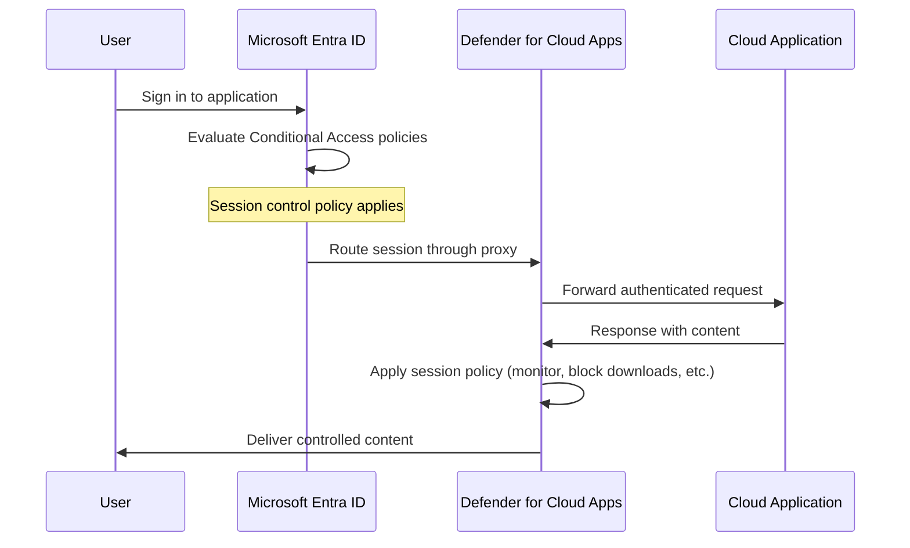

# How to Implement Conditional Access Session Controls for Cloud App Security in Microsoft Entra ID

Author: [nawazdhandala](https://www.github.com/nawazdhandala)

Tags: Conditional Access, Session Controls, Microsoft Defender for Cloud Apps, Microsoft Entra ID, Zero Trust, Security, CASB

Description: Learn how to configure Conditional Access session controls to enforce real-time monitoring and restrictions on cloud application sessions.

---

Conditional Access policies in Microsoft Entra ID are usually about the gate - they decide whether to allow or block access at sign-in time. But what happens after the user is authenticated? Session controls extend Conditional Access into the active session itself, letting you monitor user actions, block downloads, prevent data exfiltration, and enforce read-only access in real time.

This capability is powered by Microsoft Defender for Cloud Apps (formerly Microsoft Cloud App Security), which acts as a reverse proxy between the user and the cloud application. The result is granular, context-aware control that goes far beyond "allow or deny."

In this guide, I will walk through how to set up session controls, configure the most useful policies, and handle the practical challenges that come with proxy-based session management.

## How Session Controls Work

When a Conditional Access policy routes a session through Defender for Cloud Apps, the traffic flows through a reverse proxy. The user authenticates normally through Entra ID, but the session is then proxied through Defender for Cloud Apps, which can inspect and control the traffic in real time.



The user typically does not notice the proxy unless they look at the URL, which shows a `.mcas.ms` domain suffix during the session.

## Prerequisites

To use session controls, you need:

- Microsoft Entra ID P1 or P2 licenses
- Microsoft Defender for Cloud Apps license (included in Microsoft 365 E5 or as a standalone add-on)
- The cloud applications you want to control must support SAML 2.0 or OpenID Connect for single sign-on through Entra ID
- Global Administrator or Security Administrator role

## Step 1: Enable Conditional Access App Control

First, enable the integration between Conditional Access and Defender for Cloud Apps.

Navigate to the Microsoft Defender portal (security.microsoft.com) > Cloud Apps > Connected apps > Conditional Access App Control apps.

For Microsoft 365 applications (Exchange Online, SharePoint, Teams), the integration is automatic. For third-party SAML applications, you need to onboard them.

### Onboarding a Third-Party Application

1. Configure the application for SAML SSO in Entra ID (if not already done)
2. Create a Conditional Access policy that routes the app through session control (Step 2)
3. Sign in to the application while the policy is active - Defender for Cloud Apps will detect and catalog it automatically
4. In the Defender portal, go to Conditional Access App Control apps and verify the app appears with status "Connected"

For some applications, you may need to add the Defender for Cloud Apps certificate to the SAML configuration. The portal provides step-by-step instructions specific to each application.

## Step 2: Create a Conditional Access Policy with Session Controls

Navigate to Microsoft Entra ID > Security > Conditional Access > New policy.

Configure the policy with these settings:

**Name**: "Session Control - Monitor and Restrict Downloads for Unmanaged Devices"

**Assignments**:
- Users: All users (or a specific group for testing)
- Exclude: Break-glass accounts
- Cloud apps: Select the specific applications you want to control
- Conditions > Client apps: Browser (session controls only work with browser sessions)
- Conditions > Device state: Filter for unmanaged devices (devices not marked as compliant or hybrid Azure AD joined)

**Session controls**:
- Use Conditional Access App Control: Select "Use custom policy"

This tells Entra ID to route matching sessions through the Defender for Cloud Apps proxy. The actual enforcement rules are configured in Defender for Cloud Apps (Step 3).

Alternatively, for a quick setup, you can select one of the built-in options:
- **Monitor only**: Routes traffic through the proxy for visibility without blocking anything
- **Block downloads**: Prevents file downloads during the session

Here is how to create the same policy using PowerShell.

```powershell
# Connect to Microsoft Graph
Connect-MgGraph -Scopes "Policy.ReadWrite.ConditionalAccess"

# Create a Conditional Access policy with session controls
$policy = @{
    DisplayName = "Session Control - Restrict Unmanaged Devices"
    State = "enabledForReportingButNotEnforced"  # Start in report-only mode
    Conditions = @{
        Users = @{
            IncludeUsers = @("All")
            ExcludeUsers = @("break-glass-account-id")
        }
        Applications = @{
            IncludeApplications = @("app-id-1", "app-id-2")
        }
        ClientAppTypes = @("browser")
        # Target unmanaged devices using a filter
        Devices = @{
            DeviceFilter = @{
                Mode = "include"
                Rule = "device.isCompliant -ne True -and device.trustType -ne 'ServerAD'"
            }
        }
    }
    SessionControls = @{
        CloudAppSecurity = @{
            IsEnabled = $true
            CloudAppSecurityType = "mcasConfigured"  # Use custom policy from MDCA
        }
    }
}

New-MgIdentityConditionalAccessPolicy -BodyParameter $policy
```

I recommend starting in report-only mode (`enabledForReportingButNotEnforced`) so you can see which sessions would be affected before enforcing.

## Step 3: Configure Session Policies in Defender for Cloud Apps

Now create the actual enforcement rules in the Defender portal.

Navigate to Cloud Apps > Policies > Policy management > Create policy > Session policy.

### Policy: Block Downloads of Sensitive Files

This policy prevents users on unmanaged devices from downloading files that contain sensitive information.

1. **Policy name**: "Block sensitive file downloads from unmanaged devices"
2. **Category**: DLP
3. **Session control type**: Control file download (with inspection)
4. **Activity source filter**:
   - Device tag: Does not equal "Compliant" or "Azure AD joined"
5. **Files matching all of the following**:
   - Content inspection method: Built-in DLP
   - Sensitive information types: Credit Card Number, Social Security Number
6. **Actions**: Block
7. **Alerts**: Create an alert for each matching event

### Policy: Monitor and Log All Downloads

For visibility without blocking, create a monitoring policy.

1. **Policy name**: "Monitor all downloads to unmanaged devices"
2. **Session control type**: Monitor only
3. **Activity source filter**: Device tag does not equal "Compliant"
4. **Actions**: Log the activity (appears in the activity log for investigation)
5. **Alerts**: Create an alert with daily summary

### Policy: Protect Against Data Exfiltration with Clipboard Restrictions

For high-security applications, you can restrict copy-paste and printing operations.

1. **Policy name**: "Block copy-paste from HR application"
2. **Session control type**: Block activities
3. **Activity type**: Cut/Copy/Paste
4. **Application filter**: HR Application
5. **Actions**: Block

## Step 4: Test the Session Controls

Before enabling the Conditional Access policy for all users, test with a pilot group.

1. Add yourself and a few test users to the pilot group
2. Enable the Conditional Access policy targeting only the pilot group
3. Sign in to the controlled application from an unmanaged device
4. Verify the URL shows the `.mcas.ms` suffix, indicating the session is proxied
5. Try downloading a file - it should be blocked if it matches your DLP rules
6. Check the Defender for Cloud Apps activity log to verify events are being captured

```bash
# Check activity logs using the Defender for Cloud Apps API
# This requires an API token from the MDCA portal
curl -X GET "https://your-tenant.portal.cloudappsecurity.com/api/v1/activities/" \
  -H "Authorization: Token YOUR_API_TOKEN" \
  -H "Content-Type: application/json" \
  -d '{"filters":{"policy":{"eq":["your-session-policy-id"]}}}' | python -m json.tool
```

## Common Session Control Scenarios

### Scenario 1: Allow Read but Block Download for Contractors

Contractors need to view documents in SharePoint but should not be able to download copies to their personal devices.

Configure the session policy to allow browsing and viewing but block the download action. Users can still read documents in the browser, including Office files through Office Online, but clicking the download button is blocked.

### Scenario 2: Watermark Documents During Proxy Sessions

When users from unmanaged devices view documents, you can apply a dynamic watermark showing their email address and timestamp. This discourages screenshotting by making every screenshot traceable.

### Scenario 3: Enforce Step-Up Authentication for Sensitive Actions

Combine session controls with authentication context. When a user tries to perform a sensitive action (like accessing a confidential SharePoint site), require step-up authentication with a specific authentication strength.

## Troubleshooting Common Issues

**Application breaks when proxied**: Some applications do not handle the URL rewrite well. Check the Defender portal for unsupported app warnings. You may need to add specific domains to the bypass list.

**Session controls not applying**: Verify that the Conditional Access policy is not in report-only mode. Check that the user matches the policy conditions, especially the device state filter.

**Slow performance**: The reverse proxy adds latency. For applications where performance is critical, consider applying session controls only to unmanaged devices or high-risk conditions rather than all sessions.

**Users see certificate warnings**: If the application uses certificate pinning, the Defender proxy cannot intercept the traffic. These applications need to be configured with the Defender for Cloud Apps root certificate.

## Monitoring Session Control Effectiveness

Track how session controls are performing with these metrics:

- Number of sessions routed through the proxy
- Number of blocked downloads
- Number of DLP matches in proxied sessions
- User feedback and support tickets related to session controls

Review the Defender for Cloud Apps dashboard regularly and adjust policies based on actual usage patterns. If a policy generates many false positives, refine the DLP rules or narrow the conditions.

## Wrapping Up

Conditional Access session controls extend your security perimeter from the authentication gate into the active session. By routing traffic through the Defender for Cloud Apps proxy, you can monitor, restrict, and control what users do inside cloud applications based on real-time context like device compliance, user risk, and content sensitivity. Start with monitoring-only policies to understand your traffic patterns, then progressively add enforcement rules for your highest-risk scenarios. The combination of Conditional Access conditions with Defender session policies gives you the flexibility to implement precise, context-aware controls without blanket blocking.
