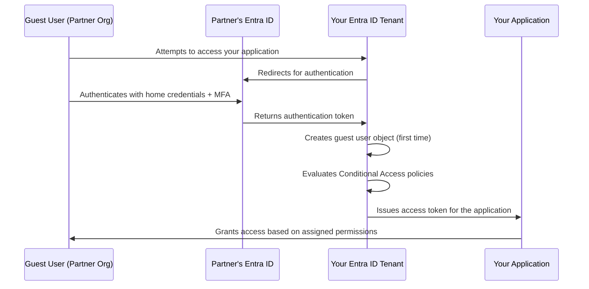

# How to Implement Cross-Tenant B2B Collaboration Using Microsoft Entra External Identities

Author: [nawazdhandala](https://www.github.com/nawazdhandala)

Tags: Azure, Microsoft Entra ID, B2B Collaboration, External Identities, Cross-Tenant, Guest Users, Identity Federation

Description: A complete guide to configuring Microsoft Entra External Identities for cross-tenant B2B collaboration, including invitation flows, access controls, and security settings.

---

Modern businesses rarely operate in isolation. You work with partners, vendors, consultants, and customers who need access to your applications and resources. Microsoft Entra External Identities (formerly Azure AD B2B) lets you invite users from other organizations into your tenant as guest users. These guests authenticate with their own organization's identity provider but get controlled access to your resources.

This guide covers the full setup of cross-tenant B2B collaboration, from basic guest invitations to advanced cross-tenant access settings and security controls.

## How B2B Collaboration Works

When you invite a guest user, they do not create a new account in your tenant. Instead, they authenticate with their home organization and receive a token that your tenant recognizes:



The guest user object in your tenant is a reference to their external identity. It does not contain their password or credentials - those stay in their home tenant.

## Prerequisites

You need:
- Microsoft Entra ID (any tier supports B2B, but P1/P2 adds Conditional Access for guests)
- Global Administrator or User Administrator role
- Knowledge of which external organizations you want to collaborate with

## Step 1: Configure External Collaboration Settings

First, configure who can invite guests and what restrictions apply:

1. Go to the Microsoft Entra admin center at entra.microsoft.com.
2. Navigate to Identity, then External identities, then External collaboration settings.
3. Configure the following:

### Guest User Access Restrictions

Choose how much access guest users have to your directory:
- **Guest users have the same access as members** (least restrictive - not recommended)
- **Guest users have limited access to properties and memberships of directory objects** (recommended)
- **Guest user access is restricted to properties and memberships of their own directory objects** (most restrictive)

### Guest Invite Settings

Control who can send invitations:
- **Anyone in the organization can invite guest users including guests and non-admins** (least restrictive)
- **Member users and users assigned to specific admin roles can invite guest users** (recommended for most organizations)
- **Only users assigned to specific admin roles can invite guest users** (most restrictive)

### Collaboration Restrictions

You can allowlist or blocklist specific domains:

```powershell
# Configure collaboration restrictions to only allow specific partner domains
Connect-MgGraph -Scopes "Policy.ReadWrite.Authorization"

$params = @{
    AllowedTargetTenants = @(
        "partner1.com",
        "partner2.com",
        "consultant-firm.com"
    )
    IsAllowedList = $true  # true = allowlist, false = blocklist
}

# Note: This is configured through the external collaboration settings
# Using the Graph API or the portal
Write-Host "Configure allowed domains in the External collaboration settings portal page."
Write-Host "Or use the Cross-tenant access settings for more granular control."
```

## Step 2: Configure Cross-Tenant Access Settings

Cross-tenant access settings give you fine-grained control over how B2B collaboration works with specific organizations:

1. In the Entra admin center, go to External identities, then Cross-tenant access settings.
2. You will see default settings that apply to all external organizations.
3. Click Add organization to configure settings for a specific partner.

### Default Settings

The default settings apply to any organization not explicitly configured:

```powershell
# Configure default cross-tenant access settings using Microsoft Graph
Connect-MgGraph -Scopes "Policy.ReadWrite.CrossTenantAccess"

# Get current default settings
$defaults = Get-MgPolicyCrossTenantAccessPolicyDefault

# Update default inbound settings (how external users access your resources)
$inboundParams = @{
    B2BCollaborationInbound = @{
        UsersAndGroups = @{
            AccessType = "allowed"
            Targets = @(
                @{
                    Target = "AllUsers"
                    TargetType = "user"
                }
            )
        }
        Applications = @{
            AccessType = "allowed"
            Targets = @(
                @{
                    Target = "AllApplications"
                    TargetType = "application"
                }
            )
        }
    }
}

Update-MgPolicyCrossTenantAccessPolicyDefault -BodyParameter $inboundParams
Write-Host "Default inbound cross-tenant access settings updated."
```

### Partner-Specific Settings

For trusted partners, you can configure more permissive settings like trusting their MFA claims:

1. Click Add organization and enter the partner's tenant ID or domain.
2. On the Inbound access tab, configure:
   - Which of their users can be invited (all users or specific groups)
   - Which of your applications they can access
3. On the Trust settings tab, configure:
   - **Trust multi-factor authentication from the partner tenant**: If enabled, guests from this partner do not need to re-register MFA in your tenant
   - **Trust compliant devices**: Accept device compliance claims from the partner
   - **Trust hybrid joined devices**: Accept hybrid Azure AD join claims

Trusting MFA from a partner is a significant improvement to the user experience. Without it, guest users must register MFA separately in your tenant, which is confusing and creates friction.

## Step 3: Invite Guest Users

### Individual Invitations via Portal

1. In the Entra admin center, go to Users, then All users.
2. Click Invite external user.
3. Enter the guest's email address.
4. Optionally add a personal message.
5. Configure group memberships and application assignments.
6. Click Invite.

The guest receives an email invitation with a link to accept it.

### Bulk Invitations via PowerShell

```powershell
# Bulk invite guest users from a CSV file
Connect-MgGraph -Scopes "User.Invite.All"

# CSV format: Name,Email,Message
$guests = Import-Csv "guest-invitations.csv"

foreach ($guest in $guests) {
    $invitation = New-MgInvitation `
        -InvitedUserDisplayName $guest.Name `
        -InvitedUserEmailAddress $guest.Email `
        -InviteRedirectUrl "https://myapps.microsoft.com" `
        -SendInvitationMessage $true `
        -InvitedUserMessageInfo @{
            CustomizedMessageBody = "Welcome to our collaboration portal. Please accept this invitation to access shared resources."
        }

    Write-Host "Invited: $($guest.Email) - Status: $($invitation.Status)"
}
```

### Programmatic Invitation via API

For automated onboarding workflows:

```powershell
# Invite a guest and immediately assign them to a group and application
$invitation = New-MgInvitation `
    -InvitedUserDisplayName "Jane Smith" `
    -InvitedUserEmailAddress "jane@partner.com" `
    -InviteRedirectUrl "https://myapps.microsoft.com" `
    -SendInvitationMessage $true

$guestUserId = $invitation.InvitedUser.Id

# Add the guest to a security group that grants access to shared resources
New-MgGroupMember `
    -GroupId "PARTNER_ACCESS_GROUP_ID" `
    -DirectoryObjectId $guestUserId

Write-Host "Guest invited and added to partner access group."
```

## Step 4: Configure Conditional Access for Guest Users

Guest users should be subject to appropriate security controls. Create Conditional Access policies specifically for external users:

```powershell
# Create a Conditional Access policy for guest users
# Requires MFA for all guest sign-ins from untrusted locations
Connect-MgGraph -Scopes "Policy.ReadWrite.ConditionalAccess"

$params = @{
    DisplayName = "Require MFA for Guest Users"
    State = "enabled"
    Conditions = @{
        Users = @{
            IncludeGuestsOrExternalUsers = @{
                GuestOrExternalUserTypes = "b2bCollaborationGuest"
                ExternalTenants = @{
                    MembershipKind = "all"
                }
            }
        }
        Applications = @{
            IncludeApplications = @("All")
        }
    }
    GrantControls = @{
        Operator = "OR"
        BuiltInControls = @("mfa")
    }
}

New-MgIdentityConditionalAccessPolicy -BodyParameter $params
Write-Host "Conditional Access policy for guests created."
```

Consider creating additional policies that:
- Block guest access from high-risk locations
- Require Terms of Use acceptance for guests
- Limit guest session duration (e.g., require re-authentication every 8 hours)
- Restrict guest access to specific applications only

## Step 5: Configure Self-Service Sign-Up (Optional)

For scenarios where partners should be able to sign up themselves without explicit invitations:

1. Go to External identities, then User flows.
2. Click New user flow.
3. Configure the sign-up flow:
   - Select which identity providers to allow (Microsoft accounts, Google, email one-time passcode)
   - Choose which attributes to collect during sign-up
   - Optionally add API connectors for custom validation
4. Associate the user flow with an application.

This is useful for partner portals, community applications, or any scenario where you want external users to self-register with approval.

## Step 6: Manage Guest User Lifecycle

Guest users should not exist indefinitely without review. Set up access reviews:

```powershell
# Create an access review for guest users
Connect-MgGraph -Scopes "AccessReview.ReadWrite.All"

$params = @{
    DisplayName = "Quarterly Guest User Review"
    DescriptionForAdmins = "Review all guest users and remove those who no longer need access."
    Scope = @{
        Query = "./members/microsoft.graph.user/?`$count=true&`$filter=(userType eq 'Guest')"
        QueryType = "MicrosoftGraph"
    }
    # Group owners review the guests in their groups
    Reviewers = @(
        @{
            Query = "./manager"
            QueryType = "MicrosoftGraph"
        }
    )
    Settings = @{
        MailNotificationsEnabled = $true
        JustificationRequiredOnApproval = $true
        DefaultDecisionEnabled = $true
        DefaultDecision = "Deny"  # Remove access if reviewer does not respond
        InstanceDurationInDays = 14  # 14 days to complete the review
        AutoApplyDecisionsEnabled = $true
        Recurrence = @{
            Pattern = @{
                Type = "absoluteMonthly"
                Interval = 3  # Every 3 months
            }
            Range = @{
                Type = "noEnd"
                StartDate = "2026-03-01"
            }
        }
    }
}

Write-Host "Configure access reviews through the Entra admin center or Identity Governance."
```

## Step 7: Monitor Guest Activity

Keep track of what guest users are doing in your environment:

```kusto
// Monitor guest user sign-in activity
// Identify guests who have not signed in recently (candidates for removal)
SigninLogs
| where TimeGenerated > ago(90d)
| where UserType == "Guest"
| summarize
    LastSignIn = max(TimeGenerated),
    SignInCount = count(),
    AppsUsed = make_set(AppDisplayName, 10),
    DistinctIPs = dcount(IPAddress)
    by UserPrincipalName, UserDisplayName
| sort by LastSignIn asc
```

```kusto
// Find guest users who have never signed in
// These are likely stale invitations that should be cleaned up
let activeGuests = SigninLogs
    | where TimeGenerated > ago(90d)
    | where UserType == "Guest"
    | distinct UserPrincipalName;
// This would need to be correlated with directory data
// In practice, use the Entra admin center to find guests with no sign-in activity
```

## Security Best Practices

When implementing B2B collaboration, follow these practices:

First, always trust MFA from known partner tenants rather than requiring guests to register MFA again in your tenant. This improves the experience without reducing security, as long as you trust the partner's MFA implementation.

Second, use Conditional Access to enforce security requirements for guest access. Do not assume that guests from partner organizations have the same security posture as your internal users.

Third, limit guest access to only the applications and resources they need. Do not grant guests access to all applications by default.

Fourth, implement regular access reviews. Guest users are often forgotten after the project they were invited for ends. Quarterly reviews ensure stale accounts are cleaned up.

Fifth, use cross-tenant access settings to configure per-organization trust rather than broad defaults. Each partnership may have different security requirements.

## Conclusion

Microsoft Entra External Identities provides a comprehensive framework for cross-tenant B2B collaboration. The key steps are configuring your external collaboration settings, setting up cross-tenant access policies for trusted partners, inviting guests with appropriate access, applying Conditional Access for security, and implementing lifecycle management through access reviews. When configured properly, B2B collaboration lets your organization work seamlessly with external partners while maintaining full control over what they can access and how long they retain that access.
