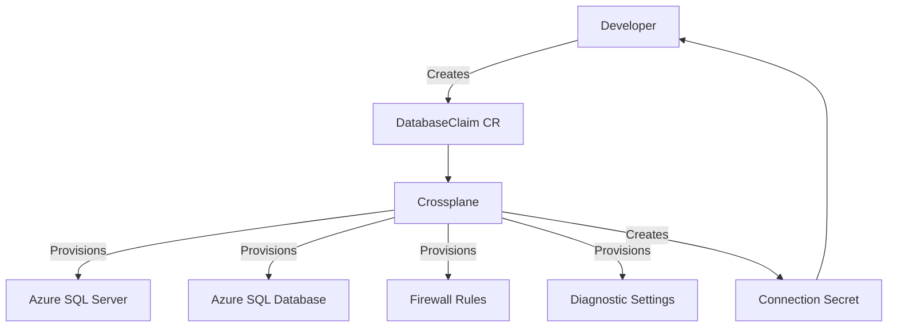

# How to Implement Crossplane Compositions for Azure Database Provisioning

Author: [nawazdhandala](https://www.github.com/nawazdhandala)

Tags: Crossplane, Azure, Kubernetes, Database, Infrastructure as Code, GitOps, Cloud

Description: Learn how to build Crossplane Compositions that let developers self-service Azure databases through Kubernetes-native APIs and custom resource definitions.

---

Crossplane brings infrastructure management into Kubernetes. Instead of writing Terraform modules and running pipelines, your developers create Kubernetes resources and Crossplane provisions the cloud infrastructure. The real power comes from Compositions - abstractions that let platform teams define opinionated infrastructure templates that developers consume through simple custom resources.

This post walks through building a Crossplane Composition for Azure database provisioning. We will create a Composite Resource Definition (XRD) that exposes a simple API, and a Composition that provisions an Azure SQL Server, database, firewall rules, and diagnostic settings behind the scenes.

## Why Crossplane for Databases

Platform teams typically want to standardize how databases get provisioned. Every database should have diagnostic settings enabled, specific firewall rules, a certain SKU tier, and proper tagging. Developers just want a database with a connection string - they should not need to know about all those operational details.

Crossplane Compositions solve this by creating an abstraction layer. The platform team defines the Composition (the "how"), and developers interact with a simplified API (the "what").



## Prerequisites

You need a Kubernetes cluster with Crossplane installed and the Azure provider configured. Here is a quick setup if you do not have it yet.

```bash
# Install Crossplane using Helm
helm repo add crossplane-stable https://charts.crossplane.io/stable
helm repo update
helm install crossplane crossplane-stable/crossplane \
  --namespace crossplane-system \
  --create-namespace

# Install the Azure provider
kubectl apply -f - <<EOF
apiVersion: pkg.crossplane.io/v1
kind: Provider
metadata:
  name: provider-azure-sql
spec:
  package: xpkg.upbound.io/upbound/provider-azure-sql:v1.1.0
EOF
```

## Defining the Composite Resource Definition (XRD)

The XRD is your API contract. It defines what developers can specify when they request a database.

```yaml
# xrd-database.yaml
apiVersion: apiextensions.crossplane.io/v1
kind: CompositeResourceDefinition
metadata:
  name: xdatabases.platform.example.com
spec:
  group: platform.example.com
  names:
    kind: XDatabase
    plural: xdatabases
  # Allow developers to create claims in their own namespaces
  claimNames:
    kind: DatabaseClaim
    plural: databaseclaims
  versions:
    - name: v1alpha1
      served: true
      referenceable: true
      schema:
        openAPIV3Schema:
          type: object
          properties:
            spec:
              type: object
              properties:
                # Simple parameters that developers need to specify
                environment:
                  type: string
                  enum: ["dev", "staging", "prod"]
                  description: "Target environment"
                size:
                  type: string
                  enum: ["small", "medium", "large"]
                  description: "Database size tier"
                databaseName:
                  type: string
                  description: "Name of the database"
                  maxLength: 128
                region:
                  type: string
                  default: "eastus"
                  description: "Azure region"
              required:
                - environment
                - size
                - databaseName
            status:
              type: object
              properties:
                serverFqdn:
                  type: string
                  description: "The FQDN of the SQL Server"
                databaseId:
                  type: string
                  description: "The resource ID of the database"
```

This XRD exposes four parameters: environment, size, database name, and region. Developers do not need to think about SKUs, DTUs, firewall rules, or any other operational concerns.

## Building the Composition

The Composition maps the simple XRD inputs to the actual Azure resources. This is where the platform team encodes their standards.

```yaml
# composition-database.yaml
apiVersion: apiextensions.crossplane.io/v1
kind: Composition
metadata:
  name: azure-sql-database
  labels:
    provider: azure
    service: sql
spec:
  compositeTypeRef:
    apiVersion: platform.example.com/v1alpha1
    kind: XDatabase
  writeConnectionSecretsToNamespace: crossplane-system

  resources:
    # Resource Group for the database resources
    - name: resource-group
      base:
        apiVersion: azure.upbound.io/v1beta1
        kind: ResourceGroup
        spec:
          forProvider:
            location: eastus
            tags:
              managed-by: crossplane
      patches:
        # Patch the location from the claim
        - type: FromCompositeFieldPath
          fromFieldPath: spec.region
          toFieldPath: spec.forProvider.location
        # Patch the environment tag
        - type: FromCompositeFieldPath
          fromFieldPath: spec.environment
          toFieldPath: spec.forProvider.tags.environment

    # SQL Server
    - name: sql-server
      base:
        apiVersion: sql.azure.upbound.io/v1beta1
        kind: MSSQLServer
        spec:
          forProvider:
            resourceGroupNameSelector:
              matchControllerRef: true
            location: eastus
            version: "12.0"
            administratorLogin: sqladmin
            administratorLoginPasswordSecretRef:
              namespace: crossplane-system
              key: password
            minimumTlsVersion: "1.2"
            tags:
              managed-by: crossplane
          writeConnectionSecretToRef:
            namespace: crossplane-system
      patches:
        - type: FromCompositeFieldPath
          fromFieldPath: spec.region
          toFieldPath: spec.forProvider.location
        - type: FromCompositeFieldPath
          fromFieldPath: spec.environment
          toFieldPath: spec.forProvider.tags.environment
        # Set the connection secret name based on the claim
        - type: FromCompositeFieldPath
          fromFieldPath: metadata.uid
          toFieldPath: spec.writeConnectionSecretToRef.name
          transforms:
            - type: string
              string:
                fmt: "sql-server-%s"

    # SQL Database with size-based SKU mapping
    - name: sql-database
      base:
        apiVersion: sql.azure.upbound.io/v1beta1
        kind: MSSQLDatabase
        spec:
          forProvider:
            serverIdSelector:
              matchControllerRef: true
            collation: "SQL_Latin1_General_CP1_CI_AS"
            maxSizeGb: 32
            skuName: S0
            tags:
              managed-by: crossplane
      patches:
        - type: FromCompositeFieldPath
          fromFieldPath: spec.databaseName
          toFieldPath: metadata.annotations[crossplane.io/external-name]
        - type: FromCompositeFieldPath
          fromFieldPath: spec.environment
          toFieldPath: spec.forProvider.tags.environment
        # Map the size parameter to actual SKU and storage settings
        - type: FromCompositeFieldPath
          fromFieldPath: spec.size
          toFieldPath: spec.forProvider.skuName
          transforms:
            - type: map
              map:
                small: S0
                medium: S3
                large: P2
        - type: FromCompositeFieldPath
          fromFieldPath: spec.size
          toFieldPath: spec.forProvider.maxSizeGb
          transforms:
            - type: map
              map:
                small: "32"
                medium: "256"
                large: "1024"

    # Firewall rule to allow Azure services
    - name: firewall-rule-azure
      base:
        apiVersion: sql.azure.upbound.io/v1beta1
        kind: MSSQLFirewallRule
        spec:
          forProvider:
            serverIdSelector:
              matchControllerRef: true
            startIpAddress: "0.0.0.0"
            endIpAddress: "0.0.0.0"
      patches: []
```

## Size Mapping Strategy

The Composition uses transforms to map simple size labels to actual Azure SKUs. Here is what each size translates to:

| Size   | SKU | DTUs | Max Storage |
|--------|-----|------|-------------|
| small  | S0  | 10   | 32 GB       |
| medium | S3  | 100  | 256 GB      |
| large  | P2  | 250  | 1 TB        |

This abstraction means developers never need to look up Azure SQL pricing tiers. They just pick small, medium, or large.

## Creating a Database Claim

With the XRD and Composition deployed, developers can now create databases by applying a simple YAML file.

```yaml
# my-database-claim.yaml
apiVersion: platform.example.com/v1alpha1
kind: DatabaseClaim
metadata:
  name: orders-db
  namespace: orders-team
spec:
  environment: prod
  size: medium
  databaseName: ordersdb
  region: eastus
  compositionSelector:
    matchLabels:
      provider: azure
      service: sql
  writeConnectionSecretToRef:
    name: orders-db-connection
```

After applying this, Crossplane will provision the resource group, SQL Server, database, and firewall rules. The connection details will be stored in a Kubernetes secret called `orders-db-connection` in the `orders-team` namespace.

## Checking the Status

Developers can check the status of their database provisioning.

```bash
# Check the claim status
kubectl get databaseclaim orders-db -n orders-team

# Check the composite resource status
kubectl get xdatabase -o wide

# Check individual managed resources
kubectl get mssqlserver,mssqldatabase,mssqlfirewallrule
```

## Adding Environment-Specific Policies

You can create different Compositions for different environments. A dev Composition might use cheaper SKUs and skip geo-replication, while a prod Composition might include failover groups and longer backup retention.

Use composition selectors and labels to route claims to the right Composition based on the environment parameter.

## Cleanup and Lifecycle

When a developer deletes their DatabaseClaim, Crossplane will delete all the underlying Azure resources. This is one of the main benefits - there are no orphaned resources to clean up manually.

For production databases, you might want to set a deletion policy of `Orphan` on the Composition resources so that deleting the Kubernetes resources does not delete the actual databases.

## Conclusion

Crossplane Compositions give platform teams a powerful way to offer self-service database provisioning through Kubernetes APIs. Developers get a simple interface with just environment, size, and name. Platform teams get standardized, policy-compliant infrastructure that they control. The result is faster provisioning, fewer tickets, and consistent database deployments across the organization.
