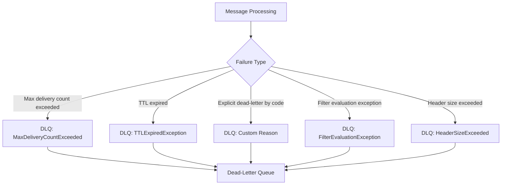

# How to Implement Dead-Letter Queue Processing in Azure Service Bus

Author: [nawazdhandala](https://www.github.com/nawazdhandala)

Tags: Azure Service Bus, Dead-Letter Queue, Error Handling, Message Processing, Azure, Reliability, Messaging

Description: Build automated dead-letter queue processing pipelines to monitor, analyze, and recover failed messages in Azure Service Bus effectively.

---

Every Azure Service Bus queue and subscription has a dead-letter sub-queue (DLQ). When messages cannot be processed - whether due to exceeding the max delivery count, TTL expiration, or explicit dead-lettering by your code - they land here. If you ignore the dead-letter queue, you are effectively ignoring failures in your system. Messages pile up, data gets lost, and problems go unnoticed.

In this post, I will show you how to build a complete dead-letter queue processing pipeline that monitors, analyzes, and recovers failed messages.

## Understanding How Messages Reach the Dead-Letter Queue

Messages end up in the DLQ for several reasons, and understanding which one caused a specific message to be dead-lettered is essential for deciding what to do with it.



Each dead-lettered message carries metadata about why it was dead-lettered:
- `DeadLetterReason` - a short string describing the reason
- `DeadLetterErrorDescription` - a more detailed description
- `DeadLetterSource` - the entity (queue or subscription) the message came from

## Reading Dead-Letter Queue Messages

The dead-letter queue is accessed using a special path. For a queue named "orders", the DLQ path is "orders/$deadletterqueue". The Azure SDK handles this for you.

```csharp
using Azure.Messaging.ServiceBus;

public class DeadLetterQueueReader
{
    private readonly ServiceBusClient _client;
    private readonly ILogger<DeadLetterQueueReader> _logger;

    public DeadLetterQueueReader(ServiceBusClient client, ILogger<DeadLetterQueueReader> logger)
    {
        _client = client;
        _logger = logger;
    }

    // Peek at dead-letter messages without removing them
    // Useful for diagnostic dashboards and reporting
    public async Task<List<DeadLetterInfo>> PeekDeadLettersAsync(
        string queueName, int maxMessages = 100)
    {
        var receiver = _client.CreateReceiver(queueName, new ServiceBusReceiverOptions
        {
            SubQueue = SubQueue.DeadLetter
        });

        var results = new List<DeadLetterInfo>();
        var messages = await receiver.PeekMessagesAsync(maxMessages);

        foreach (var message in messages)
        {
            results.Add(new DeadLetterInfo
            {
                MessageId = message.MessageId,
                EnqueuedTime = message.EnqueuedTime,
                DeadLetterReason = message.DeadLetterReason,
                DeadLetterErrorDescription = message.DeadLetterErrorDescription,
                DeliveryCount = message.DeliveryCount,
                ContentType = message.ContentType,
                BodyPreview = message.Body.ToString().Substring(0,
                    Math.Min(200, message.Body.ToString().Length)),
                ApplicationProperties = message.ApplicationProperties
                    .ToDictionary(k => k.Key, v => v.Value?.ToString())
            });
        }

        await receiver.DisposeAsync();
        return results;
    }
}

public class DeadLetterInfo
{
    public string MessageId { get; set; }
    public DateTimeOffset EnqueuedTime { get; set; }
    public string DeadLetterReason { get; set; }
    public string DeadLetterErrorDescription { get; set; }
    public int DeliveryCount { get; set; }
    public string ContentType { get; set; }
    public string BodyPreview { get; set; }
    public Dictionary<string, string> ApplicationProperties { get; set; }
}
```

## Building an Automated DLQ Processor

For production systems, you want an automated pipeline that processes dead-letter messages based on their failure reason. Some messages can be automatically fixed and resubmitted, while others need manual intervention.

```csharp
public class AutomatedDeadLetterProcessor
{
    private readonly ServiceBusClient _client;
    private readonly ILogger<AutomatedDeadLetterProcessor> _logger;
    private readonly IDeadLetterStrategy _strategy;

    public AutomatedDeadLetterProcessor(
        ServiceBusClient client,
        ILogger<AutomatedDeadLetterProcessor> logger,
        IDeadLetterStrategy strategy)
    {
        _client = client;
        _logger = logger;
        _strategy = strategy;
    }

    // Process dead-letter messages based on configurable strategies
    public async Task ProcessDeadLettersAsync(string queueName, CancellationToken cancellationToken)
    {
        var receiver = _client.CreateReceiver(queueName, new ServiceBusReceiverOptions
        {
            SubQueue = SubQueue.DeadLetter,
            ReceiveMode = ServiceBusReceiveMode.PeekLock
        });

        var sender = _client.CreateSender(queueName);

        while (!cancellationToken.IsCancellationRequested)
        {
            var message = await receiver.ReceiveMessageAsync(
                TimeSpan.FromSeconds(10), cancellationToken);

            if (message == null)
            {
                // No more messages in the DLQ
                break;
            }

            _logger.LogInformation(
                "Processing DLQ message {Id}, Reason: {Reason}",
                message.MessageId, message.DeadLetterReason);

            // Determine what to do with this message
            var action = _strategy.DetermineAction(message);

            switch (action)
            {
                case DeadLetterAction.Resubmit:
                    await ResubmitMessage(sender, receiver, message);
                    break;

                case DeadLetterAction.ResubmitWithFix:
                    await ResubmitWithFix(sender, receiver, message);
                    break;

                case DeadLetterAction.Archive:
                    await ArchiveMessage(receiver, message);
                    break;

                case DeadLetterAction.Discard:
                    await DiscardMessage(receiver, message);
                    break;

                case DeadLetterAction.RequiresManualReview:
                    _logger.LogWarning(
                        "Message {Id} requires manual review. Reason: {Reason}",
                        message.MessageId, message.DeadLetterReason);
                    // Leave in DLQ for manual handling
                    await receiver.AbandonMessageAsync(message);
                    break;
            }
        }

        await receiver.DisposeAsync();
        await sender.DisposeAsync();
    }

    private async Task ResubmitMessage(
        ServiceBusSender sender,
        ServiceBusReceiver receiver,
        ServiceBusReceivedMessage original)
    {
        // Create a fresh message with the same content
        var newMessage = new ServiceBusMessage(original.Body)
        {
            ContentType = original.ContentType,
            Subject = original.Subject,
            CorrelationId = original.CorrelationId,
            MessageId = Guid.NewGuid().ToString()
        };

        // Copy application properties
        foreach (var prop in original.ApplicationProperties)
        {
            newMessage.ApplicationProperties[prop.Key] = prop.Value;
        }

        // Track resubmission history
        int resubmitCount = original.ApplicationProperties
            .TryGetValue("ResubmitCount", out var count) ? (int)(long)count + 1 : 1;

        newMessage.ApplicationProperties["ResubmitCount"] = resubmitCount;
        newMessage.ApplicationProperties["ResubmittedAt"] = DateTimeOffset.UtcNow.ToString("O");
        newMessage.ApplicationProperties["OriginalDeadLetterReason"] =
            original.DeadLetterReason;

        // Prevent infinite resubmission loops
        if (resubmitCount > 3)
        {
            _logger.LogWarning(
                "Message has been resubmitted {Count} times, archiving instead",
                resubmitCount);
            await ArchiveMessage(receiver, original);
            return;
        }

        await sender.SendMessageAsync(newMessage);
        await receiver.CompleteMessageAsync(original);

        _logger.LogInformation(
            "Resubmitted message {OrigId} as {NewId} (resubmit #{Count})",
            original.MessageId, newMessage.MessageId, resubmitCount);
    }

    private async Task ResubmitWithFix(
        ServiceBusSender sender,
        ServiceBusReceiver receiver,
        ServiceBusReceivedMessage original)
    {
        // Apply automatic fixes to the message body
        var fixedBody = _strategy.FixMessageBody(original);

        var newMessage = new ServiceBusMessage(fixedBody)
        {
            ContentType = original.ContentType,
            Subject = original.Subject,
            MessageId = Guid.NewGuid().ToString()
        };

        newMessage.ApplicationProperties["AutoFixed"] = true;
        newMessage.ApplicationProperties["OriginalMessageId"] = original.MessageId;

        await sender.SendMessageAsync(newMessage);
        await receiver.CompleteMessageAsync(original);

        _logger.LogInformation("Auto-fixed and resubmitted message {Id}",
            original.MessageId);
    }

    private async Task ArchiveMessage(
        ServiceBusReceiver receiver,
        ServiceBusReceivedMessage message)
    {
        // Store the message in blob storage for long-term archival
        // Implementation would write to Azure Blob Storage
        _logger.LogInformation("Archiving message {Id}", message.MessageId);
        await receiver.CompleteMessageAsync(message);
    }

    private async Task DiscardMessage(
        ServiceBusReceiver receiver,
        ServiceBusReceivedMessage message)
    {
        _logger.LogInformation("Discarding message {Id}: {Reason}",
            message.MessageId, message.DeadLetterReason);
        await receiver.CompleteMessageAsync(message);
    }
}

// Strategy interface for determining how to handle each dead-letter message
public interface IDeadLetterStrategy
{
    DeadLetterAction DetermineAction(ServiceBusReceivedMessage message);
    BinaryData FixMessageBody(ServiceBusReceivedMessage message);
}

public enum DeadLetterAction
{
    Resubmit,
    ResubmitWithFix,
    Archive,
    Discard,
    RequiresManualReview
}
```

## Implementing a Strategy

Here is an example strategy that handles common dead-letter scenarios.

```csharp
public class OrderDeadLetterStrategy : IDeadLetterStrategy
{
    public DeadLetterAction DetermineAction(ServiceBusReceivedMessage message)
    {
        // Categorize by dead-letter reason
        return message.DeadLetterReason switch
        {
            // TTL expired - the message is stale, just discard it
            "TTLExpiredException" => DeadLetterAction.Discard,

            // Max delivery count - likely a transient issue that resolved itself
            // Try resubmitting once
            "MaxDeliveryCountExceeded" => message.ApplicationProperties
                .ContainsKey("ResubmitCount")
                ? DeadLetterAction.Archive
                : DeadLetterAction.Resubmit,

            // Our code explicitly dead-lettered it for validation failures
            "ValidationFailed" => DeadLetterAction.ResubmitWithFix,

            // Malformed message body - cannot be processed
            "MalformedMessage" => DeadLetterAction.Archive,

            // Anything else needs human eyes
            _ => DeadLetterAction.RequiresManualReview
        };
    }

    public BinaryData FixMessageBody(ServiceBusReceivedMessage message)
    {
        // Apply known fixes to common validation issues
        var body = message.Body.ToString();

        // Example: fix a known schema change where "amount" was renamed to "totalAmount"
        body = body.Replace("\"amount\":", "\"totalAmount\":");

        return BinaryData.FromString(body);
    }
}
```

## Scheduling DLQ Processing with a Timer Trigger

Run the DLQ processor on a schedule using an Azure Function timer trigger.

```csharp
public class DeadLetterTimerFunction
{
    private readonly AutomatedDeadLetterProcessor _processor;
    private readonly ILogger<DeadLetterTimerFunction> _logger;

    public DeadLetterTimerFunction(
        AutomatedDeadLetterProcessor processor,
        ILogger<DeadLetterTimerFunction> logger)
    {
        _processor = processor;
        _logger = logger;
    }

    // Run every 15 minutes to process dead-letter messages
    [Function("ProcessDeadLetters")]
    public async Task Run([TimerTrigger("0 */15 * * * *")] TimerInfo timer)
    {
        _logger.LogInformation("Starting DLQ processing sweep");

        var queues = new[] { "orders", "notifications", "payments" };

        foreach (var queue in queues)
        {
            try
            {
                await _processor.ProcessDeadLettersAsync(queue, CancellationToken.None);
            }
            catch (Exception ex)
            {
                _logger.LogError(ex, "Error processing DLQ for queue: {Queue}", queue);
            }
        }

        _logger.LogInformation("DLQ processing sweep completed");
    }
}
```

## Building a DLQ Dashboard

For visibility, create an HTTP endpoint that shows the current state of all dead-letter queues.

```csharp
[Function("GetDeadLetterStats")]
public async Task<HttpResponseData> GetStats(
    [HttpTrigger(AuthorizationLevel.Function, "get")] HttpRequestData req)
{
    var adminClient = new ServiceBusAdministrationClient(
        Environment.GetEnvironmentVariable("ServiceBusConnection"));

    var stats = new List<object>();

    // Get runtime properties for each queue
    await foreach (var queue in adminClient.GetQueuesAsync())
    {
        var runtime = await adminClient.GetQueueRuntimePropertiesAsync(queue.Name);

        stats.Add(new
        {
            QueueName = queue.Name,
            ActiveMessages = runtime.Value.ActiveMessageCount,
            DeadLetterMessages = runtime.Value.DeadLetterMessageCount,
            ScheduledMessages = runtime.Value.ScheduledMessageCount,
            TransferDeadLetterMessages = runtime.Value.TransferDeadLetterMessageCount
        });
    }

    var response = req.CreateResponse(System.Net.HttpStatusCode.OK);
    await response.WriteAsJsonAsync(stats);
    return response;
}
```

## Summary

Dead-letter queues are your safety net for failed message processing. Build an automated pipeline that categorizes dead-lettered messages by reason, applies automatic fixes where possible, resubmits recoverable messages with loop prevention, archives messages for audit trails, and alerts your team when manual review is needed. The worst thing you can do with a dead-letter queue is ignore it. Treat it as a first-class part of your messaging infrastructure and you will catch problems before they become incidents.
