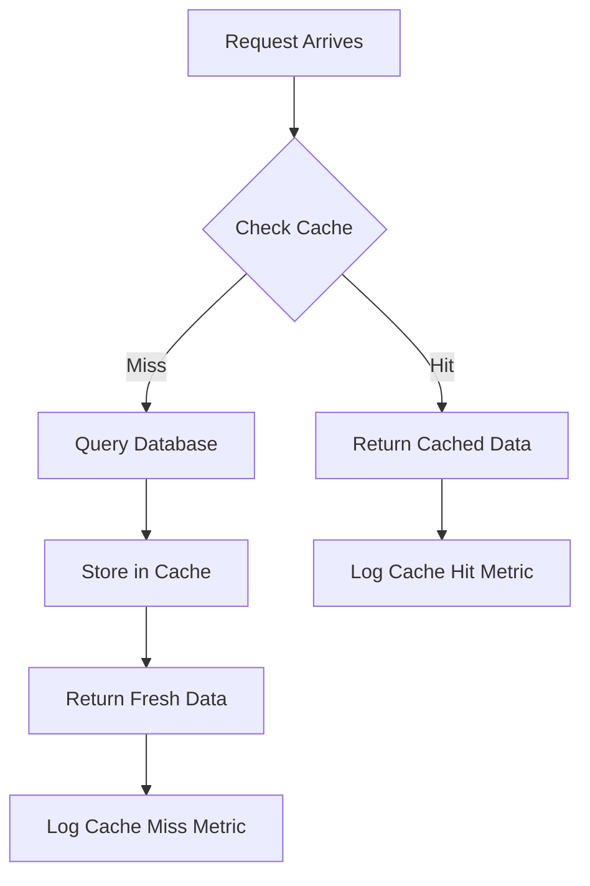

# How to Implement Distributed Caching with Azure Cache for Redis in ASP.NET Core

Author: [nawazdhandala](https://www.github.com/nawazdhandala)

Tags: Azure Cache for Redis, ASP.NET Core, Distributed Caching, Redis, C#, Performance, Cloud

Description: Learn how to implement distributed caching with Azure Cache for Redis in ASP.NET Core to boost performance and reduce database load across multiple application instances.

---

Caching is one of the fastest ways to improve the performance of any web application. When your app runs on a single server, an in-memory cache works fine. But as soon as you scale out to multiple instances behind a load balancer, you need a distributed cache that all instances can share. Azure Cache for Redis gives you a fully managed Redis instance in the cloud, and ASP.NET Core has built-in abstractions that make integrating with it straightforward.

In this post, we will set up Azure Cache for Redis, connect it to an ASP.NET Core application, and explore caching patterns that work well in production.

## Why Distributed Caching Matters

When you have multiple instances of your application running, each instance has its own memory. If Instance A caches a user's profile data and the next request hits Instance B, that user gets a cache miss and a database call. With a distributed cache, all instances read from and write to the same cache. This means:

- Consistent cache hits regardless of which instance handles the request
- Reduced load on your database since the cache absorbs repeated reads
- The ability to scale your application horizontally without worrying about cache coherence
- Shared state across instances, which is useful for things like session storage

Redis is the go-to choice for distributed caching. It is fast, supports rich data structures, and has a large ecosystem. Azure Cache for Redis removes the operational burden of running Redis yourself.

## Creating an Azure Cache for Redis Instance

You can create a Redis cache through the Azure Portal or the CLI. Here is the CLI approach.

```bash
# Create a resource group if you do not have one
az group create --name myResourceGroup --location eastus

# Create a Basic tier Redis cache (use Standard or Premium for production)
az redis create \
  --name my-app-cache \
  --resource-group myResourceGroup \
  --location eastus \
  --sku Basic \
  --vm-size c0

# Retrieve the connection string (primary key)
az redis list-keys \
  --name my-app-cache \
  --resource-group myResourceGroup
```

The Basic tier is fine for development. For production, use Standard (with replication) or Premium (with clustering and persistence).

## Setting Up the ASP.NET Core Project

Create a new ASP.NET Core web API project and add the Redis distributed cache package.

```bash
# Create the project
dotnet new webapi -n RedisCacheDemo
cd RedisCacheDemo

# Add the Redis distributed cache package
dotnet add package Microsoft.Extensions.Caching.StackExchangeRedis
```

## Configuring Redis in Program.cs

Register the Redis distributed cache service in your dependency injection container.

```csharp
using Microsoft.Extensions.Caching.Distributed;

var builder = WebApplication.CreateBuilder(args);

// Register the Redis distributed cache
builder.Services.AddStackExchangeRedisCache(options =>
{
    // Connection string from Azure Portal -> Access Keys
    options.Configuration = builder.Configuration.GetConnectionString("Redis");

    // Optional: set a prefix for all keys from this application
    options.InstanceName = "MyApp:";
});

builder.Services.AddControllers();
builder.Services.AddEndpointsApiExplorer();
builder.Services.AddSwaggerGen();

var app = builder.Build();

app.UseSwagger();
app.UseSwaggerUI();
app.MapControllers();
app.Run();
```

And in your appsettings.json, store the connection string.

```json
{
  "ConnectionStrings": {
    "Redis": "my-app-cache.redis.cache.windows.net:6380,password=your-access-key,ssl=True,abortConnect=False"
  }
}
```

The `abortConnect=False` setting is important. It tells the client to silently retry connections rather than throwing an exception on startup if Redis is momentarily unreachable.

## Using IDistributedCache for Basic Caching

ASP.NET Core provides the `IDistributedCache` interface. It works with any cache provider - Redis, SQL Server, NCache, or even in-memory for testing. Here is a controller that caches product data.

```csharp
using Microsoft.AspNetCore.Mvc;
using Microsoft.Extensions.Caching.Distributed;
using System.Text.Json;

[ApiController]
[Route("api/[controller]")]
public class ProductsController : ControllerBase
{
    private readonly IDistributedCache _cache;
    private readonly ProductService _productService;

    public ProductsController(IDistributedCache cache, ProductService productService)
    {
        _cache = cache;
        _productService = productService;
    }

    [HttpGet("{id}")]
    public async Task<IActionResult> GetProduct(int id)
    {
        string cacheKey = $"product:{id}";

        // Try to get the product from cache first
        string? cachedProduct = await _cache.GetStringAsync(cacheKey);

        if (cachedProduct != null)
        {
            // Cache hit - deserialize and return
            var product = JsonSerializer.Deserialize<Product>(cachedProduct);
            return Ok(product);
        }

        // Cache miss - fetch from database
        var productFromDb = await _productService.GetByIdAsync(id);

        if (productFromDb == null)
            return NotFound();

        // Store in cache with expiration options
        var cacheOptions = new DistributedCacheEntryOptions
        {
            // Absolute expiration: remove after 30 minutes no matter what
            AbsoluteExpirationRelativeToNow = TimeSpan.FromMinutes(30),

            // Sliding expiration: reset the timer on each access
            SlidingExpiration = TimeSpan.FromMinutes(5)
        };

        string serialized = JsonSerializer.Serialize(productFromDb);
        await _cache.SetStringAsync(cacheKey, serialized, cacheOptions);

        return Ok(productFromDb);
    }
}
```

The combination of absolute and sliding expiration gives you two safety nets. Frequently accessed data stays in the cache (sliding), but stale data eventually gets evicted (absolute).

## Building a Generic Cache Service

Rather than repeating cache logic in every controller, build a reusable service.

```csharp
public class CacheService
{
    private readonly IDistributedCache _cache;
    private readonly ILogger<CacheService> _logger;

    public CacheService(IDistributedCache cache, ILogger<CacheService> logger)
    {
        _cache = cache;
        _logger = logger;
    }

    // Get or create pattern - fetch from cache or compute and store
    public async Task<T?> GetOrCreateAsync<T>(
        string key,
        Func<Task<T>> factory,
        TimeSpan? absoluteExpiration = null,
        TimeSpan? slidingExpiration = null)
    {
        // Attempt cache read
        string? cached = await _cache.GetStringAsync(key);

        if (cached != null)
        {
            _logger.LogDebug("Cache hit for key: {Key}", key);
            return JsonSerializer.Deserialize<T>(cached);
        }

        _logger.LogDebug("Cache miss for key: {Key}", key);

        // Execute the factory function to get fresh data
        T result = await factory();

        if (result == null)
            return default;

        // Cache the result
        var options = new DistributedCacheEntryOptions
        {
            AbsoluteExpirationRelativeToNow = absoluteExpiration ?? TimeSpan.FromMinutes(30),
            SlidingExpiration = slidingExpiration ?? TimeSpan.FromMinutes(5)
        };

        await _cache.SetStringAsync(key, JsonSerializer.Serialize(result), options);

        return result;
    }

    // Invalidate a specific key
    public async Task InvalidateAsync(string key)
    {
        await _cache.RemoveAsync(key);
        _logger.LogDebug("Cache invalidated for key: {Key}", key);
    }

    // Invalidate multiple keys matching a pattern (requires StackExchange.Redis directly)
    public async Task InvalidateByPatternAsync(string pattern)
    {
        // Note: IDistributedCache does not support pattern deletion
        // For this, you need to use the StackExchange.Redis connection directly
        _logger.LogWarning("Pattern-based invalidation requires direct Redis access");
    }
}
```

Register it in your DI container and use it throughout your application.

## Cache Invalidation Strategies

Cache invalidation is famously one of the hardest problems in computer science. Here are the approaches that work well with Redis.

**Write-through**: When you update the database, also update the cache. This keeps the cache fresh but adds latency to writes.

**Write-behind**: Update the cache first, then asynchronously update the database. This is fast but risks data loss if the cache goes down.

**Cache-aside with invalidation**: The most common pattern. Read from cache on get, invalidate cache on write, and let the next read repopulate the cache.

```csharp
[HttpPut("{id}")]
public async Task<IActionResult> UpdateProduct(int id, Product updated)
{
    // Update the database
    await _productService.UpdateAsync(id, updated);

    // Invalidate the cache so the next read gets fresh data
    await _cache.RemoveAsync($"product:{id}");

    // Also invalidate any list caches that might include this product
    await _cache.RemoveAsync("products:all");

    return Ok(updated);
}
```

## Session Storage with Redis

Redis is also commonly used for distributed session storage. This lets users stay logged in regardless of which instance handles their request.

```csharp
// In Program.cs, add session support backed by Redis
builder.Services.AddSession(options =>
{
    options.IdleTimeout = TimeSpan.FromMinutes(20);
    options.Cookie.HttpOnly = true;
    options.Cookie.IsEssential = true;
});

// The AddStackExchangeRedisCache call from earlier provides the backing store
```

## Monitoring Cache Performance

Track your cache hit ratio to understand whether caching is actually helping. A healthy cache should have a hit ratio above 80%.



Azure provides built-in monitoring for your Redis instance. Watch these metrics in the Azure Portal:

- Cache Hit Ratio: Should be high
- Server Load: Keep it under 80%
- Memory Usage: Watch for evictions
- Connected Clients: Make sure you are not leaking connections

## Handling Cache Failures Gracefully

Redis going down should not take your entire application offline. The cache is an optimization, not a requirement. Wrap your cache calls so that failures fall through to the database.

```csharp
public async Task<T?> GetOrCreateSafeAsync<T>(
    string key,
    Func<Task<T>> factory)
{
    try
    {
        // Try the cache path
        string? cached = await _cache.GetStringAsync(key);
        if (cached != null)
            return JsonSerializer.Deserialize<T>(cached);
    }
    catch (Exception ex)
    {
        // Redis is down - log and continue without cache
        _logger.LogWarning(ex, "Cache read failed for key {Key}, falling back to database", key);
    }

    // Always fall back to the database
    T result = await factory();

    try
    {
        // Try to populate the cache for next time
        var options = new DistributedCacheEntryOptions
        {
            AbsoluteExpirationRelativeToNow = TimeSpan.FromMinutes(15)
        };
        await _cache.SetStringAsync(key, JsonSerializer.Serialize(result), options);
    }
    catch (Exception ex)
    {
        // Cache write failed - not critical
        _logger.LogWarning(ex, "Cache write failed for key {Key}", key);
    }

    return result;
}
```

## Final Thoughts

Distributed caching with Azure Cache for Redis is one of the highest-impact performance improvements you can make to an ASP.NET Core application. The built-in IDistributedCache abstraction makes it easy to swap providers and test with in-memory implementations. Start by caching your most frequently read, least frequently written data. Monitor your hit ratios. Invalidate carefully. And always design your application so it works without the cache - Redis is a performance layer, not a data store.
