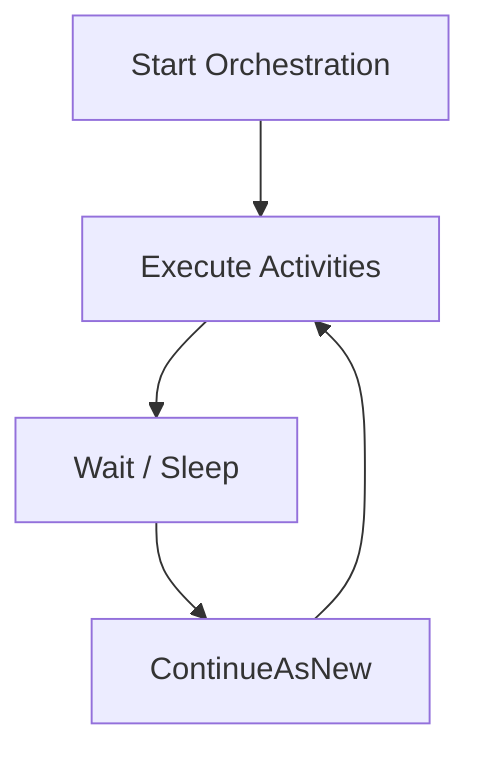

# How to Implement Durable Functions Eternal Orchestrations for Recurring Tasks

Author: [nawazdhandala](https://www.github.com/nawazdhandala)

Tags: Azure, Durable Functions, Eternal Orchestrations, Recurring Tasks, Serverless, Orchestration, Timer

Description: Implement eternal orchestrations in Azure Durable Functions to create long-running recurring tasks that execute indefinitely without timer triggers.

---

Azure Durable Functions has a feature called eternal orchestrations that is specifically designed for tasks that need to run repeatedly forever. Unlike timer-triggered functions that fire on a schedule and have no state between invocations, eternal orchestrations maintain state across iterations. They are ideal for monitoring, polling, and periodic processing where you need to carry context from one cycle to the next.

In this post, I will explain how eternal orchestrations work, show you how to implement one, and cover the important details around state management and error handling that you need to get right.

## What Is an Eternal Orchestration?

A normal orchestration runs to completion and its history is stored. An eternal orchestration calls `ContinueAsNew` at the end of each cycle, which resets the orchestration history and starts a new cycle. Without this reset, the orchestration history would grow indefinitely and eventually cause performance problems.

The pattern looks like this:



Each cycle:
1. Runs your activity functions
2. Optionally waits for a specified duration
3. Calls `ContinueAsNew` with the state for the next cycle

The `ContinueAsNew` call is what makes it eternal. It tells the Durable Functions framework to discard the current history and restart the orchestration with fresh state.

## A Basic Eternal Orchestration

Here is a simple eternal orchestration that checks a health endpoint every 30 seconds.

```javascript
// orchestrator.js - Eternal orchestration for health monitoring
const df = require('durable-functions');

module.exports = df.orchestrator(function* (context) {
  // Get the state from the previous cycle (or initial input)
  const state = context.df.getInput() || {
    checksPerformed: 0,
    lastStatus: null,
    consecutiveFailures: 0
  };

  // Run the health check activity
  const healthResult = yield context.df.callActivity('CheckHealth', {
    url: 'https://api.example.com/health'
  });

  // Update the state based on the result
  state.checksPerformed++;
  state.lastStatus = healthResult.status;

  if (healthResult.status !== 'healthy') {
    state.consecutiveFailures++;

    // Alert if there are 3 consecutive failures
    if (state.consecutiveFailures >= 3) {
      yield context.df.callActivity('SendAlert', {
        message: `Service unhealthy for ${state.consecutiveFailures} consecutive checks`,
        lastError: healthResult.error
      });
    }
  } else {
    state.consecutiveFailures = 0;
  }

  // Log the current state
  context.log(`Check #${state.checksPerformed}: ${healthResult.status} (failures: ${state.consecutiveFailures})`);

  // Wait for 30 seconds before the next cycle
  const nextCheck = new Date(context.df.currentUtcDateTime);
  nextCheck.setSeconds(nextCheck.getSeconds() + 30);
  yield context.df.createTimer(nextCheck);

  // Restart the orchestration with the updated state
  // This discards the history and prevents unbounded growth
  context.df.continueAsNew(state);
});
```

Here are the activity functions.

```javascript
// check-health.js - Activity function that performs a health check
const axios = require('axios');

module.exports = async function (context, input) {
  try {
    const response = await axios.get(input.url, { timeout: 10000 });
    return {
      status: 'healthy',
      statusCode: response.status,
      responseTime: response.headers['x-response-time'] || 'unknown'
    };
  } catch (err) {
    return {
      status: 'unhealthy',
      error: err.message,
      statusCode: err.response?.status || 0
    };
  }
};

// send-alert.js - Activity function that sends an alert
module.exports = async function (context, input) {
  context.log(`ALERT: ${input.message}`);
  // In production, send to Slack, PagerDuty, email, etc.
  // await sendSlackMessage(input.message);
  return { sent: true, timestamp: new Date().toISOString() };
};
```

## Starting and Stopping Eternal Orchestrations

Start the orchestration with an HTTP trigger or any other trigger type.

```javascript
// http-start.js - HTTP trigger to start the eternal orchestration
const df = require('durable-functions');

module.exports = async function (context, req) {
  const client = df.getClient(context);

  const instanceId = req.query.instanceId || 'health-monitor-1';

  // Check if the orchestration is already running
  const status = await client.getStatus(instanceId);
  if (status && status.runtimeStatus === 'Running') {
    context.res = {
      status: 409,
      body: { error: 'Orchestration is already running', instanceId }
    };
    return;
  }

  // Start the orchestration with a specific instance ID
  // so we can control it later
  await client.startNew('EternalOrchestrator', instanceId, {
    checksPerformed: 0,
    consecutiveFailures: 0
  });

  context.res = {
    status: 202,
    body: { message: 'Eternal orchestration started', instanceId }
  };
};
```

To stop an eternal orchestration, use the terminate API.

```javascript
// http-stop.js - HTTP trigger to stop the eternal orchestration
const df = require('durable-functions');

module.exports = async function (context, req) {
  const client = df.getClient(context);
  const instanceId = req.query.instanceId || 'health-monitor-1';

  await client.terminate(instanceId, 'Stopped by user');

  context.res = {
    body: { message: 'Orchestration terminated', instanceId }
  };
};
```

## State Management Best Practices

The state you pass to `continueAsNew` should be kept small. Since it is stored in the orchestration's input, large state objects affect performance.

```javascript
// Good: Small, focused state
context.df.continueAsNew({
  iteration: state.iteration + 1,
  lastResult: 'ok',
  consecutiveErrors: 0
});

// Bad: Accumulating data in state
context.df.continueAsNew({
  iteration: state.iteration + 1,
  allResults: [...state.allResults, newResult], // Grows every cycle
  history: [...state.history, newEntry]          // Never cleaned up
});
```

If you need to accumulate data over time, write it to an external store (database, blob storage) during each cycle rather than carrying it in the orchestration state.

## Error Handling

If an activity function throws an error and it is not caught, the orchestration will fail and stop. For an eternal orchestration, you almost always want to catch errors and continue.

```javascript
// error-handling.js - Resilient eternal orchestration
module.exports = df.orchestrator(function* (context) {
  const state = context.df.getInput() || { errors: 0, iterations: 0 };

  try {
    // Try to run the main activity
    const result = yield context.df.callActivity('ProcessBatch', state);
    state.errors = 0; // Reset error count on success
    state.lastResult = result;
  } catch (err) {
    state.errors++;
    context.log.error(`Activity failed (error #${state.errors}):`, err.message);

    // Alert after repeated failures
    if (state.errors >= 5) {
      try {
        yield context.df.callActivity('SendAlert', {
          message: `Eternal orchestration has failed ${state.errors} times consecutively`
        });
      } catch (alertErr) {
        context.log.error('Alert also failed:', alertErr.message);
      }
    }

    // Increase the wait time on repeated failures (backoff)
    const backoffSeconds = Math.min(30 * Math.pow(2, state.errors - 1), 3600);
    const retryTime = new Date(context.df.currentUtcDateTime);
    retryTime.setSeconds(retryTime.getSeconds() + backoffSeconds);
    yield context.df.createTimer(retryTime);
  }

  state.iterations++;

  // Normal wait between cycles (when no errors)
  if (state.errors === 0) {
    const nextCycle = new Date(context.df.currentUtcDateTime);
    nextCycle.setSeconds(nextCycle.getSeconds() + 60);
    yield context.df.createTimer(nextCycle);
  }

  context.df.continueAsNew(state);
});
```

## Monitoring Eternal Orchestrations

Since eternal orchestrations run indefinitely, monitoring is important. Use the Durable Functions status API to check on running orchestrations.

```javascript
// monitor-status.js - Check the status of eternal orchestrations
const df = require('durable-functions');

module.exports = async function (context, req) {
  const client = df.getClient(context);

  // List all running orchestrations
  const instances = await client.getStatusAll();
  const running = instances.filter(i => i.runtimeStatus === 'Running');

  const statuses = running.map(i => ({
    instanceId: i.instanceId,
    name: i.name,
    createdTime: i.createdTime,
    lastUpdatedTime: i.lastUpdatedTime,
    input: i.input // This is the current state
  }));

  context.res = {
    body: {
      totalRunning: running.length,
      orchestrations: statuses
    }
  };
};
```

## Eternal Orchestrations vs. Timer Triggers

Both patterns can handle recurring tasks, but they serve different needs.

| Feature | Eternal Orchestration | Timer Trigger |
|---------|----------------------|---------------|
| Maintains state | Yes | No |
| Schedule flexibility | Dynamic (can change interval) | Fixed cron expression |
| Error recovery | Custom error handling with backoff | Auto-retry per execution |
| Can be paused/resumed | Yes (terminate/restart) | Disable/enable in portal |
| History | Reset each cycle | No history between runs |
| Cost | Runs continuously | Only runs at scheduled times |

Use eternal orchestrations when you need state continuity between cycles, dynamic scheduling, or complex multi-step processing. Use timer triggers for simple, stateless periodic tasks.

## Wrapping Up

Eternal orchestrations in Durable Functions give you a serverless way to run recurring tasks with state. The `ContinueAsNew` pattern keeps the orchestration history bounded, while the state you pass forward carries context between cycles. Combine it with proper error handling and backoff logic, and you have a resilient monitoring or processing loop that runs indefinitely without manual intervention. Just remember to keep your state small, handle errors gracefully, and use the status API to monitor your running orchestrations.
