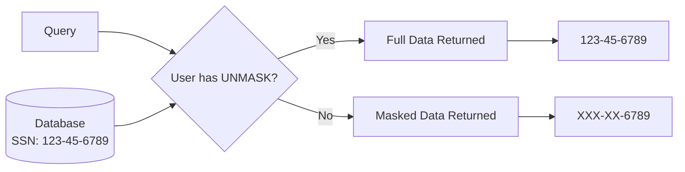

# How to Implement Dynamic Data Masking in Azure SQL Database

Author: [nawazdhandala](https://www.github.com/nawazdhandala)

Tags: Azure SQL, Dynamic Data Masking, Security, Data Protection, Azure, Database, Compliance

Description: Learn how to implement dynamic data masking in Azure SQL Database to protect sensitive data from unauthorized users without changing your application code.

---

You have a database with sensitive information - social security numbers, email addresses, credit card numbers, salary data. Your application needs access to the full data, but you also have analysts, support staff, and third-party integrators who need to query the database without seeing the actual sensitive values. Dynamic data masking in Azure SQL Database solves this problem by hiding sensitive data in query results for designated users while keeping the underlying data intact.

In this post, I will explain how dynamic data masking works, walk through configuring it, and share practical patterns for common data types.

## How Dynamic Data Masking Works

Dynamic data masking (DDM) applies masking rules to specific columns. When a user without the UNMASK permission queries a masked column, they see the masked value instead of the real data. Users with UNMASK permission see the original data.

Key points to understand:

- **No data modification**: The actual data in the database is never changed. Masking happens at the query result level only.
- **Transparent to applications**: Applications with UNMASK permission work exactly as before. No code changes needed.
- **Not encryption**: DDM is a presentation-layer feature, not a security boundary. A determined user with sufficient database permissions could potentially infer masked values through clever queries. For true data protection, use encryption or column-level security.
- **Four masking functions**: Azure SQL provides four built-in masking types - default, email, random, and custom string.



## Masking Functions

### Default Mask

The default mask replaces the entire value with a standard mask based on the data type:
- String columns: "XXXX" (or fewer X's if the column is shorter)
- Numeric columns: 0
- Date columns: 01-01-1900 00:00:00
- Binary columns: single byte of 0

### Email Mask

Shows the first letter, replaces the rest with "XXX@XXXX.com". For example, "john.doe@company.com" becomes "jXXX@XXXX.com".

### Random Number Mask

Replaces numeric values with a random number within a specified range. Useful for salary, age, or financial data where you want realistic-looking but fake numbers.

### Custom String Mask

The most flexible option. You specify how many characters to expose at the beginning and end of the string, and what padding string to use in the middle. For example, you might show the first 2 and last 4 characters of a credit card number.

## Setting Up Dynamic Data Masking via Azure Portal

### Step 1: Navigate to Your Database

Go to the Azure Portal and open your SQL database.

### Step 2: Open Dynamic Data Masking

In the left menu, under "Security", click "Dynamic Data Masking".

### Step 3: Review Recommendations

Azure automatically scans your database and recommends columns that might contain sensitive data. You will see a list of recommended columns based on their names and data types (e.g., columns named "email", "ssn", "phone").

Click "Add Mask" on any recommended column to apply the suggested mask.

### Step 4: Add Custom Masks

To add a mask to a column not in the recommendations, click "+ Add mask" at the top. Select the schema, table, and column, then choose the masking function and configure its parameters.

### Step 5: Save

Click "Save" to apply the masking rules.

## Setting Up Dynamic Data Masking via T-SQL

T-SQL gives you the most control and is easier to version-control.

Create a sample table with masked columns:

```sql
-- Create a table with dynamic data masking applied to columns
CREATE TABLE Customers (
    CustomerID INT IDENTITY(1,1) PRIMARY KEY,
    -- Default mask: replaces with XXXX for strings
    FirstName NVARCHAR(50) MASKED WITH (FUNCTION = 'default()'),
    -- Default mask for last name
    LastName NVARCHAR(50) MASKED WITH (FUNCTION = 'default()'),
    -- Email mask: shows first character and domain hint
    Email NVARCHAR(100) MASKED WITH (FUNCTION = 'email()'),
    -- Custom mask: show first 0 chars, pad with XXX-XX-, show last 4 chars
    SSN CHAR(11) MASKED WITH (FUNCTION = 'partial(0, "XXX-XX-", 4)'),
    -- Random mask: replace with random number between 1000 and 9999
    CreditScore INT MASKED WITH (FUNCTION = 'random(1000, 9999)'),
    -- Custom mask: show first 2 chars, pad with XXXX-XXXX-, show last 4
    CreditCard CHAR(16) MASKED WITH (FUNCTION = 'partial(2, "XX-XXXX-XXXX-", 4)')
);
```

Insert some sample data:

```sql
-- Insert test data into the customers table
INSERT INTO Customers (FirstName, LastName, Email, SSN, CreditScore, CreditCard)
VALUES
    ('John', 'Doe', 'john.doe@company.com', '123-45-6789', 750, '4111111111111111'),
    ('Jane', 'Smith', 'jane.smith@company.com', '987-65-4321', 820, '5500000000000004');
```

## Adding Masks to Existing Columns

You do not need to recreate your tables. You can add masks to existing columns:

```sql
-- Add a default mask to an existing column
ALTER TABLE Employees
ALTER COLUMN Salary ADD MASKED WITH (FUNCTION = 'default()');

-- Add a custom mask to an existing phone number column
ALTER TABLE Employees
ALTER COLUMN Phone ADD MASKED WITH (FUNCTION = 'partial(0, "XXX-XXX-", 4)');
```

To remove a mask:

```sql
-- Remove a mask from a column
ALTER TABLE Employees
ALTER COLUMN Salary DROP MASKED;
```

## Managing Permissions

By default, the database owner and admin users have UNMASK permission. Regular users do not. Here is how to manage who can see unmasked data.

Grant UNMASK permission:

```sql
-- Grant a user permission to see unmasked data
GRANT UNMASK TO [AppServiceUser];
```

Revoke UNMASK permission:

```sql
-- Revoke UNMASK permission from a user
REVOKE UNMASK FROM [AnalystUser];
```

You can also grant UNMASK at the schema, table, or column level for more granular control:

```sql
-- Grant UNMASK only on a specific table
GRANT UNMASK ON SCHEMA::[dbo] TO [ManagerUser];

-- Grant UNMASK only on a specific column
GRANT UNMASK ON dbo.Customers(Email) TO [SupportUser];
```

## Testing the Masks

To see how masked data looks, create a test user and query the table:

```sql
-- Create a test user with read access but no UNMASK permission
CREATE USER TestAnalyst WITHOUT LOGIN;
GRANT SELECT ON Customers TO TestAnalyst;

-- Execute a query as the test user
EXECUTE AS USER = 'TestAnalyst';
SELECT * FROM Customers;
REVERT;
```

The results for the TestAnalyst user would look like:

| CustomerID | FirstName | LastName | Email | SSN | CreditScore | CreditCard |
|---|---|---|---|---|---|---|
| 1 | XXXX | XXXX | jXXX@XXXX.com | XXX-XX-6789 | 3847 | 2XX-XXXX-XXXX-1111 |
| 2 | XXXX | XXXX | jXXX@XXXX.com | XXX-XX-4321 | 6152 | 5XX-XXXX-XXXX-0004 |

## Common Masking Patterns

Here are practical masking patterns for common data types.

**Phone numbers**: Show last 4 digits.
```sql
ALTER COLUMN Phone ADD MASKED WITH (FUNCTION = 'partial(0, "XXX-XXX-", 4)')
```

**Social Security Numbers**: Show last 4 digits.
```sql
ALTER COLUMN SSN ADD MASKED WITH (FUNCTION = 'partial(0, "XXX-XX-", 4)')
```

**Credit card numbers**: Show first 2 and last 4 digits.
```sql
ALTER COLUMN CreditCard ADD MASKED WITH (FUNCTION = 'partial(2, "XX-XXXX-XXXX-", 4)')
```

**Dates of birth**: Use default mask (returns 1900-01-01).
```sql
ALTER COLUMN DateOfBirth ADD MASKED WITH (FUNCTION = 'default()')
```

**Salaries**: Use random mask to show realistic but fake values.
```sql
ALTER COLUMN Salary ADD MASKED WITH (FUNCTION = 'random(30000, 150000)')
```

**IP addresses**: Show only the first octet.
```sql
ALTER COLUMN IPAddress ADD MASKED WITH (FUNCTION = 'partial(3, ".XXX.XXX.XXX", 0)')
```

## Limitations and Considerations

**Not a security boundary**: DDM is designed to prevent casual exposure of sensitive data, not to defend against determined attackers. A user with broad query access could potentially infer masked values through aggregation, filtering, or other techniques.

**Computed columns**: You cannot mask computed columns, but you can mask the source columns.

**Full-text search**: Masked columns participate in full-text search, so masked values could be exposed through search results.

**Import/Export**: BACPAC exports include the masking definitions. When you import the BACPAC, the masks are preserved.

**Copy activities**: When copying data (e.g., using Azure Data Factory), the data is copied in its original unmasked form if the copy account has UNMASK permission.

**Always Encrypted columns**: You cannot apply DDM to columns that use Always Encrypted.

## When to Use DDM vs Other Security Features

- **DDM**: Use for limiting casual access to sensitive data. Good for dev/test environments, support teams, and reporting users.
- **Always Encrypted**: Use when you need cryptographic protection and the server should never see the plaintext data.
- **Row-Level Security**: Use when different users should see different rows, not different columns.
- **Column-level permissions**: Use when certain users should not be able to access a column at all.

In practice, many teams combine these features. For example, you might use Always Encrypted for the most sensitive columns (like SSN) and DDM for moderately sensitive columns (like email) where support staff need to see a hint but not the full value.

## Summary

Dynamic data masking is a quick and effective way to limit exposure of sensitive data in Azure SQL Database. It requires no application code changes, applies at the query result level, and supports four flexible masking functions. Set it up through the Azure Portal or T-SQL, manage access with the UNMASK permission, and combine it with other security features for defense in depth. Just remember that DDM is designed to prevent casual exposure, not to replace encryption for truly sensitive data.
