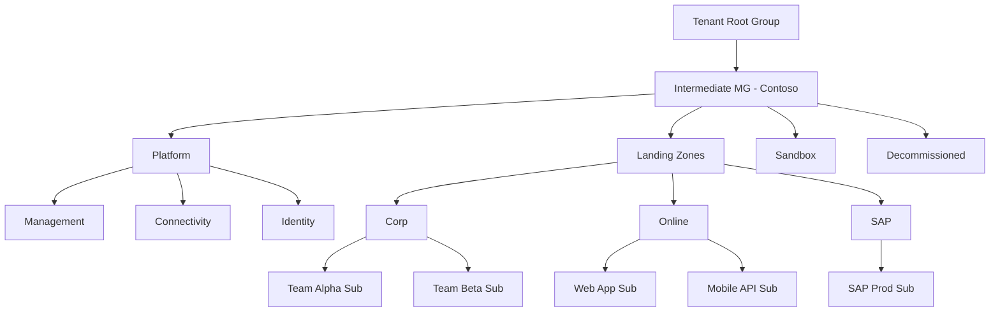

# How to Implement Enterprise-Scale Architecture in Azure with Management Groups

Author: [nawazdhandala](https://www.github.com/nawazdhandala)

Tags: Azure, Enterprise Scale, Management Groups, Governance, Architecture, Cloud Adoption, Policy

Description: Implement enterprise-scale architecture in Azure using management groups to organize subscriptions, apply policies, and enforce governance at scale.

---

When an organization grows beyond a handful of Azure subscriptions, managing each one individually becomes impractical. You need a way to organize subscriptions into logical groups, apply policies consistently, and delegate administration without giving everyone access to everything. Azure Management Groups provide this capability, and they are the foundation of enterprise-scale architecture.

In this post, I will cover how to design and implement a management group hierarchy that scales from dozens to thousands of subscriptions.

## What Are Management Groups

Management Groups are containers above subscriptions in the Azure resource hierarchy. The hierarchy goes: Tenant Root Group > Management Groups > Subscriptions > Resource Groups > Resources.

Anything you assign at a management group level - policies, RBAC roles, budgets - automatically inherits down to all subscriptions and resources underneath. This is what makes management groups powerful: you define a policy once at the top, and it applies everywhere beneath it.



## Designing the Hierarchy

The recommended hierarchy from Microsoft's Cloud Adoption Framework has these layers:

### Root Management Group

Never assign policies or RBAC directly to the Tenant Root Group. Instead, create an intermediate management group (named after your organization) as the top of your hierarchy. This gives you a clean starting point and avoids issues with the immutable tenant root.

### Platform Management Group

Contains subscriptions for shared infrastructure managed by the platform team:

- **Management** - central logging (Log Analytics), monitoring (Azure Monitor), automation
- **Connectivity** - hub networking, firewalls, DNS, VPN/ExpressRoute gateways
- **Identity** - Active Directory domain controllers, Azure AD Connect servers

### Landing Zones Management Group

Contains subscriptions for business workloads. Subdivide based on connectivity and security requirements:

- **Corp** - workloads that need access to the corporate network (through the hub)
- **Online** - internet-facing workloads that may not need corporate network access
- **Additional groups** as needed (SAP, Regulated, etc.)

### Sandbox Management Group

Development and experimentation subscriptions with relaxed policies. Teams can test new services without governance restrictions, but no connection to corporate networks.

### Decommissioned Management Group

Subscriptions being retired. All resources are being cleaned up, and strict deny policies prevent new deployments.

## Creating the Management Group Structure

Here is how to create the hierarchy using Azure CLI:

```bash
# Create the intermediate root management group
az account management-group create \
  --name "contoso" \
  --display-name "Contoso"

# Create Platform management groups
az account management-group create \
  --name "contoso-platform" \
  --display-name "Platform" \
  --parent "contoso"

az account management-group create \
  --name "contoso-management" \
  --display-name "Management" \
  --parent "contoso-platform"

az account management-group create \
  --name "contoso-connectivity" \
  --display-name "Connectivity" \
  --parent "contoso-platform"

az account management-group create \
  --name "contoso-identity" \
  --display-name "Identity" \
  --parent "contoso-platform"

# Create Landing Zone management groups
az account management-group create \
  --name "contoso-landing-zones" \
  --display-name "Landing Zones" \
  --parent "contoso"

az account management-group create \
  --name "contoso-corp" \
  --display-name "Corp" \
  --parent "contoso-landing-zones"

az account management-group create \
  --name "contoso-online" \
  --display-name "Online" \
  --parent "contoso-landing-zones"

# Create Sandbox and Decommissioned groups
az account management-group create \
  --name "contoso-sandbox" \
  --display-name "Sandbox" \
  --parent "contoso"

az account management-group create \
  --name "contoso-decommissioned" \
  --display-name "Decommissioned" \
  --parent "contoso"
```

## Applying Policies at the Right Level

The power of management groups is policy inheritance. Apply policies at the highest appropriate level:

```bash
# Apply at the root (contoso) level - applies everywhere
# Enforce allowed locations to specific Azure regions
az policy assignment create \
  --name "allowed-locations" \
  --scope "/providers/Microsoft.Management/managementGroups/contoso" \
  --policy "/providers/Microsoft.Authorization/policyDefinitions/e56962a6-4747-49cd-b67b-bf8b01975c4c" \
  --params '{"listOfAllowedLocations": {"value": ["eastus", "westus", "westeurope"]}}'

# Apply at the landing zones level - applies to all workload subscriptions
# Require diagnostic settings for all resources
az policy assignment create \
  --name "require-diagnostics" \
  --scope "/providers/Microsoft.Management/managementGroups/contoso-landing-zones" \
  --policy "/providers/Microsoft.Authorization/policyDefinitions/7f89b1eb-583c-429a-8828-af049802c1d9"

# Apply only to Corp landing zones
# Deny public IP addresses for internal-only workloads
az policy assignment create \
  --name "deny-public-ip-corp" \
  --scope "/providers/Microsoft.Management/managementGroups/contoso-corp" \
  --policy "/providers/Microsoft.Authorization/policyDefinitions/6c112d4e-5bc7-47ae-a041-ea2d9dccd749"

# Apply to Sandbox - deny VNet peering to prevent connecting to corporate networks
az policy assignment create \
  --name "deny-vnet-peering" \
  --scope "/providers/Microsoft.Management/managementGroups/contoso-sandbox" \
  --policy-definition "deny-vnet-peering-custom"
```

## RBAC at the Management Group Level

Role assignments at management groups apply to all subscriptions underneath:

```bash
# Platform team gets Owner on the Platform management group
az role assignment create \
  --role "Owner" \
  --assignee-object-id "platform-team-group-id" \
  --scope "/providers/Microsoft.Management/managementGroups/contoso-platform"

# Network team gets Network Contributor on Connectivity
az role assignment create \
  --role "Network Contributor" \
  --assignee-object-id "network-team-group-id" \
  --scope "/providers/Microsoft.Management/managementGroups/contoso-connectivity"

# Security team gets Security Reader across all landing zones
az role assignment create \
  --role "Security Reader" \
  --assignee-object-id "security-team-group-id" \
  --scope "/providers/Microsoft.Management/managementGroups/contoso-landing-zones"

# Workload teams get Contributor on their specific subscriptions
# This is more granular - applied at subscription level, not MG level
az role assignment create \
  --role "Contributor" \
  --assignee-object-id "team-alpha-group-id" \
  --scope "/subscriptions/{team-alpha-subscription-id}"
```

## Policy Strategy by Management Group Level

Here is a recommended policy matrix showing what to enforce at each level:

### Root Level (Contoso)

- Allowed locations
- Require resource tags (Environment, Owner, CostCenter)
- Enable Azure Defender for all subscriptions
- Deploy diagnostic settings to central Log Analytics
- Deny certain resource types (Classic VMs, Classic Storage)

### Platform Level

- Platform-specific RBAC restrictions
- Deny deletion of critical infrastructure resources

### Landing Zones Level

- Require NSGs on all subnets
- Audit public-facing resources
- Enforce TLS 1.2 minimum
- Deploy vulnerability assessment agents

### Corp Landing Zones

- Deny public IPs
- Require private endpoints for PaaS services
- Force traffic through the hub firewall

### Online Landing Zones

- Allow public IPs with WAF protection
- Require DDoS Protection Standard

### Sandbox Level

- Set spending limits with budgets
- Deny VNet peering to corporate networks
- Auto-delete resources older than 30 days

## Moving Subscriptions Between Management Groups

As workloads evolve, you may need to move subscriptions:

```bash
# Move a subscription from Sandbox to Corp (going to production)
az account management-group subscription add \
  --name "contoso-corp" \
  --subscription "my-subscription-name"

# Move a subscription to Decommissioned
az account management-group subscription add \
  --name "contoso-decommissioned" \
  --subscription "retiring-subscription-name"
```

When you move a subscription, it inherits the new management group's policies and loses the old ones. Test this in a non-production subscription first to make sure the new policies do not break existing resources.

## Monitoring the Hierarchy

Track compliance and governance health across your management group hierarchy:

```bash
# Check policy compliance at the management group level
az policy state summarize \
  --management-group "contoso-landing-zones" \
  --query "results[].{policy: policyAssignmentId, nonCompliant: results.nonCompliantResources}"

# List all subscriptions in a management group
az account management-group show \
  --name "contoso-corp" \
  --expand \
  --recurse
```

## Limits and Considerations

Keep these limits in mind:

- Maximum depth of 6 levels (not counting the tenant root group)
- Maximum of 10,000 management groups per tenant
- Each management group can have many children but only one parent
- Moving a subscription between management groups requires write permission on both the source and destination

## Summary

Management groups are the backbone of enterprise-scale governance in Azure. They let you organize subscriptions into a logical hierarchy, apply policies consistently through inheritance, and delegate administration through scoped RBAC. Start with the recommended CAF hierarchy - Platform, Landing Zones, Sandbox, and Decommissioned - and customize it to fit your organization. Apply policies at the highest appropriate level to minimize duplication, and use the inheritance model to ensure every new subscription automatically gets the right governance from day one.
