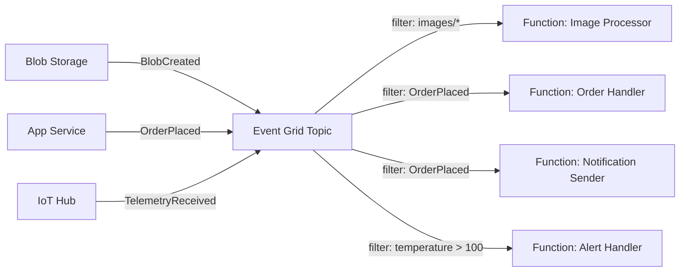

# How to Implement Event-Driven Architecture with Azure Event Grid and Functions

Author: [nawazdhandala](https://www.github.com/nawazdhandala)

Tags: Azure, Event Grid, Azure Functions, Event-Driven Architecture, Serverless, Cloud Patterns, Messaging

Description: Build a scalable event-driven architecture using Azure Event Grid and Azure Functions with practical examples and real-world patterns.

---

Event-driven architecture is one of the most effective ways to build loosely coupled, scalable systems on Azure. Instead of services calling each other directly, they publish events when something interesting happens, and other services react to those events independently. Azure Event Grid and Azure Functions make this pattern particularly easy to implement.

In this post, I will walk through how to set up an event-driven system using these two services, covering event schemas, subscriptions, filtering, error handling, and real-world considerations.

## Why Event Grid Plus Functions

Azure Event Grid is a fully managed event routing service. It receives events from sources (publishers), matches them against subscriptions (filters), and delivers them to handlers (subscribers). It is designed for high throughput, low latency, and at-least-once delivery.

Azure Functions is the natural companion. Functions can subscribe to Event Grid topics and execute code in response to events, scaling automatically from zero to thousands of concurrent executions.

Together, they give you:

- Near-real-time event processing (subsecond latency in most cases)
- Automatic scaling based on event volume
- Pay-per-execution pricing (no cost when idle)
- Built-in retry and dead-letter support

## Architecture Overview

Here is a typical event-driven architecture using Event Grid and Functions:



Notice that multiple subscribers can react to the same event independently. When an order is placed, both the Order Handler and the Notification Sender receive the event without knowing about each other.

## Setting Up a Custom Event Grid Topic

While Azure services like Blob Storage and Resource Groups have built-in Event Grid integration, you will often need custom topics for your application events.

```bash
# Create a custom Event Grid topic
az eventgrid topic create \
  --name my-app-events \
  --resource-group myResourceGroup \
  --location eastus \
  --input-schema cloudeventschemav1_0

# Get the topic endpoint and key for publishing events
az eventgrid topic show \
  --name my-app-events \
  --resource-group myResourceGroup \
  --query "endpoint" \
  --output tsv

az eventgrid topic key list \
  --name my-app-events \
  --resource-group myResourceGroup \
  --query "key1" \
  --output tsv
```

I recommend using the CloudEvents v1.0 schema instead of the default Event Grid schema. CloudEvents is an industry standard maintained by the CNCF, making your events portable across different platforms.

## Publishing Events

Here is how to publish events from a .NET application:

```csharp
using Azure.Messaging.EventGrid;
using Azure;

// Create the Event Grid publisher client
// The endpoint and key come from the topic you created
var client = new EventGridPublisherClient(
    new Uri("https://my-app-events.eastus-1.eventgrid.azure.net/api/events"),
    new AzureKeyCredential("your-topic-key")
);

// Publish an order placed event using CloudEvents schema
var orderEvent = new CloudEvent(
    source: "/app/order-service",          // identifies the event source
    type: "com.myapp.order.placed",        // event type for filtering
    jsonSerializableData: new
    {
        OrderId = "ORD-12345",
        CustomerId = "CUST-678",
        Items = new[]
        {
            new { ProductId = "PROD-001", Quantity = 2, Price = 29.99 },
            new { ProductId = "PROD-042", Quantity = 1, Price = 49.99 }
        },
        TotalAmount = 109.97,
        Currency = "USD",
        Timestamp = DateTime.UtcNow
    }
);

// Add a subject for fine-grained filtering
orderEvent.Subject = "/orders/ORD-12345";

// Send the event - Event Grid handles routing to all subscribers
await client.SendEventAsync(orderEvent);
```

You can also publish events in batches for better throughput:

```csharp
// Batch publishing for high-volume scenarios
// Event Grid processes batches more efficiently than individual events
var events = orders.Select(order => new CloudEvent(
    source: "/app/order-service",
    type: "com.myapp.order.placed",
    jsonSerializableData: order
)).ToList();

// Send up to 1 MB or 5000 events per batch
await client.SendEventsAsync(events);
```

## Creating Azure Functions as Event Handlers

Now let us create Functions that subscribe to these events:

```csharp
// Function that processes order placed events
// The EventGridTrigger binding handles the subscription automatically
[Function("ProcessOrder")]
public async Task ProcessOrder(
    [EventGridTrigger] CloudEvent cloudEvent,
    FunctionContext context)
{
    var logger = context.GetLogger("ProcessOrder");

    // Deserialize the event data
    var order = cloudEvent.Data.ToObjectFromJson<OrderPlacedEvent>();

    logger.LogInformation(
        "Processing order {OrderId} for customer {CustomerId}, amount: {Amount}",
        order.OrderId, order.CustomerId, order.TotalAmount);

    // Process the order
    await _inventoryService.ReserveItems(order.Items);
    await _paymentService.InitiatePayment(order.OrderId, order.TotalAmount);

    // Publish a downstream event
    await _eventPublisher.PublishAsync(new CloudEvent(
        source: "/app/order-processor",
        type: "com.myapp.order.processing-started",
        jsonSerializableData: new { order.OrderId, StartedAt = DateTime.UtcNow }
    ));
}

// Separate function that sends notifications for the same event
// This runs independently from the order processor
[Function("SendOrderNotification")]
public async Task SendNotification(
    [EventGridTrigger] CloudEvent cloudEvent,
    FunctionContext context)
{
    var order = cloudEvent.Data.ToObjectFromJson<OrderPlacedEvent>();

    await _emailService.SendAsync(
        to: order.CustomerEmail,
        subject: $"Order {order.OrderId} Confirmed",
        body: $"Your order for {order.TotalAmount:C} has been placed."
    );
}
```

## Event Filtering

Event Grid supports both basic and advanced filtering, so subscribers only receive events they care about:

```bash
# Create a subscription with subject filtering
# Only receives events where subject starts with /orders/priority
az eventgrid event-subscription create \
  --name priority-orders \
  --source-resource-id "/subscriptions/{sub}/resourceGroups/{rg}/providers/Microsoft.EventGrid/topics/my-app-events" \
  --endpoint "/subscriptions/{sub}/resourceGroups/{rg}/providers/Microsoft.Web/sites/myFunctionApp/functions/ProcessPriorityOrder" \
  --endpoint-type azurefunction \
  --subject-begins-with "/orders/priority" \
  --event-delivery-schema cloudeventschemav1_0

# Create a subscription with advanced filtering
# Only receives events where TotalAmount > 1000
az eventgrid event-subscription create \
  --name high-value-orders \
  --source-resource-id "/subscriptions/{sub}/resourceGroups/{rg}/providers/Microsoft.EventGrid/topics/my-app-events" \
  --endpoint "/subscriptions/{sub}/resourceGroups/{rg}/providers/Microsoft.Web/sites/myFunctionApp/functions/ProcessHighValueOrder" \
  --endpoint-type azurefunction \
  --advanced-filter data.TotalAmount NumberGreaterThan 1000
```

Advanced filtering can check numeric ranges, string prefixes, and even array contents, which lets you route events precisely without writing any filtering code in your Functions.

## Error Handling and Dead Letters

Event Grid retries delivery on failure with an exponential backoff schedule. If all retries fail, events go to a dead-letter destination.

```bash
# Configure dead-letter destination for failed events
# Events that cannot be delivered after retries go to this blob container
az eventgrid event-subscription create \
  --name order-processor \
  --source-resource-id "/subscriptions/{sub}/resourceGroups/{rg}/providers/Microsoft.EventGrid/topics/my-app-events" \
  --endpoint "/subscriptions/{sub}/resourceGroups/{rg}/providers/Microsoft.Web/sites/myFunctionApp/functions/ProcessOrder" \
  --endpoint-type azurefunction \
  --deadletter-endpoint "/subscriptions/{sub}/resourceGroups/{rg}/providers/Microsoft.Storage/storageAccounts/mystorageaccount/blobServices/default/containers/deadletters" \
  --max-delivery-attempts 10 \
  --event-ttl 1440
```

You should also set up a Function that periodically processes dead-letter events, either by retrying them or sending alerts:

```csharp
// Function that monitors the dead letter container
// Runs every 5 minutes to check for failed events
[Function("ProcessDeadLetters")]
public async Task ProcessDeadLetters(
    [TimerTrigger("0 */5 * * * *")] TimerInfo timer,
    FunctionContext context)
{
    var logger = context.GetLogger("ProcessDeadLetters");
    var container = _blobServiceClient.GetBlobContainerClient("deadletters");

    await foreach (var blob in container.GetBlobsAsync())
    {
        var blobClient = container.GetBlobClient(blob.Name);
        var content = await blobClient.DownloadContentAsync();
        var deadLetter = content.Value.Content.ToObjectFromJson<DeadLetterEvent>();

        logger.LogWarning(
            "Dead letter event: type={Type}, subject={Subject}, error={Error}",
            deadLetter.EventType, deadLetter.Subject, deadLetter.DeadLetterReason);

        // Alert the team about persistent failures
        await _alertService.SendAsync(
            $"Dead letter event detected: {deadLetter.EventType}");
    }
}
```

## Idempotency

Since Event Grid provides at-least-once delivery, your handlers must be idempotent. The same event might be delivered more than once. Use the event ID to detect duplicates:

```csharp
// Idempotent event handler using event ID tracking
[Function("ProcessOrder")]
public async Task ProcessOrder(
    [EventGridTrigger] CloudEvent cloudEvent,
    FunctionContext context)
{
    // Check if this event was already processed
    // Using Cosmos DB to track processed event IDs
    var processed = await _cosmosContainer.ReadItemAsync<ProcessedEvent>(
        cloudEvent.Id, new PartitionKey(cloudEvent.Id));

    if (processed.Resource != null)
    {
        // Already processed, skip
        return;
    }

    // Process the event
    var order = cloudEvent.Data.ToObjectFromJson<OrderPlacedEvent>();
    await _orderProcessor.ProcessAsync(order);

    // Record that this event was processed
    await _cosmosContainer.CreateItemAsync(new ProcessedEvent
    {
        Id = cloudEvent.Id,
        ProcessedAt = DateTime.UtcNow,
        // TTL of 7 days so old records clean themselves up
        Ttl = 604800
    });
}
```

## Summary

Azure Event Grid and Functions together provide a powerful, cost-effective foundation for event-driven architectures. The key principles to follow are: design events as facts that happened (past tense), keep event handlers small and focused, always handle idempotency, configure dead-letter destinations, and use advanced filtering to keep your handlers clean. Start with a single custom topic and a few subscribers, and expand as your system grows.
