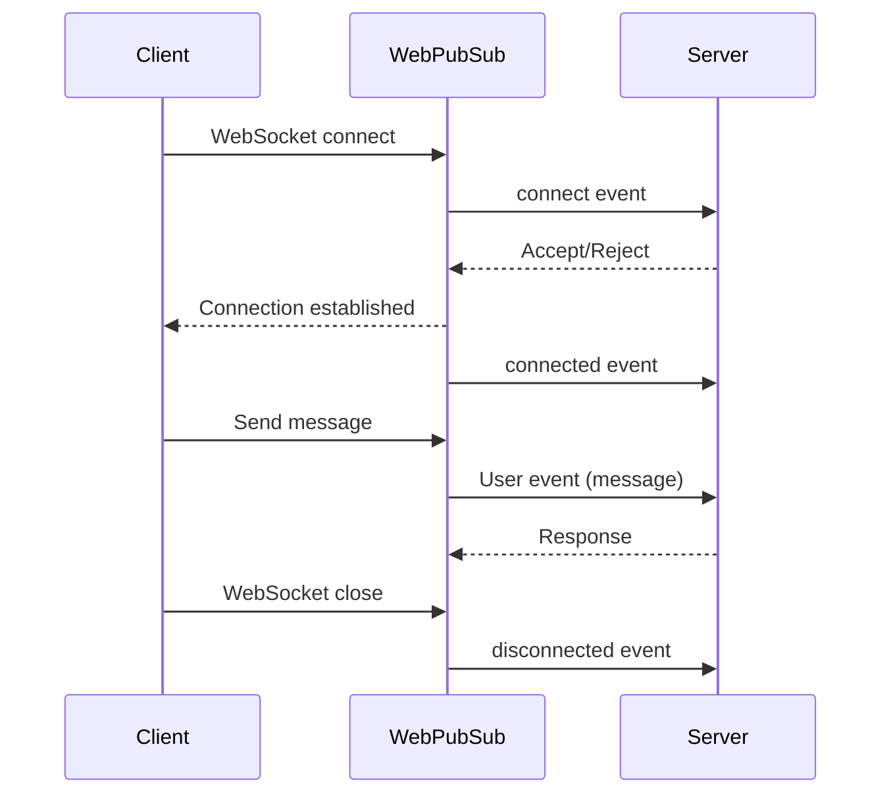

# How to Implement Event Handlers in Azure Web PubSub

Author: [nawazdhandala](https://www.github.com/nawazdhandala)

Tags: Azure, Web PubSub, Event Handlers, Webhooks, Real-Time, Server-Side, Node.js

Description: Learn how to implement event handlers in Azure Web PubSub to process client connections, messages, and disconnection events on the server side.

---

Azure Web PubSub does not just forward messages between clients. It also fires events to your server when things happen - clients connecting, sending messages, or disconnecting. Event handlers are the server-side endpoints that receive and process these events. They are your hook into the lifecycle of every WebSocket connection, and they are essential for building anything beyond a basic broadcast application.

In this post, I will walk through implementing event handlers for Azure Web PubSub, covering both system events and user events, and showing how to wire them up with an Express server.

## Understanding Web PubSub Events

Web PubSub fires two categories of events:

**System events** are triggered by the service itself:
- `connect` - Fired when a client is connecting (before the connection is established). You can accept, reject, or modify the connection.
- `connected` - Fired after the connection is fully established. This is a notification only; you cannot reject at this point.
- `disconnected` - Fired when a client disconnects.

**User events** are triggered by client messages. When a client sends a message through the WebSocket, it arrives at your server as a user event. You define what event names to handle using patterns.



## Setting Up the Event Handler Endpoint

Event handlers are HTTP endpoints on your server. Web PubSub sends POST requests to these endpoints when events occur. The SDK provides middleware that makes parsing these requests straightforward.

```bash
# Install the necessary packages
npm install @azure/web-pubsub @azure/web-pubsub-express express
```

Here is a complete server that handles all event types.

```javascript
// event-handler-server.js - Full event handler implementation
const express = require('express');
const { WebPubSubServiceClient } = require('@azure/web-pubsub');
const { WebPubSubEventHandler } = require('@azure/web-pubsub-express');

const app = express();
const connectionString = process.env.WEBPUBSUB_CONNECTION_STRING;
const hubName = 'chat';
const serviceClient = new WebPubSubServiceClient(connectionString, hubName);

// Create the event handler with all event callbacks
const handler = new WebPubSubEventHandler(hubName, {
  path: '/api/pubsub',

  // Called when a client is attempting to connect
  onConnected: async (req) => {
    const userId = req.context.userId;
    const connectionId = req.context.connectionId;
    console.log(`User ${userId} connected (${connectionId})`);

    // Notify other users about the new connection
    await serviceClient.sendToAll(
      JSON.stringify({
        type: 'system',
        message: `${userId} joined`,
        timestamp: new Date().toISOString()
      }),
      { contentType: 'application/json' }
    );
  },

  // Called when a client disconnects
  onDisconnected: async (req) => {
    const userId = req.context.userId;
    console.log(`User ${userId} disconnected`);

    await serviceClient.sendToAll(
      JSON.stringify({
        type: 'system',
        message: `${userId} left`,
        timestamp: new Date().toISOString()
      }),
      { contentType: 'application/json' }
    );
  },

  // Called when a client sends a message (user event)
  handleUserEvent: async (req, res) => {
    const userId = req.context.userId;
    const eventName = req.context.eventName;

    // The message payload from the client
    const payload = req.data;

    console.log(`Event "${eventName}" from ${userId}:`, payload);

    // Process the message based on the event name
    if (eventName === 'message') {
      // Broadcast the message to all connected clients
      await serviceClient.sendToAll(
        JSON.stringify({
          type: 'message',
          from: userId,
          content: payload,
          timestamp: new Date().toISOString()
        }),
        { contentType: 'application/json' }
      );

      // Send an acknowledgment back to the sender
      res.success('Message delivered');
    } else if (eventName === 'typing') {
      // Broadcast a typing indicator
      await serviceClient.sendToAll(
        JSON.stringify({
          type: 'typing',
          from: userId
        }),
        { contentType: 'application/json',
          filter: `userId ne '${userId}'` // Don't send back to the sender
        }
      );
      res.success();
    } else {
      // Unknown event type
      res.fail(400, 'Unknown event type');
    }
  }
});

// Register the event handler middleware
app.use(handler.getMiddleware());

// Token endpoint for clients
app.get('/api/token', async (req, res) => {
  const token = await serviceClient.getClientAccessUrl({
    userId: `user-${Date.now()}`,
    roles: ['webpubsub.sendToGroup', 'webpubsub.joinLeaveGroup']
  });
  res.json({ url: token.url });
});

app.listen(8080, () => {
  console.log('Event handler server running on port 8080');
});
```

## The Connect Event: Your Gatekeeper

The `connect` event deserves special attention because it is the only system event where you can accept or reject the connection. It is also where you can modify the connection properties.

```javascript
// connect-handler.js - Detailed connect event handling
const handler = new WebPubSubEventHandler(hubName, {
  path: '/api/pubsub',

  handleConnect: async (req, res) => {
    const userId = req.context.userId;
    const connectionId = req.context.connectionId;
    const headers = req.context.headers;

    console.log(`Connect request from ${userId}`);
    console.log('Request headers:', headers);

    // Check if the user is allowed to connect
    const isAllowed = await checkUserPermission(userId);
    if (!isAllowed) {
      // Reject the connection with an error message
      res.fail(403, 'User not permitted to connect');
      return;
    }

    // Accept the connection and optionally modify its properties
    res.success({
      // Override or set the user ID
      userId: userId,

      // Auto-join the user to specific groups
      groups: ['announcements', `user-${userId}`],

      // Set subprotocol if needed
      subprotocol: 'json.webpubsub.azure.v1',

      // Assign additional roles
      roles: ['webpubsub.joinLeaveGroup', 'webpubsub.sendToGroup']
    });
  }
});

async function checkUserPermission(userId) {
  // Check your database, cache, or external service
  // Return true if the user is allowed to connect
  return true;
}
```

## Registering Event Handlers in Azure

After building your server, you need to tell Azure Web PubSub where to send events. You do this by registering your event handler URL.

```bash
# Register the event handler for your hub
az webpubsub hub create \
  --name my-pubsub-instance \
  --resource-group my-resource-group \
  --hub-name chat \
  --event-handler \
    url-template="https://your-server.com/api/pubsub" \
    user-event-pattern="*" \
    system-event="connect,connected,disconnected"
```

The `user-event-pattern` field controls which user events get forwarded. The wildcard `*` forwards everything. You can also specify a comma-separated list of event names if you only want certain events.

For local development, you can use a tool like ngrok to expose your local server.

```bash
# Expose your local server to the internet for testing
ngrok http 8080
```

Then register the ngrok URL as your event handler endpoint.

## Handling Events with the CloudEvents Format

Web PubSub sends events using the CloudEvents specification. The Express middleware abstracts this away, but if you are building a handler without the SDK, here is what the raw request looks like.

```javascript
// raw-handler.js - Handling events without the SDK middleware
app.post('/api/pubsub', express.json(), (req, res) => {
  // CloudEvents headers contain event metadata
  const eventType = req.headers['ce-type'];
  const userId = req.headers['ce-userid'];
  const connectionId = req.headers['ce-connectionid'];
  const hub = req.headers['ce-hub'];
  const eventName = req.headers['ce-eventname'];

  console.log(`Event: ${eventType}, User: ${userId}, Event Name: ${eventName}`);

  // Handle validation requests (Web PubSub sends these to verify your endpoint)
  if (req.method === 'OPTIONS' || req.headers['webhook-request-origin']) {
    res.setHeader('WebHook-Allowed-Origin', '*');
    return res.status(200).end();
  }

  // Route based on event type
  if (eventType === 'azure.webpubsub.sys.connect') {
    // Handle connect event
    res.json({ userId: userId });
  } else if (eventType === 'azure.webpubsub.sys.connected') {
    res.status(200).end();
  } else if (eventType === 'azure.webpubsub.sys.disconnected') {
    res.status(200).end();
  } else if (eventType === 'azure.webpubsub.user.message') {
    // Handle user message
    const message = req.body;
    console.log('Message:', message);
    res.status(200).end();
  }
});
```

When Web PubSub first sends events to your endpoint, it performs a validation handshake. It sends an OPTIONS request with a `WebHook-Request-Origin` header, and your server must respond with the `WebHook-Allowed-Origin` header. The Express middleware handles this automatically.

## Error Handling in Event Handlers

Your event handlers should be resilient. If they throw an error or return a 5xx status, Web PubSub will retry the request. For the `connect` event specifically, if your handler fails to respond within the timeout (default 5 seconds), the client connection is rejected.

```javascript
// resilient-handler.js - Event handler with proper error handling
handleUserEvent: async (req, res) => {
  try {
    const payload = req.data;
    const userId = req.context.userId;

    // Validate the payload before processing
    if (!payload || typeof payload !== 'string') {
      res.fail(400, 'Invalid message format');
      return;
    }

    // Process the message with a timeout to avoid blocking
    const result = await Promise.race([
      processMessage(userId, payload),
      new Promise((_, reject) =>
        setTimeout(() => reject(new Error('Processing timeout')), 4000)
      )
    ]);

    res.success(result);
  } catch (err) {
    console.error('Error handling event:', err);
    // Return success to prevent retries if the error is not transient
    res.success('Message received but processing failed');
  }
}
```

## Testing Event Handlers Locally

You can test your event handlers locally without connecting to Azure by simulating the CloudEvents requests.

```bash
# Simulate a connect event
curl -X POST http://localhost:8080/api/pubsub \
  -H "Content-Type: application/json" \
  -H "ce-type: azure.webpubsub.sys.connect" \
  -H "ce-userid: test-user" \
  -H "ce-connectionid: test-connection" \
  -H "ce-hub: chat" \
  -H "WebHook-Request-Origin: xxx.webpubsub.azure.com" \
  -d '{}'
```

## Wrapping Up

Event handlers are what turn Azure Web PubSub from a simple message relay into a platform for building real applications. They give you control over the connection lifecycle, let you process and transform messages on the server, and provide a hook for integrating with your business logic. Start with the Express middleware for a quick setup, register your endpoints in Azure, and build from there. The combination of system events for lifecycle management and user events for message processing covers most real-time application patterns.
