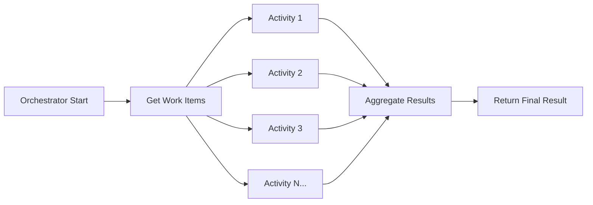

# How to Implement Fan-Out/Fan-In Patterns with Azure Durable Functions

Author: [nawazdhandala](https://www.github.com/nawazdhandala)

Tags: Azure Durable Functions, Fan-Out Fan-In, Serverless, Orchestration, Azure, Parallel Processing, Workflow

Description: Learn how to use the fan-out/fan-in pattern in Azure Durable Functions to run parallel workloads and aggregate their results efficiently.

---

One of the most powerful patterns in distributed computing is fan-out/fan-in. You take a single piece of work, split it into many parallel tasks, execute them all concurrently, and then gather the results back together. Azure Durable Functions makes this pattern surprisingly easy to implement without managing queues, workers, or coordination logic yourself.

In this post, I will show you how to build a fan-out/fan-in workflow from scratch, explain the mechanics behind it, and share the lessons I have learned running these patterns in production.

## The Pattern Explained

Think of fan-out/fan-in like this: you have a list of 500 images that need thumbnail generation. Instead of processing them one by one, you "fan out" by launching 500 parallel tasks. Each task generates one thumbnail. When all 500 are done, you "fan in" by collecting the results and sending a completion notification.

Here is a visual representation of the flow.



Without Durable Functions, you would need to set up a queue, write consumer workers, track completion in a database, and handle retries yourself. The Durable Functions framework handles all of that.

## Setting Up the Project

First, create a new Azure Functions project using the isolated worker model (the recommended approach for .NET).

```bash
# Create a new Azure Functions project with the isolated worker model
func init FanOutDemo --dotnet-isolated
cd FanOutDemo

# Add the Durable Functions NuGet package
dotnet add package Microsoft.Azure.Functions.Worker.Extensions.DurableTask
```

## The Orchestrator Function

The orchestrator is the brain of the operation. It defines the workflow logic - what to fan out over and how to collect the results.

```csharp
using Microsoft.Azure.Functions.Worker;
using Microsoft.DurableTask;
using Microsoft.Extensions.Logging;

// The orchestrator function coordinates the entire fan-out/fan-in workflow
// It is replayed by the Durable Task framework, so all code must be deterministic
[Function(nameof(ProcessBatchOrchestrator))]
public static async Task<BatchResult> ProcessBatchOrchestrator(
    [OrchestrationTrigger] TaskOrchestrationContext context)
{
    var logger = context.CreateReplaySafeLogger(nameof(ProcessBatchOrchestrator));

    // Step 1: Get the list of work items to process
    var workItems = await context.CallActivityAsync<List<WorkItem>>(
        nameof(GetWorkItems), null);

    logger.LogInformation("Fanning out to process {Count} items", workItems.Count);

    // Step 2: Fan out - launch all activities in parallel
    var tasks = new List<Task<ProcessingResult>>();
    foreach (var item in workItems)
    {
        // Each CallActivityAsync launches an independent activity
        // They will all run concurrently
        tasks.Add(context.CallActivityAsync<ProcessingResult>(
            nameof(ProcessSingleItem), item));
    }

    // Step 3: Fan in - wait for all parallel tasks to complete
    var results = await Task.WhenAll(tasks);

    // Step 4: Aggregate the results
    var summary = await context.CallActivityAsync<BatchResult>(
        nameof(AggregatResults), results.ToList());

    return summary;
}
```

There are a few critical things to understand about orchestrators. The code must be deterministic because the Durable Task framework replays it. Do not use `DateTime.Now`, `Guid.NewGuid()`, or any I/O directly in the orchestrator. Use `context.CurrentUtcDateTime` instead and delegate all side effects to activity functions.

## The Activity Functions

Activity functions are where the actual work happens. Each one processes a single item.

```csharp
// Fetches the list of items that need processing
// This could query a database, read from blob storage, or call an API
[Function(nameof(GetWorkItems))]
public static async Task<List<WorkItem>> GetWorkItems(
    [ActivityTrigger] object input, FunctionContext context)
{
    var logger = context.GetLogger(nameof(GetWorkItems));

    // In a real scenario, this might query a database or read from storage
    var items = new List<WorkItem>();
    for (int i = 0; i < 100; i++)
    {
        items.Add(new WorkItem { Id = i, Payload = $"item-{i}" });
    }

    logger.LogInformation("Retrieved {Count} work items", items.Count);
    return items;
}

// Processes a single work item - this runs in parallel with other instances
[Function(nameof(ProcessSingleItem))]
public static async Task<ProcessingResult> ProcessSingleItem(
    [ActivityTrigger] WorkItem item, FunctionContext context)
{
    var logger = context.GetLogger(nameof(ProcessSingleItem));

    // Simulate some work - in production this might resize an image,
    // call an API, run a calculation, etc.
    await Task.Delay(TimeSpan.FromSeconds(2));

    logger.LogInformation("Processed item {Id}", item.Id);

    return new ProcessingResult
    {
        ItemId = item.Id,
        Success = true,
        ProcessedAt = DateTime.UtcNow
    };
}

// Aggregates all the individual results into a summary
[Function(nameof(AggregatResults))]
public static Task<BatchResult> AggregatResults(
    [ActivityTrigger] List<ProcessingResult> results, FunctionContext context)
{
    var logger = context.GetLogger(nameof(AggregatResults));

    var summary = new BatchResult
    {
        TotalProcessed = results.Count,
        SuccessCount = results.Count(r => r.Success),
        FailureCount = results.Count(r => !r.Success),
        CompletedAt = DateTime.UtcNow
    };

    logger.LogInformation(
        "Batch complete: {Success} succeeded, {Failed} failed",
        summary.SuccessCount, summary.FailureCount);

    return Task.FromResult(summary);
}
```

## Starting the Orchestration

You need an HTTP trigger (or any other trigger) to kick off the orchestration.

```csharp
// HTTP trigger that starts the orchestration and returns a status URL
[Function("StartBatchProcessing")]
public static async Task<HttpResponseData> StartBatchProcessing(
    [HttpTrigger(AuthorizationLevel.Function, "post")] HttpRequestData req,
    [DurableClient] DurableTaskClient client,
    FunctionContext context)
{
    var logger = context.GetLogger("StartBatchProcessing");

    // Schedule the orchestrator - this returns immediately
    string instanceId = await client.ScheduleNewOrchestrationInstanceAsync(
        nameof(ProcessBatchOrchestrator));

    logger.LogInformation("Started orchestration with ID {InstanceId}", instanceId);

    // Return the management URLs so the caller can check status
    return await client.CreateCheckStatusResponseAsync(req, instanceId);
}
```

When you call this endpoint, you get back a JSON response with URLs to check the status of the orchestration, send events to it, or terminate it. This is built into the framework.

## Controlling Parallelism

Launching 10,000 parallel activities might overwhelm a downstream service or database. You can control the degree of parallelism by batching your fan-out.

```csharp
// Fan out with controlled parallelism - process items in batches of 50
[Function(nameof(ControlledFanOutOrchestrator))]
public static async Task<BatchResult> ControlledFanOutOrchestrator(
    [OrchestrationTrigger] TaskOrchestrationContext context)
{
    var workItems = await context.CallActivityAsync<List<WorkItem>>(
        nameof(GetWorkItems), null);

    var allResults = new List<ProcessingResult>();
    int batchSize = 50;

    // Process items in batches to control parallelism
    for (int i = 0; i < workItems.Count; i += batchSize)
    {
        var batch = workItems.Skip(i).Take(batchSize).ToList();

        // Launch this batch in parallel
        var batchTasks = batch.Select(item =>
            context.CallActivityAsync<ProcessingResult>(
                nameof(ProcessSingleItem), item));

        // Wait for the current batch to finish before starting the next
        var batchResults = await Task.WhenAll(batchTasks);
        allResults.AddRange(batchResults);
    }

    return await context.CallActivityAsync<BatchResult>(
        nameof(AggregatResults), allResults);
}
```

## Error Handling and Retries

In a fan-out scenario, some activities will inevitably fail. You can configure automatic retries on individual activities.

```csharp
// Configure retry options for activities that might fail transiently
var retryOptions = new TaskOptions(
    new TaskRetryOptions(new RetryPolicy(
        maxNumberOfAttempts: 3,
        firstRetryInterval: TimeSpan.FromSeconds(5),
        backoffCoefficient: 2.0))
);

// Use the retry options when calling the activity
var tasks = workItems.Select(item =>
    context.CallActivityAsync<ProcessingResult>(
        nameof(ProcessSingleItem), item, retryOptions));

// If any task fails after all retries, Task.WhenAll will throw
try
{
    var results = await Task.WhenAll(tasks);
}
catch (Exception ex)
{
    // Handle partial failure - some items succeeded, some failed
    // You could log the failures and process the successful results
}
```

## Real-World Use Cases

The fan-out/fan-in pattern shows up everywhere once you start looking for it:

- **Batch email sending**: Fan out to send 10,000 personalized emails, fan in to record delivery stats
- **Image processing**: Fan out to generate thumbnails for uploaded photos, fan in to update the database
- **Data aggregation**: Fan out to query 50 different APIs, fan in to merge the results into a report
- **Load testing**: Fan out to simulate 1,000 concurrent users, fan in to aggregate response time metrics
- **ETL pipelines**: Fan out to process chunks of a large CSV file, fan in to write the combined result

## Cost Considerations

On the Consumption plan, each activity execution is billed separately. If you fan out to 10,000 activities, you are paying for 10,000 individual function executions. For most workloads this is still cheaper than running dedicated VMs, but be aware of the cost implications when processing very large batches.

The orchestrator itself is relatively cheap because it spends most of its time waiting (and it is not billed for wait time on the Consumption plan). The orchestration state is stored in Azure Storage, which adds a small storage cost.

## Summary

The fan-out/fan-in pattern in Azure Durable Functions lets you parallelize work at scale without building custom coordination infrastructure. The orchestrator handles the workflow logic, activity functions do the actual work, and the framework manages state, retries, and scaling. Start with a simple implementation, add batching to control parallelism, and use retry policies to handle transient failures. This pattern is one of the most practical tools in the serverless toolkit.
