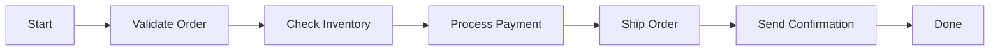

# How to Implement Function Chaining in Azure Durable Functions

Author: [nawazdhandala](https://www.github.com/nawazdhandala)

Tags: Azure Durable Functions, Function Chaining, Orchestration, Serverless, Azure, Workflow, Patterns

Description: Build sequential workflows with Azure Durable Functions using the function chaining pattern where each step depends on the output of the previous one.

---

Function chaining is the simplest and most common pattern in Azure Durable Functions. It is a sequence of activities that execute one after another, where each activity receives the output of the previous one as its input. Think of it as a pipeline: step A produces a result, step B takes that result and transforms it, step C takes that output and does something else, and so on.

This pattern is everywhere in real-world applications. Order processing, document transformation, multi-step data validation, approval workflows - any time you have a sequence of operations that must happen in order, function chaining is the right tool.

## When to Use Function Chaining

Use function chaining when your workflow has these characteristics:

- Steps must execute in a specific order
- Each step depends on the output of the previous step
- The entire workflow might take longer than a single function timeout allows
- You need automatic retry on individual steps
- You want the workflow state to survive process restarts

Without Durable Functions, you would typically implement this by chaining queue messages: function A processes its work and puts a message on a queue, function B picks up that message, does its work, and puts another message on a different queue. This works but it is tedious to build, hard to monitor, and painful to debug. Durable Functions gives you the same durability guarantees with much simpler code.

## The Architecture

Here is how function chaining looks visually.



Each box is an activity function. The arrows represent the orchestrator passing data from one activity to the next. If any step fails, the orchestrator can retry it without re-executing the steps that already succeeded.

## Building the Order Processing Pipeline

Let me walk through a realistic example: an order processing pipeline. Each step validates, processes, and fulfills an order.

First, define the data models.

```csharp
// Models that flow through the pipeline - each step enriches the order
public class Order
{
    public string OrderId { get; set; }
    public string CustomerId { get; set; }
    public List<OrderItem> Items { get; set; }
    public decimal TotalAmount { get; set; }
}

public class OrderItem
{
    public string ProductId { get; set; }
    public int Quantity { get; set; }
    public decimal UnitPrice { get; set; }
}

public class ValidatedOrder : Order
{
    public bool IsValid { get; set; }
    public List<string> ValidationErrors { get; set; }
}

public class InventoryCheckedOrder : ValidatedOrder
{
    public bool AllItemsInStock { get; set; }
    public Dictionary<string, int> ReservedInventory { get; set; }
}

public class PaidOrder : InventoryCheckedOrder
{
    public string PaymentTransactionId { get; set; }
    public DateTime PaymentTimestamp { get; set; }
}

public class FulfilledOrder : PaidOrder
{
    public string TrackingNumber { get; set; }
    public string ShippingCarrier { get; set; }
    public DateTime EstimatedDelivery { get; set; }
}
```

## The Orchestrator Function

The orchestrator defines the chain. Each `CallActivityAsync` call is a link in the chain. The output of one call becomes the input to the next.

```csharp
using Microsoft.Azure.Functions.Worker;
using Microsoft.DurableTask;
using Microsoft.Extensions.Logging;

public static class OrderOrchestrator
{
    // The orchestrator function chains activities together sequentially
    // Each activity receives the output of the previous one
    [Function(nameof(ProcessOrderOrchestrator))]
    public static async Task<FulfilledOrder> ProcessOrderOrchestrator(
        [OrchestrationTrigger] TaskOrchestrationContext context)
    {
        var logger = context.CreateReplaySafeLogger(nameof(ProcessOrderOrchestrator));
        var order = context.GetInput<Order>();

        logger.LogInformation("Starting order processing for {OrderId}", order.OrderId);

        // Step 1: Validate the order details
        var validatedOrder = await context.CallActivityAsync<ValidatedOrder>(
            nameof(ValidateOrder), order);

        // If validation fails, we can short-circuit the chain
        if (!validatedOrder.IsValid)
        {
            logger.LogWarning("Order {OrderId} failed validation", order.OrderId);
            throw new InvalidOperationException(
                $"Order validation failed: {string.Join(", ", validatedOrder.ValidationErrors)}");
        }

        // Step 2: Check and reserve inventory
        var inventoryOrder = await context.CallActivityAsync<InventoryCheckedOrder>(
            nameof(CheckInventory), validatedOrder);

        if (!inventoryOrder.AllItemsInStock)
        {
            logger.LogWarning("Order {OrderId} has out-of-stock items", order.OrderId);
            // Could trigger a backorder workflow instead of failing
            throw new InvalidOperationException("Some items are out of stock");
        }

        // Step 3: Process payment (with retry since payment gateways can be flaky)
        var retryOptions = new TaskOptions(
            new TaskRetryOptions(new RetryPolicy(
                maxNumberOfAttempts: 3,
                firstRetryInterval: TimeSpan.FromSeconds(5))));

        var paidOrder = await context.CallActivityAsync<PaidOrder>(
            nameof(ProcessPayment), inventoryOrder, retryOptions);

        // Step 4: Fulfill and ship the order
        var fulfilledOrder = await context.CallActivityAsync<FulfilledOrder>(
            nameof(FulfillOrder), paidOrder);

        // Step 5: Send confirmation email
        await context.CallActivityAsync(
            nameof(SendConfirmation), fulfilledOrder);

        logger.LogInformation(
            "Order {OrderId} processed successfully. Tracking: {Tracking}",
            order.OrderId, fulfilledOrder.TrackingNumber);

        return fulfilledOrder;
    }
}
```

Notice how each activity call awaits the result before moving to the next step. This is what makes it a chain. The Durable Task framework persists the state after each step, so if the function host crashes between steps 3 and 4, the orchestrator will replay from the beginning but skip the already-completed steps (using the stored results) and resume at step 4.

## The Activity Functions

Each activity function does one discrete piece of work.

```csharp
public static class OrderActivities
{
    // Validates the order - checks for required fields, valid quantities, etc.
    [Function(nameof(ValidateOrder))]
    public static Task<ValidatedOrder> ValidateOrder(
        [ActivityTrigger] Order order, FunctionContext context)
    {
        var logger = context.GetLogger(nameof(ValidateOrder));
        var errors = new List<string>();

        // Run validation checks
        if (string.IsNullOrEmpty(order.CustomerId))
            errors.Add("Customer ID is required");

        if (order.Items == null || order.Items.Count == 0)
            errors.Add("Order must contain at least one item");

        if (order.Items?.Any(i => i.Quantity <= 0) == true)
            errors.Add("All items must have a positive quantity");

        if (order.TotalAmount <= 0)
            errors.Add("Total amount must be positive");

        logger.LogInformation(
            "Validation for order {OrderId}: {Result}",
            order.OrderId, errors.Count == 0 ? "passed" : "failed");

        return Task.FromResult(new ValidatedOrder
        {
            OrderId = order.OrderId,
            CustomerId = order.CustomerId,
            Items = order.Items,
            TotalAmount = order.TotalAmount,
            IsValid = errors.Count == 0,
            ValidationErrors = errors
        });
    }

    // Checks inventory levels and reserves stock for the order
    [Function(nameof(CheckInventory))]
    public static async Task<InventoryCheckedOrder> CheckInventory(
        [ActivityTrigger] ValidatedOrder order, FunctionContext context)
    {
        var logger = context.GetLogger(nameof(CheckInventory));

        // In production, this would query an inventory database
        var reserved = new Dictionary<string, int>();
        bool allInStock = true;

        foreach (var item in order.Items)
        {
            // Simulate inventory check
            int available = 100; // Would come from database
            if (item.Quantity <= available)
            {
                reserved[item.ProductId] = item.Quantity;
            }
            else
            {
                allInStock = false;
            }
        }

        logger.LogInformation(
            "Inventory check for order {OrderId}: {Status}",
            order.OrderId, allInStock ? "all in stock" : "items unavailable");

        return new InventoryCheckedOrder
        {
            OrderId = order.OrderId,
            CustomerId = order.CustomerId,
            Items = order.Items,
            TotalAmount = order.TotalAmount,
            IsValid = order.IsValid,
            ValidationErrors = order.ValidationErrors,
            AllItemsInStock = allInStock,
            ReservedInventory = reserved
        };
    }

    // Processes payment through the payment gateway
    [Function(nameof(ProcessPayment))]
    public static async Task<PaidOrder> ProcessPayment(
        [ActivityTrigger] InventoryCheckedOrder order, FunctionContext context)
    {
        var logger = context.GetLogger(nameof(ProcessPayment));

        // In production, this would call Stripe, PayPal, etc.
        logger.LogInformation(
            "Processing payment of {Amount} for order {OrderId}",
            order.TotalAmount, order.OrderId);

        // Simulate payment processing
        await Task.Delay(TimeSpan.FromSeconds(1));

        return new PaidOrder
        {
            OrderId = order.OrderId,
            CustomerId = order.CustomerId,
            Items = order.Items,
            TotalAmount = order.TotalAmount,
            IsValid = order.IsValid,
            ValidationErrors = order.ValidationErrors,
            AllItemsInStock = order.AllItemsInStock,
            ReservedInventory = order.ReservedInventory,
            PaymentTransactionId = Guid.NewGuid().ToString(),
            PaymentTimestamp = DateTime.UtcNow
        };
    }

    // Ships the order and generates tracking information
    [Function(nameof(FulfillOrder))]
    public static async Task<FulfilledOrder> FulfillOrder(
        [ActivityTrigger] PaidOrder order, FunctionContext context)
    {
        var logger = context.GetLogger(nameof(FulfillOrder));

        logger.LogInformation("Fulfilling order {OrderId}", order.OrderId);

        return new FulfilledOrder
        {
            OrderId = order.OrderId,
            CustomerId = order.CustomerId,
            Items = order.Items,
            TotalAmount = order.TotalAmount,
            IsValid = order.IsValid,
            ValidationErrors = order.ValidationErrors,
            AllItemsInStock = order.AllItemsInStock,
            ReservedInventory = order.ReservedInventory,
            PaymentTransactionId = order.PaymentTransactionId,
            PaymentTimestamp = order.PaymentTimestamp,
            TrackingNumber = $"TRK-{Guid.NewGuid().ToString()[..8].ToUpper()}",
            ShippingCarrier = "FedEx",
            EstimatedDelivery = DateTime.UtcNow.AddDays(5)
        };
    }

    // Sends a confirmation email to the customer
    [Function(nameof(SendConfirmation))]
    public static async Task SendConfirmation(
        [ActivityTrigger] FulfilledOrder order, FunctionContext context)
    {
        var logger = context.GetLogger(nameof(SendConfirmation));

        // In production, this would send an actual email via SendGrid, etc.
        logger.LogInformation(
            "Sending confirmation for order {OrderId} to customer {CustomerId}. " +
            "Tracking: {Tracking}",
            order.OrderId, order.CustomerId, order.TrackingNumber);
    }
}
```

## Error Handling in Chains

When an activity in the chain fails, the orchestrator throws an exception. You can catch it and implement compensation logic.

```csharp
// Orchestrator with error handling and compensation
[Function(nameof(ProcessOrderWithCompensation))]
public static async Task<string> ProcessOrderWithCompensation(
    [OrchestrationTrigger] TaskOrchestrationContext context)
{
    var order = context.GetInput<Order>();
    InventoryCheckedOrder inventoryOrder = null;

    try
    {
        var validatedOrder = await context.CallActivityAsync<ValidatedOrder>(
            nameof(ValidateOrder), order);

        inventoryOrder = await context.CallActivityAsync<InventoryCheckedOrder>(
            nameof(CheckInventory), validatedOrder);

        var paidOrder = await context.CallActivityAsync<PaidOrder>(
            nameof(ProcessPayment), inventoryOrder);

        var fulfilledOrder = await context.CallActivityAsync<FulfilledOrder>(
            nameof(FulfillOrder), paidOrder);

        return fulfilledOrder.TrackingNumber;
    }
    catch (TaskFailedException ex)
    {
        // Compensation: if payment or fulfillment fails, release the inventory
        if (inventoryOrder != null)
        {
            await context.CallActivityAsync(
                nameof(ReleaseInventory), inventoryOrder);
        }

        // Notify the customer about the failure
        await context.CallActivityAsync(
            nameof(NotifyFailure), new { order.OrderId, Error = ex.Message });

        throw;
    }
}
```

## Summary

Function chaining is the bread and butter of Durable Functions orchestrations. You define a sequence of activity calls in an orchestrator, pass data from one to the next, and the framework handles state persistence, replay, and retries. The pattern maps naturally to any business process that has sequential steps. Start with simple chains and add error handling and compensation logic as your workflow matures. The key thing to remember is that the orchestrator must be deterministic - no random values, no direct I/O, no non-deterministic DateTime calls. All side effects belong in activity functions.
