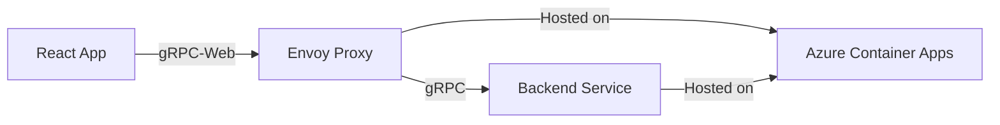

# How to Implement gRPC-Web with a React Frontend and Azure Container Apps Backend

Author: [nawazdhandala](https://www.github.com/nawazdhandala)

Tags: gRPC-Web, React, Azure Container Apps, Frontend, Backend, Envoy, Proxy

Description: Build a React frontend that communicates with a gRPC backend through gRPC-Web, deployed on Azure Container Apps with an Envoy proxy.

---

Browsers cannot speak native gRPC. They lack the ability to make raw HTTP/2 requests with the framing that gRPC requires. That is where gRPC-Web comes in. It is a protocol that bridges the gap, allowing browser-based applications to call gRPC services through a translation layer - typically an Envoy proxy.

In this post, we will build a complete stack: a gRPC backend service, an Envoy proxy that translates gRPC-Web requests, and a React frontend that calls the backend using the gRPC-Web client library. Everything will be deployed to Azure Container Apps.

## Architecture Overview

The flow looks like this:



The React app makes gRPC-Web calls to Envoy. Envoy translates those into native gRPC calls and forwards them to the backend service. Both Envoy and the backend run as separate containers in Azure Container Apps.

## Step 1: Define the Protobuf Schema

We will build a simple note-taking service.

```protobuf
// proto/notes.proto
// Defines the NoteService for CRUD operations on notes
syntax = "proto3";

package notes;

message Note {
  string id = 1;
  string title = 2;
  string content = 3;
  int64 created_at = 4;
}

message CreateNoteRequest {
  string title = 1;
  string content = 2;
}

message GetNoteRequest {
  string id = 1;
}

message ListNotesRequest {}

message ListNotesResponse {
  repeated Note notes = 1;
}

message DeleteNoteRequest {
  string id = 1;
}

message DeleteNoteResponse {
  bool success = 1;
}

service NoteService {
  rpc CreateNote(CreateNoteRequest) returns (Note);
  rpc GetNote(GetNoteRequest) returns (Note);
  rpc ListNotes(ListNotesRequest) returns (ListNotesResponse);
  rpc DeleteNote(DeleteNoteRequest) returns (DeleteNoteResponse);
}
```

## Step 2: Build the Backend Service

We will use Node.js for the backend.

```javascript
// backend/server.js
// gRPC server that implements the NoteService
const grpc = require('@grpc/grpc-js');
const protoLoader = require('@grpc/proto-loader');
const { v4: uuidv4 } = require('uuid');

const packageDefinition = protoLoader.loadSync('./proto/notes.proto', {
  keepCase: true,
  longs: Number,
  defaults: true,
  oneofs: true,
});

const notesProto = grpc.loadPackageDefinition(packageDefinition).notes;

// Simple in-memory store
const notesStore = new Map();

const serviceImpl = {
  // Create a new note and return it
  createNote(call, callback) {
    const note = {
      id: uuidv4(),
      title: call.request.title,
      content: call.request.content,
      created_at: Date.now(),
    };
    notesStore.set(note.id, note);
    callback(null, note);
  },

  // Retrieve a single note by ID
  getNote(call, callback) {
    const note = notesStore.get(call.request.id);
    if (!note) {
      return callback({ code: grpc.status.NOT_FOUND, message: 'Note not found' });
    }
    callback(null, note);
  },

  // Return all notes
  listNotes(call, callback) {
    callback(null, { notes: Array.from(notesStore.values()) });
  },

  // Delete a note by ID
  deleteNote(call, callback) {
    const deleted = notesStore.delete(call.request.id);
    callback(null, { success: deleted });
  },
};

const server = new grpc.Server();
server.addService(notesProto.NoteService.service, serviceImpl);

const port = process.env.GRPC_PORT || 50051;
server.bindAsync(`0.0.0.0:${port}`, grpc.ServerCredentials.createInsecure(), (err) => {
  if (err) throw err;
  console.log(`gRPC backend listening on port ${port}`);
});
```

## Step 3: Configure the Envoy Proxy

Envoy acts as the translation layer between gRPC-Web and native gRPC.

```yaml
# envoy/envoy.yaml
# Envoy configuration for gRPC-Web to gRPC translation
admin:
  address:
    socket_address: { address: 0.0.0.0, port_value: 9901 }

static_resources:
  listeners:
    - name: listener_0
      address:
        socket_address: { address: 0.0.0.0, port_value: 8080 }
      filter_chains:
        - filters:
            - name: envoy.filters.network.http_connection_manager
              typed_config:
                "@type": type.googleapis.com/envoy.extensions.filters.network.http_connection_manager.v3.HttpConnectionManager
                codec_type: auto
                stat_prefix: ingress_http
                route_config:
                  name: local_route
                  virtual_hosts:
                    - name: local_service
                      domains: ["*"]
                      routes:
                        - match: { prefix: "/" }
                          route:
                            cluster: grpc_backend
                            timeout: 30s
                            max_stream_duration:
                              grpc_timeout_header_max: 30s
                      # CORS headers so the browser allows cross-origin calls
                      cors:
                        allow_origin_string_match:
                          - prefix: "*"
                        allow_methods: GET, PUT, DELETE, POST, OPTIONS
                        allow_headers: keep-alive,user-agent,cache-control,content-type,content-transfer-encoding,x-accept-content-transfer-encoding,x-accept-response-streaming,x-user-agent,x-grpc-web,grpc-timeout
                        max_age: "1728000"
                        expose_headers: grpc-status,grpc-message
                http_filters:
                  # The gRPC-Web filter translates gRPC-Web requests to gRPC
                  - name: envoy.filters.http.grpc_web
                    typed_config:
                      "@type": type.googleapis.com/envoy.extensions.filters.http.grpc_web.v3.GrpcWeb
                  - name: envoy.filters.http.cors
                    typed_config:
                      "@type": type.googleapis.com/envoy.extensions.filters.http.cors.v3.Cors
                  - name: envoy.filters.http.router
                    typed_config:
                      "@type": type.googleapis.com/envoy.extensions.filters.http.router.v3.Router
  clusters:
    - name: grpc_backend
      connect_timeout: 5s
      type: LOGICAL_DNS
      lb_policy: ROUND_ROBIN
      typed_extension_protocol_options:
        envoy.extensions.upstreams.http.v3.HttpProtocolOptions:
          "@type": type.googleapis.com/envoy.extensions.upstreams.http.v3.HttpProtocolOptions
          explicit_http_config:
            http2_protocol_options: {}
      load_assignment:
        cluster_name: grpc_backend
        endpoints:
          - lb_endpoints:
              - endpoint:
                  address:
                    socket_address:
                      # This points to the backend container
                      address: localhost
                      port_value: 50051
```

## Step 4: Generate the gRPC-Web Client Code

Install the protoc compiler and the gRPC-Web plugin, then generate the client code for React.

```bash
# Install protoc-gen-grpc-web plugin
# On macOS:
brew install protoc-gen-grpc-web

# Generate JavaScript client code from the proto file
protoc -I=./proto notes.proto \
  --js_out=import_style=commonjs:./frontend/src/generated \
  --grpc-web_out=import_style=commonjs,mode=grpcwebtext:./frontend/src/generated
```

## Step 5: Build the React Frontend

Create the React app and use the generated client to call the backend.

```jsx
// frontend/src/App.jsx
// React app that uses gRPC-Web to communicate with the backend
import React, { useState, useEffect } from 'react';
import { NoteServiceClient } from './generated/notes_grpc_web_pb';
import {
  CreateNoteRequest,
  ListNotesRequest,
  DeleteNoteRequest,
} from './generated/notes_pb';

// Point the client at the Envoy proxy
const client = new NoteServiceClient('https://my-envoy-proxy.azurecontainerapps.io');

function App() {
  const [notes, setNotes] = useState([]);
  const [title, setTitle] = useState('');
  const [content, setContent] = useState('');

  // Fetch all notes on component mount
  useEffect(() => {
    fetchNotes();
  }, []);

  function fetchNotes() {
    const request = new ListNotesRequest();
    client.listNotes(request, {}, (err, response) => {
      if (err) {
        console.error('Failed to list notes:', err.message);
        return;
      }
      setNotes(response.getNotesList().map((n) => ({
        id: n.getId(),
        title: n.getTitle(),
        content: n.getContent(),
      })));
    });
  }

  function handleCreate(e) {
    e.preventDefault();
    const request = new CreateNoteRequest();
    request.setTitle(title);
    request.setContent(content);

    client.createNote(request, {}, (err, response) => {
      if (err) {
        console.error('Failed to create note:', err.message);
        return;
      }
      setTitle('');
      setContent('');
      fetchNotes(); // Refresh the list after creating
    });
  }

  function handleDelete(id) {
    const request = new DeleteNoteRequest();
    request.setId(id);
    client.deleteNote(request, {}, (err) => {
      if (err) {
        console.error('Failed to delete note:', err.message);
        return;
      }
      fetchNotes();
    });
  }

  return (
    <div style={{ maxWidth: 600, margin: '0 auto', padding: 20 }}>
      <h1>Notes</h1>
      <form onSubmit={handleCreate}>
        <input
          value={title}
          onChange={(e) => setTitle(e.target.value)}
          placeholder="Title"
        />
        <textarea
          value={content}
          onChange={(e) => setContent(e.target.value)}
          placeholder="Content"
        />
        <button type="submit">Add Note</button>
      </form>
      <ul>
        {notes.map((note) => (
          <li key={note.id}>
            <strong>{note.title}</strong>: {note.content}
            <button onClick={() => handleDelete(note.id)}>Delete</button>
          </li>
        ))}
      </ul>
    </div>
  );
}

export default App;
```

## Step 6: Deploy to Azure Container Apps

Create a Container Apps environment and deploy both the backend and the Envoy proxy.

```bash
# Create the Container Apps environment
az containerapp env create \
  --name notes-env \
  --resource-group myResourceGroup \
  --location eastus

# Deploy the backend gRPC service
az containerapp create \
  --name notes-backend \
  --resource-group myResourceGroup \
  --environment notes-env \
  --image myregistry.azurecr.io/notes-backend:v1 \
  --target-port 50051 \
  --transport http2 \
  --ingress internal \
  --min-replicas 1

# Deploy the Envoy proxy
az containerapp create \
  --name notes-envoy \
  --resource-group myResourceGroup \
  --environment notes-env \
  --image myregistry.azurecr.io/notes-envoy:v1 \
  --target-port 8080 \
  --ingress external \
  --min-replicas 1

# Deploy the React frontend as a static container
az containerapp create \
  --name notes-frontend \
  --resource-group myResourceGroup \
  --environment notes-env \
  --image myregistry.azurecr.io/notes-frontend:v1 \
  --target-port 80 \
  --ingress external \
  --min-replicas 1
```

## Handling Authentication

When you need to pass authentication tokens from the React app through to the gRPC backend, include them as metadata in the gRPC-Web call.

```javascript
// Adding auth metadata to gRPC-Web calls
const metadata = {
  'authorization': `Bearer ${authToken}`,
};

client.listNotes(request, metadata, (err, response) => {
  // Handle response
});
```

Make sure your Envoy configuration allows the `authorization` header through CORS.

## Production Considerations

Running gRPC-Web in production involves a few extra considerations. First, you should enable TLS on the Envoy proxy. Azure Container Apps provides automatic TLS termination on the ingress, which simplifies this. Second, think about error handling. gRPC status codes map differently than HTTP status codes, so your React app should translate them into user-friendly messages.

Third, consider using server-side streaming if your use case requires real-time updates. gRPC-Web supports server-side streaming (but not client-side or bidirectional streaming), which makes it suitable for scenarios like live feeds or notifications.

## Summary

The combination of gRPC-Web, React, and Azure Container Apps gives you a modern, type-safe full-stack architecture. The protobuf schema serves as a single source of truth for both frontend and backend, reducing the chance of API contract mismatches. Envoy handles the protocol translation transparently, and Azure Container Apps provides a managed hosting platform that scales automatically. This approach works particularly well for internal tools and dashboards where you want strong typing across the entire stack.
