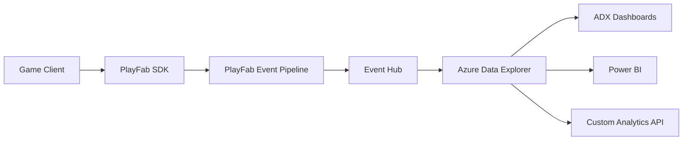

# How to Implement In-Game Analytics with Azure PlayFab and Azure Data Explorer

Author: [nawazdhandala](https://www.github.com/nawazdhandala)

Tags: Azure PlayFab, Azure Data Explorer, Game Analytics, Telemetry, Game Development, Data Analysis, KQL

Description: Implement in-game analytics using PlayFab for event collection and Azure Data Explorer for large-scale telemetry analysis and dashboards.

---

Every game studio needs analytics. You need to know where players drop off, which items they buy, how long sessions last, and what drives retention. Without data, you are guessing about what to build next and whether your latest update helped or hurt.

PlayFab collects game events automatically and provides basic analytics out of the box. But for deep analysis - ad-hoc queries across billions of events, custom dashboards, and real-time operational monitoring - you want Azure Data Explorer (ADX). It is built for exactly this kind of high-volume time-series analytics. In this guide, I will show you how to pipe PlayFab events into ADX and build the queries that answer your most important game design questions.

## Architecture



PlayFab captures events from the game client through its SDK. Those events flow to an Event Hub via PlayFab's data connections. Azure Data Explorer ingests from the Event Hub and stores the events for querying. You can then build dashboards directly in ADX, connect Power BI, or build a custom API layer.

## Step 1 - Configure PlayFab Event Collection

PlayFab automatically collects certain events like login, purchase, and session start/end. For custom analytics, you need to send custom events from your game code.

```csharp
using PlayFab;
using PlayFab.ClientModels;
using System.Collections.Generic;

public class GameAnalytics
{
    /// <summary>
    /// Track when a player completes a level
    /// </summary>
    public static void TrackLevelComplete(int levelId, float completionTime, int score, int deaths)
    {
        var request = new WriteClientPlayerEventRequest
        {
            EventName = "level_completed",
            Body = new Dictionary<string, object>
            {
                { "level_id", levelId },
                { "completion_time_seconds", completionTime },
                { "score", score },
                { "deaths", deaths },
                { "difficulty", GetCurrentDifficulty() },
                { "character_class", GetPlayerClass() },
                { "items_used", GetItemsUsedInLevel() }
            }
        };

        PlayFabClientAPI.WritePlayerEvent(request, OnSuccess, OnError);
    }

    /// <summary>
    /// Track when a player makes an in-game purchase
    /// </summary>
    public static void TrackPurchase(string itemId, string currency, int amount)
    {
        var request = new WriteClientPlayerEventRequest
        {
            EventName = "item_purchased",
            Body = new Dictionary<string, object>
            {
                { "item_id", itemId },
                { "currency_type", currency },
                { "amount", amount },
                { "player_level", GetPlayerLevel() },
                { "session_duration_minutes", GetSessionDuration() },
                { "store_location", GetCurrentStoreUI() }
            }
        };

        PlayFabClientAPI.WritePlayerEvent(request, OnSuccess, OnError);
    }

    /// <summary>
    /// Track when a player starts and abandons a level
    /// </summary>
    public static void TrackLevelAbandoned(int levelId, float timeBeforeQuit, string reason)
    {
        var request = new WriteClientPlayerEventRequest
        {
            EventName = "level_abandoned",
            Body = new Dictionary<string, object>
            {
                { "level_id", levelId },
                { "time_before_quit_seconds", timeBeforeQuit },
                { "abandon_reason", reason },
                { "deaths_before_quit", GetDeathCount() },
                { "last_checkpoint", GetLastCheckpoint() }
            }
        };

        PlayFabClientAPI.WritePlayerEvent(request, OnSuccess, OnError);
    }

    private static void OnSuccess(WriteEventResponse result)
    {
        // Event logged successfully - no need to bother the player
    }

    private static void OnError(PlayFabError error)
    {
        // Log locally but don't interrupt gameplay
        UnityEngine.Debug.LogWarning($"Analytics event failed: {error.ErrorMessage}");
    }

    // Helper methods (implementations depend on your game)
    private static string GetCurrentDifficulty() => "normal";
    private static string GetPlayerClass() => "warrior";
    private static List<string> GetItemsUsedInLevel() => new List<string>();
    private static int GetPlayerLevel() => 1;
    private static float GetSessionDuration() => 0;
    private static string GetCurrentStoreUI() => "main_store";
    private static int GetDeathCount() => 0;
    private static string GetLastCheckpoint() => "none";
}
```

Include enough context in each event to answer follow-up questions without needing to join with other data. For example, including `player_level` and `session_duration_minutes` in the purchase event means you can analyze spending patterns by player progression without a separate join.

## Step 2 - Set Up the Data Pipeline to Azure Data Explorer

Configure PlayFab to export events to an Event Hub, then set up ADX to ingest from it.

```bash
# Create an Event Hub namespace and hub for PlayFab events
az eventhubs namespace create \
  --name game-analytics-ns \
  --resource-group gaming-rg \
  --sku Standard \
  --location eastus

az eventhubs eventhub create \
  --name playfab-events \
  --namespace-name game-analytics-ns \
  --resource-group gaming-rg \
  --partition-count 8 \
  --message-retention 3

# Create an Azure Data Explorer cluster
az kusto cluster create \
  --name gameanalytics \
  --resource-group gaming-rg \
  --location eastus \
  --sku name="Standard_D13_v2" capacity=2 tier="Standard"

# Create a database for game events
az kusto database create \
  --cluster-name gameanalytics \
  --resource-group gaming-rg \
  --database-name GameEvents \
  --soft-delete-period P365D \
  --hot-cache-period P31D
```

In PlayFab, go to Data Connections under your title settings and create an Event Hub connection pointing to your event hub. PlayFab will start streaming events there.

## Step 3 - Create the ADX Table and Ingestion Mapping

Define the table structure in ADX to store PlayFab events.

```kql
// Create the table for PlayFab events
.create table PlayFabEvents (
    Timestamp: datetime,
    EventId: string,
    EventName: string,
    PlayerId: string,
    EventNamespace: string,
    EntityType: string,
    TitleId: string,
    EventData: dynamic,
    SourceType: string
)

// Create the JSON ingestion mapping
.create table PlayFabEvents ingestion json mapping 'PlayFabMapping' '[
    {"column": "Timestamp", "path": "$.Timestamp", "datatype": "datetime"},
    {"column": "EventId", "path": "$.EventId", "datatype": "string"},
    {"column": "EventName", "path": "$.EventName", "datatype": "string"},
    {"column": "PlayerId", "path": "$.PlayerId", "datatype": "string"},
    {"column": "EventNamespace", "path": "$.EventNamespace", "datatype": "string"},
    {"column": "EntityType", "path": "$.EntityType", "datatype": "string"},
    {"column": "TitleId", "path": "$.TitleId", "datatype": "string"},
    {"column": "EventData", "path": "$.EventData", "datatype": "dynamic"},
    {"column": "SourceType", "path": "$.SourceType", "datatype": "string"}
]'

// Create the data connection from Event Hub
.create table PlayFabEvents ingestion eventhub mapping 'PlayFabEventHubConnection'
    '{"eventHubResourceId": "/subscriptions/<sub>/resourceGroups/gaming-rg/providers/Microsoft.EventHub/namespaces/game-analytics-ns/eventhubs/playfab-events",
      "consumerGroup": "$Default",
      "tableName": "PlayFabEvents",
      "mappingRuleName": "PlayFabMapping",
      "dataFormat": "json"}'
```

## Step 4 - Write Analytics Queries

Now the fun part. With events flowing into ADX, you can answer all sorts of game design questions using KQL (Kusto Query Language).

Player retention analysis - how many players return after day 1, day 7, and day 30.

```kql
// Calculate D1, D7, and D30 retention by cohort
let cohort_start = ago(90d);
let first_logins = PlayFabEvents
    | where EventName == "player_logged_in" and Timestamp > cohort_start
    | summarize FirstLogin = min(Timestamp) by PlayerId
    | extend CohortWeek = startofweek(FirstLogin);
let returning = PlayFabEvents
    | where EventName == "player_logged_in" and Timestamp > cohort_start
    | join kind=inner first_logins on PlayerId
    | extend DaysSinceFirst = datetime_diff("day", Timestamp, FirstLogin);
first_logins
| summarize CohortSize = dcount(PlayerId) by CohortWeek
| join kind=inner (
    returning
    | where DaysSinceFirst == 1
    | summarize D1_Retained = dcount(PlayerId) by CohortWeek
) on CohortWeek
| join kind=leftouter (
    returning
    | where DaysSinceFirst == 7
    | summarize D7_Retained = dcount(PlayerId) by CohortWeek
) on CohortWeek
| join kind=leftouter (
    returning
    | where DaysSinceFirst == 30
    | summarize D30_Retained = dcount(PlayerId) by CohortWeek
) on CohortWeek
| project CohortWeek, CohortSize,
    D1_Pct = round(100.0 * D1_Retained / CohortSize, 1),
    D7_Pct = round(100.0 * coalesce(D7_Retained, 0) / CohortSize, 1),
    D30_Pct = round(100.0 * coalesce(D30_Retained, 0) / CohortSize, 1)
| order by CohortWeek desc
```

Level difficulty analysis - identify which levels cause players to quit.

```kql
// Find levels with the highest abandonment rates
let completions = PlayFabEvents
    | where EventName == "level_completed"
    | extend LevelId = toint(EventData.level_id)
    | summarize Completions = count() by LevelId;
let abandonments = PlayFabEvents
    | where EventName == "level_abandoned"
    | extend LevelId = toint(EventData.level_id)
    | summarize Abandonments = count(),
        AvgTimeBeforeQuit = avg(todouble(EventData.time_before_quit_seconds)),
        AvgDeathsBeforeQuit = avg(todouble(EventData.deaths_before_quit))
    by LevelId;
completions
| join kind=fullouter abandonments on LevelId
| extend AbandonRate = round(100.0 * coalesce(Abandonments, 0) / (coalesce(Completions, 0) + coalesce(Abandonments, 0)), 1)
| project LevelId = coalesce(LevelId, LevelId1),
    Completions = coalesce(Completions, 0),
    Abandonments = coalesce(Abandonments, 0),
    AbandonRate,
    AvgTimeBeforeQuit = round(coalesce(AvgTimeBeforeQuit, 0.0), 1),
    AvgDeathsBeforeQuit = round(coalesce(AvgDeathsBeforeQuit, 0.0), 1)
| order by AbandonRate desc
```

Revenue analysis by player segment.

```kql
// Revenue breakdown by player tenure and level
PlayFabEvents
| where EventName == "item_purchased" and Timestamp > ago(30d)
| extend Amount = toint(EventData.amount),
    Currency = tostring(EventData.currency_type),
    PlayerLevel = toint(EventData.player_level)
| where Currency == "USD"  // Real money purchases
| summarize
    TotalRevenue = sum(Amount),
    TransactionCount = count(),
    UniqueSpenders = dcount(PlayerId),
    AvgTransactionValue = round(avg(Amount), 2)
  by PlayerLevelBucket = case(
    PlayerLevel <= 10, "New (1-10)",
    PlayerLevel <= 30, "Mid (11-30)",
    PlayerLevel <= 50, "Veteran (31-50)",
    "Endgame (50+)")
| extend ARPPU = round(1.0 * TotalRevenue / UniqueSpenders, 2)
| order by TotalRevenue desc
```

## Step 5 - Build Dashboards

ADX has a built-in dashboard feature. Pin your most important queries to a dashboard that the game team checks daily.

Key dashboards to build:

- **Daily Active Users (DAU)**: Track daily unique players over time
- **Session metrics**: Average session length, sessions per player, peak concurrent users
- **Economy health**: Currency earn/spend rates, inflation tracking, popular items
- **Funnel analysis**: New player first-time user experience (FTUE) completion rates
- **Live ops**: Real-time event participation, limited-time offer conversion rates

For real-time monitoring during live events, create a dashboard with auto-refresh set to every 30 seconds. You can watch player counts and purchase rates change in near real time.

## Wrapping Up

PlayFab and Azure Data Explorer give game teams a powerful analytics stack. PlayFab handles event collection from the client with minimal integration work. ADX provides the storage and query engine for analyzing billions of events with sub-second response times. KQL is expressive enough to answer complex game design questions without writing custom code. Start by instrumenting your key game events, set up the pipeline, and build dashboards around the metrics that drive your design decisions. The data will tell you where players struggle, what keeps them coming back, and where you should invest development time.
