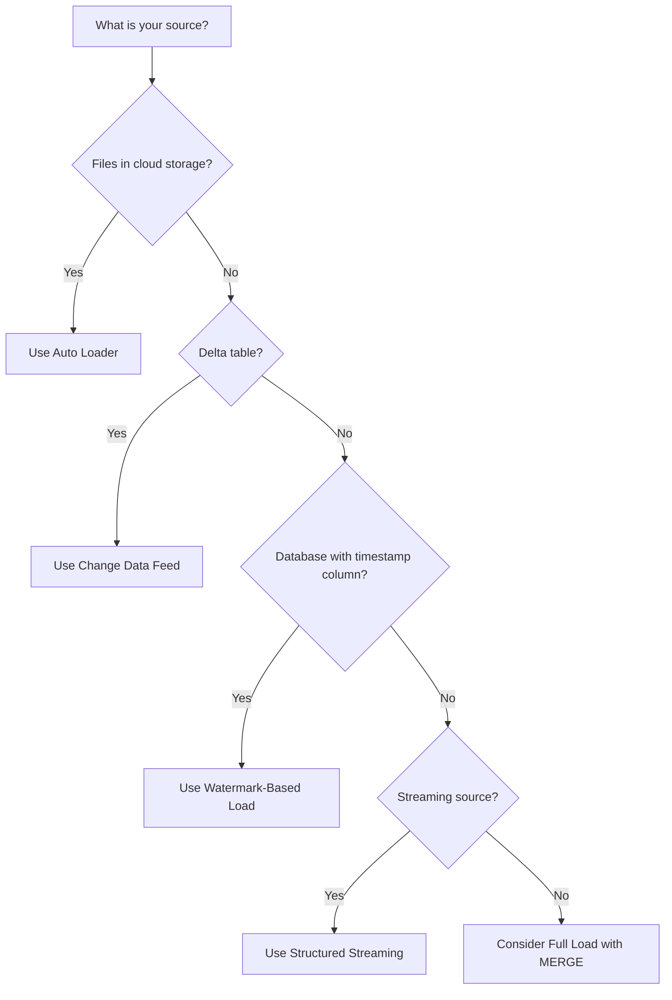

# How to Implement Incremental Data Ingestion with Delta Lake in Azure Databricks

Author: [nawazdhandala](https://www.github.com/nawazdhandala)

Tags: Delta Lake, Azure Databricks, Incremental Ingestion, Data Engineering, CDC, Streaming

Description: Learn how to implement incremental data ingestion patterns with Delta Lake in Azure Databricks using watermarks, Change Data Capture, and Auto Loader.

---

Loading your entire dataset every time a pipeline runs is wasteful. If you have a table with 100 million rows and only 10,000 changed since the last load, reprocessing everything costs time, compute, and money. Incremental ingestion solves this by loading only new or changed data since the last successful run.

Delta Lake in Azure Databricks provides several mechanisms for incremental ingestion, from simple watermark-based approaches to Change Data Feed and Auto Loader. In this post, I will cover the main patterns and show you how to implement each one.

## Why Incremental Ingestion Matters

The benefits are significant:

- **Faster processing** - loading 10,000 rows is orders of magnitude faster than 100 million
- **Lower cost** - less compute time means lower Databricks spending
- **Fresher data** - faster processing means you can run more frequently
- **Less resource contention** - smaller jobs put less pressure on your cluster and storage

The tradeoff is complexity. You need to track what has already been loaded and handle edge cases like late-arriving data and schema changes.

## Pattern 1: Watermark-Based Incremental Load

The simplest incremental approach uses a watermark column - a timestamp or auto-incrementing ID that increases monotonically. You track the highest value seen in the last load and use it to filter the next load.

### Implementation

```python
# watermark_ingestion.py - Incremental load using a watermark column
from pyspark.sql import functions as F
from delta.tables import DeltaTable

# Configuration
source_table = "jdbc_connection.source_db.orders"
target_path = "/mnt/datalake/silver/orders"
watermark_path = "/mnt/datalake/metadata/watermarks/orders"

def get_last_watermark():
    """Read the last processed watermark value."""
    try:
        wm_df = spark.read.format("delta").load(watermark_path)
        return wm_df.agg(F.max("watermark_value")).first()[0]
    except Exception:
        # First run - no watermark exists yet
        return "1900-01-01T00:00:00"

def update_watermark(new_value):
    """Save the new watermark value."""
    wm_df = spark.createDataFrame(
        [(new_value,)],
        ["watermark_value"]
    )
    wm_df.write.format("delta").mode("overwrite").save(watermark_path)

# Get the last watermark
last_watermark = get_last_watermark()
print(f"Last watermark: {last_watermark}")

# Read only new/modified records from the source
new_data = (
    spark.read
    .format("jdbc")
    .option("url", "jdbc:sqlserver://server:1433;database=sourcedb")
    .option("dbtable", f"(SELECT * FROM orders WHERE modified_date > '{last_watermark}') AS q")
    .option("user", dbutils.secrets.get("db-secrets", "username"))
    .option("password", dbutils.secrets.get("db-secrets", "password"))
    .load()
)

row_count = new_data.count()
print(f"New rows to process: {row_count}")

if row_count > 0:
    # Get the new watermark value before writing
    new_watermark = new_data.agg(F.max("modified_date")).first()[0]

    # Merge into the target Delta table (upsert)
    if DeltaTable.isDeltaTable(spark, target_path):
        target = DeltaTable.forPath(spark, target_path)
        target.alias("target").merge(
            new_data.alias("source"),
            "target.order_id = source.order_id"
        ).whenMatchedUpdateAll() \
         .whenNotMatchedInsertAll() \
         .execute()
    else:
        # First run - create the table
        new_data.write.format("delta").save(target_path)

    # Update the watermark after successful write
    update_watermark(str(new_watermark))
    print(f"Updated watermark to: {new_watermark}")
else:
    print("No new data to process")
```

### Limitations of Watermark-Based Loads

- Requires a reliable watermark column (must always increase)
- Cannot detect deletes in the source
- Late-arriving data with old timestamps can be missed
- Does not handle re-processed or corrected historical records

## Pattern 2: Delta Lake Change Data Feed

Delta Lake's Change Data Feed (CDF) tracks row-level changes to a Delta table. When enabled, CDF records every insert, update, and delete operation, making it easy for downstream consumers to read only the changes.

### Enable Change Data Feed

```sql
-- Enable CDF on an existing table
ALTER TABLE silver.orders SET TBLPROPERTIES (delta.enableChangeDataFeed = true);

-- Or enable when creating a new table
CREATE TABLE silver.orders (
    order_id INT,
    customer_id INT,
    amount DECIMAL(10, 2),
    status STRING,
    modified_date TIMESTAMP
)
USING DELTA
TBLPROPERTIES (delta.enableChangeDataFeed = true);
```

### Read Changes

Once CDF is enabled, you can read changes between versions or timestamps.

```python
# read_changes.py - Read incremental changes from a Delta table's CDF

# Read changes since version 10
changes = (
    spark.read
    .format("delta")
    .option("readChangeFeed", "true")
    .option("startingVersion", 10)
    .table("silver.orders")
)

# The DataFrame includes special columns:
# _change_type: insert, update_preimage, update_postimage, delete
# _commit_version: the version number of the change
# _commit_timestamp: when the change happened

# Filter for just inserts and updated rows
new_and_updated = changes.filter(
    F.col("_change_type").isin(["insert", "update_postimage"])
)

# Filter for deletes
deletes = changes.filter(F.col("_change_type") == "delete")

print(f"Inserts and updates: {new_and_updated.count()}")
print(f"Deletes: {deletes.count()}")
```

```python
# Read changes between timestamps
changes = (
    spark.read
    .format("delta")
    .option("readChangeFeed", "true")
    .option("startingTimestamp", "2026-02-15T00:00:00")
    .option("endingTimestamp", "2026-02-16T00:00:00")
    .table("silver.orders")
)
```

### Propagate Changes Downstream

Use CDF to build incremental pipelines between Delta tables.

```python
# propagate_changes.py - Incrementally update a gold table from silver changes

# Track the last version we processed
last_version = spark.sql(
    "SELECT MAX(processed_version) FROM gold.processing_log WHERE table_name = 'orders'"
).first()[0] or 0

# Get the current version
current_version = DeltaTable.forName(spark, "silver.orders").history(1).first().version

if current_version > last_version:
    # Read only the changes since last processed version
    changes = (
        spark.read
        .format("delta")
        .option("readChangeFeed", "true")
        .option("startingVersion", last_version + 1)
        .option("endingVersion", current_version)
        .table("silver.orders")
    )

    # Process inserts and updates
    upserts = changes.filter(
        F.col("_change_type").isin(["insert", "update_postimage"])
    ).drop("_change_type", "_commit_version", "_commit_timestamp")

    # Merge into gold table
    gold = DeltaTable.forName(spark, "gold.order_summary")
    gold.alias("target").merge(
        upserts.alias("source"),
        "target.order_id = source.order_id"
    ).whenMatchedUpdateAll() \
     .whenNotMatchedInsertAll() \
     .execute()

    # Log the processed version
    spark.sql(f"""
        INSERT INTO gold.processing_log
        VALUES ('orders', {current_version}, current_timestamp())
    """)

    print(f"Processed changes from version {last_version + 1} to {current_version}")
```

## Pattern 3: Auto Loader for File-Based Ingestion

Auto Loader (also known as cloudFiles) is Databricks' recommended approach for incrementally ingesting files from cloud storage. It automatically discovers and tracks new files as they arrive.

```python
# auto_loader.py - Incrementally ingest new files using Auto Loader

# Configure Auto Loader to read new JSON files
stream = (
    spark.readStream
    .format("cloudFiles")
    # Specify the file format
    .option("cloudFiles.format", "json")
    # Enable schema inference and evolution
    .option("cloudFiles.inferColumnTypes", "true")
    .option("cloudFiles.schemaEvolutionMode", "addNewColumns")
    # Checkpoint location to track processed files
    .option("cloudFiles.schemaLocation", "/mnt/datalake/checkpoints/orders_schema")
    # Source path to monitor for new files
    .load("/mnt/datalake/raw/orders/")
)

# Add ingestion metadata
stream_with_metadata = stream \
    .withColumn("_ingested_at", F.current_timestamp()) \
    .withColumn("_source_file", F.input_file_name())

# Write to Delta table with checkpointing
(
    stream_with_metadata.writeStream
    .format("delta")
    .option("checkpointLocation", "/mnt/datalake/checkpoints/orders_checkpoint")
    .outputMode("append")
    # Trigger once for batch-style processing
    .trigger(availableNow=True)
    .toTable("bronze.raw_orders")
)
```

### Auto Loader Key Features

- **File tracking** - uses a checkpoint to remember which files have been processed
- **Schema inference** - automatically detects the schema from new files
- **Schema evolution** - handles new columns appearing in source files
- **Exactly-once processing** - each file is processed exactly once
- **availableNow trigger** - processes all available new files and then stops (batch-style)

### Auto Loader vs. Manual File Listing

```python
# Bad: manual file listing reprocesses all files every run
df = spark.read.format("json").load("/mnt/datalake/raw/orders/")

# Good: Auto Loader only processes new files
df = (
    spark.readStream
    .format("cloudFiles")
    .option("cloudFiles.format", "json")
    .load("/mnt/datalake/raw/orders/")
)
```

## Pattern 4: Structured Streaming for Continuous Ingestion

For near-real-time requirements, use Structured Streaming to continuously process new data.

```python
# continuous_ingestion.py - Streaming ingestion from Event Hubs or Kafka

# Read from Azure Event Hubs
stream = (
    spark.readStream
    .format("eventhubs")
    .options(**{
        "eventhubs.connectionString": dbutils.secrets.get("eh-secrets", "connection-string"),
        "eventhubs.consumerGroup": "databricks-consumer",
        "eventhubs.startingPosition": '{"offset": "-1", "seqNo": -1, "enqueuedTime": null, "isInclusive": true}'
    })
    .load()
)

# Parse the event body
from pyspark.sql.types import StructType, StructField, StringType, DoubleType, TimestampType

event_schema = StructType([
    StructField("order_id", StringType()),
    StructField("customer_id", StringType()),
    StructField("amount", DoubleType()),
    StructField("event_time", TimestampType())
])

parsed = (
    stream
    .withColumn("body", F.col("body").cast("string"))
    .withColumn("parsed", F.from_json("body", event_schema))
    .select("parsed.*", F.col("enqueuedTime").alias("_enqueued_time"))
)

# Write to Delta table with continuous processing
(
    parsed.writeStream
    .format("delta")
    .option("checkpointLocation", "/mnt/datalake/checkpoints/streaming_orders")
    .outputMode("append")
    # Process every 30 seconds
    .trigger(processingTime="30 seconds")
    .toTable("bronze.streaming_orders")
)
```

## Choosing the Right Pattern

Here is a decision guide.



| Pattern | Best For | Complexity | Handles Deletes |
|---------|----------|------------|-----------------|
| Watermark | JDBC sources with timestamp columns | Low | No |
| Change Data Feed | Delta-to-Delta pipelines | Medium | Yes |
| Auto Loader | File-based ingestion from cloud storage | Low | No |
| Structured Streaming | Real-time event streams | Medium | No (append only) |

## Production Tips

1. **Always checkpoint** - whether using Auto Loader or Structured Streaming, the checkpoint is what tracks progress. Store it in a durable location.
2. **Handle late-arriving data** - if your source can have late arrivals, build in a lookback window to re-scan recent data.
3. **Monitor processing lag** - track the time between data arriving in the source and being available in the target.
4. **Test recovery** - verify that your pipeline can restart cleanly after a failure without duplicating or losing data.
5. **Start with batch, move to streaming if needed** - the `trigger(availableNow=True)` option gives you streaming semantics with batch scheduling.

## Wrapping Up

Incremental data ingestion with Delta Lake in Azure Databricks dramatically reduces processing time and cost compared to full loads. Auto Loader is the best choice for file-based sources. Change Data Feed handles Delta-to-Delta propagation with full change tracking including deletes. Watermark-based loads work well for JDBC sources with reliable timestamp columns. And Structured Streaming handles real-time event processing. Pick the pattern that matches your data source and latency requirements, and always make sure your checkpoints and watermarks are stored durably.
